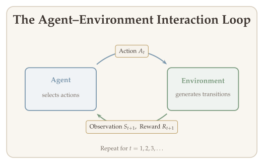
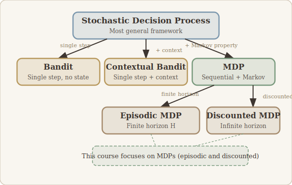
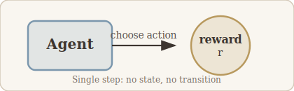
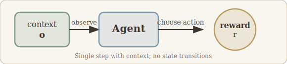
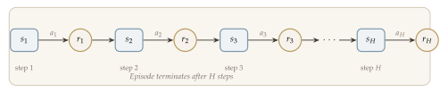
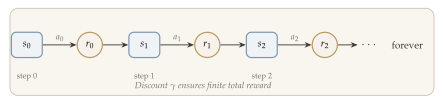
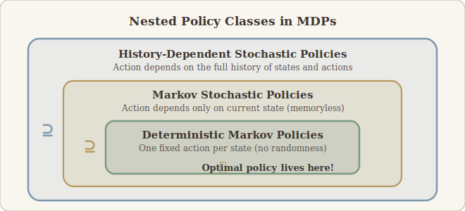
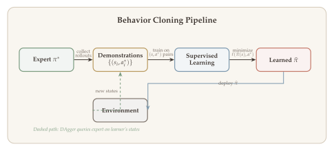
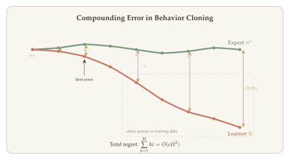
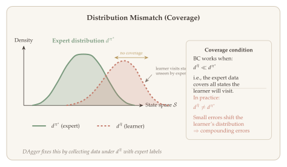

Reinforcement learning (RL) sits at the intersection of statistics, optimization, and computer science, addressing one of the most fundamental questions in machine learning: how should an agent make sequential decisions in an uncertain environment to maximize long-term performance? Unlike supervised learning, where a model is trained on a fixed dataset of input-output pairs, an RL agent must actively interact with its environment, observe the consequences of its actions, and adapt its strategy over time. This trial-and-error paradigm makes RL uniquely suited to problems where the decision-maker's choices influence future observations and rewards.

The scope of RL applications is remarkably broad. In games, RL algorithms have achieved superhuman performance in Atari, Go, chess, and shogi. In robotics, RL enables agents to learn manipulation tasks, locomotion, and autonomous driving. In healthcare, RL can optimize treatment regimens; in finance, it can guide portfolio management and algorithmic trading. More recently, RL has become a core component in fine-tuning large language models, where reinforcement learning from human feedback (RLHF) steers generation toward desirable outputs.

From a theoretical standpoint, RL is deeply connected to dynamic programming, optimal control, and stochastic optimization. However, it introduces a distinctive challenge absent from classical statistics and optimization: the data distribution depends on the agent's decisions. This coupling between estimation and control is what makes RL both intellectually rich and technically demanding.

In this lecture, we introduce the broad framework of reinforcement learning, survey its empirical successes, position it relative to classical statistical decision theory and stochastic optimization, and formalize the key mathematical objects --- stochastic decision processes, policies, and Markov decision processes --- that will serve as the foundation for the rest of the course.

## What Will Be Covered {#sec-overview}

- **What is reinforcement learning?** A broad definition as sequential decision making in a possibly stochastic environment.
- **Key empirical successes of deep RL:** Atari games, the game of Go, LLM alignment, reasoning models, and beyond.
- **RL in abstract form:** The agent--environment interaction loop, policies, trajectories, and the optimization objective.
- **Connections to optimization and statistics:** How RL relates to and differs from statistical decision theory and stochastic optimization.
- **How RL differs from classical frameworks:** The fundamental distinction that data distributions depend on decisions.
- **Formalizing the goal:** The performance metric, $\varepsilon$-suboptimality, and the design axes (model, data-generating process).
- **Examples of RL models:** Stochastic decision processes, bandits, contextual bandits, episodic MDPs, and discounted MDPs.
- **Policies for MDPs:** History-dependent, Markov, and deterministic Markov policies, and why restricting to the latter suffices.

## What Is Reinforcement Learning? {#sec-what-is-rl}

At the broadest level, reinforcement learning can be described in a single phrase:

::: {.callout-important}
## The RL Problem
**Reinforcement learning is sequential decision making in a possibly stochastic environment.**
:::

Let us unpack the three key ingredients of this definition.

- **Decision making:** The agent seeks to optimize some utility, reward, or performance metric by taking actions.
- **Sequential:** The agent takes a (perhaps infinite) sequence of actions, where each action is selected based on observable quantities accumulated so far.
- **Possibly stochastic environment:** The environment may be deterministic (e.g., the game of Go, where the board state follows deterministically from the moves) or stochastic (e.g., a robot navigating with noisy sensors). The observations the agent receives are generated from a distribution that depends on the entire action sequence. Stochastic environments are the harder and more general case, and most of our theory is developed for this setting.

The central question of RL is therefore:

::: {.callout-important}
## The Central Question
*How do we find the optimal action sequence --- the policy that maximizes long-term cumulative reward --- when the agent must learn from its own experience in the environment?*
:::

## Key Empirical Successes of Deep RL {#sec-empirical-successes}

Before diving into the mathematical formalism, it is worth appreciating why reinforcement learning has attracted so much attention in recent years. A series of landmark results in deep RL demonstrated that combining neural network function approximation with RL algorithms can solve problems previously considered intractable.

**1. Atari games --- Deep Q-Networks (DQN).** Deep RL began to take off with the development of Deep Q-Networks, which learned to play classic Atari games directly from raw pixel inputs. This line of work showed that a single architecture and algorithm could achieve human-level or superhuman performance across dozens of diverse games.

::: {.callout-tip}
## References
- Mnih et al., "Playing Atari with Deep Reinforcement Learning," 2013.
- Mnih et al., "Human-level control through deep reinforcement learning," *Nature*, 2015.
:::

**2. Game of Go.** DeepMind's AlphaGo and its successors (AlphaGo Zero, AlphaZero) defeated world champions in Go, a game with an astronomically large state space that had long resisted classical AI approaches. These systems combined Monte Carlo tree search with deep neural networks trained via self-play RL. We study AlphaGo in detail in Chapter 8.

::: {.callout-tip}
## References
- Silver, D. et al., "Mastering the game of Go with deep neural networks and tree search," *Nature*, 2016.
- Silver, D. et al., "Mastering the game of Go without human knowledge," *Nature*, 2017.
:::

**3. Alignment of large language models.** Reinforcement learning from human feedback (RLHF) has become the standard method for aligning LLMs with human preferences. The InstructGPT/ChatGPT pipeline uses PPO to optimize language model outputs against a reward model trained on human comparisons, transforming a raw text predictor into a helpful assistant. We develop RLHF in Chapter 9.

::: {.callout-tip}
## References
- Ouyang, L. et al., "Training language models to follow instructions with human feedback," *NeurIPS*, 2022.
:::

**4. Reasoning models.** Most recently, RL from verifiable rewards has produced a new class of **reasoning models** that achieve remarkable performance on mathematical and coding benchmarks by learning to "think" through extended chains of reasoning. OpenAI's o1 model (2024) demonstrated that test-time compute scaling --- allowing the model to reason longer before answering --- can dramatically improve accuracy. DeepSeek R1 (DeepSeek-AI, 2025) showed that pure RL with verifiable rewards, using the GRPO algorithm, can train a base language model to achieve frontier-level mathematical reasoning without any supervised reasoning data. We cover these developments in Chapter 10.

::: {.callout-tip}
## References
- DeepSeek-AI, "DeepSeek-R1: Incentivizing reasoning capability in LLMs via reinforcement learning," *arXiv preprint*, 2025.
:::

**5. And beyond.** Further successes have extended to robotics, autonomous driving, chip design (Mirhoseini et al., 2021), and protein structure prediction.

## RL in Abstract Form {#sec-abstract-form}

To reason precisely about reinforcement learning, we need to formalize the agent--environment interaction. The key abstraction is that decision rules in RL are called **policies**.

The interaction proceeds as follows. At each step $t$:

1. The agent has access to the **history** $\tau_t = (o_1, a_1, \ldots, o_{t-1}, a_{t-1}, o_t)$.
2. The agent chooses an action $a_t \sim \pi_t(\cdot \mid \tau_t)$, where the policy $\pi_t$ maps the history $\tau_t$ to a distribution over actions.
3. The environment generates the next observation $o_{t+1} \sim P(\cdot \mid \tau_t, a_t)$, which in general may depend on the full history and the chosen action: $P(o_{t+1} = \cdot \mid o_1, a_1, \ldots, o_t, a_t)$.

{#fig-agent-env-loop width="80%"}

A **policy** $\pi = \{\pi_t\}_{t \geq 1}$ generates a random **trajectory**

$$
\tau = (o_1, a_1, o_2, a_2, \ldots),
$$

which may be infinitely long. We denote the distribution of this trajectory by $D(\pi)$.

The agent's goal is to solve the following optimization problem. Let $R: \text{Trajectory} \to \mathbb{R}$ be a reward functional that measures "how good the trajectory is." Then the RL objective is

$$
\max_{\pi \in \Pi} \; \mathbb{E}_{\tau \sim D(\pi)}\bigl[R(\tau)\bigr]. $$ {#eq-rl-objective}

::: {.callout-tip}
## Remark: Why We Need Structured Models
The formulation in ([-@eq-rl-objective]) is extremely abstract. The trajectory $\tau$ can be infinitely long, so we cannot learn a function whose input space is infinite-dimensional without further structure. This is why RL devises **various models** for $D(\pi)$ and $R(\tau)$ that make the problem tractable.
:::

A canonical example of such structure is the **Markov decision process (MDP)**, where the trajectory reward takes a discounted additive form

$$
R(\tau) = r(o_1, a_1) + \gamma \cdot r(o_2, a_2) + \cdots + \gamma^t \cdot r(o_t, a_t) + \cdots, \quad \gamma \in (0, 1),
$$

and the transition distribution satisfies the **Markov property**:

$$
P(o_t \mid \tau_t, a_t) = P(o_t \mid o_1, \ldots, a_{t-1}, o_t, a_t) = P(o_{t+1} \mid o_t, a_t).
$$

Together with $P(a_t \mid \tau_t) = \pi_t(a_t \mid \tau_t)$, these structural assumptions fully specify $D(\pi)$.

## Connections to Optimization and Statistics {#sec-connections}

Reinforcement learning is naturally and closely related to both **optimization** and **statistics**. Finding the optimal decision-making rule amounts to

$$
\max_{\text{Decision Rule}} \; \text{Performance}(\text{Decision Rule}).
$$

This is inherently an optimization problem. In some settings --- such as multi-agent RL --- the optimization may be more involved than simple maximization, as one instead seeks a certain equilibrium concept. Nevertheless, it remains an optimization over the space of decision-making rules.

Moreover, the performance of a decision rule often involves an **expectation** with respect to the stochastic environment. Evaluating and optimizing this expected performance connects RL to the toolkit of **statistical estimation**, including supervised learning and representation learning.

RL is also deeply related to several neighboring fields:

- **Economics and game theory.** When multiple agents interact in a shared environment, each agent's optimal policy depends on the other agents' policies. This moves the problem from optimization to **equilibrium computation**: instead of maximizing a single objective, we seek a Nash equilibrium or other solution concept where no agent can improve by deviating unilaterally. Multi-agent RL inherits the rich structure (and difficulty) of game theory --- including the possibility of non-existence or multiplicity of equilibria, and the challenge of learning in non-stationary environments where other agents are simultaneously adapting.

- **Causal inference and offline RL.** In many practical settings, we do not have the luxury of interacting with the environment. Instead, we are given a **historical dataset** of trajectories collected by some previous policy (a doctor's past treatment decisions, a company's past pricing strategies). Learning a good policy from such data is called **offline RL** (or batch RL), and it is intimately connected to causal inference. The core challenge is **confounding**: the historical policy's action choices may depend on unobserved variables that also affect the outcome. For example, a doctor may prescribe a stronger drug to sicker patients --- if we naively interpret the data, we might conclude that the stronger drug *causes* worse outcomes, when in fact the confounding variable (patient severity) explains both the treatment choice and the outcome. Offline RL must account for this distribution shift between the data-collection policy and the policy being evaluated, using tools from causal inference such as importance weighting and doubly-robust estimation.

::: {.callout-note appearance="simple"}
The connection between offline RL and causal inference is particularly important in healthcare, education, and public policy, where online experimentation is expensive, slow, or ethically constrained. We cannot run RL exploration on real patients --- we must learn from observational data, carefully disentangling causal effects from confounders.
:::

- **Optimal control.** When the state and action spaces are continuous ($\mathcal{S}, \mathcal{A} \subseteq \mathbb{R}^d$) and the dynamics may operate in continuous time, RL reduces to **optimal control** --- a classical field with deep connections to differential equations, the Hamilton--Jacobi--Bellman equation, and Pontryagin's maximum principle. Robotics, autonomous driving, and process control are natural application domains. The Bellman equation we study in this course is the discrete-time analogue of the Hamilton--Jacobi--Bellman PDE.

- **Operations research.** OR provides a rich collection of structured sequential decision problems: inventory management, queuing systems, scheduling, and network routing. These problems often have special structure (e.g., convexity, monotonicity) that enables more efficient algorithms than general-purpose RL. Conversely, modern RL algorithms can tackle OR problems that are too large or complex for classical dynamic programming approaches.

## How RL Differs from Statistical Decision Theory and Stochastic Optimization {#sec-rl-differs}

To appreciate what makes RL distinctive, it helps to recall two classical frameworks and pinpoint the key difference.

### Statistical Decision Theory {#sec-stat-decision-theory}

Statistical decision theory is concerned with making the best decision when statistical knowledge (data) sheds light on the stochastic environment. The setup is as follows:

- Observe data $X_1, \ldots, X_n \sim P_{\theta^*}$, where $\theta^* \in \Theta$ is the unknown parameter.
- A **decision rule** is a mapping $d: \mathcal{X}^n \to \Theta$.
- A **loss function** $\ell: \Theta \times \Theta \to \mathbb{R}$ reflects the cost of the decision rule: $\ell(\theta, d(x))$ measures how far the decision $d(x)$ is from the truth $\theta$.
  - For example, $\ell(\theta, \theta') = \|\theta - \theta'\|_2^2$.

The **risk** of a decision rule $d$ is

$$
R_\theta(d) = \mathbb{E}_{X_i \sim P_\theta}\bigl[\ell(\theta, d(X))\bigr].
$$

The **optimal decision rule** minimizes the risk:

$$
\inf_d \; R_{\theta^*}(d).
$$

The **minimax optimal decision rule** hedges against the worst case:

$$
\inf_d \; \sup_{\theta \in \Theta} \; R_\theta(d).
$$

### Stochastic Optimization {#sec-stochastic-optimization}

In stochastic optimization, the goal is to minimize an expected objective:

$$
\min_\theta \; F(\theta) = \mathbb{E}_{X \sim P}\bigl[f(X, \theta)\bigr] = \int_{\mathcal{X}} f(x, \theta) \, dP(x).
$$

One observes data $\{X_i\} \sim P$ and uses it to iteratively update the parameter. A prototypical algorithm is **stochastic gradient descent (SGD)**:

$$
\theta^{t+1} \leftarrow \theta^t - \alpha^t \nabla_\theta f(X_t, \theta_t).
$$

### The Fundamental Distinction {#sec-fundamental-distinction}

The crucial difference between these classical frameworks and reinforcement learning is:

:::: {.columns}
::: {.column width="48%"}
::: {.callout-note appearance="simple"}
## Statistical Decision Theory / Stochastic Optimization

Data distribution is **independent** of the decision.

$$X_1, \ldots, X_n \sim P \quad \text{(fixed } P\text{)}$$

The learner observes data from a distribution that does not change regardless of what decisions are made.
:::
:::
::: {.column width="4%"}
:::
::: {.column width="48%"}
::: {.callout-warning appearance="simple"}
## Reinforcement Learning

Data distribution **depends** on the decision.

$$\tau \sim D(\pi) \quad \text{(depends on } \pi\text{)}$$

The agent's policy $\pi$ determines what data it sees. Changing the policy changes the data distribution.
:::
:::
::::

This coupling between estimation and control is the source of many of the unique challenges in RL. In supervised learning and stochastic optimization, the data are drawn from a fixed distribution $P$ regardless of what the learner does. In RL, the agent's policy $\pi$ determines the trajectory distribution $D(\pi)$, so the data the agent sees are a direct consequence of the decisions it makes.

## Formalizing the RL Objective {#sec-formalizing-objective}

We now return to the abstract RL objective and introduce the key notion of suboptimality. Recall that the agent seeks to solve

$$
\max_{\pi \in \Pi} \; J(\pi; \mathcal{M}^*) = \mathbb{E}_{\tau \sim D(\pi)}\bigl[R(\tau)\bigr],
$$ {#eq-rl-objective-formal}

where $\mathcal{M}^*$ denotes the true environment. Let $\pi^* \in \Pi$ denote the argmax, which is the **optimal policy**.

The notion of approximate optimality is captured by the following definition.

::: {#def-eps-suboptimal}
## $\varepsilon$-Suboptimal Policy
For any $\varepsilon > 0$, we say that a policy $\widehat{\pi} \in \Pi$ is **$\varepsilon$-suboptimal** if

$$
\sup_{\pi \in \Pi} J(\pi; \mathcal{M}^*) - J(\widehat{\pi}; \mathcal{M}^*) \leq \varepsilon.
$$
:::

To design RL algorithms, in light of ([-@eq-rl-objective-formal]), we need to specify two things:

1. **Model:** What are the structural assumptions on $D(\pi)$ and $R(\tau)$? Examples include bandits, MDPs, and POMDPs.
2. **Data-generating process:** How is the data collected? Examples include access to a simulator, online interactions, an offline dataset, or a combination of online and offline data.

::: {.callout-note appearance="simple"}
In this course, we will mainly focus on **MDPs** under **simulator**, **online**, and **offline** settings.
:::

## Examples of RL Models {#sec-examples}

We now formalize the general interaction protocol and then specialize it to several important model classes. @fig-rl-landscape provides an overview of how these models relate to each other hierarchically, with increasingly specific structural assumptions.

{#fig-rl-landscape width="85%"}

The following definition captures the most general setting.

::: {#def-sdp}
## Stochastic Decision Process
A **stochastic decision process (SDP)** is a model that specifies an iterative interaction protocol:

- At the initial step $t = 1$, the observation is drawn from an initial distribution: $o_1 \sim P_0 \in \Delta(\mathcal{O})$.
- For all $t \geq 1$, the agent chooses action $a_t \in \mathcal{A}$ based on the history $\tau_t = (o_1, a_1, \ldots, o_{t-1}, a_{t-1}, o_t)$.
- The environment generates the next observation according to $P(\cdot \mid \tau_t, a_t)$.
- The performance of the RL agent is given by $R(\tau)$, where $\tau$ is the whole trajectory.
:::

The agent's behavior is governed by a policy, which we now define formally.

::: {#def-policy}
## Policy
A **policy** is a mapping that specifies how actions are selected:

$$
\pi = \{\pi_t\}_{t \geq 1}, \qquad \pi_t: (\mathcal{O} \times \mathcal{A})^{t-1} \times \mathcal{O} \longrightarrow \Delta(\mathcal{A}),
$$

so that at each step $t$, the action is sampled as $a_t \sim \pi_t(\cdot \mid \tau_t)$.
:::

We now present four progressively more structured examples.

### Example 1: Bandit {#sec-bandit}

The simplest RL model involves **single-stage decision making**. There is no sequential structure --- the agent takes one action and receives one reward.

::: {#exm-bandit}
## Bandit
In a bandit problem:

- The initial observation is a constant: $o_1 = \phi$ (no context).
- The agent chooses an action $a \in \mathcal{A}$ and observes a random reward $r$ such that $\mathbb{E}[r \mid \text{action} = a] = R(a)$.
- The goal is to find $\max_{a \in \mathcal{A}} R(a)$.
- The optimal policy is $a^* = \operatorname{argmax}_{a \in \mathcal{A}} R(a)$.

Two important special cases:

- If $\mathcal{A}$ is finite with $|\mathcal{A}| = K$, this is the **multi-armed bandit**.
- If $R(a) = \phi(a)^\top \theta^*$ for a known feature map $\phi$, this is the **linear bandit**.
:::

The bandit trajectory is the simplest possible: a single action--reward pair, with no state transitions or sequential structure.

{#fig-bandit-trajectory width="55%"}

### Example 2: Contextual Bandit {#sec-contextual-bandit}

The contextual bandit extends the bandit setting by incorporating an observation (context) that informs the decision.

::: {#exm-contextual-bandit}
## Contextual Bandit
In a contextual bandit:

- The environment generates a context $o \in \mathcal{O}$.
- The agent takes an action $a \in \mathcal{A}$ and receives a random reward $r$ with $\mathbb{E}[r \mid o, a] = R(o, a)$.
- The reward function $R: \mathcal{O} \times \mathcal{A} \to \mathbb{R}$ is often assumed to belong to a function class. For example, $R(o, a) = \phi(o, a)^\top \theta^*$ gives the **linear contextual bandit**.
- The optimal policy is $\pi^*(o) = \operatorname{argmax}_{a \in \mathcal{A}} R(o, a)$ for all $o \in \mathcal{O}$.

Note that $\pi^*$ is **deterministic**: given the context, there is a single best action.
:::

The contextual bandit trajectory adds one element before the action: an observed context that informs the decision.

{#fig-contextual-bandit-trajectory width="70%"}

::: {.callout-tip}
## Aside: Multi-Class Classification as a Contextual Bandit

Multi-class classification can be viewed as a special case of the contextual bandit at the population level. Consider a classification problem with $K$ classes. We can define the following reduction:

- The **context** $o$ corresponds to the feature vector (input) $x$.
- The **action** $a \in \{1, 2, \ldots, K\}$ corresponds to predicting a class label.
- The **reward** is a one-hot binary signal: $r(o, a) = \mathbf{1}\{a = a^*\}$, where $a^* = a^*(o)$ is the true label for context $o$.

Under this mapping, the expected reward of a policy $\pi$ is exactly its classification accuracy:

$$
\mathbb{E}_{o}[R(o, \pi(o))] = \mathbb{E}_{o}\bigl[\mathbf{1}\{\pi(o) = a^*(o)\}\bigr] = \Pr(\text{correct classification}).
$$

The optimal policy $\pi^*(o) = a^*(o)$ is the Bayes classifier, and the contextual bandit objective reduces to minimizing the classification error.

Despite this formal equivalence, there are two important distinctions:

1. **Distribution of contexts.** In the contextual bandit (and more broadly, in online learning), the context $o_t$ at each round can be **arbitrary** and even chosen by an **adversary**. The agent must perform well regardless of how the contexts are generated. In contrast, standard classification assumes the data $(o_t, a_t^*)$ are drawn i.i.d. from a fixed distribution --- the offline, stochastic setting.

2. **Feedback structure.** In classification, the learner has access to the **full label** $a_t^*$ for each training example (full-information feedback). In the contextual bandit, the agent only observes the reward $r(o_t, a_t)$ for the **action it chose** --- it does not learn what would have happened under other actions (bandit feedback). This partial observability is what makes exploration necessary.

These distinctions highlight why the bandit framework is strictly more general: it encompasses adversarial contexts, partial feedback, and the need to balance exploration and exploitation --- challenges absent from standard supervised learning.
:::

### Example 3: Episodic Markov Decision Process {#sec-episodic-mdp}

The episodic MDP is the workhorse model for finite-horizon sequential decision making. It introduces state transitions governed by the Markov property.

::: {#def-episodic-mdp}
## Episodic Markov Decision Process
An **episodic (finite-horizon) MDP** is specified by a tuple $(\mathcal{S}, \mathcal{A}, P, R, P_0, H)$:

- $\mathcal{S}$: state space.
- $\mathcal{A}$: action space.
- $P = \{P_h\}_{h \in [H]}$: Markov transition kernels, where $P_h: \mathcal{S} \times \mathcal{A} \to \Delta(\mathcal{S})$.
- $R = \{R_h\}_{h \in [H]}$: reward functions, where $R_h: \mathcal{S} \times \mathcal{A} \to [0, 1]$ satisfies $\mathbb{E}[r_h \mid s_h = s, a_h = a] = R_h(s, a)$.
- $P_0 \in \Delta(\mathcal{S})$: initial state distribution.
- $H$: horizon (number of steps per episode).

The interaction proceeds as follows:

1. The initial state is drawn as $s_1 \sim P_0$.
2. For each step $h \in [H] = \{1, 2, \ldots, H\}$, after observing state $s_h$, the agent takes action $a_h \in \mathcal{A}$.
3. The agent receives a random immediate reward $r_h \in [0, 1]$ with mean $R_h(s_h, a_h)$.
4. The next state is sampled as $s_{h+1} \sim P_h(\cdot \mid s_h, a_h)$.
:::

The trajectory of an episodic MDP unfolds over $H$ steps:

{#fig-episodic-trajectory width="90%"}

The episodic MDP is a special case of the SDP with the **Markov property**:

$$
P(s_{h+1} \mid s_1, a_1, \ldots, s_h, a_h) = P_h(s_{h+1} \mid s_h, a_h).
$$

That is, the next state depends on the history only through the current state and action. The trajectory reward is the sum of per-step rewards:

$$
R(\tau) = \sum_{h=1}^{H} R_h(s_h, a_h).
$$ {#eq-episodic-reward}

The performance metric (expected cumulative reward) is therefore

$$
J(\pi) = \mathbb{E}_\pi\left[\sum_{h=1}^{H} R_h(s_h, a_h)\right].
$$ {#eq-episodic-performance}

### Example 4: Discounted MDP {#sec-discounted-mdp}

The discounted MDP is the standard model for infinite-horizon sequential decision making.

::: {#def-discounted-mdp}
## Discounted Markov Decision Process
A **discounted MDP** is specified by a tuple $(\mathcal{S}, \mathcal{A}, P, R, P_0, \gamma)$:

- $P: \mathcal{S} \times \mathcal{A} \to \Delta(\mathcal{S})$: Markov transition kernel.
- $R: \mathcal{S} \times \mathcal{A} \to [0, 1]$: reward function.
- $P_0 \in \Delta(\mathcal{S})$: initial state distribution.
- $\gamma \in (0, 1)$: discount factor.

Starting from $s_0 \sim P_0$, the agent takes action $a_t$, receives reward $r_t$, and the environment transitions to $s_{t+1} \sim P(\cdot \mid s_t, a_t)$.
:::

The trajectory of a discounted MDP is an infinite sequence:

{#fig-discounted-trajectory width="85%"}

The discounted MDP is a special case of the SDP with:

1. Markov property: $P(s_{t+1} = \cdot \mid \tau_t, a_t) = P(s_{t+1} = \cdot \mid s_t, a_t)$.
2. Discounted trajectory reward: $R(\tau) = \sum_{t=0}^{\infty} \gamma^t \cdot R(s_t, a_t)$.

The agent's goal is to maximize the **discounted return**:

$$
J(\pi) = \mathbb{E}_\pi\left[\sum_{t=0}^{\infty} \gamma^t \cdot R(s_t, a_t)\right].
$$ {#eq-discounted-return}

## History-Dependent Policies and Markov Policies {#sec-policy-classes}

A natural question arises once we have defined the MDP: what class of policies should we optimize over? According to the definition of the policy class for SDPs, one should in principle consider **stochastic, history-dependent policies**:

$$
\pi_h(a_h = \cdot \mid s_1, a_1, \ldots, s_{h-1}, a_{h-1}, s_h) \in \Delta(\mathcal{A}).
$$

However, the Markov property suggests that simpler policies may suffice.

::: {#def-markov-policy}
## Markov Policy
A policy $\pi = \{\pi_h\}_{h \in [H]}$ is a **Markov policy** if the action at step $h$ depends only on the current state:

$$
\pi_h(a_h = \cdot \mid s_1, \ldots, a_{h-1}, s_h) = \pi_h(a_h = \cdot \mid s_h = s).
$$

That is, the choice of $a_h$ depends only on $s_h$.
:::

::: {#def-det-markov-policy}
## Deterministic Markov Policy
A policy $\pi = \{\pi_h\}_{h \in [H]}$ is a **deterministic Markov policy** if each $\pi_h: \mathcal{S} \to \mathcal{A}$ is a deterministic function, so that $a_h = \pi_h(s_h)$.
:::

A fundamental result of MDP theory tells us that we lose nothing by restricting attention to simple policies.

::: {.callout-note appearance="simple"}
**Fundamental result.** A fundamental result of MDP theory is that there exists an optimal policy which is **deterministic** and **Markovian**.
:::

{#fig-policy-classes width="70%"}

This means that instead of optimizing over the full space of history-dependent stochastic policies, we can equivalently consider

$$
\max_{\pi \in \Pi_{\text{Markov}}} J(\pi) \qquad \text{or} \qquad \max_{\pi \in \Pi_{\text{Markov, det}}} J(\pi).
$$

This restriction enables solving MDPs efficiently and will be the starting point for the algorithms we develop in subsequent lectures.

For the **discounted MDP**, the same structural result holds. A Markov policy is a fixed mapping $\pi: \mathcal{S} \to \Delta(\mathcal{A})$ (the same mapping for all $t \geq 0$), and a deterministic Markov policy is $\pi: \mathcal{S} \to \mathcal{A}$.

::: {.callout-note appearance="simple"}
It is also true for the discounted MDP that there exists an optimal policy that is **deterministic** and **Markovian**.
:::

## Additional Materials: Imitation Learning {#sec-imitation-learning}

Before diving into the algorithmic core of RL in subsequent chapters, it is worth asking: **can we bypass trial-and-error entirely and simply learn a policy by imitating an expert?** This is the idea behind **imitation learning** (also called **learning from demonstrations**), and it provides an illuminating contrast with RL.

### Behavior Cloning {#sec-behavior-cloning}

Suppose we have access to a dataset of expert demonstrations $\{(s_i, a_i^*)\}_{i=1}^N$, where each pair records a state the expert visited and the action the expert took. **Behavior cloning** treats policy learning as supervised classification (or regression, for continuous actions):

$$
\widehat{\pi} = \operatorname{argmin}_{\pi \in \Pi} \frac{1}{N} \sum_{i=1}^N \ell\bigl(\pi(s_i),\, a_i^*\bigr),
$$ {#eq-behavior-cloning}

where $\ell$ is a suitable loss (e.g., cross-entropy for discrete actions). This is fast, simple, and requires no environment interaction.

{#fig-bc-workflow width="90%"}

::: {.callout-tip}
## Behavior Cloning in LLM Training

Behavior cloning appears in a different guise in the large language model (LLM) pipeline: **supervised finetuning** (SFT). In SFT, a pretrained language model is finetuned on curated instruction--response pairs $(x_i, y_i^*)$ by minimizing the cross-entropy loss over tokens --- this is exactly behavior cloning, where the "states" are partial sequences, the "actions" are next tokens, and the "expert" is the human-written response. Just as behavior cloning in RL can only match the average quality of the demonstrations, SFT can only approach the quality of the training data. To surpass this ceiling, LLM training adds a subsequent **RLHF** stage that optimizes a reward signal from human preferences --- the same imitation-to-RL progression we study in this course. See @sec-imitation-to-optimization for the full treatment.
:::

### The Compounding Error Problem {#sec-compounding-error}

Behavior cloning has a fundamental limitation. The learned policy $\widehat{\pi}$ will inevitably make small errors. Each error pushes the agent into a state slightly different from those in the training data. In that unfamiliar state, the policy is more likely to err again, pushing the agent even further from the expert's state distribution. These errors **compound** over time.

::: {.callout-important}
## Compounding Error Bound

Let $\varepsilon$ denote the per-step classification error of the learned policy. Over an episode of length $H$, the total expected cost of behavior cloning scales as:

$$
J(\pi^*) - J(\widehat{\pi}) = O(\varepsilon H^2).
$$
:::

**Why $\varepsilon H^2$?** The argument is a simple counting exercise. At each step $h$, the learned policy mismatches the expert with probability at most $\varepsilon$. By a union bound, the probability that the learner has made *at least one* error in the first $h$ steps is at most $h\varepsilon$. Once the learner deviates from the expert's trajectory, it enters states not represented in the training data and may incur a per-step cost of up to $1$ for the remainder of the episode. Summing the probability of being off-distribution over all steps gives

$$
\sum_{h=1}^{H} h\varepsilon \;=\; \varepsilon \cdot \frac{H(H+1)}{2} \;=\; O(\varepsilon H^2).
$$

The quadratic scaling is the price of open-loop imitation: small errors accumulate into large distribution shift, and the learner has no mechanism to correct course.

{#fig-compounding-error width="90%"}

This is the key distinction between imitation and RL. RL methods optimize the actual long-term reward, so they can recover from mistakes. Behavior cloning optimizes a surrogate (per-step classification accuracy) and cannot correct for distributional shift.

### The Coverage Condition {#sec-coverage}

The compounding error problem is fundamentally a **distribution mismatch** problem. The expert demonstrations cover states from the expert's distribution $d^{\pi^*}$, but the learned policy visits states from its own distribution $d^{\widehat{\pi}}$. If $d^{\widehat{\pi}}$ places mass on states where $d^{\pi^*}$ has little or no coverage, the learned policy has no guidance on what to do.

More formally, behavior cloning works well when the training data has good **coverage** of the states the learner will actually visit. If the expert data is diverse enough (or the environment is forgiving enough) that $d^{\widehat{\pi}} \ll d^{\pi^*}$, the compounding error is controlled. In practice, however, this is rarely guaranteed.

{#fig-distribution-mismatch width="90%"}

### DAgger: Dataset Aggregation {#sec-dagger}

**DAgger** (Dataset Aggregation) is an elegant algorithm that directly addresses the distribution mismatch. The idea is simple: instead of training only on the expert's trajectories, we also collect data under the **learner's** distribution and ask the expert to label it.

::: {.callout-important}
## Algorithm: DAgger

1. **Initialize** dataset $\mathcal{D} \gets \emptyset$ and policy $\widehat{\pi}_1$ (e.g., random).
2. **For** rounds $n = 1, 2, \ldots, N$:
   a. Roll out $\widehat{\pi}_n$ in the environment to collect states $\{s_1, \ldots, s_T\}$.
   b. Query the expert for labels: $a_t^* = \pi^*(s_t)$ for each visited state.
   c. Aggregate: $\mathcal{D} \gets \mathcal{D} \cup \{(s_t, a_t^*)\}_{t=1}^T$.
   d. Train $\widehat{\pi}_{n+1}$ on the full dataset $\mathcal{D}$.
3. **Return** the best policy $\widehat{\pi}_n$.
:::

By training on states from the learner's own distribution (with expert labels), DAgger eliminates the distribution mismatch. The compounding error improves from $O(\varepsilon H^2)$ to $O(\varepsilon H)$ --- linear in the horizon rather than quadratic.

::: {.callout-note}
## Imitation vs. Reinforcement Learning

Imitation learning (BC and DAgger) requires an **expert** that can label arbitrary states. RL requires only a **reward signal**. In many applications --- LLM alignment, game playing, robotics --- obtaining reward signals (even noisy ones) is much easier than providing expert demonstrations for every possible situation. This is why RL is indispensable despite its greater algorithmic complexity. We will revisit this imitation-vs-RL distinction in @sec-behavior-cloning (AlphaGo) and @sec-imitation-to-optimization (RL for LLMs).
:::

### Code Demo: Behavior Cloning and DAgger {#sec-bc-notebook}

The following notebook implements behavior cloning and DAgger on the MountainCar environment, comparing the learned policy against the expert.

::: {.callout-tip}
## Looking Ahead
In the next chapter we will formalize the MDP framework in greater detail, introduce value functions ($V^\pi$ and $Q^\pi$), define the Bellman operators, and prove the fundamental theorem of MDPs --- establishing that the optimal value function is the unique fixed point of the Bellman optimality operator and that the greedy policy with respect to it is optimal.
:::
