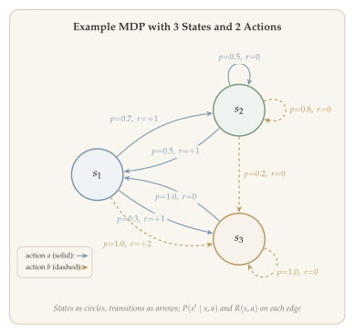
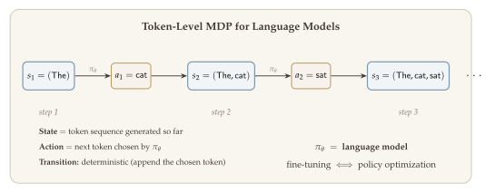
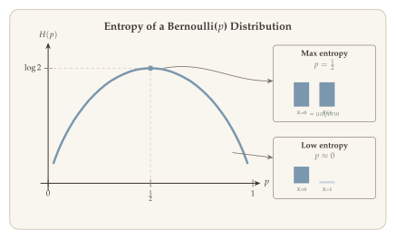
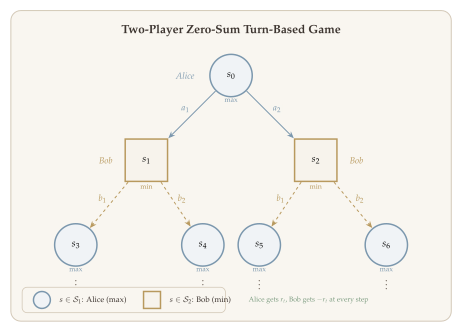

In the previous lecture, we introduced reinforcement learning at a high level and sketched the agent--environment interaction loop. We saw that the Markov decision process (MDP) provides the canonical mathematical model for sequential decision making. But we left many important questions unanswered: What does it mean for a policy to be "optimal"? How can we characterize the quality of a state or a state--action pair under a given policy? And what structural properties make MDPs computationally tractable?

This lecture addresses these questions by developing the mathematical foundations of MDPs. We introduce value functions --- both $V$-functions and $Q$-functions --- that summarize the long-term expected reward of following a policy from a given state. We then establish the Bellman equations, which provide recursive characterizations of these value functions, and introduce the Bellman operators that encode one-step look-ahead relationships. The contraction property of these operators, a consequence of the discount factor $\gamma \in (0,1)$, is the key analytic tool that guarantees existence and uniqueness of value functions and underlies virtually every planning and learning algorithm.

The culmination of this lecture is the **fundamental theorem of MDPs**: the optimal value function is the unique fixed point of the Bellman optimality operator, and any policy that is greedy with respect to it is optimal. Moreover, there always exists an optimal policy that is deterministic and Markovian, so that searching over complicated history-dependent stochastic policies is unnecessary.

::: {.callout-important}
## The Central Question
*How can we mathematically characterize optimal behavior in a Markov decision process, and what structural properties of MDPs make this characterization tractable?*
:::

## What Will Be Covered {#sec-overview}

1. **Definition of MDPs** --- Discounted and episodic settings
2. **Policies and optimal policy** --- History-dependent and Markovian
3. **Characterization of optimality** --- $V$-function, $Q$-function, Bellman operators, and the Bellman equation
4. **Additional material** --- Softmax Bellman operator, two-player zero-sum turn-based games

## Abstract Formulation of Single-Agent RL {#sec-abstract-formulation}

Before diving into MDPs, it is helpful to set up the most general framework for sequential decision-making. The key idea is that an agent repeatedly interacts with an environment: it observes something, takes an action, and the environment responds. How well the agent does over the course of this interaction is the quantity we want to maximize.

::: {#def-stochastic-decision-process}
## Stochastic Decision Process

A **stochastic decision process** is a model that specifies an iterative interaction protocol:

- At the initial step $t = 1$, the agent observes $o_1 \sim p_0 \in \Delta(\mathcal{O})$.
- For all $t \geq 1$, the agent chooses action $a_t \in \mathcal{A}$ based on the history
  $$
  \tau_t = (o_1, a_1, \ldots, o_{t-1}, a_{t-1}, o_t).
  $$
- The environment generates the next observation according to $P(\cdot \mid \tau_t, a_t)$.
- The performance of the RL agent is given by $R(\tau)$, where $\tau$ is the whole trajectory.
:::

::: {#def-policy-abstract}
## Policy

A **policy** is a mapping that specifies how actions are selected:

$$
\pi = \{\pi_t\}_{t \geq 1}, \qquad \pi_t : (\mathcal{O} \times \mathcal{A})^{t-1} \times \mathcal{O} \longrightarrow \Delta(\mathcal{A}),
$$

so that $a_t \sim \pi_t(\cdot \mid \tau_t)$. Each $\pi_t$ is **history-dependent**.
:::

### The Optimization Goal {#sec-optimization-goal}

The central goal of reinforcement learning is to find an **optimal policy** $\pi^*$ that maximizes the expected performance metric:

$$
\pi^* \in \operatorname*{argmax}_{\pi \in \Pi} \; J(\pi, M) = \mathbb{E}_{\tau \sim D(\pi)} \bigl[ R(\tau) \bigr], \qquad (\star)
$$ {#eq-rl-objective}

where $M$ is the model that determines how each observation is generated, $D(\pi)$ is the distribution over trajectories $\{o_1, a_1, \ldots\}$ induced by running $\pi$ on model $M$, and $R(\tau)$ is a performance metric.

The ultimate goal of RL is to solve ([-@eq-rl-objective]) from data, when we do not know the model (no knowledge of $M$).

::: {.callout-tip}
## Remark: Types of Data

- **Online** --- from active experiments (the agent interacts with the environment in real time).
- **Offline** --- from a passive dataset (the agent learns from previously collected data).
:::

## Markov Decision Processes {#sec-mdp}

In the following lectures we mainly focus on the settings of **discounted** and **episodic** MDPs. We will not cover partially observable settings because the corresponding algorithms are less well developed.

The key property that distinguishes MDPs from general stochastic decision processes is the **Markov property**: only the current state matters for predicting the future.

::: {#def-markov-property}
## Markov Property

Let $x_1, x_2, \ldots, x_t, \ldots$ be a stochastic process. The Markov property holds if and only if

$$
P(x_{t+1} = \cdot \mid x_1 = x_1, x_2 = x_2, \ldots, x_t = x_t) = P(x_{t+1} = \cdot \mid x_t = x_t), \qquad \forall \, t \geq 0.
$$ {#eq-markov-property}

Equivalently, $x_{t+1} \perp \{x_{t-1}, \ldots, x_1\} \mid x_t$. Given the current state $x_t$, the past is independent of the future.
:::

A **Markov Decision Process (MDP)** is a stochastic decision-making process that satisfies the Markov property. That is, in MDPs, conditioning on the current state of the world, the past does not affect the future (and performance metric $R(\tau)$).

Formally, the transition satisfies:

$$
P(s_{t+1} = \cdot \mid \tau_t, a_t) = P(s_{t+1} = \cdot \mid s_t, a_t),
$$ {#eq-mdp-transition-markov}

and $R(\tau) = \sum_t r_t$ is the sum of cumulative rewards.

### Discounted MDP {#sec-discounted-mdp}

In a discounted MDP, the interaction between agent and environment lasts forever. The discount factor ensures that future rewards are downweighted, giving the agent an incentive to earn rewards sooner.

::: {#def-discounted-mdp}
## Discounted MDP

A **discounted MDP** is specified by the tuple $(\mathcal{S}, \mathcal{A}, R, P, p_0, \gamma)$ where $\gamma \in (0,1)$:

- $R: \mathcal{S} \times \mathcal{A} \to [0,1]$ --- reward function.
- $P: \mathcal{S} \times \mathcal{A} \to \Delta(\mathcal{S})$ --- transition kernel.

The interaction protocol is:

1. $s_0 \sim p_0 \in \Delta(\mathcal{S})$.
2. For $t = 0, 1, 2, \ldots$:
   - Take action $a_t$ at state $s_t$.
   - Environment gives reward $r_t$ and next state $s_{t+1}$, where $\mathbb{E}[r_t \mid s_t = s, a_t = a] = R(s,a)$ and $P(s_{t+1} = \cdot \mid s_t = s, a_t = a) = P(\cdot \mid s, a)$.

The trajectory is $\tau = (s_0, a_0, r_0, s_1, a_1, r_1, \ldots)$ and the discounted return is:

$$
R(\tau) = \sum_{t=0}^{\infty} \gamma^t \cdot r_t.
$$ {#eq-discounted-return}
:::

Since the rewards satisfy $r_t \in [0,1]$, the return is bounded: $R(\tau) \leq \sum_{t=0}^\infty \gamma^t = \frac{1}{1 - \gamma}$.

::: {.callout-tip}
## Remark: Effective Horizon

In practice we can approximate the infinite sum with a finite truncation. Let $\widehat{R}^T(\tau) = \sum_{t=0}^{T} \gamma^t r_t$. Then:

$$
\bigl|R(\tau) - \widehat{R}^T(\tau)\bigr| \leq \sum_{t=T+1}^{\infty} \gamma^t = \frac{\gamma^{T}}{1 - \gamma} \leq \varepsilon.
$$

To achieve $\varepsilon$-accuracy, it suffices to take $T \geq \frac{1}{1-\gamma} \log_e(1/\varepsilon)$. This quantity $\frac{1}{1-\gamma}$ is often called the **effective horizon** of a discounted MDP.
:::

### Episodic MDP {#sec-episodic-mdp}

In contrast to the infinite-horizon discounted setting, an episodic MDP has a fixed horizon $H$ after which the episode terminates. This is natural in many applications such as games, robotic manipulation tasks, or dialogue systems.

::: {#def-episodic-mdp}
## Episodic MDP

An **episodic MDP** is specified by $(\mathcal{S}, \mathcal{A}, R, P, p_0, H)$ where $[H] = \{1, 2, \ldots, H\}$ and $\Delta(\cdot)$ denotes a distribution:

- $R = \{R_h\}_{h \in [H]}$, where $R_h : \mathcal{S} \times \mathcal{A} \to [0,1]$.
- $P = \{P_h\}_{h \in [H]}$, where $P_h : \mathcal{S} \times \mathcal{A} \to \Delta(\mathcal{S})$.

The interaction protocol is:

1. $s_1 \sim p_0 \in \Delta(\mathcal{S})$.
2. For $h = 1, 2, \ldots, H$: at state $s_h$, take action $a_h$. The environment gives reward $r_h$ and next state $s_{h+1}$, where $\mathbb{E}[r_h \mid s_h = s, a_h = a] = R_h(s,a)$ and $P(s_{h+1} = \cdot \mid s_h = s, a_h = a) = P_h(\cdot \mid s, a)$.
3. Observe $s_{H+1}$. Terminate.

The return is $R(\tau) = \sum_{h=1}^{H} r_h$.
:::

### Examples of MDPs {#sec-examples-mdp}

Understanding that virtually any sequential decision problem can be cast as an MDP is an important conceptual step. We begin with a concrete numerical example that illustrates the key components of an MDP, then describe two conceptual examples.

::: {#exm-three-state-mdp}
## A Small MDP

Consider an MDP with $\mathcal{S} = \{s_1, s_2, s_3\}$ and $\mathcal{A} = \{a, b\}$. @fig-mdp-transition shows the full specification as a transition diagram, where states are circles and transitions are arrows labeled with the probability $P(s' \mid s, \text{action})$ and expected reward $R(s, \text{action})$.

{#fig-mdp-transition width="90%"}

To read this diagram, consider state $s_1$:

- **Action $a$ from $s_1$:** The agent transitions to $s_2$ with probability $0.7$ or to $s_3$ with probability $0.3$. In either case, the expected reward is $+1$.
- **Action $b$ from $s_1$:** The agent transitions deterministically to $s_3$ (probability $1.0$) and receives a higher expected reward of $+2$.

At first glance, action $b$ from $s_1$ looks better --- it gives $+2$ reward instead of $+1$. But notice that $s_3$ is a "dead end": taking action $b$ from $s_3$ keeps the agent stuck there with zero reward, and action $a$ returns to $s_1$ with zero reward. Meanwhile, $s_2$ has a chance of returning to $s_1$ (where the agent can earn reward again). The optimal policy must weigh the **immediate reward** against the **long-term consequences** of each transition --- this is the fundamental tradeoff that makes MDPs interesting.
:::

::: {#exm-stochastic-decision-as-mdp}
## Stochastic Decision Process as an MDP

Any stochastic decision process can be cast as an MDP by letting the state be the full history: $s_h = \tau_h = (o_1, a_1, \ldots, o_{h-1}, a_{h-1}, o_h)$. The state transition is:

$$
P(s_{h+1} = \cdot \mid s_h, a_h) = \begin{cases} 0 & \text{if } s_{h+1} \text{ and } (s_h, a_h) \text{ do not match,} \\ P(o_{h+1} \mid s_h, a_h) & \text{otherwise.} \end{cases}
$$

Thus any general decision-making problem can be cast as an MDP. The practical difficulty is that:

1. The state space is infinitely large (the number of values $\tau_h$ can take is $\Omega(\exp(h))$).
2. The state transition is complicated (it involves an indicator matching $s_{h+1}$ with $(s_h, a_h)$).
:::

::: {#exm-token-level-mdp}
## Token-Level MDP (Fine-Tuning LLMs)

In NLP, a token is a subword, a piece of a word. The whole vocabulary is split into a finite number of tokens. For simplicity, we just view each token as a word in an English dictionary.

Let $\mathcal{O}$ denote the space of tokens. Usually $|\mathcal{O}|$ is very large, say 50k. A causal language model is an autoregressive token sequence generator:

$$
P_{\mathrm{LLM}}(\text{next token} = \cdot \mid \text{context} = \cdot).
$$

A token-level MDP is defined as follows:

- $\mathcal{S}$: set of token sequences, $s_t = (o_1, o_2, \ldots, o_t)$.
- $\mathcal{A} = \mathcal{O}$: set of all tokens, $a_t = o_{t+1}$.
- State transition: **deterministic**, $s_{t+1} = s_t \cup \{a_t\} = (o_1, \ldots, o_{t+1})$.

{#fig-token-level-mdp width="95%"}

The key insight is that the language model's next-token distribution is exactly a policy: $\pi_\theta(a_t \mid s_t) = P_{\mathrm{LLM}}(o_{t+1} \mid o_1, \ldots, o_t)$. Thus, **fine-tuning an LLM $\Longleftrightarrow$ policy optimization**. The reward function depends on the application --- for example, a reward model trained on human preferences (RLHF) or a verifiable correctness signal (RL from verifiable rewards).
:::

### Code Demo: RL Environments {#sec-code-demos}

The following notebook explores standard Gymnasium environments (classic control, Atari, MuJoCo) with random and pretrained policies. Click the badge to run it interactively on Google Colab.

## Objective in MDP {#sec-objective}

With the MDP formulation in hand, we can now state precisely what it means for a policy to be "good." The objective is to find a policy that maximizes the expected cumulative reward.

Let $\pi$ be any (history-dependent) policy. We define

$$
J(\pi) = \begin{cases} \mathbb{E}\Bigl[\sum_{h=1}^{H} r_h\Bigr] & \text{episodic,} \\[6pt] \mathbb{E}\Bigl[\sum_{t \geq 0} \gamma^t \cdot r_t\Bigr] & \text{discounted,} \end{cases}
$$ {#eq-objective}

where the trajectory and rewards are generated by $\pi$. Our goal is to maximize $J(\pi)$.

However, notice that $J(\pi)$ depends on the initial state distribution $p_0$. We want to achieve a **more ambitious goal**:

::: {.callout-important}
## The Central Goal
Find a single policy $\pi^*$ that maximizes the expected total return **starting from any initial state** $s$, simultaneously for all $s \in \mathcal{S}$.
:::

This is a much stronger requirement than maximizing $J(\pi)$ for a particular $p_0$: we want a policy that is optimal no matter where the agent starts. As we will see, the remarkable message of the **fundamental theorem of MDPs** is that such a universally optimal policy always exists and can be taken to be deterministic and Markov.

To formalize and achieve this goal, we will first classify the types of policies available to the agent, then introduce **value functions** --- which measure the expected return from each individual state --- and the **Bellman equations** that characterize them.

## Policy Classes {#sec-policy-classes}

Policies can be classified according to how much of the history they use and whether they employ randomization. Understanding these distinctions is important because a major result in MDP theory shows that it suffices to search over simple policy classes.

::: {#def-history-dependent-policy}
## History-Dependent Policy

$\pi$ is a **history-dependent policy** if:

- (Episodic case) $\pi = \{\pi_h\}_{h=1}^{H}$, where $\pi_h : \tau_h = (s_1, a_1, \ldots, s_{h-1}, a_{h-1}, s_h) \longmapsto \Delta(\mathcal{A})$.
- (Discounted case) $\pi = \{\pi_t\}_{t \geq 0}$, where $\pi_t : \tau_t = (s_0, a_0, \ldots, s_{t-1}, a_{t-1}, s_t) \longmapsto \Delta(\mathcal{A})$.
:::

::: {.callout-tip}
## Remark: Well-Definedness of Trajectory Distribution

In a discounted MDP, the trajectory is infinitely long. So we need to make sure that the joint distribution of trajectory $\tau = \{(s_t, a_t)\}_{t \geq 0}$ is well-defined. This is guaranteed by the following theorem.
:::

::: {#thm-ionescu-tulcea}
## Ionescu-Tulcea Theorem (Trajectory Distribution)

Fix a discounted MDP $M = (\mathcal{S}, \mathcal{A}, R, P, p_0, \gamma)$. Let $\pi$ be any policy. Then there exists a probability $\mathbb{P}$ (denoted by $\mathbb{P}^\pi$) over measure space $(\Omega, \mathcal{F})$, where $\Omega = (\mathcal{S} \times \mathcal{A})^{\mathbb{N}}$ and $\mathcal{F} = (2^{\mathcal{S} \times \mathcal{A}})^{\mathbb{N}}$. Moreover $\mathbb{P}$ satisfies:

1. $\mathbb{P}(s_0 = s) = p_0(s)$, $\forall \, s \in \mathcal{S}$.
2. $\mathbb{P}(a_t = a \mid \tau_t) = \pi_t(a \mid \tau_t)$, $\forall \, a \in \mathcal{A}$, $\forall \, t \geq 0$.
3. $\mathbb{P}(s_{t+1} = s' \mid \tau_t, a_t = a) = P(s' \mid s_t, a)$, $\forall \, a \in \mathcal{A}$, $\forall \, s' \in \mathcal{S}$.
:::

The family of history-dependent policies is the set of **all possible policies**. We introduce two important special cases.

::: {#def-markov-policy}
## Markov / Memoryless Policy

$\pi$ is a **Markov** (or **memoryless**) policy if:

- (Episodic case) $\pi = \{\pi_h\}_{h \in [H]}$, where $\pi_h : \mathcal{S} \to \Delta(\mathcal{A})$. That is, $\pi_h(\cdot \mid \tau_h) = \pi_h(\cdot \mid s_h)$.
- (Discounted case) $\pi = \{\pi_t\}_{t \geq 0}$, where $\pi_t : \mathcal{S} \to \Delta(\mathcal{A})$. That is, $\pi_t(\cdot \mid \tau_t) = \pi_t(\cdot \mid s_t)$.
:::

::: {#def-stationary-policy}
## Stationary Policy

In a discounted MDP, $\pi$ is a **stationary** and memoryless policy if $\pi$ is a fixed mapping for all steps. That is, $\pi_t(\cdot \mid \tau_t) = \pi(\cdot \mid s_t)$.
:::

::: {.callout-tip}
## Remark: Convention

When we say $\pi$ is a Markov policy in the discounted setting, we often also assume it is stationary.
:::

::: {#def-deterministic-policy}
## Deterministic Policy

$\pi$ is a **deterministic** policy if it is a deterministic function:

- (Episodic case) $\pi = \{\pi_h\}_{h \in [H]}$, where $a_h = \pi_h(\tau_h)$.
- (Discounted case) $\pi = \{\pi_t\}_{t \geq 0}$, where $a_t = \pi_t(\tau_t)$.
:::

In particular, $\pi$ is a deterministic **and** Markov policy if:

- (Episodic) $\{\pi_h\}_{h \in [H]}$ are deterministic functions such that $a_h = \pi_h(s_h)$.
- (Discounted) $\pi$ is a deterministic function such that $a_t = \pi(s_t)$, $\forall \, t \geq 0$.

We now turn to the value functions that formalize the central goal stated in @sec-objective. Let us first focus on the discounted case.

## Value Functions (Discounted) {#sec-value-functions}

Value functions are the central objects in MDP theory. They quantify how good it is for an agent to be in a given state (or state--action pair) under a given policy. By comparing value functions across policies, we can identify optimal behavior.

### State-Value Function {#sec-state-value}

::: {#def-state-value-function}
## State-Value Function

Let $\pi$ be any (history-dependent) policy. We define the **state-value function** $V^\pi : \mathcal{S} \to \bigl[0, \tfrac{1}{1-\gamma}\bigr]$ as

$$
V^\pi(s) = \mathbb{E}\!\left[\sum_{t=0}^{\infty} \gamma^t \cdot r_t \;\middle|\; s_0 = s\right].
$$ {#eq-state-value}
:::

### Optimal Value Function {#sec-optimal-value}

The optimal value function captures the largest expected return we can possibly get starting from any state $s$:

::: {#def-optimal-value-function}
## Optimal Value Function

$$
V^*(s) = \sup_{\pi \in \text{All history-dependent policies}} V^\pi(s).
$$ {#eq-optimal-value}
:::

::: {#def-optimal-policy}
## Optimal Policy

A policy $\pi^*$ is **optimal** if and only if

$$
V^{\pi^*}(s) = V^*(s), \qquad \forall \, s \in \mathcal{S}.
$$ {#eq-optimal-policy-condition}
:::

### Alternative Characterization of Value Functions {#sec-alt-value}

There is a recursive way to express the value function that will be fundamental for deriving the Bellman equation. Starting from the definition:

$$
V^\pi(s) = \mathbb{E}\!\left[\sum_{t=0}^{\infty} \gamma^t r_t \;\middle|\; s_0 = s\right] = \mathbb{E}[r_0 \mid s_0 = s] + \gamma \cdot \mathbb{E}\!\left[\mathbb{E}\!\left[\sum_{t=0}^{\infty} \gamma^t r_{t+1} \;\middle|\; s_1 = s', a_0 = a, s_0 = s\right]\right].
$$

By the tower property $\mathbb{E}[X] = \sum_{y \in \mathcal{Y}} \mathbb{E}[X \mid Y = y] \cdot \mathbb{P}(Y = y)$, and using the Markov property, we get:

$$
V^\pi(s) = R^\pi(s) + \gamma \cdot \sum_{a, s'} \pi(a \mid s) \cdot P(s' \mid s, a) \cdot V^\pi(s').
$$ {#eq-value-recursive}

This recursion is the foundation of the Bellman equations we develop next.

## From History-Dependent to Memoryless Policies {#sec-reduction}

A remarkable feature of MDPs is that the optimal policy can always be found within a much simpler class of policies. Searching over the enormous space of history-dependent policies is unnecessary: it suffices to consider memoryless (Markov) policies.

::: {#thm-memoryless-sufficiency}
## Sufficiency of Memoryless Policies

For any $s \in \mathcal{S}$ and any history-dependent policy $\pi$, there exists a memoryless policy $\pi'$ such that

$$
V^\pi(s) = V^{\pi'}(s).
$$

As a result,

$$
\max_\pi V^\pi(s) = \max_{\pi' \in \text{Memoryless policies}} V^{\pi'}(s).
$$
:::

The proof of this theorem uses the notion of **occupancy measure** and is deferred. The upshot is that we have reduced the optimization problem to finding the optimal **memoryless** policy.

::: {#thm-optimal-deterministic-stationary}
## Existence of Optimal Deterministic Stationary Policy

For a discounted MDP, there exists a policy $\pi'$ that is stationary, Markovian, and deterministic such that

$$
V^*(s) = V^{\pi'}(s), \qquad \forall \, s \in \mathcal{S}.
$$

Consequently,

$$
\max_{\pi \in \text{All policies}} V^\pi(s) = \max_{\pi \in \Pi_{\mathrm{MD}}} V^\pi(s) = \max_{\pi \in \{\pi : \mathcal{S} \to \mathcal{A}\}} V^\pi(s) = \max_{\pi \in \{\pi : \mathcal{S} \to \Delta(\mathcal{A})\}} V^\pi(s),
$$

where $\Pi_{\mathrm{MD}}$ denotes the class of Markovian deterministic stationary policies.
:::

So far, we have reduced the problem to finding the optimal memoryless policy. If such a policy exists, it is the **globally optimal** policy. We will show that it indeed exists, and can be characterized by the optimal value function $V^*$ (with $\pi^*$ being the greedy policy of $V^*$). Moreover, $V^*$ is characterized by the **Bellman equation**, or equivalently, $V^*$ is the fixed point of the **Bellman operator**.

## Bellman Operators {#sec-bellman-operators}

Now we focus on $\Pi_{\mathrm{ML}}$ (memoryless policies) and find the optimal policy. We do this by introducing the Bellman operators, which provide a clean algebraic framework for reasoning about value functions.

Let $\pi : \mathcal{S} \to \Delta(\mathcal{A})$ be a memoryless policy. We define the following shorthand:

$$
\begin{aligned}
R^\pi(s) &= \sum_{a \in \mathcal{A}} R(s,a) \cdot \pi(a \mid s), \\
P^\pi(s' \mid s) &= \sum_{a \in \mathcal{A}} P(s' \mid s, a) \cdot \pi(a \mid s).
\end{aligned}
$$ {#eq-pi-shorthand}

{#fig-bellman-backup width="85%"}

### Bellman Evaluation Operator {#sec-bellman-eval}

The Bellman evaluation operator answers the question: given a value function $V$ and a policy $\pi$, what value function would result from executing $\pi$ for one step and then following $V$ thereafter? This one-step look-ahead structure is the key to all recursive methods in MDP theory.

::: {#def-bellman-eval-operator}
## Bellman Evaluation Operator

The **Bellman evaluation operator** $T^\pi : \mathbb{R}^{\mathcal{S}} \to \mathbb{R}^{\mathcal{S}}$ is defined, for any $V \in \mathbb{R}^{\mathcal{S}}$, by

$$
(T^\pi V)(s) := R^\pi(s) + \gamma \cdot (P^\pi V)(s) = R^\pi(s) + \gamma \sum_{s' \in \mathcal{S}} P^\pi(s' \mid s) \cdot V(s').
$$ {#eq-bellman-eval}

Equivalently,

$$
(T^\pi V)(s) = \sum_a \pi(a \mid s) \cdot \Bigl\{ R(s,a) + \gamma \sum_{s' \in \mathcal{S}} P(s' \mid s, a) \, V(s') \Bigr\}.
$$ {#eq-bellman-eval-expanded}
:::

### Bellman Optimality Operator {#sec-bellman-opt}

While the evaluation operator averages over the actions prescribed by a fixed policy $\pi$, we also need an operator that captures the best possible one-step look-ahead. The Bellman optimality operator replaces the policy-average with a maximization over actions, encoding the idea of making the best decision at each state.

::: {#def-bellman-opt-operator}
## Bellman Optimality Operator

The **Bellman optimality operator** $T : \mathbb{R}^{\mathcal{S}} \to \mathbb{R}^{\mathcal{S}}$ is defined by

$$
(TV)(s) = \max_a \Bigl\{ R(s,a) + \gamma \sum_{s'} P(s' \mid s, a) \, V(s') \Bigr\}.
$$ {#eq-bellman-opt}
:::

::: {.callout-tip}
## Remark: Linearity

- $T^\pi$ is a **linear** operator: $T^\pi(V_1 + V_2) = T^\pi V_1 + T^\pi V_2$.
- $T$ is **nonlinear** (due to the $\max$ operation).
:::

We use the $\ell_\infty$-norm on $\mathbb{R}^{\mathcal{S}}$:

$$
\|V\|_\infty = \sup_{s \in \mathcal{S}} |V(s)|.
$$ {#eq-infinity-norm}

### Contraction Property {#sec-contraction}

The Bellman operators are contractions in the $\ell_\infty$-norm. This is the key property that ensures the existence and uniqueness of fixed points and the convergence of iterative algorithms.

::: {#prp-gamma-contraction}
## $\gamma$-Contraction

For any $V_1, V_2 \in \mathbb{R}^{\mathcal{S}}$:

$$
\|T^\pi V_1 - T^\pi V_2\|_\infty \leq \gamma \cdot \|V_1 - V_2\|_\infty,
$$ {#eq-contraction-eval}

$$
\|T V_1 - T V_2\|_\infty \leq \gamma \cdot \|V_1 - V_2\|_\infty.
$$ {#eq-contraction-opt}
:::

::: {.proof}
We use the elementary fact that $|\max_a u(a) - \max_a v(a)| \leq \max_a |u(a) - v(a)|$. Then for any $s$:

$$
\begin{aligned}
|(TV)(s) - (Tu)(s)| &\leq \max_a \Bigl| \Bigl(R(s,a) + \gamma \sum_{s'} P(s' \mid s, a)\, V(s')\Bigr) - \Bigl(R(s,a) + \gamma \sum_{s'} P(s' \mid s, a)\, u(s')\Bigr) \Bigr| \\
&\leq \gamma \cdot \max_a \sum_{s'} P(s' \mid s, a) \cdot |u(s') - V(s')| \\
&\leq \gamma \cdot \|u - V\|_\infty.
\end{aligned}
$$

The last step uses $\sum_{s'} P(s' \mid s, a) = 1$ and $|u(s') - V(s')| \leq \|u - V\|_\infty$. The proof for $T^\pi$ is analogous. Since $\gamma \in (0,1)$, both operators are strict contractions. $\blacksquare$
:::

### Unique Fixed Points via Banach's Theorem {#sec-fixed-points}

Now we can apply **Banach's fixed point theorem** to the contraction mappings $T^\pi$ and $T$.

::: {#thm-unique-fixed-point}
## Unique Fixed Point of Bellman Operators

Given any $u \in \mathbb{R}^{\mathcal{S}}$ and any $\pi \in \Pi_{\mathrm{ML}}$, we have:

- $V^\pi = \lim_{k \to \infty} (T^\pi)^k u$, and for any $k \geq 0$,
  $$
  \|V^\pi - (T^\pi)^k u\|_\infty \leq \gamma^k \cdot \|V^\pi - u\|_\infty,
  $$
  where $V^\pi$ is the **unique** fixed point of $T^\pi$, i.e., $T^\pi V^\pi = V^\pi$.

- $V_\infty = \lim_{k \to \infty} T^k u$, and for any $k \geq 0$,
  $$
  \|V_\infty - T^k u\|_\infty \leq \gamma^k \cdot \|V_\infty - u\|_\infty,
  $$
  where $V_\infty$ is the unique fixed point of $T$, i.e., $T V_\infty = V_\infty$.
:::

::: {.proof}
We prove the statement for $T^\pi$; the proof for $T$ is identical. Consider the sequence $V^{(0)} = u$, $V^{(t)} = T^\pi V^{(t-1)} = (T^\pi)^t u$, for $t = 1, 2, \ldots$. By the $\gamma$-contraction property:

$$
\|V^\pi - (T^\pi)^k u\|_\infty = \|T^\pi V^\pi - T^\pi \cdot (T^\pi)^{k-1} u\|_\infty \leq \gamma \cdot \|V^\pi - (T^\pi)^{k-1} u\|_\infty \leq \gamma^k \cdot \|V^\pi - u\|_\infty.
$$

As $k \to \infty$ and $\gamma \in (0,1)$, we get $(T^\pi)^k u \to V^\pi$.

For uniqueness, suppose $Tu^* = u^*$ and $TV^* = V^*$. Then:

$$
\|u^* - V^*\|_\infty = \|Tu^* - TV^*\|_\infty \leq \gamma \cdot  \|u^* - V^*\|_\infty.
$$

Since $\gamma \in (0,1)$, this implies $\|u^* - V^*\|_\infty = 0$, so $u^* = V^*$. The fixed point is unique. $\blacksquare$
:::

### Value Iteration {#sec-value-iteration}

The contraction property immediately suggests an algorithm for computing $V^*$: simply iterate the Bellman optimality operator.

::: {.callout-important}
## Algorithm: Value Iteration (VI)

1. **Initialize** $V_0 = \mathbf{0}$ (or any $V_0 \in \mathbb{R}^{\mathcal{S}}$).
2. **For** $k = 1, 2, \ldots$:
   $$
   V_k = T V_{k-1} = T^k V_0.
   $$
3. For a sufficiently large $K$, return the greedy policy of $V_K$.
:::

Since $T$ is a $\gamma$-contraction, we have 

$$
\|V_K - V^*\|_\infty \leq \gamma^K \cdot \|V^*\|_\infty \leq \frac{\gamma^K}{1 - \gamma}.
$$ {#eq-vi-convergence}

We can also establish an upper bound on the suboptimality of value iteration. We will see this in the next lecture.

## Greedy Policy {#sec-greedy-policy}

Note that in the definition of $T$, there is a "$\max_{a \in \mathcal{A}}$". A policy that chooses an action that maximizes some function is called "greedy." Understanding greedy policies is essential because the optimal policy turns out to be greedy with respect to $V^*$.

::: {#def-greedy-policy}
## Greedy Policy

We say $\pi$ is **greedy** with respect to $V \in \mathbb{R}^{\mathcal{S}}$ if

$$
\pi(a \mid s) = \mathbb{1}\Bigl\{a = \operatorname*{argmax}_{\widehat{a}} \Bigl\{ R(s,\widehat{a}) + \gamma \sum_{s'} P(s' \mid s, \widehat{a}) \, V(s') \Bigr\}\Bigr\}.
$$ {#eq-greedy-policy}

If there are ties, break them arbitrarily.
:::

::: {.callout-tip}
## Remark: One-Step Lookahead

The quantity $R(s,a) + \gamma \sum_{s'} P(s' \mid s, a) \, V(s')$ is called the **one-step lookahead**. It represents the immediate reward plus the discounted expected future value when taking action $a$ and then following value function $V$.
:::

## Fundamental Theorem of MDPs {#sec-fundamental-theorem}

Now we are ready to state the central result of MDP theory. This theorem ties together the Bellman equation, the optimal value function, and the greedy policy into a single coherent picture.

::: {#thm-fundamental-mdp}
## Fundamental Theorem of MDPs (Discounted Case)

For any finite MDP, the following hold true:

1. The optimal value function $V^*$ satisfies $V^* = TV^*$ (i.e., $V^*$ is the unique fixed point of the Bellman optimality operator), where $V^*(s) = \sup_\pi V^\pi(s)$.
2. Any policy $\pi$ that is **greedy** with respect to $V^*$ is optimal.

Thus, there exists an optimal policy that is **memoryless** and **deterministic**.
:::

::: {.proof}
By @thm-unique-fixed-point, the Bellman optimality operator $T$ has a unique fixed point $V_\infty$. We need to show $V_\infty = V^*$.

First, for any memoryless policy $\pi$, $V^\pi$ is the unique fixed point of $T^\pi$ by @thm-unique-fixed-point. Since $T^\pi V \leq TV$ for all $V$ (because averaging over actions is no larger than the max), we have $V^\pi \leq V_\infty$. Taking the supremum over $\pi$ gives $V^* \leq V_\infty$.

Conversely, let $\pi^*$ be the greedy policy with respect to $V_\infty$. Then $T^{\pi^*} V_\infty = T V_\infty = V_\infty$, so $V_\infty$ is a fixed point of $T^{\pi^*}$. By uniqueness, $V^{\pi^*} = V_\infty$. Hence $V^* \geq V^{\pi^*} = V_\infty$. Combining, $V^* = V_\infty$, and $\pi^*$ is optimal. $\blacksquare$
:::

## Action-Value Functions and Bellman Operators {#sec-q-functions}

In addition to state-value functions, there are also **action-value functions**, also known as $Q$-functions. These are particularly important in practice because they allow an agent to select optimal actions without knowing the transition model.

### Definition of $Q$-Function {#sec-q-definition}

::: {#def-q-function}
## Action-Value Function ($Q$-Function)

Let $\pi$ be a memoryless policy. We define $Q^\pi : \mathcal{S} \times \mathcal{A} \to \bigl[0, \tfrac{1}{1-\gamma}\bigr]$ by

$$
Q^\pi(s, a) = \mathbb{E}_\pi\!\left[\sum_{t=0}^{\infty} r_t \;\middle|\; s_0 = s,\, a_0 = a\right].
$$ {#eq-q-function}
:::

The tower property gives the relationship between $V^\pi$ and $Q^\pi$:

$$
V^\pi(s) = \sum_{a \in \mathcal{A}} \pi(a \mid s) \cdot Q^\pi(s,a) = \bigl\langle \pi(\cdot \mid s),\, Q^\pi(s, \cdot) \bigr\rangle_{\mathcal{A}},
$$ {#eq-v-from-q}

where $\langle u, v \rangle = \sum_{a \in \mathcal{A}} u(a) \cdot v(a)$.

### Recursive Formula for $Q^\pi$ {#sec-q-recursive}

Moreover, by definition we have:

$$
\begin{aligned}
Q^\pi(s,a) &= R(s,a) + \gamma \cdot \mathbb{E}\!\left[\sum_{t=0}^{\infty} \gamma^t r_{t+1} \;\middle|\; s_0 = s,\, a_0 = a\right] \\
&= R(s,a) + \gamma \cdot \mathbb{E}\!\left[\mathbb{E}\!\left[\sum_{t=0}^{\infty} \gamma^t r_{t+1} \;\middle|\; s_1 = s'\right] \;\middle|\; s_0 = s, a_0 = a\right] \\
&= R(s,a) + \gamma \sum_{s' \in \mathcal{S}} P(s' \mid s, a) \, V^\pi(s').
\end{aligned}
$$ {#eq-q-recursive}

In compact vector form: $Q^\pi = R + \gamma P V^\pi$, where $Q^\pi \in \mathbb{R}^{|\mathcal{S}||\mathcal{A}|}$, $R \in \mathbb{R}^{|\mathcal{S}||\mathcal{A}|}$, and $P \in \mathbb{R}^{|\mathcal{S}||\mathcal{A}| \times |\mathcal{S}|}$.

Also, $V^\pi(s') = \bigl\langle \pi(\cdot \mid s'),\, Q^\pi(s', \cdot)\bigr\rangle_{\mathcal{A}}$.

### Bellman Operators for $Q$-Functions {#sec-bellman-q}

::: {#def-bellman-eval-q}
## Bellman Evaluation Operator for $Q$-Functions

With a slight abuse of notation, $T^\pi : \mathbb{R}^{\mathcal{S} \times \mathcal{A}} \to \mathbb{R}^{\mathcal{S} \times \mathcal{A}}$ is defined by

$$
(T^\pi Q)(s,a) = R(s,a) + \gamma \sum_{s', a'} P(s' \mid s, a) \cdot \pi(a' \mid s') \cdot Q(s', a').
$$ {#eq-bellman-eval-q}
:::

### Optimal $Q$-Function {#sec-optimal-q}

::: {#def-optimal-q}
## Optimal Action-Value Function

$$
Q^*(s, a) = \sup_\pi Q^\pi(s, a).
$$ {#eq-optimal-q}
:::

$Q^*$ is closely related to $V^*$, $\pi^*$, and the Bellman optimality operator:

$$
(TQ)(s,a) = R(s,a) + \gamma \sum_{s'} P(s' \mid s, a) \Bigl\{\max_{a'} Q(s', a')\Bigr\} = R(s,a) + \gamma \, \mathbb{E}_{s' \sim P(\cdot \mid s, a)}\!\left[\max_{a'} Q(s', a')\right].
$$ {#eq-bellman-opt-q}

Analogous to the state-value case:

- $T^\pi$ and $T$ (for $Q$-functions) have unique fixed points $Q^\pi$ and $Q^*$ respectively, where $Q^* = Q^{\pi^*}$.
- $\pi^*$ is greedy with respect to $Q^*$:
  $$
  \pi_Q(s) = \operatorname*{argmax}_{a \in \mathcal{A}} Q(s,a) \quad \Longrightarrow \quad \pi^* \text{ is the optimal policy of the MDP.}
  $$ {#eq-greedy-q}
- $Q^* = R + P V^*$, and $V^*(s) = \max_a Q^*(s, a) = \bigl\langle \pi^*(\cdot \mid s),\, Q^*(\cdot \mid s) \bigr\rangle_{\mathcal{A}}$.

## Episodic Case {#sec-episodic-case}

Finally, all the results above can be translated to the **episodic case**. The main difference is that all quantities now carry a step index $h$.

### Policies and Value Functions {#sec-episodic-values}

A memoryless policy in the episodic case is $\pi = \{\pi_h\}_{h \in [H]}$ where $\pi_h : \mathcal{S} \to \Delta(\mathcal{A})$.

The value functions are indexed by step $h$:

$$
V_h^\pi(s) = \mathbb{E}\!\left[\sum_{t \geq h} r_t \;\middle|\; s_h = s\right], \qquad V_h^*(s) = \sup_{\pi \in \Pi} V_h^\pi(s),
$$ {#eq-episodic-v}

$$
Q_h^\pi(s, a) = \mathbb{E}\!\left[\sum_{t \geq h} r_t \;\middle|\; s_h = s,\, a_h = a\right], \qquad Q_h^*(s,a) = \sup_{\pi} Q_h^\pi(s,a).
$$ {#eq-episodic-q}

### Bellman Equations (Episodic) {#sec-episodic-bellman}

The Bellman equations in the episodic case take a backward-recursive form:

$$
V_h^\pi(s) = \sum_a \pi_h(a \mid s) \cdot Q_h^\pi(s, a), \qquad Q_h^\pi = R_h + P_h V_{h+1}^\pi,
$$ {#eq-episodic-bellman-eval}

$$
V_h^*(s) = \max_a Q_h^*(s, a), \qquad Q_h^* = R_h + P_h V_{h+1}^*.
$$ {#eq-episodic-bellman-opt}

### Fundamental Theorem (Episodic) {#sec-episodic-fundamental}

::: {#thm-fundamental-episodic}
## Fundamental Theorem (Episodic Case)

1. The optimal value function $V = \{V_h^*\}$ satisfies the Bellman equation:
   $$
   V_h^*(s) = \max_a \Bigl\{ R_h(s,a) + \sum_{s'} P_h(s' \mid s, a) \, V_{h+1}^*(s') \Bigr\}, \qquad (V_{H+1}^* = 0).
   $$ {#eq-episodic-bellman-optimality}
2. Any policy that is greedy with respect to $V^*$ (or equivalently $Q^*$) is optimal.
:::

::: {#exm-episodic-backward-induction}
## Backward Induction ($H = 2$)

Consider an episodic MDP with $H = 2$. At step $h = 2$:

$$
Q_2^*(s, a) = R_2(s, a), \qquad V_2^*(s) = \max_a Q_2^*(s, a), \qquad \pi_2^* = \text{arbitrary (greedy)}.
$$

Then at step $h = 1$:

$$
Q_1^*(s, a) = R_1(s, a) + \mathbb{E}_{s' \sim P(\cdot \mid s, a)}\bigl[V_2^*(s')\bigr], \qquad V_1^*(s) = \max_a Q_1^*(s, a).
$$

This backward computation generalizes to any $H$, yielding the **dynamic programming** (backward induction) algorithm.
:::

## Additional Materials I: Extension to Continuous Actions {#sec-softmax-bellman}

When the action space $\mathcal{A}$ is continuous (e.g., $\mathcal{A} = [0,1]$), the $\max_{a \in \mathcal{A}}$ in the Bellman optimality operator is hard to compute because $\max_{a \in \mathcal{A}} f(a)$ is itself an optimization problem. A natural idea is to **approximate the hard max by a softmax**.

### Softmax Function {#sec-softmax}

To formalize the softmax approximation, we first recall the softmax function itself.

::: {#def-softmax}
## Softmax Function

The **softmax** function maps a vector $v \in \mathbb{R}^{|\mathcal{A}|}$ to a distribution over $\mathcal{A}$:

$$
[\mathrm{Softmax}(v)]_a = \frac{\exp(v_a)}{\sum_{a' \in \mathcal{A}} \exp(v_{a'})}.
$$ {#eq-softmax-discrete}

For continuous $\mathcal{A}$:

$$
[\mathrm{Softmax}(v)]_a = \frac{\exp(v_a)}{\int_{a' \in \mathcal{A}} \exp(v_{a'}) \, da'}.
$$ {#eq-softmax-continuous}
:::

### Temperature in Softmax {#sec-temperature}

The temperature parameter $\beta \geq 0$ controls how closely the softmax approximates the hard max. Consider the distribution $\mathrm{Softmax}\bigl(\tfrac{1}{\beta} v\bigr)$:

$$
\left[\mathrm{Softmax}\!\left(\tfrac{1}{\beta} v\right)\right]_a = \frac{\exp\!\bigl(\tfrac{1}{\beta} v_a\bigr)}{\int_{a'} \exp\!\bigl(\tfrac{1}{\beta} v_{a'}\bigr) \, da'}.
$$ {#eq-softmax-temperature}

As a result:

- As $\beta \to 0$, softmax $\to$ hard max (the distribution concentrates on $\delta\{a = \operatorname{argmax}_{a'} v_{a'}\}$).
- As $\beta \to +\infty$, softmax $\to$ uniform distribution (over $\mathcal{A}$, with respect to the Lebesgue measure $|\mathcal{A}|$).

Intuitively, $\beta$ controls the **randomness** of the distribution $\mathrm{Softmax}\bigl(\tfrac{1}{\beta} v_a\bigr)$.

### Entropy {#sec-entropy}

In information theory, the randomness of a distribution is captured by its **entropy**. This connection between softmax and entropy is both elegant and practically important.

::: {#def-entropy}
## Entropy

Let $X$ be a random variable (discrete or continuous valued) with pmf or pdf $f$. The **entropy** of $X$ is:

$$
\mathcal{H}(X) = \mathbb{E}[-\log f(X)] = \begin{cases} \sum_{x \in \mathcal{X}} -\log f(x) \cdot f(x) & \text{discrete,} \\ \int_{x \in \mathcal{X}} -\log f(x) \cdot f(x) \, dx & \text{continuous.} \end{cases}
$$ {#eq-entropy}
:::

::: {#exm-entropy-examples}
## Entropy Examples

- **Bernoulli($p$)** ($\mathbb{P}(X = 1) = p$): $\mathcal{H}(X) = -(p \cdot \log p + (1-p) \cdot \log(1-p))$. Maximized by $p = \tfrac{1}{2}$ ($\mathcal{H} = \log 2$), minimized by $p = 0$ or $1$ ($\mathcal{H} = 0$).
- **Uniform$[a, b]$**: $\mathcal{H}(X) = \log(b - a)$.
- **$\mathcal{N}(0, \sigma^2)$**: $\mathcal{H}(X) = \log(\sigma\sqrt{2\pi e})$.
:::

{#fig-entropy-bernoulli width="85%"}

### Softmax and Maximum Entropy {#sec-softmax-max-entropy}

There is a deep connection between the softmax distribution and entropy-regularized optimization.

Let $f: \mathcal{X} \to \mathbb{R}$ be a fixed function. Consider the **softmax distribution**:

$$
\pi_f(x) = \frac{\exp\!\bigl(\tfrac{1}{\beta} f(x)\bigr)}{\int_{z \in \mathcal{X}} \exp\!\bigl(\tfrac{1}{\beta} f(z)\bigr) \, dz} \in \Delta(\mathcal{X}).
$$ {#eq-softmax-distribution}

Now consider the **entropy-regularized maximization**:

$$
\max_{\pi} \Bigl\{ \mathbb{E}_{X \sim \pi}[f(X)] + \beta \cdot \mathcal{H}(\pi) \Bigr\}.
$$ {#eq-entropy-regularized}

::: {#thm-softmax-max-entropy}
## Softmax as Maximum-Entropy Solution

The solution to the entropy-regularized optimization ([-@eq-entropy-regularized]) is exactly $\pi_f$, for all $\beta \geq 0$.
:::

::: {.proof}
Consider the Lagrangian:

$$
\mathcal{L}(\pi, \vec{\lambda}, \mu) = \langle \pi, f - \beta \log \pi \rangle_{\mathcal{X}} + \vec{\lambda}^\top(-\pi) + \mu(1 - \mathbf{1}^\top \pi).
$$

We verify that $\pi = \pi_f$, $\vec{\lambda} = \vec{0}$, $\mu = \mu_f$ satisfy the KKT conditions, where we set $\mu_f = \beta \log\!\bigl(\int_{z \in \mathcal{X}} \exp\!\bigl(\tfrac{1}{\beta} f(z)\bigr) dz\bigr) - \beta$.

1. **Primal feasible:** $\pi_f \geq 0$, $\mathbf{1}^\top \pi_f = 1$.
2. **Dual feasible:** $\vec{\lambda} \geq 0$.
3. **Complementary slackness:** $\vec{\lambda} \circ \pi_f$ is the zero function.
4. **Stationarity:**
   $$
   \nabla_\pi \mathcal{L}\Big|_{\pi = \pi_f,\, \lambda = 0,\, \mu = \mu_f} = f - \beta \log \pi_f - \beta - \mu_f = \beta \log\!\Bigl(\int \exp\!\bigl(\tfrac{1}{\beta} f(z)\bigr) dz\Bigr) - \beta - \mu_f = 0.
   $$

All KKT conditions are satisfied, confirming that $\pi_f$ is optimal. $\blacksquare$
:::

### Optimal Objective Value {#sec-max-entropy-value}

We know that the optimal policy is $\pi_f$ with $\pi_f(x) \propto \exp\!\bigl(\tfrac{1}{\beta} f(x)\bigr)$. The optimal objective value is:

$$
V^* = \mathbb{E}_{X \sim \pi_f}[f(X)] + \beta \, \mathcal{H}(\pi_f) = \beta \log\!\left(\int_{z \in \mathcal{X}} \exp(\beta \cdot f(z)) \, dz\right).
$$ {#eq-log-sum-exp}

This is the **log-sum-exp** function. As we will see, log-sum-exp serves as the value $V$-function in the softmax Bellman equation.

### Softmax Bellman Equation {#sec-softmax-bellman-eq}

Replacing $\max_{a \in \mathcal{A}}$ by softmax, we obtain the softmax version of the Bellman operator $T_\beta$ and the corresponding Bellman equation.

::: {#def-softmax-bellman}
## Softmax Bellman Operator

For any $Q : \mathcal{S} \times \mathcal{A} \to \mathbb{R}$, we define $T_\beta Q$ as follows. First, let:

$$
V_Q(s') = \beta \log\!\left(\int_{\mathcal{A}} \exp(\beta \cdot Q(s', a)) \, da\right), \qquad \forall \, s' \in \mathcal{S}.
$$ {#eq-softmax-v}

Then:

$$
(T_\beta Q)(s, a) = R(s, a) + \gamma \, \mathbb{E}_{s' \sim P(\cdot \mid s, a)}\bigl[V_Q(s')\bigr].
$$ {#eq-softmax-bellman-operator}
:::

$T_\beta$ is also a $\gamma$-contraction in the $\ell_\infty$-norm. Thus, it has a unique fixed point $Q_\beta^*$:

$$
Q_\beta^* = T_\beta Q_\beta^*.
$$ {#eq-softmax-fixed-point}

The corresponding softmax Bellman equation is:

$$
V_\beta^*(s) = \beta \cdot \log\!\left(\int_{\mathcal{A}} \exp\!\bigl(\tfrac{1}{\beta} Q_\beta^*(s, a)\bigr) \, da\right),
$$ {#eq-softmax-bellman-v}

$$
Q_\beta^*(s, a) = R(s, a) + \gamma \, \mathbb{E}_{s' \sim P(\cdot \mid s, a)}\bigl[V_\beta^*(s')\bigr].
$$ {#eq-softmax-bellman-q}

The **optimal policy** ("greedy" policy) induced by $Q_\beta^*$ is:

$$
\pi_\beta^*(a \mid s) = \frac{\exp\!\bigl(\tfrac{1}{\beta} Q_\beta^*(s, a)\bigr)}{\int \exp\!\bigl(\tfrac{1}{\beta} Q_\beta^*(s, a')\bigr) \, da'} = \exp\!\Bigl(\tfrac{1}{\beta}\bigl(Q_\beta^*(s, a) - V_\beta^*(s)\bigr)\Bigr).
$$ {#eq-softmax-optimal-policy}

::: {.callout-tip}
## Remark: Entropy-Regularized MDP

$\pi_\beta^*$ is the optimal policy of the **entropy-regularized MDP**:

$$
\max_\pi \; \mathbb{E}\!\left\{\sum_{t=0}^{\infty} \gamma^t \bigl[r_t + \mathcal{H}(\pi(\cdot \mid s_t))\bigr]\right\}.
$$

Moreover, $V_\beta^*(s) = \mathbb{E}_{a \sim \pi_\beta^*}\bigl[Q_\beta^*(s, a) - \beta \log \pi_\beta^*(a \mid s)\bigr]$.
:::

## Additional Materials II: Two-Player Zero-Sum Turn-Based Games {#sec-zero-sum-games}

As a simple but important extension beyond single-agent RL, we consider **two-player zero-sum turn-based games**. These arise naturally in games like Go and Chess where two players alternate turns, and one player's gain is exactly the other's loss. Remarkably, the entire MDP framework we have built --- value functions, Bellman equations, contraction arguments --- carries over with only minor modifications.

### Setup {#sec-game-setup}

Consider a game (e.g., Go, Chess) involving two players, **Alice** and **Bob**. They take turns to take actions, and their total payoff is zero: Alice's gain is Bob's loss. This "zero-sum" constraint means we only need to track one player's value function; the other's is its negation.

::: {#def-zero-sum-game}
## Two-Player Zero-Sum Turn-Based Game

A **two-player zero-sum turn-based game** is a tuple $(\mathcal{S}_1, \mathcal{S}_2, \mathcal{A}, \mathcal{B}, P, R, \gamma)$ where:

- $\mathcal{S} = \mathcal{S}_1 \cup \mathcal{S}_2$ is the state space, partitioned into **Alice's states** $\mathcal{S}_1$ and **Bob's states** $\mathcal{S}_2$ (with $\mathcal{S}_1 \cap \mathcal{S}_2 = \emptyset$),
- $\mathcal{A}$ is Alice's action space and $\mathcal{B}$ is Bob's action space,
- $P(s' \mid s, a)$ is the transition kernel,
- $R(s, a)$ is Alice's reward (Bob receives $-R(s, a)$),
- $\gamma \in [0, 1)$ is the discount factor.
:::

The key structural difference from a standard MDP is the **state partition**: at each state, only one player acts. When $s \in \mathcal{S}_1$, Alice chooses an action from $\mathcal{A}$; when $s \in \mathcal{S}_2$, Bob chooses from $\mathcal{B}$. Notice that Alice's reward $r_t$ can be nonzero even when Bob takes action at time $t$ --- the reward depends on the state, not on who is acting.

{#fig-zero-sum-game width="85%"}

### Trajectory of the Game {#sec-game-trajectory}

The game unfolds as follows:

- $s_0 \sim p_0 \in \Delta(\mathcal{S})$.
- For $t \geq 0$:
  - If $s_t \in \mathcal{S}_1$: Alice takes action $a_t \sim \pi_A(\cdot \mid s_t)$, where $a_t \in \mathcal{A}$.
  - If $s_t \in \mathcal{S}_2$: Bob takes action $a_t \sim \pi_B(\cdot \mid s_t)$, where $a_t \in \mathcal{B}$.
  - Alice receives reward $r_t = R(s_t, a_t)$; Bob receives $-r_t$.
  - State evolves to $s_{t+1} \sim P(\cdot \mid s_t, a_t)$.

Alice's objective is to maximize her total discounted return $\sum_{t=0}^\infty \gamma^t r_t$, while Bob's objective is to minimize the same quantity (equivalently, to maximize his own return $\sum_{t=0}^\infty \gamma^t (-r_t)$). This leads to a **minimax** problem.

### Value Functions {#sec-game-value}

Given a pair of policies $(\pi_A, \pi_B)$, Alice's value function is:

$$
V^{\pi_A, \pi_B}(s) = \mathbb{E}\!\left[\sum_{t=0}^\infty \gamma^t r_t \;\middle|\; s_0 = s\right].
$$ {#eq-game-value}

Alice wants to find $\pi_A$ that maximizes $V$ (assuming Bob plays optimally to minimize it), while Bob wants $\pi_B$ that minimizes $V$ (assuming Alice plays optimally to maximize it). The central question is: **does the order of optimization matter?**

::: {.callout-important}
## Minimax Theorem (von Neumann)

For two-player zero-sum turn-based games with finite state and action spaces:

$$
\max_{\pi_A} \min_{\pi_B} V^{\pi_A, \pi_B}(s) = \min_{\pi_B} \max_{\pi_A} V^{\pi_A, \pi_B}(s) = V^*(s), \qquad \forall \, s \in \mathcal{S}.
$$

That is, the **game has a value** $V^*$, and neither player benefits from knowing the other's strategy in advance.
:::

This is a profound result: it means a well-defined "optimal play" exists for both players simultaneously. The common value $V^*$ is called the **value of the game**.

::: {.callout-note}
## Beyond Turn-Based Games: Zero-Sum Markov Games

The minimax theorem holds far more generally than the turn-based setting above. In a **zero-sum Markov game** (also called a stochastic game), both players act **simultaneously** at every state: at each time step, Alice chooses $a_t \in \mathcal{A}$ and Bob chooses $b_t \in \mathcal{B}$ without observing each other's choice, and the transition and reward depend on both actions via $P(s' \mid s, a, b)$ and $R(s, a, b)$. The minimax equality $\max_{\pi_A} \min_{\pi_B} V^{\pi_A, \pi_B} = \min_{\pi_B} \max_{\pi_A} V^{\pi_A, \pi_B}$ continues to hold, though the optimal policies may need to be **stochastic** (mixed strategies) rather than deterministic. The Bellman equations and value iteration for this more general setting involve a saddle-point operator $\max_a \min_b$ at every state; we omit the details here.
:::

### Bellman Equation for Games {#sec-game-bellman}

We let $Q^*$ and $V^*$ denote Alice's optimal value functions. Since the game is zero-sum, Bob's optimal value functions are simply $-Q^*$ and $-V^*$. The Bellman equation takes a natural form: Alice maximizes at her states, and Bob minimizes at his states.

$$
V^*(s) = \begin{cases} \max_{a \in \mathcal{A}} Q^*(s, a) & \text{if } s \in \mathcal{S}_1 \text{ (Alice's turn),} \\[4pt] \min_{a \in \mathcal{B}} Q^*(s, a) & \text{if } s \in \mathcal{S}_2 \text{ (Bob's turn),} \end{cases}
$$ {#eq-game-v-star}

$$
Q^*(s, a) = R(s, a) + \gamma \, \mathbb{E}_{s' \sim P(\cdot \mid s, a)}\bigl[V^*(s')\bigr].
$$ {#eq-game-q-star}

Compared with the single-agent Bellman optimality equation (@eq-bellman-opt), the only change is that $\max$ is replaced by $\min$ at Bob's states. The $Q$-function equation remains identical.

### Bellman Operator and Value Iteration {#sec-game-vi}

Define the **minimax Bellman operator** $T_{\text{game}} : \mathbb{R}^{\mathcal{S}} \to \mathbb{R}^{\mathcal{S}}$ by:

$$
(T_{\text{game}} V)(s) = \begin{cases} \max_{a \in \mathcal{A}} \bigl\{ R(s, a) + \gamma \sum_{s'} P(s' \mid s, a) \, V(s') \bigr\} & s \in \mathcal{S}_1, \\[4pt] \min_{a \in \mathcal{B}} \bigl\{ R(s, a) + \gamma \sum_{s'} P(s' \mid s, a) \, V(s') \bigr\} & s \in \mathcal{S}_2. \end{cases}
$$ {#eq-game-bellman-operator}

Since both $\max$ and $\min$ are non-expansive operations, the same contraction argument from @sec-contraction applies: $T_{\text{game}}$ is a $\gamma$-contraction in $\|\cdot\|_\infty$, and value iteration $V_{k+1} = T_{\text{game}} V_k$ converges to $V^*$ at the same geometric rate.

### Optimal Policy {#sec-game-optimal-policy}

The optimal policies for both players are deterministic and greedy with respect to $Q^*$:

$$
\pi_A^*(s) = \operatorname{argmax}_{a \in \mathcal{A}} Q^*(s, a), \qquad s \in \mathcal{S}_1,
$$ {#eq-game-policy-alice}

$$
\pi_B^*(s) = \operatorname{argmin}_{a \in \mathcal{B}} Q^*(s, a), \qquad s \in \mathcal{S}_2.
$$ {#eq-game-policy-bob}

Alice maximizes, Bob minimizes --- this is the classic **minimax** structure of zero-sum games.

::: {.callout-tip}
## Connection to AlphaGo and AlphaZero

The game of Go is a two-player zero-sum turn-based game with $|\mathcal{S}| \approx 10^{170}$ (far too large for exact value iteration). AlphaGo and AlphaZero approximate $V^*$ with a deep neural network and use **Monte Carlo tree search** (MCTS) to efficiently compute approximate minimax strategies. The Bellman equation structure above is exactly what MCTS exploits: it performs partial tree search rooted at the current state, using the learned $V^*$ approximation to evaluate leaf nodes.
:::

::: {.callout-tip}
## Looking Ahead
In the next chapter we will study **planning algorithms** for MDPs --- methods that compute the optimal policy given full knowledge of the model. We will cover value iteration, policy iteration, linear programming formulations, the performance difference lemma, and policy gradient methods.
:::
