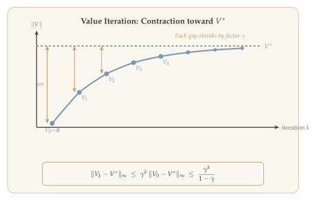

In the previous lecture we established the theoretical foundations of Markov decision processes: value functions, Bellman operators, and the fundamental theorem guaranteeing that optimal policies are deterministic and Markovian. A natural question follows: given full knowledge of the MDP model --- the reward function $R$ and the transition kernel $P$ --- how do we actually *compute* the optimal policy $\pi^*$?

This is the **planning** problem. While the model-free setting (where we must learn from data) is the ultimate goal of reinforcement learning, planning algorithms form the backbone of nearly every model-free method. Value iteration appears inside fitted Q-iteration; policy iteration motivates actor-critic methods; and the performance difference lemma, derived here, is the theoretical foundation for policy gradient algorithms. Understanding planning deeply is therefore essential for the rest of the course.

A [companion Jupyter notebook](https://colab.research.google.com/github/ZhuoranYang/sds685-notes/blob/main/notebooks/03-planning-algorithms.ipynb) accompanies this chapter with runnable implementations of value iteration (V and Q versions) and linear programming on the Frozen Lake environment.

This lecture develops a comprehensive toolkit of planning algorithms. We begin with **value-based methods** --- value iteration and linear programming --- that first estimate $V^*$ or $Q^*$ and then extract the greedy policy. We then turn to **policy-based methods** --- policy iteration, soft policy iteration (policy mirror descent), and policy gradient methods --- that directly optimize the performance metric $J(\pi)$ over the space of policies. The performance difference lemma serves as the bridge between these two families, providing an exact "Taylor expansion" for comparing policies.

::: {.callout-important}
## The Central Question
*Given complete knowledge of an MDP's rewards and transitions, how can we efficiently compute an optimal policy?*
:::

## What Will Be Covered {#sec-overview}

1. **Value-based methods** --- Estimate $V^*$ or $Q^*$ first, then return the greedy policy
   - Value iteration
   - Linear programming
2. **Policy-based methods** --- Directly optimize $J(\pi)$ over the space of (memoryless) policies
   - Policy iteration
   - Soft policy iteration (policy mirror descent)
   - Policy gradient

## Recap from the Previous Lecture {#sec-recap}

Before developing planning algorithms, we recall the key results established in the previous lecture. These results tell us *what* we are trying to compute; the algorithms in this lecture tell us *how*.

::: {#thm-fundamental}
## Fundamental Theorem of MDPs (Recap from @thm-fundamental-mdp)

For any finite MDP with discount factor $\gamma \in [0,1)$:

1. The optimal value function $V^*$ is the **unique fixed point** of the Bellman optimality operator: $V^* = \mathcal{T} V^*$.
2. Any policy $\pi^*$ that is **greedy** with respect to $V^*$ is optimal.

Consequently, there always exists an optimal policy that is **memoryless** and **deterministic**. This tells us *what* to compute --- the fixed point of $\mathcal{T}$ --- and the algorithms below tell us *how*.
:::

### Bellman Operators {#sec-bellman-operators}

The Bellman operators are the central workhorses of MDP theory. They encode a one-step look-ahead relationship between value functions and are used in virtually every planning and learning algorithm.

**Bellman evaluation operators.** For a fixed policy $\pi$, the Bellman evaluation operators map value functions to value functions by averaging over the actions prescribed by $\pi$:

$$
(\mathcal{T}^\pi V)(s) = \sum_a \pi(a \mid s) \Bigl\{ R(s,a) + \gamma \sum_{s'} P(s' \mid s,a) \, V(s') \Bigr\},
$$ {#eq-bellman-eval-v}

$$
(\mathcal{T}^\pi Q)(s,a) = R(s,a) + \gamma \sum_{s',a'} P(s' \mid s,a) \, \pi(a' \mid s') \, Q(s',a').
$$ {#eq-bellman-eval-q}

**Bellman optimality operators.** The optimality operators replace the policy-average with a maximization over actions:

$$
(\mathcal{T} V)(s) = \max_a \Bigl\{ R(s,a) + \gamma \sum_{s'} P(s' \mid s,a) \, V(s') \Bigr\},
$$ {#eq-bellman-opt-v}

$$
(\mathcal{T} Q)(s,a) = R(s,a) + \gamma \sum_{s'} P(s' \mid s,a) \, \Bigl\{ \max_{a'} Q(s',a') \Bigr\}.
$$ {#eq-bellman-opt-q}

### Optimality Conditions {#sec-optimality-conditions}

The optimal policy $\pi^*$, optimal Q-function $Q^*$, and optimal value function $V^*$ satisfy:

- $\pi^*$ is greedy with respect to $Q^* / V^*$.
- $Q^* = Q^{\pi^*}$, $\quad V^* = V^{\pi^*}$.
- $V^*(s) = \max_a Q^*(s,a) = \langle Q^*(s,\cdot), \pi^*(\cdot \mid s) \rangle_{\mathcal{A}}$.

## Value-Based and Policy-Based Methods {#sec-value-vs-policy}

There are two broad families of planning algorithms, distinguished by whether they work in the space of value functions or in the space of policies.

### Value-Based Algorithms {#sec-value-based-overview}

Value-based algorithms are an **indirect** approach to finding $\pi^*$. The idea is:

1. Learn $V^*$ or $Q^*$ by constructing an approximation $\widehat{V}$ or $\widehat{Q}$.
2. Return $\widehat{\pi} = \text{greedy}(\widehat{V})$ or $\widehat{\pi} = \text{greedy}(\widehat{Q})$.

How do we learn $Q^*$ or $V^*$? By solving the **Bellman equation**. Concretely, value-based methods proceed in two steps:

1. **(Approximately) solve the Bellman equation** to obtain $\widehat{Q} \approx Q^*$.
2. **Return the greedy policy** with respect to $\widehat{Q}$.

### Policy-Based Algorithms {#sec-policy-based-overview}

Policy-based algorithms take a **direct** approach: they solve $\max_\pi J(\pi)$ over the space of policies. This resembles standard stochastic optimization of the form $\min_x f(x)$, where we often use gradient-based methods.

Two natural questions arise in this setting:

1. Is there an **ascent direction** for improving $J(\pi)$?
2. What is the **Taylor expansion** of $J(\pi)$ --- that is, how do we compare two policies?

We will answer both questions when we study policy-based methods later in this lecture.

## Value Iteration {#sec-value-iteration}

### The Algorithm {#sec-vi-algorithm}

Value iteration (VI) is the first planning algorithm we study. The core idea is simple and elegant: since the Bellman optimality operator $\mathcal{T}$ is a **contraction**, repeatedly applying it to any initial value function must converge to the unique fixed point $V^*$.

Formally, for any initialization $V_0$, we have $(\mathcal{T})^k V_0 \to V^*$ as $k \to \infty$. This means we can recursively apply the Bellman operator to compute $V^*$.

::: {.callout-important}
## Algorithm: Value Iteration ($V$-function version)

Recall that the Bellman optimality operator acts on $V$-functions as:

$$
(\mathcal{T} V)(s) = \max_{a \in \mathcal{A}} \Bigl\{ R(s,a) + \mathbb{E}_{s' \sim P(\cdot \mid s,a)} \bigl[ V(s') \bigr] \Bigr\}.
$$

1. **Initialize:** $V_0 = 0$.
2. **For** $k = 1, 2, \ldots, K$:
   $$
   V_k = \mathcal{T} V_{k-1}.
   $$
3. **Return** $\widehat{\pi}$ that is greedy with respect to $V_K$:
   $$
   \widehat{\pi}(a \mid s) = \mathbb{1}\bigl\{ a = \operatorname*{argmax}_{a' \in \mathcal{A}} (\mathcal{T} V_K)(s) \bigr\}.
   $$
:::

::: {.callout-important}
## Algorithm: Value Iteration ($Q$-function version)

1. **Initialize:** $Q_0 = 0$.
2. **For** $k = 1, 2, \ldots, K$:
   $$
   Q_k = \mathcal{T} Q_{k-1},
   $$
   where $Q_k(s,a) = R(s,a) + \gamma \sum_{s'} P(s' \mid s,a) \bigl\{ \max_{a'} Q_{k-1}(s',a') \bigr\}, \quad \forall \, (s,a) \in \mathcal{S} \times \mathcal{A}$.
3. **Return** $\widehat{\pi} = \text{greedy}(Q_K)$:
   $$
   \widehat{\pi}(a \mid s) = \mathbb{1}\bigl\{ a = \operatorname*{argmax}_{a' \in \mathcal{A}} Q_K(s,a') \bigr\}.
   $$
:::

{#fig-vi-convergence width="85%"}

### Convergence Analysis of Value Iteration {#sec-vi-convergence}

The natural question is: how good is the policy $\widehat{\pi}$ returned by value iteration? That is, what is $V^*(s) - V^{\widehat{\pi}}(s)$?

An important subtlety: we do **not** care whether $V_k \approx V^*$ or $Q_k \approx Q^*$ per se. We only care about the **quality of the learned policy**. This is why we focus on the suboptimality gap $V^*(s) - V^{\widehat{\pi}}(s)$.

We will prove the following result:

$$
0 \leq V^*(s) - V^{\widehat{\pi}}(s) \leq \frac{2 \gamma^K}{(1 - \gamma)^2}, \qquad \forall \, s \in \mathcal{S},
$$ {#eq-vi-bound}

after $K$ iterations of value iteration. To get an $\varepsilon$-optimal policy, we therefore need $K = \widetilde{O}\bigl(\frac{1}{1-\gamma}\bigr)$ iterations, where $\widetilde{O}$ hides logarithmic factors.

The proof involves two steps:

1. Prove that $Q_k \to Q^*$ at a $\gamma^k / (1-\gamma)$ rate.
2. Relate the suboptimality gap $V^*(s) - V^{\widehat{\pi}}(s)$ to $\|Q_k - Q^*\|_\infty$.

### Step 1: Contraction of the Bellman Operator {#sec-vi-step1}

The Bellman optimality operator $\mathcal{T}$ is a $\gamma$-contraction in the $\ell_\infty$-norm. This is the key property that drives the convergence of value iteration.

::: {#lem-bellman-contraction}
## Bellman Contraction

For any $Q, Q' \in \mathbb{R}^{|\mathcal{S}| \times |\mathcal{A}|}$,

$$
\|\mathcal{T} Q - \mathcal{T} Q'\|_\infty \leq \gamma \, \|Q - Q'\|_\infty.
$$ {#eq-bellman-contraction}
:::

::: {.proof}
For any $(s,a)$, we have

$$
\begin{aligned}
\bigl| (\mathcal{T} Q)(s,a) - (\mathcal{T} Q')(s,a) \bigr|
&= \gamma \, \Bigl| \sum_{s'} P(s' \mid s,a) \Bigl[ \max_{a'} Q(s',a') - \max_{a'} Q'(s',a') \Bigr] \Bigr| \\
&\leq \gamma \sum_{s'} P(s' \mid s,a) \, \Bigl| \max_{a'} Q(s',a') - \max_{a'} Q'(s',a') \Bigr| \\
&\leq \gamma \sum_{s'} P(s' \mid s,a) \, \|Q - Q'\|_\infty \\
&= \gamma \, \|Q - Q'\|_\infty.
\end{aligned}
$$

The second inequality uses the fact that $|\max_a f(a) - \max_a g(a)| \leq \max_a |f(a) - g(a)|$. Since this holds for all $(s,a)$, the result follows. $\blacksquare$
:::

By applying @lem-bellman-contraction recursively, we immediately obtain:

$$
\|Q_K - Q^*\|_\infty \leq \gamma^K \, \|Q_0 - Q^*\|_\infty \leq \frac{\gamma^K}{1 - \gamma},
$$ {#eq-qk-bound}

where the last inequality uses $\|Q_0 - Q^*\|_\infty = \|Q^*\|_\infty \leq \frac{1}{1-\gamma}$ (since $Q_0 = 0$ and rewards are bounded in $[0,1]$).

### Step 2: From Q-Function Error to Policy Suboptimality {#sec-vi-step2}

It remains to relate the suboptimality gap $V^*(s) - V^{\widehat{\pi}}(s)$ to the approximation error $\|Q_K - Q^*\|_\infty$. The following lemma, which applies to **any** greedy policy, is the key.

::: {#lem-greedy-suboptimality}
## Greedy Policy Suboptimality

For any $f \in \mathbb{R}^{|\mathcal{S}| \times |\mathcal{A}|}$, let $\pi_f$ be the greedy policy with respect to $f$:

$$
\pi_f(a \mid s) = \mathbb{1}\bigl\{ a = \operatorname*{argmax}_{a' \in \mathcal{A}} f(s,a') \bigr\}, \qquad \forall \, (s,a).
$$

Then

$$
V^*(s) - V^{\pi_f}(s) \leq \frac{2 \, \|f - Q^*\|_\infty}{1 - \gamma}, \qquad \forall \, s \in \mathcal{S}.
$$ {#eq-greedy-subopt}
:::

::: {.proof}
Using the relationship between $V^\pi$ and $Q^\pi$, we decompose:

$$
\begin{aligned}
V^*(s) - V^{\pi_f}(s)
&= \langle Q^*(s,\cdot),\, \pi^*(\cdot \mid s) \rangle_\mathcal{A} - \langle Q^{\pi_f}(s,\cdot),\, \pi_f(\cdot \mid s) \rangle_\mathcal{A} \\
&= \underbrace{\langle Q^*(s,\cdot) - f(s,\cdot),\, \pi^*(\cdot \mid s) \rangle_\mathcal{A}}_{\text{(i)}}
+ \underbrace{\langle f(s,\cdot),\, \pi^*(\cdot \mid s) - \pi_f(\cdot \mid s) \rangle_\mathcal{A}}_{\text{(ii)}} \\
&\quad + \underbrace{\langle f(s,\cdot) - Q^*(s,\cdot),\, \pi_f(\cdot \mid s) \rangle_\mathcal{A}}_{\text{(iii)}}
+ \underbrace{\langle Q^*(s,\cdot) - Q^{\pi_f}(s,\cdot),\, \pi_f(\cdot \mid s) \rangle_\mathcal{A}}_{\text{(iv)}}.
\end{aligned}
$$

We bound each term:

- **Terms (i) and (iii):** Each is at most $\|Q^* - f\|_\infty$ in absolute value.
- **Term (ii):** $\leq 0$, because $\pi_f$ is greedy with respect to $f$, so $\langle f(s,\cdot), \pi_f(\cdot \mid s) \rangle \geq \langle f(s,\cdot), \pi^*(\cdot \mid s) \rangle$.
- **Term (iv):** $Q^*(s,a) - Q^{\pi_f}(s,a) = \gamma \sum_{s'} P(s' \mid s,a) \bigl( V^*(s') - V^{\pi_f}(s') \bigr)$.

Combining, we obtain:

$$
V^*(s) - V^{\pi_f}(s) \leq 2 \|f - Q^*\|_\infty + \gamma \, \|V^* - V^{\pi_f}\|_\infty.
$$

Taking the supremum over $s$ and rearranging yields:

$$
\|V^* - V^{\pi_f}\|_\infty \leq \frac{2 \, \|f - Q^*\|_\infty}{1 - \gamma}.
$$

This completes the proof. $\blacksquare$
:::

### Putting It Together {#sec-vi-final}

Combining ([-@eq-qk-bound]) and @lem-greedy-suboptimality (with $f = Q_K$), we obtain:

$$
\|V^* - V^{\widehat{\pi}}\|_\infty \leq \frac{2 \, \|Q_K - Q^*\|_\infty}{1 - \gamma} \leq \frac{2 \gamma^K}{(1 - \gamma)^2}.
$$ {#eq-vi-final-bound}

::: {#thm-vi-convergence}
## Convergence of Value Iteration

After $K$ iterations of value iteration, the returned policy $\widehat{\pi}$ satisfies

$$
V^*(s) - V^{\widehat{\pi}}(s) \leq \frac{2 \gamma^K}{(1 - \gamma)^2}, \qquad \forall \, s \in \mathcal{S}.
$$

For any fixed $\varepsilon > 0$, $\widehat{\pi}$ is $\varepsilon$-optimal when $K = O\!\left(\frac{\log\bigl(1/(\varepsilon(1-\gamma))\bigr)}{1 - \gamma}\right)$.
:::

::: {.proof}
We need $\frac{2\gamma^K}{(1-\gamma)^2} \leq \varepsilon$. Rewriting $\gamma^K = \bigl(1 - (1-\gamma)\bigr)^K$ and using the inequality $(1-1/x)^x \leq 1/e$ for $x > 1$, we get

$$
\frac{2}{(1-\gamma)^2} \cdot \gamma^K = \frac{2}{(1-\gamma)^2} \cdot \bigl(1 - (1-\gamma)\bigr)^K \leq \frac{2}{(1-\gamma)^2} \cdot \exp\bigl(-(1-\gamma)K\bigr) \leq \varepsilon.
$$

Solving for $K$ gives $K = O\!\left(\frac{\log(1/(\varepsilon(1-\gamma)))}{1-\gamma}\right)$. $\blacksquare$
:::

::: {.callout-tip}
## Remark: Computational Cost

Each iteration of value iteration requires $O(|\mathcal{S}|^2 |\mathcal{A}|)$ arithmetic operations (for each $(s,a)$ pair, we sum over all next states $s'$). Thus, the total computational cost is

$$
\widetilde{O}\!\left(|\mathcal{S}|^2 |\mathcal{A}| \cdot \frac{1}{1-\gamma}\right),
$$

where $\widetilde{O}$ omits logarithmic factors.
:::

## Linear Programming {#sec-linear-programming}

### Primal LP for MDPs {#sec-primal-lp}

The second value-based method reformulates the Bellman equation as a **linear program**. Recall that $V^*$ satisfies $V^* = \mathcal{T} V^*$. The LP approach exploits the fact that $V^*$ is the *smallest* function satisfying $V \geq \mathcal{T} V$.

Let $p_0 \in \Delta(\mathcal{S})$ be a distribution over the initial state satisfying $p_0(s) > 0$ for all $s \in \mathcal{S}$ and $\sum_s p_0(s) = 1$. Consider the optimization problem:

$$
\min_{V \in \mathbb{R}^{|\mathcal{S}|}} \; p_0^\top V \qquad \text{subject to} \quad V \geq \mathcal{T} V,
$$

where the constraint $V \geq \mathcal{T} V$ means $V(s) \geq \max_a \bigl\{ R(s,a) + \gamma \, \mathbb{E}_{s' \sim P(\cdot \mid s,a)}[V(s')] \bigr\}$ for all $s$. This can be written as a standard LP:

$$
\boxed{
\begin{aligned}
(\text{Primal}) \qquad & \min_{V \in \mathbb{R}^{|\mathcal{S}|}} \quad p_0^\top V \\
& \text{s.t.} \quad V(s) \geq R(s,a) + \gamma \, P(\cdot \mid s,a)^\top V, \quad \forall \, (s,a) \in \mathcal{S} \times \mathcal{A}.
\end{aligned}
}
$$ {#eq-primal-lp}

Here $P(\cdot \mid s,a)$ is regarded as a vector in $\mathbb{R}^{|\mathcal{S}|}$. The LP has $|\mathcal{S}|$ decision variables and $|\mathcal{S}| \times |\mathcal{A}|$ inequality constraints.

::: {#thm-primal-lp}
## Primal LP Solves the MDP

If $p_0(s) > 0$ for all $s \in \mathcal{S}$, then the optimal solution to the primal LP ([-@eq-primal-lp]) is $V^*$.
:::

::: {.proof}
Recall that the Bellman optimality operator $\mathcal{T}$ is **monotone**: for any $V \geq V'$, we have $\mathcal{T} V \geq \mathcal{T} V'$.

First, the primal LP is feasible because $V^*$ satisfies $V^* = \mathcal{T} V^* \geq \mathcal{T} V^*$ (it satisfies the constraint with equality).

For any feasible $V$, we have $V \geq \mathcal{T} V$. By monotonicity, $V \geq \mathcal{T} V$ implies $\mathcal{T} V \geq \mathcal{T}^2 V$. Recursively applying $\mathcal{T}$, we obtain:

$$
V \geq \mathcal{T} V \geq \cdots \geq \mathcal{T}^\infty V = V^*.
$$

Since $p_0(s) > 0$ for all $s$, this implies $p_0^\top V \geq p_0^\top V^*$, and the minimum is attained at $V = V^*$. $\blacksquare$
:::

### Dual LP and Occupancy Measures {#sec-dual-lp}

We can also consider the **dual form** of the LP:

$$
\boxed{
\begin{aligned}
(\text{Dual}) \qquad & \max_{d \in \mathbb{R}^{|\mathcal{S}| \times |\mathcal{A}|}} \quad d^\top R \\
& \text{s.t.} \quad \sum_a d(s,a) - \gamma \sum_{\widetilde{s}, \widetilde{a}} P(s \mid \widetilde{s}, \widetilde{a}) \, d(\widetilde{s}, \widetilde{a}) = p_0(s), \quad \forall \, s \in \mathcal{S}.
\end{aligned}
}
$$ {#eq-dual-lp}

Here $d$ plays the role of an **occupancy measure**.

::: {#def-occupancy-measure}
## Occupancy Measure

Let $p_0 \in \Delta(\mathcal{S})$ be the initial distribution ($s_0 \sim p_0$). For any policy $\pi$, the **occupancy measure** is defined as

$$
d_{p_0}^\pi(s,a) = \sum_{t=0}^{\infty} \gamma^t \, \mathbb{P}^\pi(s_t = s, \, a_t = a),
$$ {#eq-occupancy}

where $\mathbb{P}^\pi$ denotes the probability induced by the trajectory under policy $\pi$.
:::

The occupancy measure is an unnormalized probability distribution over $\mathcal{S} \times \mathcal{A}$ that measures how frequently each state-action pair $(s,a)$ is visited along a trajectory. It satisfies $\sum_{s,a} d_{p_0}^\pi(s,a) = \frac{1}{1-\gamma}$.

The constraint in the dual LP is called the **flow constraint**: it says that the occupancy measure is preserved by the transition dynamics.

::: {.callout-tip}
## Remark: Key Properties of Occupancy Measures

The occupancy measure has two fundamental properties:

1. **Performance identity:** $J(\pi) = \sum_{s,a} d_{p_0}^\pi(s,a) \, R(s,a) = (d_{p_0}^\pi)^\top R$.
2. **Flow constraint:** $d_{p_0}^\pi$ satisfies the flow constraint for all $\pi$.

Moreover, we can identify any occupancy measure $d$ satisfying the flow constraint to a policy:

$$
\pi(a \mid s) = \frac{d(s,a)}{\sum_{a'} d(s,a')}.
$$

Thus, optimizing $J(\pi)$ over Markov policies is equivalent to optimizing $d^\top R$ subject to the flow constraint.
:::

::: {.proof}
We verify that $d_{p_0}^\pi$ satisfies the flow constraint. By definition:

$$
\begin{aligned}
\sum_a d_{p_0}^\pi(s,a) &= \sum_a \sum_{t=0}^{\infty} \gamma^t \, \mathbb{P}^\pi(s_t = s,\, a_t = a) \\
&= \sum_{t=0}^{\infty} \gamma^t \, \mathbb{P}^\pi(s_t = s) \\
&= p_0(s) + \gamma \sum_{t=0}^{\infty} \gamma^t \, \mathbb{P}^\pi(s_{t+1} = s) \\
&= p_0(s) + \gamma \sum_{\widetilde{s}, \widetilde{a}} P(s \mid \widetilde{s}, \widetilde{a}) \cdot d_{p_0}^\pi(\widetilde{s}, \widetilde{a}).
\end{aligned}
$$

Rearranging gives the flow constraint. $\blacksquare$
:::

By strong duality, the dual LP admits a unique solution $d^*$ satisfying ${d^*}^\top R = p_0^\top V^*$. From $d^*$ we recover the optimal policy:

$$
\pi^*(a \mid s) = \frac{d^*(s,a)}{\sum_{a' \in \mathcal{A}} d^*(s,a')}.
$$ {#eq-policy-from-dual}

Moreover, the optimal dual objective value equals the optimal expected return:

$$
\langle d^*, R \rangle_{\mathcal{S} \times \mathcal{A}} = \langle p_0, V^* \rangle_{\mathcal{S}} = \mathbb{E}_{\pi^*}\!\left[ \sum_{t=0}^{\infty} \gamma^t \, r_t \right].
$$ {#eq-dual-value}

::: {.callout-tip}
## Remark: Value-Based vs. Policy-Based Summary

Value iteration and the primal LP are **value-based** methods because they aim to find $V^*$ directly by constructing a sequence of value functions that converges to $V^*$. (For example, consider the sequence generated by VI, or the sequence generated by simplex/interior-point methods for solving the primal LP.)

In the following, we turn to **policy-based** methods, which construct a sequence of policies $\{\pi_k\}_{k \geq 0}$ such that $V^{\pi_k}$ converges to $V^* = V^{\pi^*}$.
:::

## Policy Iteration {#sec-policy-iteration}

### General Pipeline of Policy-Based Methods {#sec-policy-pipeline}

Policy-based methods work directly in the space of policies. The general template involves two alternating steps:

::: {.callout-important}
## General Pipeline: Policy-Based Methods

1. **Initialize** $\pi_0$ arbitrarily.
2. **For** $k = 0, 1, 2, \ldots$:
   - **Policy evaluation:** Estimate $Q^{\pi_k}$.
   - **Policy improvement:** $\pi_{k+1} = \text{Update}(\pi_k, Q^{\pi_k})$.
:::

Policy-based methods are essentially **optimization in policy space**. The Q-function $Q^{\pi_k}$ serves as the ascent direction for the optimization problem $\max_\pi J(\pi) = \mathbb{E}_{p_0}[V^\pi(s)]$. This is why policy-based methods often borrow ideas from optimization and are popular in practice.

{#fig-pi-cycle width="85%"}

### The Policy Iteration Algorithm {#sec-pi-algorithm}

Policy iteration (PI) uses the simplest possible policy improvement: take the greedy policy with respect to the current Q-function.

::: {.callout-important}
## Algorithm: Policy Iteration

$$
\pi_{k+1} = \text{greedy}(Q^{\pi_k}), \qquad k = 0, 1, 2, \ldots
$$

That is, $\pi_{k+1}(a \mid s) = \mathbb{1}\{a = \operatorname*{argmax}_{a'} Q^{\pi_k}(s,a')\}$.
:::

::: {.callout-tip}
## Remark: Fixed Point

The optimal policy $\pi^*$ is a **fixed point** of policy iteration: $\pi^* = \text{greedy}(Q^*) = \text{greedy}(Q^{\pi^*})$. This follows directly from the fundamental theorem of MDPs.
:::

### Monotone Improvement {#sec-pi-monotone}

Why is policy iteration a correct algorithm? It creates a sequence of policies that **monotonically improves** the value function, until $\pi^*$ is reached.

::: {#thm-pi-monotone}
## Monotone Improvement of Policy Iteration

For all $(s,a) \in \mathcal{S} \times \mathcal{A}$ and all $k \geq 0$,

$$
Q^{\pi_{k+1}}(s,a) \geq \mathcal{T} Q^{\pi_k}(s,a) \geq Q^{\pi_k}(s,a).
$$ {#eq-pi-monotone}
:::

::: {.proof}
The proof relies on a key property of greedy policies.

**Claim:** If $\pi_f$ is greedy with respect to $f \in \mathbb{R}^{|\mathcal{S}| \times |\mathcal{A}|}$, then $\mathcal{T} f = \mathcal{T}^{\pi_f} f$.

To verify this claim, note that:

$$
(\mathcal{T}^{\pi_f} f)(s,a) = R(s,a) + \gamma \sum_{s',a'} \pi_f(a' \mid s') \, P(s' \mid s,a) \, f(s',a') = R(s,a) + \gamma \sum_{s'} P(s' \mid s,a) \cdot \max_{a'} f(s',a') = (\mathcal{T} f)(s,a).
$$

This holds because $\pi_f$ places all its weight on the action that maximizes $f$.

Now, in policy iteration, $\pi_{k+1} = \text{greedy}(Q^{\pi_k})$, so $\mathcal{T}^{\pi_{k+1}} Q^{\pi_k} = \mathcal{T} Q^{\pi_k}$.

**Right inequality:** It is clear that $\mathcal{T} Q^{\pi_k} \geq \mathcal{T}^{\pi_k} Q^{\pi_k} = Q^{\pi_k}$, since maximizing over actions is at least as good as following a fixed policy.

**Left inequality:** Since $\mathcal{T}^{\pi_{k+1}} Q^{\pi_k} = \mathcal{T} Q^{\pi_k} \geq Q^{\pi_k}$, by the monotonicity of $\mathcal{T}^{\pi_{k+1}}$, we have:

$$
Q^{\pi_{k+1}} = (\mathcal{T}^{\pi_{k+1}})^\infty Q^{\pi_k} \geq \cdots \geq \mathcal{T}^{\pi_{k+1}} Q^{\pi_k} \geq Q^{\pi_k}.
$$

Combining both inequalities completes the proof. $\blacksquare$
:::

### Convergence of Policy Iteration {#sec-pi-convergence}

We are now ready to bound $V^*(s) - V^{\pi_{K+1}}(s)$.

Since $\pi_{K+1} = \text{greedy}(Q^{\pi_K})$, by @lem-greedy-suboptimality we have:

$$
V^*(s) - V^{\pi_{K+1}}(s) \leq \frac{2 \, \|Q^{\pi_K} - Q^*\|_\infty}{1 - \gamma}.
$$ {#eq-pi-step1}

To bound $\|Q^{\pi_K} - Q^*\|_\infty$, we use the contraction property:

$$
\begin{aligned}
\|Q^{\pi_K} - Q^*\|_\infty
&\leq \|Q^* - \mathcal{T} Q^{\pi_{K-1}}\|_\infty
= \|\mathcal{T} Q^* - \mathcal{T} Q^{\pi_{K-1}}\|_\infty \\
&\leq \gamma \, \|Q^* - Q^{\pi_{K-1}}\|_\infty \\
&\leq \gamma^K \, \|Q^* - Q^{\pi_0}\|_\infty \leq \gamma^K.
\end{aligned}
$$

Here the first inequality uses $Q^* \geq Q^{\pi_K} \geq \mathcal{T} Q^{\pi_{K-1}}$ (from the monotone improvement property).

Substituting back:

$$
V^*(s) - V^{\pi_{K+1}}(s) \leq \frac{2 \gamma^K}{1 - \gamma}.
$$ {#eq-pi-convergence}

::: {#thm-pi-convergence}
## Convergence of Policy Iteration

Policy iteration finds an $\varepsilon$-approximately optimal policy in

$$
O\!\left(\frac{1}{1-\gamma} \log\!\left(\frac{1}{(1-\gamma)\varepsilon}\right)\right)
$$

iterations.
:::

::: {.callout-tip}
## Remark: Comparison of VI and PI

| | Value Iteration | Policy Iteration |
|---|---|---|
| **Update** | $Q_k = \mathcal{T} Q_{k-1}$ | Policy eval: estimate $Q^{\pi_k}$; Policy improv: $\pi_{k+1} = \text{greedy}(Q^{\pi_k})$ |
| **Output** | $\widehat{\pi} = \text{greedy}(Q_K)$ | $\pi_K$ |
| **Iterations to $\varepsilon$-optimal** | $K = \widetilde{O}\bigl(\frac{1}{1-\gamma}\bigr)$ | $K = \widetilde{O}\bigl(\frac{1}{1-\gamma}\bigr)$ |
| **Key idea** | $\mathcal{T}$ is a contraction | $\mathcal{T}$ is a contraction; $\mathcal{T}^\pi$ is monotone and contractive |
:::

### Key Steps of the Analysis {#sec-analysis-summary}

The analysis of both VI and PI rests on a common set of ideas:

1. **Greedy policy suboptimality** (@lem-greedy-suboptimality): For any greedy policy $\pi_f = \text{greedy}(f)$ where $f: \mathcal{S} \times \mathcal{A} \to \mathbb{R}$,
   $$
   V^*(s) - V^{\pi_f}(s) \leq \frac{1}{1-\gamma} \, \|Q^* - f\|_\infty, \qquad \forall \, s \in \mathcal{S}.
   $$
   This result characterizes the performance of **any** greedy policy.

2. **For VI**, by contractivity of $\mathcal{T}$: $\|Q^* - Q_k\|_\infty \leq \gamma^k \, \|Q^* - Q_0\|_\infty$.

3. **For PI**, the analysis is slightly more involved:
   - **(a) Monotone improvement:** $Q^{\pi_{k+1}} \geq (\mathcal{T}^{\pi_{k+1}})^k Q^{\pi_k} \geq \mathcal{T}^{\pi_{k+1}} Q^{\pi_k} = \mathcal{T} Q^{\pi_k} \geq Q^{\pi_k}$.
     Here we use: (i) $\pi_{k+1} = \text{greedy}(Q^{\pi_k})$ implies $\mathcal{T}^{\pi_{k+1}} Q^{\pi_k} = \mathcal{T} Q^{\pi_k} \geq \mathcal{T}^{\pi_k} Q^{\pi_k} = Q^{\pi_k}$; (ii) $\mathcal{T}^{\pi_{k+1}}$ is monotone and $\gamma$-contractive.
   - **(b) $\gamma$-contractivity of $\mathcal{T}$:** $\|Q^* - Q^{\pi_{k+1}}\|_\infty \leq \|Q^* - \mathcal{T} Q^{\pi_k}\|_\infty \leq \cdots \leq \gamma^{k+1} \, \|Q^* - Q^{\pi_0}\|_\infty$.

### Why Do We Need Methods Beyond Policy Iteration? {#sec-beyond-pi}

In the following, we will see other policy improvement methods. There are several reasons to look beyond greedy policy improvement:

1. **Sensitivity to estimation error.** The greedy mapping is sensitive to errors in the Q-function estimate. When there is estimation error in $Q^{\pi_k}$, the greedy policy can be very wrong. For example, consider the argmax of $\begin{pmatrix} 0.9 \\ 1.0 \end{pmatrix}$ vs. $\begin{pmatrix} 1.1 \\ 1.0 \end{pmatrix}$ --- a tiny perturbation flips the selected action.

2. **Monotonicity breaks.** When there is estimation error, the monotone improvement property in the PI analysis breaks down.

3. **Scalability.** Computing the greedy policy requires enumerating all states, which is not feasible when $|\mathcal{S}|$ is large. Ideally, we want to represent the policy as a neural network. For instance, when $\mathcal{A}$ is finite, it is more natural to write $\pi_\theta(a \mid s) = \text{Softmax}\bigl(f_\theta(s,a)\bigr)$ where $f_\theta$ is a neural network.

## Aside: VI, PI, and LP in the Episodic Setting {#sec-episodic}

In the episodic case, the planning algorithms take a particularly clean form because the horizon is finite.

::: {.callout-important}
## Algorithm: Value Iteration (Episodic Setting)

1. **Set** $Q_{H+1} = 0$ (no reward after the final step $H$).
2. **For** $h = H, H-1, \ldots, 1$:
   $$
   Q_h(s,a) = R_h(s,a) + \sum_{s'} P_h(s' \mid s,a) \bigl\{ \max_{a'} Q_{h+1}(s',a') \bigr\}.
   $$
3. **Return** the greedy policy of $Q = \{Q_h\}$, denoted $\pi_{\text{VI}}$.

**Claim:** $\pi_{\text{VI}} = \pi^*$. In other words, VI finds $\pi^*$ in exactly one backward pass (no iteration needed).
:::

## Policy Iteration (Episodic Setting) {#sec-policy-iteration-episodic}

Having studied value iteration and its convergence properties, we now turn to a second major family of planning algorithms: **policy iteration (PI)**. While value iteration operates directly on the value function, policy iteration alternates between two phases --- evaluating the current policy and improving it. This alternation often leads to faster convergence in practice and provides a natural bridge to the policy-based optimization methods we will study later.

::: {.callout-important}
## Algorithm: Policy Iteration (PI)

1. Initialize $\pi^{(0)}$ arbitrarily.
2. For $k = 0, 1, 2, \ldots$:
   - **Policy evaluation:** Compute $Q^{(k)}$ by setting $Q^{(k)}_{H+1} = 0$ and, for $h = H, H-1, \ldots, 1$,
     $$
     Q^{(k)}_h(s, a) = R_h(s, a) + \sum_{s'} \sum_{a'} \pi^{(k)}_{h+1}(a' \mid s') \, P_h(s' \mid s, a) \, Q^{(k)}_{h+1}(s', a').
     $$ {#eq-pi-evaluation}
   - **Policy improvement:** Set
     $$
     \pi^{(k+1)} \leftarrow \operatorname{greedy}(Q^{(k)}).
     $$
:::

The key result for policy iteration in the episodic setting is that it terminates quickly and finds the optimal policy exactly.

**Claim.** Policy iteration terminates and finds $\pi^*$ in at most $H$ iterations.

To see this, note that $Q^{(0)}_H = R_H = Q^*_H$, since at the last step the Q-function equals the immediate reward regardless of the policy. Therefore

$$
\pi^{(1)}_H = \operatorname{greedy}(Q^*_H) = \pi^*_H.
$$

Then at the next evaluation step,

$$
Q^{(1)}_{H-1} = R_{H-1} + \sum_{s'} P_H(s' \mid s, a) \cdot \max_{a'} Q_H(s', a') = Q^*_{H-1}.
$$

This implies $\pi^{(2)}_{H-1} = \pi^*_{H-1}$ and $\pi^{(2)}_H = \pi^*_H$. Following the same reasoning inductively, we obtain $\pi^{(H)} = \pi^*$. $\blacksquare$

## Linear Programming Formulation {#sec-lp-formulation}

MDP planning can also be cast as a linear program. This perspective is valuable both theoretically --- it reveals duality structure connecting value functions and occupancy measures --- and computationally, since it allows us to leverage the powerful machinery of LP solvers.

### Primal LP (Episodic) {#sec-primal-lp-episodic}

The primal LP finds the tightest upper bound on the value function that is consistent with the Bellman inequalities. Let $P_1$ denote the distribution of the initial state $s_1$.

$$
\min_{\{V_1, \ldots, V_H\} \in \mathbb{R}^S} \quad P_1^\top V_1
$$ {#eq-primal-lp-obj}

subject to

$$
V_h(s) \geq R_h(s, a) + \sum_{s'} P_h(s' \mid s, a) \, V_{h+1}(s'), \qquad \forall \, (s, a, h) \in \mathcal{S} \times \mathcal{A} \times [H],
$$ {#eq-primal-lp-constraint}

$$
V_{H+1} = 0.
$$

::: {.callout-tip}
## Remark

The constraints enforce that $V_h$ dominates the Bellman backup for every action. At optimality, the inequality binds for the optimal action, recovering $V^*_h$.
:::

### Dual LP (Episodic) {#sec-dual-lp-episodic}

The dual LP optimizes over occupancy measures instead of value functions. The dual variables $d_1, \ldots, d_H$ have a natural interpretation as state-action visitation frequencies.

$$
\max_{d_1, \ldots, d_H} \quad \sum_{h=1}^{H} d_h^\top R_h = \sum_{h=1}^{H} \sum_{(s_h, a_h) \in \mathcal{S} \times \mathcal{A}} d_h(s_h, a_h) \cdot R_h(s_h, a_h)
$$ {#eq-dual-lp-obj}

subject to

$$
\sum_{a} d_h(s, a) = \sum_{\widetilde{s}, \widetilde{a}} P_{h-1}(s \mid \widetilde{s}, \widetilde{a}) \, d_{h-1}(\widetilde{s}, \widetilde{a}), \qquad \forall \, s \in \mathcal{S}, \; h \geq 1,
$$ {#eq-dual-flow}

$$
\sum_{a} d_1(s, a) = P_0(s).
$$

The flow constraints in ([-@eq-dual-flow]) enforce that the occupancy measures are consistent with the transition dynamics, linking successive time steps through the probability kernel.

## Policy-Based Methods: Performance Difference Lemma {#sec-pdl}

We now shift our attention from value-based to **policy-based methods**. The key analytical tool in this section is the **Performance Difference Lemma (PDL)**, which plays the role of a Taylor expansion in RL and provides the theoretical foundation for all policy optimization algorithms.

### Policy Optimization in General Form {#sec-po-general}

The policy optimization problem in the discounted setting is:

$$
\max_{\pi} \; J(\pi) = \mathbb{E}_\pi\biggl[\sum_{t=0}^{\infty} \gamma^t \cdot r_t\biggr].
$$ {#eq-po-objective}

This is a standard stochastic optimization problem. In general, policy optimization algorithms involve the following two steps:

- **Policy evaluation:** Estimate $Q^{\pi_k}$.
- **Policy improvement:** Update the policy via $\pi_{k+1} = \operatorname{Update}(\pi_k, Q^{\pi_k})$.

To build intuition, recall classical first-order optimization for $\min_x f(x)$. Each iteration also involves two steps:

1. Find a descent direction $d_k$, e.g., $d_k = -\nabla f(x_k)$.
2. Update: $x_{k+1} = \operatorname{Update}(d_k, x_k)$.

The analogy is clear: $Q^{\pi_k}$ plays the role of the descent direction in policy space.

{#fig-po-landscape width="90%"}

### Descent Directions {#sec-descent-direction}

In $\min_x f(x)$, a vector $d \in \mathbb{R}^n$ is a **descent direction** if and only if

$$
\langle \nabla f(x), \, d \rangle < 0.
$$

This can be justified by Taylor expansion:

$$
f(x + \alpha \cdot d) = f(x) + \alpha \cdot d^\top \nabla f(x) + o(\alpha) < f(x),
$$

for $\alpha$ sufficiently small.

Two natural questions arise in the RL setting:

1. Is $Q^\pi$ a descent direction at "point" $\pi$?
2. What is the "Taylor expansion" for policy optimization?

We will answer these questions using the Performance Difference Lemma.

### Performance Difference Lemma {#sec-pdl-statement}

The Performance Difference Lemma provides an exact identity --- a "Taylor expansion in RL" --- that decomposes the performance gap between any two policies.

::: {#lem-pdl}
## Performance Difference

Let $\pi$ and $\pi'$ be two policies. For any initial distribution $\mu \in \Delta(\mathcal{S})$,

$$
\mathbb{E}_{s \sim \mu}\bigl[V^{\pi'}(s) - V^\pi(s)\bigr] = \mathbb{E}_{s \sim d_\mu^{\pi'}}\bigl[\langle Q^\pi(s, \cdot), \; \pi'(\cdot \mid s) - \pi(\cdot \mid s)\rangle_{\mathcal{A}}\bigr].
$$ {#eq-pdl}

Here $d_\mu^{\pi'}$ is the (discounted) occupancy measure defined by choosing $s_0 \sim \mu$ and $a_t \sim \pi'(\cdot \mid s_t)$ for all $t \geq 0$:

$$
d_\mu^{\pi'}(s) = \sum_{t=0}^{\infty} \gamma^t \, \mathbb{P}^{\pi'}(s_t = s), \qquad \forall \, s \in \mathcal{S}.
$$
:::

### Interpretation as Taylor Expansion {#sec-pdl-taylor}

This lemma can be viewed as a Taylor expansion --- and it is **exact**. Let $f(\pi) = \mathbb{E}_{s \sim \mu}\bigl[V^\pi(s)\bigr]$. The PDL shows that

$$
f(\pi') - f(\pi) = \bigl\langle Q^\pi, \; d_\mu^{\pi'} \otimes (\pi' - \pi) \bigr\rangle_{\mathcal{S} \times \mathcal{A}},
$$ {#eq-pdl-taylor}

which can be rewritten as

$$
f(\pi') - f(\pi) = \mathbb{E}_{s \sim d_\mu^{\pi'}}\bigl[\langle Q^\pi(s, \cdot), \; \pi'(\cdot \mid s) - \pi(\cdot \mid s)\rangle_{\mathcal{A}}\bigr] = \mathbb{E}_{(s, a) \sim d_\mu^{\pi'}}\bigl[Q^\pi(s, a) - V^\pi(s)\bigr].
$$

The last expression equals $\mathbb{E}_{(s,a) \sim d_\mu^{\pi'}}[A^\pi(s, a)]$, where $A^\pi(s,a) = Q^\pi(s,a) - V^\pi(s)$ is the advantage function.

This analogy is worth making precise, because it motivates the entire family of policy optimization methods we will study. The following table summarizes the correspondence.

::: {.callout-note appearance="simple"}
## The PDL--Taylor Analogy

| | **Classical Optimization** $\min_x f(x)$ | **Reinforcement Learning** $\max_\pi J(\pi)$ |
|:---|:---|:---|
| **First-order identity** | $f(x') - f(x) = \nabla f(x)^\top (x' - x) + o(\|x' - x\|)$ | $J(\pi') - J(\pi) = \bigl\langle Q^\pi,\; d^{\pi'}_\mu \otimes (\pi' - \pi)\bigr\rangle$ |
| **Current iterate** | Point $x \in \mathbb{R}^n$ | Policy $\pi(\cdot \mid s) \in \Delta(\mathcal{A})$ |
| **Gradient / ascent direction** | $\nabla f(x)$ | $Q^\pi(s, a)$ --- the "gradient" in policy space |
| **Displacement** | $x' - x$ | $\pi'(\cdot \mid s) - \pi(\cdot \mid s)$, weighted by occupancy $d_\mu^{\pi'}(s)$ |
| **Inner product** | Standard: $\langle u, v \rangle = u^\top v$ | Weighted: $\mathbb{E}_{s \sim d_\mu^{\pi'}}\bigl[\langle F(s,\cdot),\, G(s,\cdot)\rangle_{\mathcal{A}}\bigr]$ |
| **Exactness** | Approximate (remainder $o(\cdot)$) | **Exact** --- no remainder term |

: The PDL as an exact Taylor expansion in policy space. {#tbl-pdl-taylor .striped .hover}
:::

The key takeaway is that the PDL is **exact**: it decomposes the performance gap between any two policies without approximation error. This exactness is what makes it the universal foundation for policy optimization. Every method we study in the remainder of this chapter --- policy iteration, soft policy iteration, TRPO, NPG, policy gradient --- can be derived by choosing a specific update rule for the "displacement" $\pi' - \pi$ and a specific way to handle the occupancy measure $d_\mu^{\pi'}$.

### Implications of the PDL {#sec-pdl-implications}

The Performance Difference Lemma has several important consequences.

**Implication 1: Convexity-like property at the optimum.** Since $V^{\pi^*} \geq V^\pi$ for all $\pi$, we have

$$
\mathbb{E}_{s \sim p_0}\bigl[V^{\pi^*}(s) - V^\pi(s)\bigr] = J(\pi^*) - J(\pi) = \mathbb{E}_{s \sim d_{p_0}^{\pi}}\bigl[\langle Q^\pi(s, \cdot), \; \pi^*(\cdot \mid s) - \pi(\cdot \mid s)\rangle_{\mathcal{A}}\bigr] \geq 0.
$$

This implies

$$
\mathbb{E}_{s \sim d_{p_0}^{\pi^*}}\bigl[\langle Q^\pi(s, \cdot), \; \pi^*(\cdot \mid s) - \pi(\cdot \mid s)\rangle\bigr] \geq 0, \qquad \forall \, \pi.
$$ {#eq-pdl-convexity}

Recall that if a function $f$ is convex, its gradient $\nabla f$ is monotone: $\langle \nabla f(x) - \nabla f(y), \, x - y \rangle \geq 0$ for all $x, y$ (and $\nabla f(x^*) = 0$ at the minimum). The inequality ([-@eq-pdl-convexity]) shows that $-J(\pi)$ behaves like a convex function at the point $\pi^*$, though this is not fully rigorous.

**Implication 2: $Q^\pi$ is a valid descent direction.** More precisely, it is an ascent direction since we maximize $J(\pi)$. To see this, at the current point $\pi_k$, suppose we set

$$
\pi_{k+1} = \pi_k + \alpha \cdot Q^{\pi_k},
$$

with $\alpha$ sufficiently small (ignoring for now that $\pi_{k+1}$ must be a valid policy). Then by the PDL,

$$
\mathbb{E}_\mu\bigl[V^{\pi_{k+1}} - V^{\pi_k}\bigr] = \alpha \cdot \mathbb{E}_{(s,a) \sim d_\mu^{\pi_{k+1}}}\bigl\{[Q^{\pi_k}(s, a)]^2\bigr\} \geq 0.
$$

**Implication 3: Policy iteration is steepest descent under the PDL.** For policy iteration, we apply the PDL with $\pi_k$ and $\pi_{k+1}$. Since $\pi_{k+1} = \operatorname{greedy}(Q^{\pi_k})$, we see that the PI update solves the steepest descent problem under the PDL:

$$
\max_{\pi(\cdot \mid s) \in \Delta(\mathcal{A})} \; \langle Q^{\pi_k}(s, \cdot), \; \pi(\cdot \mid s) - \pi_k(\cdot \mid s)\rangle, \qquad \forall \, s \in \mathcal{S}.
$$

The objective value is nonnegative. By the PDL,

$$
V^{\pi_{k+1}}(s) - V^{\pi_k}(s) = \mathbb{E}_{s' \sim d_s^{\pi_{k+1}}}\bigl[\langle Q^{\pi_k}(s', \cdot), \; \pi_{k+1}(\cdot \mid s') - \pi_k(\cdot \mid s')\rangle_{\mathcal{A}}\bigr] \geq 0.
$$

In addition to steepest descent, we can consider other first-order optimization methods. This leads to other policy optimization methods.

### Proof of the Performance Difference Lemma {#sec-pdl-proof}

::: {.proof}
Recall that $d_\mu^\pi(s) = \sum_{t=0}^{\infty} \gamma^t \, \mathbb{P}^\pi(s_t = s)$ for any policy $\pi$. Thus,

$$
J(\pi) = \mathbb{E}_{s \sim \mu}\bigl[V^\pi(s)\bigr] = \mathbb{E}_{s \sim \mu}\bigl[\langle Q^\pi(s, \cdot), \, \pi(\cdot \mid s)\rangle_{\mathcal{A}}\bigr] = \mathbb{E}_{s \sim d_\mu^\pi}\bigl[\langle R(s, \cdot), \, \pi(\cdot \mid s)\rangle_{\mathcal{A}}\bigr].
$$

The second equality uses the fact that $V^\pi(s) = \langle Q^\pi(s,\cdot), \pi(\cdot|s)\rangle_{\mathcal{A}}$. The last equality follows from expanding via the occupancy measure: $\sum_{s,a} d_\mu^\pi(s,a) R(s,a)$.

By the Bellman equation,

$$
Q^\pi(s, a) = R(s, a) + \gamma \sum_{s'} P(s' \mid s, a) \, \langle Q^\pi(s', \cdot), \, \pi(\cdot \mid s')\rangle_{\mathcal{A}}.
$$

We can write $\langle Q^\pi(s', \cdot), \pi(\cdot|s')\rangle_{\mathcal{A}} = V^\pi(s')$, so

$$
Q^\pi(s, a) = R(s, a) + \gamma \sum_{s'} P(s' \mid s, a) \, V^\pi(s').
$$

Now consider the right-hand side of the PDL. We compute

$$
\mathbb{E}_{s \sim d_\mu^{\pi'}}\bigl[\langle Q^\pi(s, \cdot), \; \pi'(\cdot \mid s) - \pi(\cdot \mid s)\rangle_{\mathcal{A}}\bigr]
$$

$$
= \mathbb{E}_{s \sim d_\mu^{\pi'}}\bigl[\langle Q^\pi(s, \cdot), \; \pi'(\cdot \mid s)\rangle_{\mathcal{A}} - V^\pi(s)\bigr].
$$

Plugging in the Bellman equation for $Q^\pi$:

$$
= \mathbb{E}_{s \sim d_\mu^{\pi'}}\bigl[\langle R(s, \cdot), \, \pi'(\cdot \mid s)\rangle_{\mathcal{A}}\bigr] + \gamma \, \mathbb{E}_{s \sim d_\mu^{\pi'}}\biggl[\sum_{a, s'} \pi'(a \mid s) \, P(s' \mid s, a) \, V^\pi(s')\biggr] - \mathbb{E}_{s \sim d_\mu^{\pi'}}\bigl[V^\pi(s)\bigr].
$$

Label these three terms as (I), (II), and (III) respectively. Then (I) $= J(\pi')$.

For (II), we expand using the definition of the occupancy measure:

$$
\text{(II)} = \sum_{s \in \mathcal{S}} \sum_{t=0}^{\infty} \gamma^t \, \mathbb{P}^{\pi'}(s_t = s) \cdot \mathbb{E}_{\pi'}\bigl[\gamma \, V^\pi(s_{t+1}) \mid s_t = s\bigr] = \sum_{s \in \mathcal{S}} \sum_{t=1}^{\infty} \gamma^t \, \mathbb{P}^{\pi'}(s_t = s) \cdot V^\pi(s),
$$

where we changed the order of summation and shifted the time index.

For (III), note that $d_\mu^{\pi'}(s) = \sum_{t=0}^{\infty} \gamma^t \, \mathbb{P}^{\pi'}(s_t = s)$. Thus,

$$
\text{(III)} = \sum_{s \in \mathcal{S}} \mathbb{P}^{\pi'}(s_0 = s) \cdot V^\pi(s) + \text{(II)}.
$$

Since $s_0 \sim \mu$, we have $\mathbb{P}^{\pi'}(s_0 = s) = \mu(s)$. Therefore,

$$
\text{(II)} - \text{(III)} = -\sum_{s \in \mathcal{S}} \mu(s) \, V^\pi(s) = -\mathbb{E}_\mu\bigl[V^\pi(s_0)\bigr] = -J(\pi).
$$

Combining everything:

$$
\mathbb{E}_{s \sim d_\mu^{\pi'}}\bigl[\langle Q^\pi(s, \cdot), \; \pi'(\cdot \mid s) - \pi(\cdot \mid s)\rangle_{\mathcal{A}}\bigr] = J(\pi') - J(\pi) = \mathbb{E}_{s \sim \mu}\bigl[V^{\pi'}(s) - V^\pi(s)\bigr].
$$

This completes the proof. $\blacksquare$
:::

## Policy-Based Methods: Soft Policy Iteration {#sec-soft-pi}

Having established the PDL, we now use it to design and analyze policy optimization algorithms. The PDL shows that $Q^\pi$ is a valid descent direction. For any initial distribution $\mu \in \Delta(\mathcal{S})$ and for all $s \in \mathcal{S}$,

$$
\mathbb{E}_{s \sim \mu}\bigl[V^{\pi'}(s) - V^\pi(s)\bigr] = \mathbb{E}_{s \sim d_\mu^{\pi'}}\bigl[\langle Q^\pi(s, \cdot), \; \pi'(\cdot \mid s) - \pi(\cdot \mid s)\rangle_{\mathcal{A}}\bigr].
$$

Let $\pi$ be the current policy. We use $Q^\pi$ to update $\pi$. So far we do not parameterize $\pi$ and regard it as a mapping from $\mathcal{S}$ to $\Delta(\mathcal{A})$. Thus, we can update each $\pi(\cdot \mid s)$ separately based on $Q^\pi(s, \cdot)$.

We can use various first-order optimization methods:

- Projected gradient descent
- Frank--Wolfe
- Mirror descent

### Projected Gradient Policy Optimization {#sec-projected-gradient}

Projected gradient descent for $\min_{x \in \mathcal{C}} f(x)$ performs the update:

$$
x^{\mathrm{new}} \leftarrow \Pi_{\mathcal{C}}\bigl(x - \alpha \cdot \nabla f(x)\bigr),
$$

where $\Pi_{\mathcal{C}}$ is the projection operator, $\Pi_{\mathcal{C}}(y) = \operatorname*{argmin}_{z \in \mathcal{C}} \frac{1}{2}\|y - z\|_2^2$, and $\alpha > 0$ is the step size.

Now, we set $\mathcal{C} = \Delta(\mathcal{A})$ (the probability simplex), $x = \pi(\cdot \mid s)$, and $\nabla f(x) = Q^\pi(s, \cdot)$. The policy optimization update becomes (using "$+$" for maximization):

$$
\pi^{\mathrm{new}}(\cdot \mid s) \leftarrow \Pi_{\Delta(\mathcal{A})}\bigl(\pi(\cdot \mid s) + \alpha \cdot Q^\pi(s, \cdot)\bigr).
$$

::: {.callout-tip}
## Remark

This algorithm is a special case of soft policy iteration. However, this version is not practical because the projection $\Pi_{\Delta(\mathcal{A})}$ onto the simplex under the $\ell_2$-norm is hard to implement efficiently and is not a natural operation for probability distributions.
:::

### Frank--Wolfe and Conservative Policy Iteration {#sec-frank-wolfe}

The Frank--Wolfe method provides an alternative approach. At point $x$, it performs:

$$
y \leftarrow \operatorname*{argmin}_{z \in \mathcal{C}} \, \langle \nabla f(x), \, z \rangle, \qquad x^{\mathrm{new}} \leftarrow (1 - \alpha) \cdot x + \alpha \cdot y.
$$

Applying this to policy optimization yields **Conservative Policy Iteration (CPI)** [Kakade and Langford, 2003].

::: {.callout-important}
## Algorithm: Conservative Policy Iteration (CPI)

At the current policy $\pi$, do the following:

1. **Policy evaluation:** Compute $Q^\pi$.
2. **Get update direction:**
   $$
   \pi' \leftarrow \operatorname{greedy}(Q^\pi) = \operatorname*{argmax}_{\widetilde{\pi}} \bigl\{\langle Q^\pi(s, \cdot), \; \widetilde{\pi}(\cdot \mid s) - \pi(\cdot \mid s)\rangle\bigr\}, \qquad \forall \, s \in \mathcal{S}.
   $$
3. **Update policy:**
   $$
   \pi^{\mathrm{new}} \leftarrow (1 - \alpha) \, \pi + \alpha \, \pi'.
   $$

Terminate if $\max_{\widetilde{\pi}} \mathbb{E}_{s \sim d_{p_0}^\pi}\bigl[\langle Q^\pi(s, \cdot), \; \widetilde{\pi}(\cdot \mid s) - \pi(\cdot \mid s)\rangle\bigr] \leq \varepsilon$.
:::

::: {.callout-tip}
## Remark

By choosing $\alpha$ properly, CPI achieves monotone improvement at each step. The updated policy $\pi^{\mathrm{new}}$ is a **mixture of two policies**, which maintains feasibility automatically.
:::

### Trust Region Methods {#sec-trust-region}

Trust region methods take a different approach: at the current point $x$, we optimize a local approximation of $f$ within a local neighborhood of $x$.

$$
x^{\mathrm{new}} \leftarrow \operatorname*{argmin}_{z} \; \bigl\{f(x) + \langle \nabla f(x), \, z - x\rangle\bigr\} \quad \text{s.t.} \quad \|z - x\| \leq \delta.
$$

The objective is the first-order Taylor approximation, and the constraint defines the local neighborhood (trust region).

We can directly replace $f(x) + \langle \nabla f(x), z - x\rangle$ using the PDL. The remaining question is: how to define a neighborhood over policies?

One option is the $\ell_2$-norm: $\bigl\{\widetilde{\pi} : \mathbb{E}_{s \sim d_{p_0}^\pi}\bigl[\|\pi(\cdot \mid s) - \widetilde{\pi}(\cdot \mid s)\|^2\bigr] \leq \varepsilon\bigr\}$. But since $\pi(\cdot \mid s)$ is a distribution, we can use other more natural distance notions for probability distributions. For example, **KL divergence**.

### Kullback--Leibler Divergence {#sec-kl-divergence}

Before defining the trust region algorithm, we recall the definition of KL divergence, which provides a natural distance measure between probability distributions.

::: {#def-kl-divergence}
## KL-Divergence

For any $p, q \in \Delta(\mathcal{X})$, the **Kullback--Leibler divergence** (also known as relative entropy) between $p$ and $q$ is:

$$
\mathrm{KL}(p \,\|\, q) = \sum_{x \in \mathcal{X}} p(x) \log \frac{p(x)}{q(x)} \qquad \text{(discrete distributions)},
$$ {#eq-kl-discrete}

$$
\mathrm{KL}(p \,\|\, q) = \int p(x) \log \frac{p(x)}{q(x)} \, dx \qquad \text{(continuous distributions)}.
$$ {#eq-kl-continuous}
:::

Key properties:

- KL divergence is a natural distance over probability distributions.
- KL is **asymmetric**: $\mathrm{KL}(p \,\|\, q) \neq \mathrm{KL}(q \,\|\, p)$ in general.

### Trust-Region Policy Optimization (TRPO) {#sec-trpo}

We use KL divergence to define a distance between policies:

$$
\bar{D}_{\mathrm{KL}}(\pi, \widetilde{\pi}) = \mathbb{E}_{s \sim d_{p_0}^\pi}\bigl[\mathrm{KL}\bigl(\pi(\cdot \mid s) \,\big\|\, \widetilde{\pi}(\cdot \mid s)\bigr)\bigr].
$$ {#eq-avg-kl}

Consider the following trust-region problem:

$$
\max_{\widetilde{\pi}} \; \mathbb{E}_{s \sim d_{p_0}^\pi}\bigl[\langle Q^\pi(s, \cdot), \; \widetilde{\pi}(\cdot \mid s) - \pi(\cdot \mid s)\rangle_{\mathcal{A}}\bigr] \qquad \text{s.t.} \quad \bar{D}_{\mathrm{KL}}(\pi, \widetilde{\pi}) \leq \delta.
$$ {#eq-trpo-problem}

The solution is $\pi^{\mathrm{new}}$, the next policy. This algorithm is called **Trust Region Policy Optimization (TRPO)**.

## Mirror Descent and Bregman Divergence {#sec-mirror-descent}

For simplicity, let us assume $\mathcal{A}$ is finite. The discussion in the sequel also works for continuous $\mathcal{A}$.

Recall that we introduced projected gradient policy optimization:

$$
\pi^{\mathrm{new}}(\cdot \mid s) \leftarrow \Pi_{\Delta(\mathcal{A})}\bigl(\pi(\cdot \mid s) - \alpha \cdot Q^\pi(s, \cdot)\bigr).
$$

A property of projected gradient is that $\pi^{\mathrm{new}}$ is the solution to

$$
\min_{\widetilde{\pi}(\cdot \mid s) \in \Delta(\mathcal{A})} \; \bigl\{\langle Q^\pi(s, \cdot), \; \widetilde{\pi}(\cdot \mid s) - \pi(\cdot \mid s)\rangle + \tfrac{1}{2\alpha}\|\widetilde{\pi}(\cdot \mid s) - \pi(\cdot \mid s)\|_2^2\bigr\}.
$$

That is, we use the $\ell_2$-norm as the distance, which is not a natural distance over probability distributions. **KL-divergence is a more natural distance for probability distributions.** This motivates the use of Bregman divergence and mirror descent.

### Bregman Divergence {#sec-bregman}

Bregman divergence is a general class of "distances" defined using strictly convex functions.

::: {#def-convexity}
## Convexity and Concavity

A function $f : \mathcal{D} \to \mathbb{R}$ is **convex** if

$$
f(y) \geq f(x) + \langle \nabla f(x), \, y - x\rangle, \qquad \forall \, x, y \in \mathcal{D}.
$$ {#eq-convexity}

In addition, $f$ is **concave** if $f(y) \leq f(x) + \langle \nabla f(x), \, y - x\rangle$.

Geometrically, a convex function lies above its tangent line, while a concave function lies below its tangent line.
:::

::: {#def-negative-entropy}
## Negative Entropy

Let $p \in \Delta(\mathcal{X})$ be a discrete distribution. We define the **negative entropy** of $p$, denoted by $H(p)$, as

$$
H(p) = \sum_{x} p(x) \log p(x) = \sum_{x} p(x) \log \frac{1}{p(x)} \cdot (-1).
$$ {#eq-neg-entropy}

Note that $H : \Delta(\mathcal{X}) \subseteq \mathbb{R}^d \to \mathbb{R}$ where $d = |\mathcal{X}|$, and $-H(p)$ is the Shannon entropy.

**Property:** $H(p) \in [-\log|\mathcal{X}|, \, 0]$ for all $p \in \Delta(\mathcal{X})$.
:::

If we view $H : \Delta(\mathcal{X}) \to \mathbb{R}$ as a function on $\mathbb{R}^d$, its gradient and Hessian are

$$
\nabla H(p) = \begin{pmatrix} 1 + \log p(1) \\ \vdots \\ 1 + \log p(d) \end{pmatrix}, \qquad \nabla^2 H(p) = \begin{pmatrix} \frac{1}{p(1)} & & 0 \\ & \frac{1}{p(2)} & \\ 0 & & \ddots \end{pmatrix} \succ 0.
$$

Since the Hessian is positive definite, $H$ is strictly convex. Then we can verify:

$$
H(p) - H(q) - \langle \nabla H(q), \, p - q\rangle = \sum_{x} \bigl(p(x) \log p(x) - q(x) \log q(x) - (p(x) - q(x))(1 + \log q(x))\bigr)
$$
$$
= \sum_{x} p(x)\bigl(\log p(x) - \log q(x)\bigr) = \mathrm{KL}(p \,\|\, q) \geq 0.
$$

::: {#def-bregman}
## Bregman Divergence

Let $\Phi : \mathcal{D} \subseteq \mathbb{R}^d \to \mathbb{R}$ be a continuously differentiable and strictly convex function. $\mathcal{D}$ is the domain of $\Phi$. We define the **Bregman divergence** induced by $\Phi$, denoted by $D_\Phi : \mathcal{D} \times \mathcal{D} \to \mathbb{R}$, by letting

$$
D_\Phi(x, y) = \Phi(x) - \Phi(y) - \langle \nabla \Phi(y), \, x - y\rangle.
$$ {#eq-bregman-def}
:::

**Examples:**

1. $\mathcal{D} = \Delta(\mathcal{X})$, $\Phi(p) = H(p)$ (negative entropy) $\implies$ $D_\Phi(p, q) = \mathrm{KL}(p \,\|\, q)$.
2. $\mathcal{D} \subseteq \mathbb{R}^d$, $\Phi(p) = \|p\|_2^2$ $\implies$ $D_\Phi(p, q) = \|p - q\|_2^2$.

### Mirror Descent {#sec-mirror-descent-algorithm}

Mirror descent generalizes projected gradient descent by replacing the $\ell_2$-norm with a Bregman divergence. For $\min_{x \in \mathcal{D}} f(x)$:

- Initialize from $x_0 = \operatorname*{argmin}_{x \in \mathcal{D}} \Phi(x)$.
  - When $\Phi = \|\cdot\|_2^2$, we get $x_0 = 0$.
  - When $\Phi = H$ (negative entropy), we get $x_0 = \mathrm{Unif}(\mathcal{D})$.
- For $k = 1, 2, \ldots, K$:

$$
x_k = \operatorname*{argmax}_{x \in \mathcal{D}} \bigl\{\langle -\nabla f(x_{k-1}), \, x - x_{k-1}\rangle - \tfrac{1}{\alpha} \, D_\Phi(x, x_{k-1})\bigr\}.
$$ {#eq-mirror-descent}

### Soft Policy Iteration (Policy Mirror Descent) {#sec-spi}

We now apply mirror descent with the KL divergence to policy optimization, obtaining **Soft Policy Iteration (SPI)**, also known as **Policy Mirror Descent**.

At the current policy $\pi$, the update is:

$$
\pi^{\mathrm{new}}(\cdot \mid s) \leftarrow \operatorname*{argmax}_{\widetilde{\pi}(\cdot \mid s) \in \Delta(\mathcal{A})} \bigl\{\langle Q^\pi(s, \cdot), \; \widetilde{\pi}(\cdot \mid s)\rangle - \tfrac{1}{\alpha} \, \mathrm{KL}\bigl(\widetilde{\pi}(\cdot \mid s) \,\big\|\, \pi(\cdot \mid s)\bigr)\bigr\}, \qquad \forall \, s \in \mathcal{S}.
$$ {#eq-spi-update}

Moreover, $\pi^{\mathrm{new}}$ admits a **closed-form solution**:

$$
\pi^{\mathrm{new}}(a \mid s) \propto \pi(a \mid s) \cdot \exp\bigl(\alpha \cdot Q^\pi(s, a)\bigr), \qquad \forall \, (s, a).
$$ {#eq-spi-closed-form}

Equivalently,

$$
\pi^{\mathrm{new}}(a \mid s) = \frac{\pi(a \mid s) \cdot \exp\bigl(\alpha \cdot Q^\pi(s, a)\bigr)}{\sum_{a' \in \mathcal{A}} \pi(a' \mid s) \cdot \exp\bigl(\alpha \cdot Q^\pi(s, a')\bigr)}.
$$ {#eq-spi-normalized}

### Why "Soft" Policy Iteration? {#sec-why-soft}

The name becomes clear by examining the role of the step size $\alpha$:

- Let $\alpha \to \infty$: then $\pi^{\mathrm{new}} = \operatorname{greedy}(Q^\pi)$, which recovers **vanilla PI**.
- Let $\alpha = 0$: then $\pi^{\mathrm{new}} = \pi$ (no update).

Thus $\alpha$ should be viewed as the "step size" that interpolates between no update and the hard greedy update of standard policy iteration.

::: {.callout-tip}
## Remark

- When we replace $\mathrm{KL}(\cdot \,\|\, \cdot)$ by the $\ell_2$-norm, we recover the projected gradient algorithm.
- Initialization: $\pi^{(0)}(\cdot \mid s) = \mathrm{Unif}(\mathcal{A})$ for all $s \in \mathcal{S}$.
- This algorithm is shown to find the globally optimal policy at a $O(\sqrt{1/K})$ rate.
- Linear convergence can be obtained with stronger assumptions.
- This method will become the **PPO algorithm**, one of the most popular deep RL algorithms, when we use neural networks to represent $Q^\pi$ and $\pi$.
:::

### Global Convergence of SPI {#sec-spi-convergence}

Let $p_0$ be the distribution of the initial state. Define $J(\pi) = \mathbb{E}_{s_0 \sim p_0}\bigl[V^\pi(s_0)\bigr]$.

::: {#thm-spi-convergence}
## Sublinear Convergence of SPI

Let $\pi^{(0)}$ be an arbitrary initial policy, say, $\pi^{(0)}(\cdot \mid s) = \mathrm{Unif}(\mathcal{A})$ for all $s \in \mathcal{S}$. Let $\{\pi^{(k)}\}_{k \geq 0}$ be the sequence of policies generated by SPI with a constant step size $\alpha > 0$. Then we have:

$$
\frac{1}{K+1} \sum_{k=0}^{K} \bigl(J(\pi^*) - J(\pi^{(k)})\bigr) \leq O\biggl(\Bigl(\frac{1}{1-\gamma}\Bigr)^2 \cdot \sqrt{\frac{\log|\mathcal{A}|}{K}}\biggr).
$$ {#eq-spi-rate}
:::

**Interpretation.** If we report any one among $\{\pi^{(0)}, \ldots, \pi^{(K)}\}$ uniformly at random, then $\widehat{\pi} \sim \mathrm{Uniform}\{\pi^{(0)}, \ldots, \pi^{(K)}\}$ is an $\varepsilon$-optimal policy if

$$
K = O\biggl(\frac{1}{(1-\gamma)^4} \cdot \frac{1}{\varepsilon^2}\biggr).
$$

::: {.callout-tip}
## Remark

1. The number of iterations depends on $1/\varepsilon$ through $(1/\varepsilon)^2$ instead of $\log(1/\varepsilon)$ as in PI.
2. The number of iterations depends on the size of the MDP via $\log|\mathcal{A}|$, which comes from the KL divergence. But it is **independent of $|\mathcal{S}|$**.
3. The effective horizon factor is $(1-\gamma) \cdot \sqrt{\log|\mathcal{A}|/K}$.
:::

## Policy-Based Methods: Policy Gradient Methods {#sec-policy-gradient}

We now turn to **policy gradient methods**, which include the PG theorem, REINFORCE, and actor-critic algorithms. These methods are the workhorses of modern deep RL.

### Motivation {#sec-pg-motivation}

Our goal is to find the optimal policy $\pi^*$. **Value-based methods** find $\pi^*$ indirectly by (i) estimating $Q^*$ and then (ii) reporting the greedy policy. In contrast, **policy-based methods** find $\pi^*$ directly by optimizing $J(\pi) = \mathbb{E}_{s_0 \sim \mu}\bigl[V^\pi(s_0)\bigr]$, where $\mu$ is some distribution over the initial state.

We have seen two policy-based methods --- PI and SPI. A key drawback of these methods is that to update the policy, we need to enumerate all states, which is infeasible when $|\mathcal{S}|$ is large.

When $|\mathcal{S}|$ is large, we need to use some function class (e.g., linear, kernel, neural networks) to represent the policy and value functions.

### Parametric Policy Classes {#sec-parametric-policies}

Consider a parametric policy class $\{\pi_\theta : \theta \in \Theta \subseteq \mathbb{R}^d\}$. Then our policy optimization problem is translated to parameter space:

$$
\max_{\theta \in \Theta} \; F(\theta) := J(\pi_\theta). \qquad \text{(PO)}
$$ {#eq-po-parametric}

This is a standard optimization problem. In optimization theory, we often want $F$ to be differentiable and solve (PO) via gradient ascent:

$$
\theta^{t+1} \leftarrow \theta^t + \alpha^t \cdot \nabla_\theta J(\pi_\theta).
$$

The quantity $\nabla_\theta J(\pi_\theta)$ is called the **policy gradient**.

To ensure $F$ is differentiable, we consider policy classes that are **stochastic**, because deterministic policies are often not differentiable (for example, consider greedy policies). Moreover, motivated by the updates in SPI, we often consider **softmax policies**.

### Examples of Softmax Policies {#sec-softmax-examples}

**Example 1 (Tabular softmax policies).** $\Theta = \mathbb{R}^{|\mathcal{S}| \times |\mathcal{A}|}$. Any $\theta \in \Theta$ is a vector in $\mathbb{R}^{|\mathcal{S}| \times |\mathcal{A}|}$, with $\theta = \{\theta(s, a)\}_{(s, a) \in \mathcal{S} \times \mathcal{A}}$.

$$
\pi_\theta(a \mid s) = \frac{\exp\bigl(\theta(s, a)\bigr)}{\sum_{a'} \exp\bigl(\theta(s, a')\bigr)}.
$$ {#eq-tabular-softmax}

**Example 2 (Log-linear policies / Linear softmax policies).** Let $\phi : \mathcal{S} \times \mathcal{A} \to \mathbb{R}^d$ be a known feature mapping. $\Theta \subseteq \mathbb{R}^d$.

$$
\pi_\theta(a \mid s) = \frac{\exp\bigl(\phi(s, a)^\top \theta\bigr)}{\sum_{a'} \exp\bigl(\phi(s, a')^\top \theta\bigr)}.
$$ {#eq-log-linear-softmax}

**Example 3 (Neural softmax policies).** Let $f_\theta : \mathcal{S} \times \mathcal{A} \to \mathbb{R}$ be a neural network, where $\theta$ is the network weights.

$$
\pi_\theta(a \mid s) = \frac{\exp\bigl(f_\theta(s, a)\bigr)}{\sum_{a'} \exp\bigl(f_\theta(s, a')\bigr)}.
$$ {#eq-neural-softmax}

### Deriving the Policy Gradient {#sec-deriving-pg}

In the following, we want to derive $\nabla_\theta J(\pi_\theta)$ and see how to construct unbiased estimators of $\nabla_\theta J(\pi_\theta)$ by trajectories sampled from $\pi_\theta$.

Let $\tau = (s_0, a_0, s_1, a_1, \ldots)$ denote the trajectory. Let $\mathbb{P}_\mu^{\pi}$ be the joint distribution of $\tau$, when $s_0 \sim \mu$ and $a_t \sim \pi(\cdot \mid s_t)$ for $t \geq 0$. Let $R(\tau) = \sum_{t \geq 0} \gamma^t \cdot r_t$, where $r_t$ is the immediate reward satisfying $\mathbb{E}[r_t \mid (s_t, a_t) = (s, a)] = R(s, a)$. For simplicity, assume $r_t = R(s_t, a_t)$.

## Policy Gradient Theorem {#sec-policy-gradient-theorem}

The policy gradient theorem is the central theoretical result enabling gradient-based optimization of parameterized policies. It provides closed-form expressions for $\nabla_\theta J(\pi_\theta)$ that can be estimated from data without requiring knowledge of the transition dynamics. The theorem comes in several equivalent forms, each suggesting a different algorithmic design.

::: {#thm-policy-gradient}
## Policy Gradient Theorem

We have the following expressions for $\nabla_\theta J(\pi_\theta)$:

**(a) REINFORCE form.**

$$
\nabla_\theta J(\pi_\theta) = \mathbb{E}_{\tau \sim \mathbb{P}_\mu^{\pi_\theta}} \Biggl[ R(\tau) \cdot \sum_{t=0}^{\infty} \nabla_\theta \log \pi_\theta(a_t \mid s_t) \Biggr].
$$ {#eq-pg-reinforce}

Note that the sum over $t$ is *not* discounted.

**(b) Action-value form.**

$$
\nabla_\theta J(\pi_\theta) = \mathbb{E}_{(s,a) \sim d_\mu^{\pi_\theta}} \bigl[ Q^{\pi_\theta}(s,a) \cdot \nabla_\theta \log \pi_\theta(a \mid s) \bigr].
$$ {#eq-pg-action-value}

**(c) Baseline form.**

$$
\nabla_\theta J(\pi_\theta) = \mathbb{E}_{(s,a) \sim d_\mu^{\pi_\theta}} \bigl[ \bigl( Q^{\pi_\theta}(s,a) - b(s) \bigr) \cdot \nabla_\theta \log \pi_\theta(a \mid s) \bigr],
$$ {#eq-pg-baseline}

where $b \colon \mathcal{S} \to \mathbb{R}$ is any function on $\mathcal{S}$.

Here $d_\mu^{\pi_\theta}(s,a) = \sum_{t \geq 0} \gamma^t \, \mathbb{P}_\mu^{\pi_\theta}\bigl((s_t, a_t) = (s,a)\bigr)$ is the (discounted) visitation measure of $\pi_\theta$, and $b$ is an arbitrary baseline. Note that $d_\mu^{\pi_\theta}$ is unnormalized because $\sum_{s,a} d_\mu^{\pi_\theta}(s,a) = \frac{1}{1 - \gamma}$.
:::

A particularly useful choice of baseline is $b = V^{\pi_\theta}$. In that case the policy gradient becomes

$$
\nabla_\theta J(\pi_\theta) = \mathbb{E}_{(s,a) \sim d_\mu^{\pi_\theta}} \bigl[ A^{\pi_\theta}(s,a) \cdot \nabla_\theta \log \pi_\theta(a \mid s) \bigr],
$$ {#eq-pg-advantage}

where $A^{\pi_\theta}(s,a) = Q^{\pi_\theta}(s,a) - V^{\pi_\theta}(s)$ is called the **advantage function**.

### Example: Log-Linear Policy {#sec-pg-log-linear}

Consider a log-linear policy $\pi_\theta(a \mid s) \propto \exp\bigl(\phi(s,a)^\top \theta\bigr)$, so that

$$
\log \pi_\theta(a \mid s) = \phi(s,a)^\top \theta - \log \Biggl( \sum_{a'} \exp\bigl(\phi(s,a')^\top \theta\bigr) \Biggr).
$$

Then

$$
\nabla_\theta \log \pi_\theta(a \mid s) = \phi(s,a) - \frac{\sum_{a'} \exp\bigl(\phi(s,a')^\top \theta\bigr) \cdot \phi(s,a')}{\sum_{a'} \exp\bigl(\phi(s,a')^\top \theta\bigr)} = \phi(s,a) - \mathbb{E}_{a' \sim \pi_\theta(\cdot \mid s)}\bigl[\phi(s,a')\bigr].
$$

Plugging into the action-value form ([-@eq-pg-action-value]), we obtain

$$
\nabla_\theta J(\pi_\theta) = \mathbb{E}_{(s,a) \sim d_\mu^{\pi_\theta}} \Biggl[ Q^{\pi_\theta}(s,a) \cdot \biggl(\phi(s,a) - \mathbb{E}_{a' \sim \pi_\theta(\cdot \mid s)}\bigl[\phi(s,a')\bigr]\biggr) \Biggr].
$$ {#eq-pg-log-linear}

### Example: Bandit Case {#sec-pg-bandit}

Suppose $\mathcal{S} = \varnothing$ (a single-state problem), so $\pi_\theta \colon \Theta \to \Delta(\mathcal{A})$. Then $J(\pi_\theta) = \sum_a \pi_\theta(a) \cdot R(a)$. We have

$$
\nabla_\theta J(\pi_\theta) = \sum_a \nabla_\theta \pi_\theta(a) \cdot R(a) = \sum_a \pi_\theta(a) \cdot \frac{\nabla_\theta \pi_\theta(a)}{\pi_\theta(a)} \cdot R(a) = \sum_a \pi_\theta(a) \cdot \nabla_\theta \log \pi_\theta(a) \cdot R(a),
$$

which gives $\nabla_\theta J(\pi_\theta) = \mathbb{E}_{a \sim \pi_\theta}\bigl[\nabla_\theta \log \pi_\theta(a) \cdot R(a)\bigr]$. This illustrates why the $\nabla_\theta \log \pi_\theta$ term (the *score function*) appears naturally: it arises from the identity $\nabla_\theta \pi_\theta(a) = \pi_\theta(a) \cdot \nabla_\theta \log \pi_\theta(a)$.

## Proof of the Policy Gradient Theorem {#sec-pg-proof}

We prove each form of the policy gradient theorem in turn.

**Proof of form (a) (REINFORCE).**
This case is similar to the bandit case derivation. Write

$$
J(\pi_\theta) = \sum_\tau R(\tau) \cdot \mathbb{P}_\mu^{\pi_\theta}(\tau),
$$

where the sum is over all possible trajectories. Then

$$
\nabla_\theta J(\pi_\theta) = \sum_\tau R(\tau) \cdot \nabla_\theta \mathbb{P}_\mu^{\pi_\theta}(\tau).
$$

Moreover, $\mathbb{P}_\mu^{\pi_\theta}(\tau) = \mu(s_0) \cdot \pi_\theta(a_0 \mid s_0) \cdot P(s_1 \mid s_0, a_0) \cdot \pi_\theta(a_1 \mid s_1) \cdots$, so

$$
\nabla_\theta \mathbb{P}_\mu^{\pi_\theta}(\tau) = \sum_{t=0}^{\infty} \mu(s_0) \cdots P(s_t \mid s_{t-1}, a_{t-1}) \cdot \nabla_\theta \pi_\theta(a_t \mid s_t) \cdot P(s_{t+1} \mid a_t, s_t) \cdots = \mathbb{P}_\mu^{\pi_\theta}(\tau) \cdot \sum_{t=0}^{\infty} \nabla_\theta \log \pi_\theta(a_t \mid s_t).
$$

Therefore

$$
\nabla_\theta J(\pi_\theta) = \sum_\tau R(\tau) \cdot \mathbb{P}_\mu^{\pi_\theta}(\tau) \cdot \Biggl(\sum_{t=0}^{\infty} \nabla_\theta \log \pi_\theta(a_t \mid s_t)\Biggr) = \mathbb{E}_{\tau \sim \mathbb{P}_\mu^{\pi_\theta}} \Biggl[ R(\tau) \cdot \sum_{t=0}^{\infty} \nabla_\theta \log \pi_\theta(a_t \mid s_t) \Biggr].
$$

This establishes form (a). $\blacksquare$

---

**Proof of form (b) (Action-value form).**
Recall how we compute the gradient. By Taylor expansion,

$$
J(\pi_{\theta + \Delta}) - J(\pi_\theta) \approx \nabla_\theta J(\pi_\theta)^\top \Delta.
$$

The performance difference lemma gives us

$$
J(\pi_{\theta + \Delta}) - J(\pi_\theta) = \mathbb{E}_{s \sim d_\mu^{\pi_{\theta+\Delta}}} \bigl[\langle Q^{\pi_\theta}(s,\cdot),\; \pi_{\theta+\Delta}(\cdot \mid s) - \pi_\theta(\cdot \mid s)\rangle_{\mathcal{A}}\bigr],
$$

where we let $d_\mu^{\pi} \in \Delta(\mathcal{S})$ denote the state visitation measure: $d_\mu^{\pi_{\theta+\Delta}}(s) = \sum_{t \geq 0} \gamma^t \, \mathbb{P}_\mu^{\pi_{\theta+\Delta}}(s_t = s)$.

To get a term linear in $\Delta$, we need to expand $\pi_{\theta+\Delta}(\cdot \mid s) - \pi_\theta(\cdot \mid s)$. By Taylor expansion of $\pi_\theta(a \mid s)$ in terms of $\theta$:

$$
\pi_{\theta+\Delta}(a \mid s) - \pi_\theta(a \mid s) = \Delta^\top \bigl(\nabla_\theta \pi_\theta(a \mid s)\bigr) + O(\|\Delta\|).
$$

Note that $\nabla_\theta \log \pi_\theta(a \mid s) = \frac{\nabla_\theta \pi_\theta(a \mid s)}{\pi_\theta(a \mid s)}$. Therefore Taylor expansion gives us

$$
\pi_{\theta+\Delta}(a \mid s) - \pi_\theta(a \mid s) = \pi_\theta(a \mid s) \cdot \bigl(\nabla_\theta \log \pi_\theta(a \mid s)\bigr)^\top \Delta + O(\|\Delta\|).
$$

Substituting into the performance difference,

$$
J(\pi_{\theta+\Delta}) - J(\pi_\theta) = \mathbb{E}_{s \sim d_\mu^{\pi_{\theta+\Delta}}} \Biggl(\sum_a Q^{\pi_\theta}(s,a) \cdot \pi_\theta(a \mid s) \cdot \nabla_\theta \log \pi_\theta(a \mid s)\Biggr)^\top \Delta + O(\|\Delta\|).
$$

Taking the limit $\Delta \to 0$, we have $\lim_{\Delta \to 0} d_\mu^{\pi_{\theta+\Delta}} = d_\mu^{\pi_\theta}$, and therefore

$$
\nabla_\theta J(\pi_\theta) = \mathbb{E}_{(s,a) \sim d_\mu^{\pi_\theta}} \bigl[ Q^{\pi_\theta}(s,a) \cdot \nabla_\theta \log \pi_\theta(a \mid s) \bigr].
$$

This establishes form (b). $\blacksquare$

---

**Proof of form (c) (Baseline form).**
To show form (c) from form (b), we only need to show that

$$
\mathbb{E}_{(s,a) \sim d_\mu^{\pi_\theta}} \bigl[ b(s) \cdot \nabla_\theta \log \pi_\theta(a \mid s) \bigr] = 0.
$$ {#eq-baseline-zero}

To see this, write

$$
\mathbb{E}_{(s,a) \sim d_\mu^{\pi_\theta}} \bigl[ b(s) \cdot \nabla_\theta \log \pi_\theta(a \mid s) \bigr] = \mathbb{E}_{s \sim d_\mu^{\pi_\theta}} \Bigl[ b(s) \cdot \mathbb{E}_{a \sim \pi_\theta(\cdot \mid s)}\bigl[\nabla_\theta \log \pi_\theta(a \mid s)\bigr] \Bigr],
$$

where $d_\mu^{\pi_\theta} \in \Delta(\mathcal{S})$ is the state visitation measure. Now observe that

$$
\mathbb{E}_{a \sim \pi_\theta(\cdot \mid s)}\bigl[\nabla_\theta \log \pi_\theta(a \mid s)\bigr] = \sum_{a \in \mathcal{A}} \pi_\theta(a \mid s) \cdot \frac{\nabla_\theta \pi_\theta(a \mid s)}{\pi_\theta(a \mid s)} = \sum_{a \in \mathcal{A}} \nabla_\theta \pi_\theta(a \mid s) = \nabla_\theta \Bigl(\sum_a \pi_\theta(a \mid s)\Bigr) = \nabla_\theta 1 = 0.
$$

This completes the proof. $\blacksquare$

### An Alternative Derivation of Form (b) {#sec-pg-alt-proof}

Using the proof of form (c), in particular the fact that

$$
\mathbb{E}_{a \sim \pi_\theta(\cdot \mid s)} \bigl[\nabla_\theta \log \pi_\theta(a \mid s)\bigr] = 0,
$$

we have, for all $\ell < t$,

$$
\mathbb{E}_{a_t \sim \pi_\theta(\cdot \mid s_t)} \bigl[\nabla_\theta \log \pi_\theta(a_t \mid s_t) \cdot r_\ell\bigr] = 0.
$$

Thus we have

$$
\nabla_\theta J(\pi_\theta) = \mathbb{E}_{\tau \sim \mathbb{P}_\mu^{\pi_\theta}} \Biggl[\Biggl(\sum_{t \geq 0} \nabla_\theta \log \pi_\theta(a_t \mid s_t)\Biggr) \cdot R(\tau)\Biggr].
$$

We can rewrite $R(\tau) = \sum_{\ell \geq 0} \gamma^\ell r_\ell$ and exchange the order of summation:

$$
\nabla_\theta J(\pi_\theta) = \mathbb{E}\Biggl[\sum_{t \geq 0} \nabla_\theta \log \pi_\theta(a_t \mid s_t) \cdot \gamma^t \cdot \Biggl(\sum_{\ell \geq t} \gamma^{\ell - t} \, r_\ell\Biggr)\Biggr].
$$

Recall that $d_\mu^{\pi_\theta}(s,a) = \sum_{t \geq 0} \gamma^t \, \mathbb{P}_\mu^{\pi_\theta}(s_t = s,\, a_t = a)$. Thus we have

$$
\nabla_\theta J(\pi_\theta) = \sum_{s,a} \Biggl(\sum_{t=0}^{\infty} \nabla_\theta \log \pi_\theta(a \mid s) \cdot \gamma^t \cdot \mathbb{E}\Biggl[\sum_{\ell = t}^{\infty} \gamma^{\ell - t} \, r_\ell \;\Big|\; s_t = s,\, a_t = a\Biggr]\Biggr) \cdot \mathbb{P}_\mu^{\pi_\theta}(s_t = s,\, a_t = a).
$$

The conditional expectation is precisely $Q^{\pi_\theta}(s,a)$, so

$$
\nabla_\theta J(\pi_\theta) = \mathbb{E}_{(s,a) \sim d_\mu^{\pi_\theta}} \bigl[\nabla_\theta \log \pi_\theta(a \mid s) \cdot Q^{\pi_\theta}(s,a)\bigr].
$$

This provides an alternative, more direct, proof of form (b). $\blacksquare$

::: {.callout-tip}
## Remark: Concavity of the Objective

Is $F(\theta) = J(\pi_\theta)$ concave? The answer depends on the parameterization. Generally the answer is **no**. See Section 11.2 (Lemma 11.5) of the AJKS book for a concrete counterexample. This means that policy gradient methods can only be guaranteed to converge to stationary points, not global optima.
:::

## Policy Gradient Methods {#sec-pg-methods}

Armed with the policy gradient theorem, we can now design algorithms that optimize the policy by gradient ascent in parameter space.

### Vanilla Policy Gradient {#sec-vanilla-pg}

The simplest approach is **vanilla policy gradient**: run (stochastic) gradient ascent on $F(\theta) = J(\pi_\theta)$:

$$
\theta^{t+1} \leftarrow \theta^t + \alpha^t \cdot \nabla_\theta J(\pi_\theta)\big|_{\theta = \theta^t}.
$$ {#eq-vanilla-pg}

Convergence results follow directly from standard optimization theory, once we establish smoothness of $J(\pi_\theta)$.

::: {#lem-vanilla-pg-convergence}
## Convergence of Vanilla Policy Gradient

Assume that for all $\theta \in \Theta$, $\nabla_\theta J(\pi_\theta)$ is $\beta$-Lipschitz, i.e.,

$$
\bigl\|\nabla_\theta J(\pi_\theta) - \nabla_\theta J(\pi_{\theta'})\bigr\|_2 \leq \beta \cdot \|\theta - \theta'\|_2.
$$

Then setting $\alpha = \frac{1}{\beta}$, the one-step ascent satisfies

$$
J(\pi_{\theta^{t+1}}) - J(\pi_{\theta^t}) \geq \frac{1}{2\beta} \cdot \bigl\|\nabla_\theta J(\pi_\theta)\bigr\|_2^2 \Big|_{\theta = \theta^t}.
$$

Hence, after $T$ iterations,

$$
\frac{1}{T+1} \sum_{t=0}^{T} \bigl\|\nabla_\theta J(\pi_\theta)\bigr\|_2^2 \Big|_{\theta = \theta^t} \leq \frac{2\beta \cdot J(\pi^*)}{T + 1}.
$$

That is, gradient ascent converges to a stationary point of $F(\theta) = J(\pi_\theta)$.
:::

### Implementing Vanilla Policy Gradient {#sec-implementing-pg}

To implement vanilla policy gradient $\theta^{t+1} \leftarrow \theta^t + \alpha \cdot \nabla_\theta J(\pi_\theta)$, we need to estimate $\nabla_\theta J(\pi_\theta)$. The policy gradient theorem suggests two ways of doing this.

**Method 1: REINFORCE.** Collect a trajectory $\tau \sim \mathbb{P}_\mu^{\pi_\theta}$ (until a sufficient length). Say we choose a large $H$ and execute $\pi_\theta$ for $H$ steps and get $\widetilde{\tau} = (s_0, a_0, s_1, a_1, \ldots, s_H, a_H)$. Use $\widetilde{\tau}$ to calculate $R(\widetilde{\tau})$ and estimate $\nabla_\theta J(\pi_\theta)$ by

$$
\Biggl(\sum_{t=0}^{H} \gamma^t \, R(s_t, a_t)\Biggr) \cdot \Biggl(\sum_{t=0}^{H} \nabla_\theta \log \pi_\theta(a_t \mid s_t)\Biggr).
$$ {#eq-reinforce-estimator}

This method is called **REINFORCE**.

::: {.callout-important}
## REINFORCE Algorithm

1. Initialize $\theta^0$.
2. For $t = 0, 1, 2, \ldots$:
   a. Collect trajectory $\widetilde{\tau} = (s_0, a_0, \ldots, s_H, a_H)$ by executing $\pi_{\theta^t}$.
   b. Compute gradient estimate via ([-@eq-reinforce-estimator]).
   c. Update $\theta^{t+1} \leftarrow \theta^t + \alpha^t \cdot \widehat{\nabla_\theta J}$.
:::

**Method 2: Actor-Critic.** Construct an estimator of $Q^{\pi_\theta}$ based on data, then use

$$
\mathbb{E}_{(s,a) \sim d_\mu^{\pi_\theta}} \bigl[Q^{\pi_\theta}(s,a) \cdot \nabla_\theta \log \pi_\theta(a \mid s)\bigr].
$$

This method is known as the **actor-critic method**. The "actor" is the policy $\pi_\theta$; the "critic" is $Q^{\pi_\theta}$.

Often we use another parametric function class to represent $Q$ functions. Estimating $Q^{\pi_\theta}$ can be carried out by **temporal difference** methods, which are similar to regression methods, and thus easy to implement. Actor-critic methods are much more popular in practice than pure REINFORCE.

## Proximal Policy Optimization and Natural Policy Gradient {#sec-ppo-npg}

We now turn to two important refinements of the basic policy gradient approach: **proximal policy optimization** (PPO) and **natural policy gradient** (NPG). Both methods can be understood as different ways of controlling the step size in policy space rather than in parameter space.

### Proximal Policy Optimization {#sec-ppo}

Instead of vanilla gradient ascent, we can run **KL-divergence mirror descent** over the parameter space. At each step, we solve

$$
\theta^{t+1} \leftarrow \operatorname*{argmax}_{\theta} \; \mathbb{E}_{s \sim d_\mu^{\pi_{\theta^t}}} \Bigl[\bigl\langle Q^{\pi_{\theta^t}}(s,\cdot),\; \pi_\theta(\cdot \mid s)\bigr\rangle_{\mathcal{A}} - \tfrac{1}{\alpha}\, \mathrm{KL}\bigl(\pi_\theta(\cdot \mid s) \,\|\, \pi_{\theta^t}(\cdot \mid s)\bigr)\Bigr].
$$ {#eq-ppo-update}

Since $V^{\pi_{\theta^t}}$ does not depend on $\theta$, this is equivalent to

$$
\theta^{t+1} \leftarrow \operatorname*{argmax}_{\theta} \; \mathbb{E}_{s \sim d_\mu^{\pi_{\theta^t}}} \Bigl[\bigl\langle A^{\pi_{\theta^t}}(s,\cdot),\; \pi_\theta(\cdot \mid s)\bigr\rangle_{\mathcal{A}} - \tfrac{1}{\alpha}\, \mathrm{KL}\bigl(\pi_\theta(\cdot \mid s) \,\|\, \pi_{\theta^t}(\cdot \mid s)\bigr)\Bigr],
$$

which can be rewritten as

$$
\theta^{t+1} \leftarrow \operatorname*{argmax}_{\theta} \; \mathbb{E}_{(s,a) \sim d_\mu^{\pi_{\theta^t}}} \Biggl[A^{\pi_{\theta^t}}(s,a) \cdot \frac{\pi_\theta(a \mid s)}{\pi_{\theta^t}(a \mid s)} - \tfrac{1}{\alpha}\, \mathrm{KL}\bigl(\pi_\theta(\cdot \mid s) \,\|\, \pi_{\theta^t}(\cdot \mid s)\bigr)\Biggr].
$$ {#eq-ppo-ratio}

::: {.callout-tip}
## Remark

Neural network + PPO is arguably the most popular deep RL method. We will revisit PPO in more detail later.
:::

### Natural Policy Gradient {#sec-npg}

Natural policy gradient arises from a second-order Taylor expansion of the KL-divergence penalty in PPO. When the magnitude of policy update steps is small, we can consider the Taylor expansion of $\mathrm{KL}\bigl(\pi_{\theta+\Delta}(\cdot \mid s) \,\|\, \pi_\theta(\cdot \mid s)\bigr)$.

Specifically, expanding the KL divergence:

$$
\mathrm{KL}\bigl(\pi_{\theta+\Delta} \,\|\, \pi_\theta\bigr) = \sum_a \pi_{\theta+\Delta}(a) \cdot \bigl(\log \pi_{\theta+\Delta}(a) - \log \pi_\theta(a)\bigr).
$$

Using $\pi_{\theta+\Delta}(a) = \pi_\theta(a) + \nabla_\theta \pi_\theta(a)^\top \Delta + O(\|\Delta\|)$ and $\frac{\nabla_\theta \pi_\theta(a)^\top \Delta}{\pi_\theta(a)} + O(\|\Delta\|)$ for the log ratio, we get

$$
\mathrm{KL}\bigl(\pi_{\theta+\Delta}(\cdot \mid s) \,\|\, \pi_\theta(\cdot \mid s)\bigr) = \Delta^\top \, \mathcal{I}(\theta) \, \Delta + O\bigl(\|\Delta\|^2\bigr),
$$

where $\mathcal{I}(\theta)$ is the **Fisher information matrix**:

$$
\mathcal{I}(\theta) = \mathbb{E}_{a \sim \pi_\theta}\bigl[\nabla_\theta \log \pi_\theta(a) \cdot \bigl(\nabla_\theta \log \pi_\theta(a)\bigr)^\top\bigr].
$$ {#eq-fisher-info-local}

More generally, incorporating the state visitation measure, we define

$$
\mathcal{I}(\theta) = \mathbb{E}_{(s,a) \sim d_\mu^{\pi_\theta}} \bigl[\nabla_\theta \log \pi_\theta(a \mid s) \cdot \bigl(\nabla_\theta \log \pi_\theta(a \mid s)\bigr)^\top\bigr].
$$ {#eq-fisher-info}

### NPG as an Approximation of PPO {#sec-npg-approx-ppo}

NPG can be viewed as an approximation of PPO. Recall the PPO objective:

$$
\max_\theta \; \mathbb{E}_{(s,a) \sim d_\mu^{\pi_{\theta^t}}} \Biggl[A^{\pi_{\theta^t}}(s,a) \cdot \frac{\pi_\theta(a \mid s)}{\pi_{\theta^t}(a \mid s)} - \tfrac{1}{\alpha}\, \mathrm{KL}\bigl(\pi_\theta(\cdot \mid s) \,\|\, \pi_{\theta^t}(\cdot \mid s)\bigr)\Biggr].
$$

Suppose we only maximize over a local neighborhood of $\theta^t$, i.e., $\theta^{t+1} = \theta^t + \Delta$. Then we can apply the following Taylor expansions:

- The importance ratio satisfies $\frac{\pi_\theta(a \mid s)}{\pi_{\theta^t}(a \mid s)} \approx 1 + \bigl(\nabla_\theta \log \pi_{\theta^t}(a \mid s)\bigr)^\top \Delta$.
- Since $\mathbb{E}_{(s,a) \sim d_\mu^\pi}\bigl[A^\pi(s,a)\bigr] = \mathbb{E}_{(s,a) \sim d_\mu^\pi}\bigl[Q^\pi(s,a) - V^\pi(s)\bigr] = 0$, the constant term vanishes.
- The KL divergence satisfies $\mathrm{KL}\bigl(\pi_\theta(\cdot \mid s) \,\|\, \pi_{\theta^t}(\cdot \mid s)\bigr) = \Delta^\top \, \mathcal{I}(\theta^t) \, \Delta + O\bigl(\|\Delta\|^2\bigr)$, where $\Delta = \theta - \theta^t$.

Thus, we get the following approximation:

$$
\max_\Delta \;\Bigl\{\nabla_\theta J(\pi_\theta)\big|_{\theta=\theta^t}^\top \, \Delta - \tfrac{1}{\alpha}\, \Delta^\top \, \mathcal{I}(\theta^t) \, \Delta\Bigr\}.
$$ {#eq-npg-quadratic}

The solution of this problem is

$$
\Delta^* = \alpha \cdot \bigl(\mathcal{I}(\theta^t)\bigr)^{-1} \nabla_\theta J(\pi_{\theta^t}),
$$

which is exactly the **natural policy gradient** (NPG) update:

$$
\theta^{t+1} \leftarrow \theta^t + \alpha^t \cdot \bigl(\mathcal{I}(\theta^t)\bigr)^{-1} \nabla_\theta J(\pi_\theta)\big|_{\theta = \theta^t}.
$$ {#eq-npg-update}

That is, the policy gradient is scaled by the inverse of the Fisher information matrix. This preconditioner accounts for the geometry of the policy space and ensures that equal-size steps in KL divergence (rather than in Euclidean parameter space) are taken at each iteration.

## Chapter Summary {#sec-chapter-summary}

This chapter developed a complete toolkit of planning algorithms, organized into two families --- value-based and policy-based --- each grounded in a distinct theoretical foundation.

### Summary of Methods

| Algorithm | Family | Foundation | Update Rule | Convergence |
|:---|:---|:---|:---|:---|
| **Value Iteration** | Value-based | Bellman contraction | $Q_k = \mathcal{T} Q_{k-1}$ | $\frac{2\gamma^K}{(1-\gamma)^2}$ |
| **Linear Programming** | Value-based | Bellman equation | $\min p_0^\top V$ s.t. $V \geq \mathcal{T}V$ | Exact (poly-time) |
| **Policy Iteration** | Policy-based | PDL (steepest descent) | $\pi_{k+1} = \operatorname{greedy}(Q^{\pi_k})$ | $\frac{2\gamma^K}{1-\gamma}$ |
| **Conservative PI** | Policy-based | PDL (Frank--Wolfe) | $(1-\alpha)\pi + \alpha \cdot \operatorname{greedy}(Q^\pi)$ | Monotone |
| **Soft PI / PMD** | Policy-based | PDL (mirror descent) | $\pi'(a \mid s) \propto \pi(a \mid s) e^{\alpha Q^\pi(s,a)}$ | $O(1/\sqrt{K})$ |
| **TRPO** | Policy-based | PDL (trust region) | $\max_{\widetilde{\pi}} \langle Q^\pi, \widetilde{\pi} - \pi\rangle$ s.t. $\bar{D}_{\mathrm{KL}} \leq \delta$ | — |
| **REINFORCE** | Policy-based | PG theorem | $\theta \mathrel{+}= \alpha \cdot R(\tau) \sum_t \nabla_\theta \log \pi_\theta(a_t \mid s_t)$ | Stationary point |
| **Actor--Critic** | Policy-based | PG theorem | $\theta \mathrel{+}= \alpha \cdot \widehat{Q}^{\pi_\theta} \nabla_\theta \log \pi_\theta$ | Stationary point |
| **PPO** | Policy-based | PG theorem + KL penalty | KL-penalized policy gradient in $\theta$-space | — |
| **NPG** | Policy-based | PG theorem + Fisher info | $\theta \mathrel{+}= \alpha \cdot \mathcal{I}(\theta)^{-1} \nabla_\theta J$ | — |

: Summary of planning algorithms covered in this chapter. {#tbl-method-summary .striped .hover}

### Logical Dependency of Methods

The diagram below shows how every algorithm derives from one of two theoretical foundations.

- The **Bellman equation** (and its contraction property) underlies value-based methods: value iteration and linear programming.
- The **Performance Difference Lemma** underlies all policy-based methods. Different choices of optimization strategy --- steepest descent, Frank--Wolfe, mirror descent, trust region --- yield different algorithms.
- **Parametrizing** the policy as $\pi_\theta$ and Taylor-expanding the PDL produces the **policy gradient theorem**, which in turn yields REINFORCE, actor--critic, PPO, and NPG.

{#fig-method-dependency width="95%"}

## Appendix: PDL and PG Theorem in Entropy-Regularized MDP {#sec-entropy-regularized}

In this appendix, we extend the performance difference lemma and the policy gradient theorem to the entropy-regularized setting, which forms the theoretical foundation for algorithms like Soft Actor-Critic (SAC).

### Policy Optimization in Entropy-Regularized MDP {#sec-entropy-reg-setup}

Let $\mathcal{H}\bigl(\pi(\cdot \mid s)\bigr) = -\int_{\mathcal{A}} \log \pi(a \mid s) \cdot \pi(a \mid s) \, da$ be the **differential entropy**. With entropy regularization, we solve

$$
\max_\pi \; J(\pi) = \mathbb{E}\Biggl[\sum_{t=0}^{\infty} \gamma^t \cdot \bigl(r_t + \beta \cdot \mathcal{H}\bigl(\pi(\cdot \mid s_t)\bigr)\bigr)\Biggr].
$$ {#eq-entropy-reg-obj}

The optimal value functions $V_\beta^*$, $Q_\beta^*$ and optimal policy $\pi_\beta^*$ satisfy a similar Bellman equation:

- $\pi_\beta^*(a \mid s) = \exp\bigl(\tfrac{1}{\beta}\bigl(Q_\beta^*(s,a) - V_\beta^*(s)\bigr)\bigr)$.
- $Q_\beta^*(s,a) = R(s,a) + \gamma \, \mathbb{E}_{s' \sim P(\cdot \mid s,a)}\bigl[V_\beta^*(s')\bigr]$.
- $V_\beta^*(s) = \mathbb{E}_{a \sim \pi_\beta^*(\cdot \mid s)}\bigl[Q_\beta^*(s,a) - \beta \cdot \log \pi_\beta^*(a \mid s)\bigr]$.

Moreover, for any policy $\pi$, we can define value functions $V_\beta^\pi$ and $Q_\beta^\pi$ as:

$$
V_\beta^\pi(s) = \mathbb{E}_{d_\mu^\pi}\Biggl[\sum_{t=0}^{\infty} \gamma^t \cdot \bigl(r_t - \beta \cdot \log \pi(a_t \mid s_t)\bigr) \;\Big|\; s_0 = s\Biggr],
$$ {#eq-entropy-V}

$$
Q_\beta^\pi(s,a) = R(s,a) + \gamma \, \mathbb{E}_{s' \sim P(\cdot \mid s,a)}\bigl[V_\beta^\pi(s')\bigr].
$$ {#eq-entropy-Q}

Thus, we have

$$
J(\pi) = \mathbb{E}_{s \sim \mu}\bigl[V_\beta^\pi(s)\bigr] = \mathbb{E}_{\substack{s \sim \mu \\ a \sim \pi(\cdot \mid s)}}\bigl[Q_\beta^\pi(s,a) - \beta \cdot \log \pi(a \mid s)\bigr].
$$

To simplify the notation, we omit the subscript $\beta$ in the following.

For $Q^\pi$ and $V^\pi$, we also have the **Bellman equation**:

$$
\begin{cases}
Q^\pi(s,a) = R(s,a) + \gamma \, \mathbb{E}_{s' \sim P(\cdot \mid s,a)}\bigl[V^\pi(s')\bigr], \\
V^\pi(s) = \mathbb{E}_{a \sim \pi(\cdot \mid s)}\bigl[Q^\pi(s,a) - \beta \cdot \log \pi(a \mid s)\bigr].
\end{cases}
$$ {#eq-entropy-bellman}

In addition, $Q_\beta^* = Q_\beta^{\pi_\beta^*}$ and $V_\beta^* = V_\beta^{\pi_\beta^*}$, where $\pi_\beta^*$ is the globally optimal policy.

### PDL for Entropy-Regularized MDP {#sec-entropy-pdl}

As an exercise, let us derive the performance difference lemma for entropy-regularized MDPs.

::: {#lem-pdl-entropy}
## Performance Difference Lemma (Entropy-Regularized)

For any two policies $\pi'$ and $\pi$,

$$
J(\pi') - J(\pi) = \mathbb{E}_{s \sim d_\mu^{\pi'}} \bigl[\langle Q^\pi(s,\cdot),\; \pi'(\cdot \mid s) - \pi(\cdot \mid s)\rangle_{\mathcal{A}}\bigr] + \mathbb{E}_{s \sim d_\mu^{\pi'}} \bigl[\beta \cdot \bigl(\mathcal{H}\bigl(\pi'(\cdot \mid s)\bigr) - \mathcal{H}\bigl(\pi(\cdot \mid s)\bigr)\bigr)\bigr],
$$ {#eq-pdl-entropy}

where $\mathcal{H}\bigl(\pi(\cdot \mid s)\bigr) = -\mathbb{E}_{a \sim \pi(\cdot \mid s)}[\log \pi(a \mid s)]$.
:::

**Proof.** Similar to the un-regularized case, we prove by direct calculation. Note that

$$
J(\pi) = \mathbb{E}_{s \sim d_\mu^\pi}\bigl[R(s,a) - \beta \cdot \log \pi(a \mid s)\bigr] = \mathbb{E}_{s \sim \mu}\bigl[V^\pi(s)\bigr]. \quad \text{(i)}
$$

By the Bellman equation,

$$
\langle Q^\pi(s,\cdot),\; \pi(\cdot \mid s)\rangle = V^\pi(s) + \beta \cdot \mathbb{E}_{a \sim \pi}\bigl[\log \pi(a \mid s)\bigr]. \quad \text{(ii)}
$$

Plugging the Bellman equation and (ii) into $\mathbb{E}_{s \sim d^{\pi'}}\bigl[\langle Q^\pi,\; \pi' - \pi\rangle\bigr]$, we get

$$
\mathbb{E}_{s \sim d^{\pi'}} \bigl[\langle Q^\pi(s,\cdot),\; \pi'(\cdot \mid s) - \pi(\cdot \mid s)\rangle\bigr]
$$
$$
= \underbrace{\mathbb{E}_{s \sim d^{\pi'}} \bigl[\langle R(s,\cdot),\; \pi'(\cdot \mid s)\rangle\bigr]}_{\text{(a)}} + \underbrace{\mathbb{E}_{s \sim d^{\pi'},\, a \sim \pi'(\cdot \mid s)} \bigl[\gamma \, V^\pi(s')\bigr]}_{\text{(b)}} - \underbrace{\mathbb{E}_{s \sim d^{\pi'}} \bigl[V^\pi(s)\bigr]}_{\text{(c)}} - \underbrace{\beta \cdot \mathbb{E}_{s \sim d^{\pi'}} \bigl[\mathbb{E}_{a \sim \pi}\bigl[\log \pi(a \mid s)\bigr]\bigr]}_{\text{(d)}}.
$$

From (ii), to get $J(\pi)$, we need to add $\mathbb{E}_{s \sim d^{\pi'},\, a \sim \pi'}[-\beta \cdot \log \pi'(a \mid s)]$. Therefore

$$
\text{(a)} = J(\pi') + \beta \cdot \mathbb{E}_{s \sim d^{\pi'},\, a \sim \pi'}\bigl[\beta \cdot \log \pi'(a \mid s)\bigr] = J(\pi') - \beta \cdot \mathbb{E}_{s \sim d^{\pi'}}\bigl[\mathcal{H}\bigl(\pi'(\cdot \mid s)\bigr)\bigr].
$$

Consider (b) $-$ (c). This term also appears in the un-regularized case. By telescoping, (b) $-$ (c) $= -\mathbb{E}_{s \sim \mu}\bigl[V^\pi(s)\bigr] = -J(\pi)$ (from (i)).

And (d) $= \mathbb{E}_{s \sim d^{\pi'}}\bigl[\beta \cdot \mathcal{H}\bigl(\pi(\cdot \mid s)\bigr)\bigr]$.

Finally, combining everything, we have

$$
J(\pi') - J(\pi) = \mathbb{E}_{s \sim d^{\pi'}} \bigl[\langle Q^\pi(s,\cdot),\; \pi'(\cdot \mid s) - \pi(\cdot \mid s)\rangle_{\mathcal{A}}\bigr] + \beta \cdot \mathbb{E}_{s \sim d^{\pi'}} \bigl[\mathcal{H}\bigl(\pi'(\cdot \mid s)\bigr) - \mathcal{H}\bigl(\pi(\cdot \mid s)\bigr)\bigr].
$$

This completes the proof. $\blacksquare$

### Policy Gradient Theorem (Entropy-Regularized) {#sec-entropy-pg}

With the entropy-regularized PDL, we can derive the PG theorem. To derive it, we parameterize $\pi$ by writing it as $\pi_\theta$. Then we expand $J(\pi_{\theta+\Delta}) - J(\pi_\theta)$ using the PDL.

::: {#thm-pg-entropy}
## Policy Gradient Theorem (Entropy-Regularized)

$$
\nabla_\theta J(\pi_\theta) = \mathbb{E}_{(s,a) \sim d_\mu^{\pi_\theta}} \bigl[\nabla_\theta \log \pi_\theta(a \mid s) \cdot \bigl(Q^{\pi_\theta}(s,a) - \beta \cdot \log \pi_\theta(a \mid s) - \beta\bigr)\bigr].
$$ {#eq-pg-entropy}
:::

**Proof.** From the PDL, let us expand $J(\pi_{\theta+\Delta}) - J(\pi_\theta)$:

$$
J(\pi_{\theta+\Delta}) - J(\pi_\theta) = \underbrace{\mathbb{E}_{s \sim d^{\pi_{\theta+\Delta}}} \bigl[\langle Q^{\pi_\theta}(s,\cdot),\; \pi_{\theta+\Delta}(\cdot \mid s) - \pi_\theta(\cdot \mid s)\rangle_{\mathcal{A}}\bigr]}_{\text{Term } \textcircled{1}} + \underbrace{\beta \cdot \mathbb{E}_{s \sim d^{\pi_{\theta+\Delta}}} \bigl[\mathcal{H}\bigl(\pi_{\theta+\Delta}(\cdot \mid s)\bigr) - \mathcal{H}\bigl(\pi_\theta(\cdot \mid s)\bigr)\bigr]}_{\text{Term } \textcircled{2}}.
$$

**Term** $\textcircled{1}$ **is standard.** By the same Taylor expansion argument as in the un-regularized case,

$$
\textcircled{1} \approx \mathbb{E}_{s \sim d^{\pi_\theta}} \bigl[\langle Q^{\pi_\theta}(s,\cdot),\; \nabla_\theta \pi_\theta(\cdot \mid s)^\top \Delta\rangle_{\mathcal{A}}\bigr].
$$

**Now, consider Term** $\textcircled{2}$, which reduces to computing the gradient of $\mathcal{H}\bigl(\pi_\theta(\cdot \mid s)\bigr)$:

$$
\nabla_\theta \mathcal{H}\bigl(\pi_\theta(\cdot \mid s)\bigr) = \nabla_\theta \Bigl(-\sum_a \pi_\theta(a \mid s) \cdot \log \pi_\theta(a \mid s)\Bigr)
$$

$$
= -\sum_a \pi_\theta(a \mid s) \cdot \log \pi_\theta(a \mid s) \cdot \nabla_\theta \log \pi_\theta(a \mid s) - \sum_a \pi_\theta(a \mid s) \cdot \nabla_\theta \log \pi_\theta(a \mid s)
$$

$$
= -\sum_a \pi_\theta(a \mid s) \cdot \nabla_\theta \log \pi_\theta(a \mid s) \cdot \bigl(\log \pi_\theta(a \mid s) + 1\bigr).
$$

Combining both terms and taking the limit $\Delta \to 0$, we obtain

$$
\nabla_\theta J(\pi_\theta) = \mathbb{E}_{(s,a) \sim d_\mu^{\pi_\theta}} \bigl[\nabla_\theta \log \pi_\theta(a \mid s) \cdot \bigl(Q^{\pi_\theta}(s,a) - \beta \cdot \log \pi_\theta(a \mid s) - \beta\bigr)\bigr].
$$

This completes the proof. $\blacksquare$

::: {.callout-tip}
## Looking Ahead
In the next chapter we move from the planning setting --- where the model is known --- to the **learning** setting, where we must find a good policy from data. We will introduce the principle of certainty equivalence, which decomposes the error of a learned policy into a statistical estimation error and a planning error. This decomposition underlies model-based RL, fitted Q-iteration, and approximate soft policy iteration.
:::
