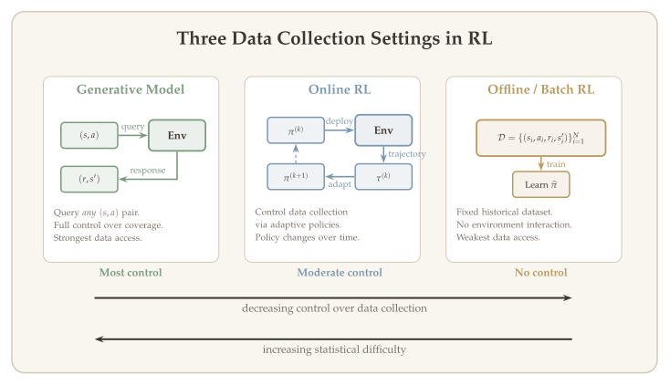
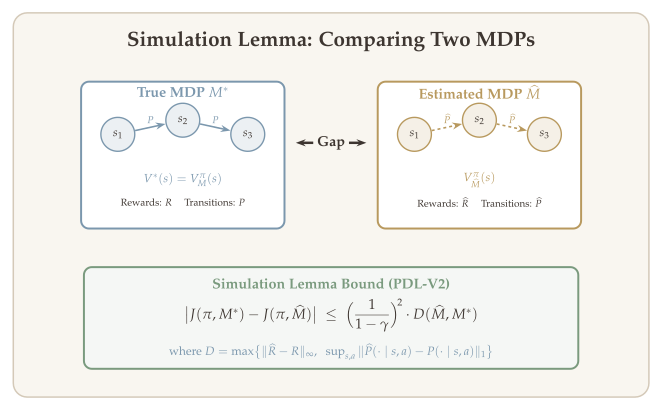
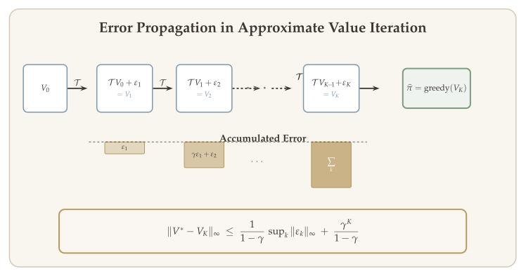
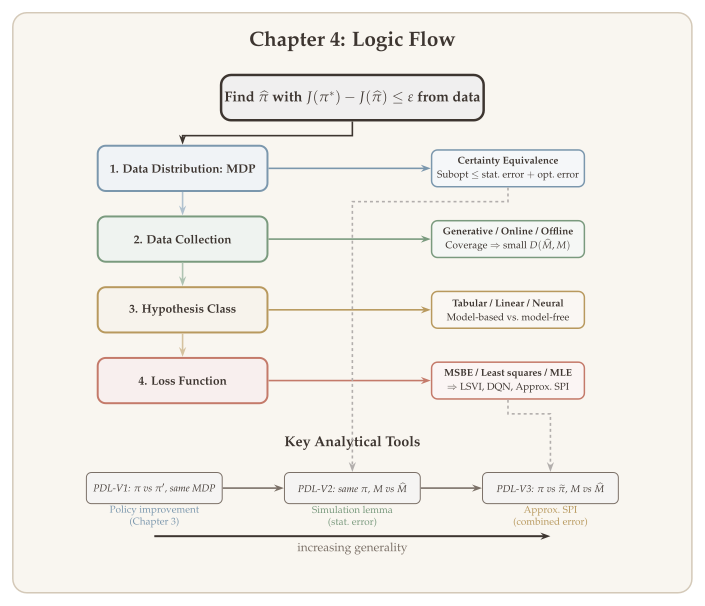

In previous lectures we studied how to find a near-optimal policy of an MDP when the model is known. That is, we only considered the "planning problem," and the question we asked was one of computational complexity: how many iterations do we need to find an $\varepsilon$-optimal policy?

Starting from this lecture we enter the area of **reinforcement learning**, where we do not assume any knowledge of the model. Instead, we learn $\pi^*$ from data. In this setting we can study both sample complexity and computational complexity, but we will mainly focus on sample complexity. The central question becomes:

::: {.callout-important}
## The Central Question
*How many data points do we need to find an $\varepsilon$-optimal policy $\widehat{\pi}$, i.e., $\widehat{\pi}$ such that $J(\pi^*) - J(\widehat{\pi}) \leq \varepsilon$?*
:::

A powerful organizing principle for this study is **certainty equivalence**: the idea that the error of the learned policy can be decomposed into an estimation error and a planning (optimization) error. This decomposition allows us to analyze the statistical and computational aspects of RL separately, and it underlies a wide range of algorithms --- from model-based planning to model-free value iteration to approximate soft policy iteration.

## What Will Be Covered {#sec-overview}

1. **Settings of RL** --- Solving MDPs from data: data distributions, data collection processes, hypothesis classes, and loss functions.
2. **Certainty equivalence** --- Decomposing the error of a learned policy as a sum of policy optimization error and estimation error.
    - Model-based planning
    - Model-free least-squares value iteration
    - Approximate soft policy iteration

## Recap: MDP Planning Methods {#sec-recap-planning}

Before introducing the statistical aspects, let us briefly recall the two main families of planning algorithms we have already studied.

**Value-based methods.** These directly solve the Bellman equation. The prototypical algorithm is value iteration. The key analysis tool is that the Bellman optimality operator $\mathcal{T}$ is a $\gamma$-contraction.

**Policy-based methods.** These optimize the performance metric $J(\pi) = \mathbb{E}\bigl[\sum_{t \geq 0} \gamma^t r_t\bigr]$ as a function of $\pi$. Algorithms such as actor-critic, natural policy gradient (NPG), and soft policy iteration need to estimate $Q^\pi$ as a descent direction (except for REINFORCE, which uses score-function estimators). Updating $\pi$ based on $Q^\pi$ also involves solving a Bellman equation.

The main analysis tools are:

- The Bellman operator $\mathcal{T}^\pi$ is a $\gamma$-contraction.
- The performance difference lemma.

### Recap: Performance Difference Lemma {#sec-recap-pdl}

The performance difference lemma is one of the most important identities in RL theory. It expresses the gap between two policies in terms of the advantage function.

::: {#lem-pdl-v1}
## Performance Difference Lemma (Version I)

Let $\mu$ be the distribution of the initial state. Define $J(\pi) = \mathbb{E}_{s \sim \mu}\bigl[V^\pi(s)\bigr]$. For any two policies $\pi$ and $\pi'$, we have

$$
J(\pi') - J(\pi) = \mathbb{E}_{(s,a) \sim d_\mu^{\pi'}}\bigl[\langle Q^\pi(s, \cdot),\; \pi'(\cdot \mid s) - \pi(\cdot \mid s)\rangle_{\mathcal{A}}\bigr],
$$ {#eq-pdl-v1-inner}

which can equivalently be written as

$$
J(\pi') - J(\pi) = \mathbb{E}_{(s,a) \sim d_\mu^{\pi'}}\bigl[A^\pi(s, a)\bigr],
$$ {#eq-pdl-v1-advantage}

where $A^\pi(s,a) = Q^\pi(s,a) - V^\pi(s)$ is the **advantage function** of $\pi$, and the visitation measures are defined as

$$
d_\mu^\pi(s) = \sum_{t=0}^{\infty} \gamma^t \, \mathbb{P}_\mu^\pi(s_t = s), \qquad d_\mu^\pi(s,a) = \sum_{t=0}^{\infty} \gamma^t \, \mathbb{P}_\mu^\pi(s_t = s,\, a_t = a),
$$

for all policies $\pi$.
:::

::: {.callout-tip}
## Remark: Three Versions of the PDL

The performance difference lemma appears in three increasingly general forms throughout this course:

| Version | Compares | Section |
|:---|:---|:---|
| **Version I** (above) | Different policies, same MDP | @sec-recap-pdl |
| **Version II** | Same policy, different MDPs | @sec-pdl-v2 |
| **Version III** | Different policies, different MDPs | @sec-pdl-v3 |

Version I was the foundation for all planning algorithms in @sec-recap-planning. Versions II and III, which we develop later in this chapter, are the tools we need once we move from planning to *learning*, where the model is estimated from data.
:::

## Statistical Estimation in RL {#sec-stat-estimation}

We now turn to the statistical side of reinforcement learning. A common subproblem solved by both value-based and policy-based approaches is **learning value functions** ($Q^*$ or $Q^\pi$). This is equivalent to solving the fixed point of the Bellman equations from data.

Recall the Bellman equations:

$$
Q^*(s,a) = R(s,a) + \mathbb{E}_{s' \sim P(\cdot \mid s,a)}\Bigl[\max_{a'} Q^*(s', a')\Bigr],
$$ {#eq-bellman-optimality}

$$
Q^\pi(s,a) = R(s,a) + \mathbb{E}_{s' \sim P(\cdot \mid s,a)}\bigl[\langle Q^\pi(s', \cdot),\; \pi(\cdot \mid s)\rangle_{\mathcal{A}}\bigr].
$$ {#eq-bellman-evaluation}

Estimating $Q^*$ or $Q^\pi$ is fundamentally a **statistical estimation** problem.

### Aside: Statistical Estimation via Regression {#sec-aside-regression}

Regression is the most familiar statistical estimation problem, and it provides a useful template for understanding RL as a statistical problem. Before defining the four elements of RL estimation, let us recall how they appear in classical regression.

**Setup.** We observe data $(x_1, y_1), \ldots, (x_N, y_N)$ generated by an unknown function $f^*$:

$$
y_i = f^*(x_i) + \varepsilon_i, \qquad \varepsilon_i \sim \mathcal{N}(0, \sigma^2), \quad i = 1, \ldots, N.
$$ {#eq-regression-model}

The goal is to estimate $f^*$ from data. Every estimation problem --- whether regression or RL --- requires specifying four ingredients.

**1. Model (data distribution).** The model specifies how data is generated. In regression, the model is ([-@eq-regression-model]): the input $x$ determines the conditional distribution $y \mid x \sim \mathcal{N}(f^*(x), \sigma^2)$. The unknown quantity is $f^*$.

**2. Data collection process.** How are the inputs $\{x_i\}$ chosen? Common settings include:

- *Fixed design:* the inputs $x_1, \ldots, x_N$ are deterministic and chosen in advance.
- *Random design:* the inputs are sampled i.i.d.\ from a distribution $\mu$, i.e., $x_i \sim \mu$.
- *Active learning:* the learner adaptively selects $x_{i+1}$ based on $(x_1, y_1), \ldots, (x_i, y_i)$.

Note the parallel to RL: fixed design $\leftrightarrow$ generative model, random design $\leftrightarrow$ offline RL, active learning $\leftrightarrow$ online RL.

**3. Hypothesis class.** The hypothesis class $\mathcal{F}$ constrains which functions we consider. Examples include:

- *Linear:* $\mathcal{F} = \{x \mapsto w^\top x : w \in \mathbb{R}^d\}$.
- *Neural network:* $\mathcal{F} = \{x \mapsto v^\top \sigma(Wx) : W \in \mathbb{R}^{m \times d},\, v \in \mathbb{R}^m\}$.
- *Nonparametric (kernel):* $\mathcal{F}$ is a reproducing kernel Hilbert space.

**4. Loss function.** The loss function measures how well a candidate $f \in \mathcal{F}$ fits the data. The most common choice is the least-squares loss:

$$
L(f) = \frac{1}{2N} \sum_{i=1}^{N} \bigl(y_i - f(x_i)\bigr)^2,
$$ {#eq-regression-loss}

and the estimator is $\widehat{f} = \operatorname*{argmin}_{f \in \mathcal{F}} L(f)$.

::: {.callout-note appearance="simple"}
## From Regression to RL: The Four Elements

The table below summarizes how each element maps from regression to RL. The key difference is that in RL, the data distribution is *induced by the policy*, creating a feedback loop between estimation and data collection that does not exist in standard regression.

| Element | **Regression** | **Reinforcement Learning** |
|:---|:---|:---|
| **Model** | $y = f^*(x) + \varepsilon$ | MDP $M^* = (\mathcal{S}, \mathcal{A}, R, P, \mu, \gamma)$ |
| **Unknown** | Function $f^*$ | $Q^*$, $Q^\pi$, or the model $(R, P)$ |
| **Data collection** | Fixed / random / active design | Generative model / online RL / offline RL |
| **Hypothesis class** | Linear, kernel, neural network | Tabular, linear, kernel, neural network |
| **Loss function** | Least squares: $(y - f(x))^2$ | Bellman residual, least squares, MLE |
| **Key challenge** | i.i.d.\ data, well-understood | Non-i.i.d.\ data; distribution depends on policy |

: The four elements of statistical estimation in regression vs. RL. {#tbl-regression-vs-rl .striped .hover}
:::

### Four Elements of Statistical Estimation in RL {#sec-four-elements}

With the regression analogy in mind, we now specify the four elements for RL.

**1. Data distribution: the MDP.** The MDP plays the role of the data-generating model. It can be either discounted or episodic. In a discounted MDP, given an initial state $s_0$ and any policy $\pi$, the joint distribution of the trajectory $\{(s_t, a_t, r_t) : t \geq 0\}$ is fully specified.

**2. Data collection process.** There are three canonical settings, ordered by decreasing control over data collection:

| Setting | Input | Output | Control | RL analogue of... |
|:---|:---|:---|:---|:---|
| **Generative model** | Any $(s, a)$ | $(r, s')$ | Full | Fixed design |
| **Online RL** | Adaptive $\pi^{(1)}, \pi^{(2)}, \ldots$ | Trajectories | Moderate | Active learning |
| **Offline / batch RL** | Fixed dataset $\mathcal{D}$ | --- | None | Random design |

: The three canonical data collection settings. {#tbl-data-collection .striped .hover}

- **Generative model:** Query any $(s, a) \in \mathcal{S} \times \mathcal{A}$, observe $r$ and $s' \sim P(\cdot \mid s, a)$. This gives full control over data collection --- specify $(s, a)$, get $(r, s')$.
- **Online RL:** Control the data collection process by specifying a sequence of policies $\pi^{(1)}, \pi^{(2)}, \ldots, \pi^{(N)}$. Each $\pi^{(i)}$ can depend on data collected by $\pi^{(1)}, \ldots, \pi^{(i-1)}$.
- **Batch / offline setting:** Learn from a given dataset with no control over data collection. The dataset contains transition tuples collected a priori. We might not know the policies either, and they can be adaptive (e.g., a dataset collected by an online RL agent).

Each data point is of the form $(s_t, a_t, r_t, s_{t+1})$. We sometimes write this as $(s, a, r, s')$ and call it a **transition tuple**.

::: {.callout-tip}
## Remark: Offline RL Datasets

In the offline setting, a typical dataset consists of $N$ trajectories of $T$ steps:

$$
\text{Dataset} = \bigl\{\, s_1^{(i)},\, a_1^{(i)},\, r_1^{(i)},\, s_2^{(i)},\, \ldots,\, s_T^{(i)},\, a_T^{(i)},\, r_T^{(i)},\, s_{T+1}^{(i)} \,\bigr\}_{i=1}^{N}.
$$

Each trajectory $i$ is collected by policy $\pi^{(i)}$, $i \in [N]$.
:::

**3. Hypothesis class.** The hypothesis class specifies the functional assumption --- what structure do we impose on the model or $Q$-function? We can freely use various function classes to estimate the MDP model or the $Q$-function:

- **Tabular:** $\mathcal{S}$ and $\mathcal{A}$ are both finite. The transition kernel is stored as a table.
- **Linear:** $Q(s,a) = \phi(s,a)^\top \theta^*$; $P(s' \mid s,a) = \phi(s,a)^\top \psi(s')$.
- **Kernel:** An infinite-dimensional linear model.
- **Neural network.**

When $|\mathcal{S}|$ is very large, these are called **function approximation** settings.

::: {.callout-tip}
## Remark: Two Estimation Approaches

There are two broad approaches for leveraging the hypothesis class:

1. **Model-based:** Estimate $P$ and $R$ first, then solve the Bellman equation on the estimated model.
2. **Model-free:** Directly solve the Bellman equation from data, bypassing explicit model estimation.
:::

We can consider all possible combinations of data collection settings (generative model, offline RL, online RL) with hypothesis classes (tabular, function approximation), yielding a rich landscape of RL problems.

{#fig-data-collection width="95%"}

### Loss Functions {#sec-loss-functions}

#### Model-Based Methods {#sec-loss-model-based}

With transition data $(s, a, r, s')$, estimating $R$ and $P$ is just standard supervised learning. We have

$$
\mathbb{E}[r \mid s, a] = R(s, a), \qquad \mathbb{E}[\mathbf{1}\{s' = s_0\} \mid s, a] = P(s_0 \mid s, a).
$$

- **Estimate $R$:** Use a least-squares loss over a hypothesis class $\{R_\theta, P_\theta\}_{\theta \in \Theta}$:

$$
L_R(\theta) = \sum_{(s,a,r,s') \in \mathcal{D}} \bigl(r - R_\theta(s,a)\bigr)^2.
$$ {#eq-loss-R}

- **Estimate $P$:** Use a maximum likelihood loss:

$$
L_P(\theta) = \sum_{(s,a,r,s') \in \mathcal{D}} -\log P_\theta(s' \mid s, a).
$$ {#eq-loss-P}

::: {.callout-tip}
## Remark: Alternatives to MLE

MLE is not the only way to estimate $P$. Any method that estimates a conditional distribution works. For example, when $|\mathcal{S}|$ and $|\mathcal{A}|$ are finite, we can use the **count-based estimator**:

$$
\widehat{P}(s' \mid s, a) = \frac{\#\text{transitions } (s,a) \to s'}{\#\text{visits to } (s,a)} = \frac{\sum_t \mathbf{1}\{(s_t, a_t, s_{t+1}) = (s, a, s')\}}{\sum_t \mathbf{1}\{(s_t, a_t) = (s, a)\}}.
$$
:::

#### Model-Free Methods {#sec-loss-model-free}

Model-free methods are based on two kinds of loss functions that directly target the $Q$-function without estimating the model.

**(i) Mean-Squared Bellman Error (MSBE).** For estimating $Q^*$:

$$
L(Q) = \sum_{(s,a,r,s') \in \mathcal{D}} \Bigl[Q(s,a) - r - \max_{a'} Q(s', a')\Bigr]^2.
$$ {#eq-msbe-optimal}

For estimating $Q^\pi$:

$$
L(Q) = \sum_{(s,a,r,s') \in \mathcal{D}} \Bigl[Q(s,a) - r - \sum_{a' \in \mathcal{A}} \pi(a' \mid s') \cdot Q(s', a')\Bigr]^2.
$$ {#eq-msbe-policy}

The rationale is that the ideal loss is the squared residual of the Bellman equation:

$$
L(Q) = \mathbb{E}_{(s,a) \sim d}\Bigl\{\bigl[Q(s,a) - (\mathcal{T}Q)(s,a)\bigr]^2\Bigr\},
$$ {#eq-bellman-residual-ideal}

where $d$ is the sampling distribution. Note that $\mathcal{T}Q$ (or $\mathcal{T}^\pi Q$) involves $\mathbb{E}_{s' \sim P(\cdot \mid s,a)}$. MSBE replaces the expectation by a single sample.

::: {.callout-tip}
## Caveat: MSBE Is Not Unbiased

MSBE is **not** an unbiased estimator of the Bellman residual. To see this, consider the per-sample loss

$$
\ell(Q;\, s, a) = \bigl(Q(s,a) - r - \max_{a'} Q(s', a')\bigr)^2.
$$

Taking expectations, we obtain

$$
\mathbb{E}\bigl[\ell(Q;\, s, a)\bigr] = \bigl(Q(s,a) - (\mathcal{T}Q)(s,a)\bigr)^2 + \operatorname{Var}\bigl(r + \max_{a'} Q(s', a')\bigr).
$$

Thus,

$$
\text{MSBE}(Q) = \bigl(\text{Bellman Residual}(Q)\bigr)^2 + \text{Variance}\bigl(\text{Estimator of } \mathcal{T}Q\bigr).
$$

Consequently, minimizing MSBE $\neq$ minimizing the Bellman residual. One must be careful when using MSBE. Classical algorithms that use MSBE include Q-learning and temporal difference learning (TD(0)).
:::

**(ii) Mean-squared loss ($\ell_2$-error).** An alternative loss function takes the form

$$
L(Q) = \sum_{(s,a,r,s') \in \mathcal{D}} \bigl(Y - Q(s,a)\bigr)^2,
$$ {#eq-l2-loss}

where $Y$ is a response variable constructed from data. This loss can be used for estimating both $Q^*$ and $Q^\pi$. It reduces the problem of solving the Bellman equation to a sequence of supervised learning problems, and thus can be easily combined with deep learning. For this reason, least-squares loss is commonly used in deep RL.

### Examples of Least-Squares Methods {#sec-ls-examples}

#### Least-Squares Estimation for Policy Evaluation {#sec-ls-policy-eval}

To estimate $Q^\pi$, we can sample $(s, a) \sim \mu \in \mathcal{P}(\mathcal{S} \times \mathcal{A})$. For each $(s, a)$, collect a trajectory following $\pi$, starting from $(s, a)$:

$$
(s_0, a_0) = (s, a), \quad s_{t+1} \sim P(\cdot \mid s_t, a_t), \quad a_{t+1} \sim \pi(\cdot \mid s_{t+1}), \quad 0 \leq t \leq T.
$$

Define the response variable as $Y = \sum_{t=0}^{T} \gamma^t r_t$. Due to discounting,

$$
\bigl|\mathbb{E}[Y \mid (s_0, a_0) = (s,a)] - Q^\pi(s,a)\bigr| \leq \frac{\gamma^T}{1 - \gamma} \to 0 \quad \text{as } T \to \infty.
$$

The loss function is then $(Y - Q(s,a))^2$.

#### Fitted Q-Iteration (Least-Squares Value Iteration) {#sec-fitted-q-iteration}

Recall value iteration: $Q^{(k+1)} \leftarrow \mathcal{T}Q^{(k)}$ (or $Q^{(k+1)} \leftarrow \mathcal{T}^\pi Q^{(k)}$ for policy evaluation). We can estimate $\mathcal{T}Q^{(k)}$ by regression.

Given a transition tuple $(s, a, r, s')$, define the response variable:

$$
Y = r + \max_{a'} Q^{(k)}(s', a') \qquad \text{(for } Q^*\text{)},
$$

or

$$
Y = r + \mathbb{E}_{a' \sim \pi(\cdot \mid s')}\bigl[Q^{(k)}(s', a')\bigr] \qquad \text{(for } Q^\pi\text{)}.
$$

Note that $\mathbb{E}[Y \mid s, a] = (\mathcal{T}Q^{(k)})(s,a)$. The loss function is

$$
L(Q) = \sum_{(s,a,r,s') \in \mathcal{D}} \bigl(Y - Q(s,a)\bigr)^2,
$$

and the update rule is

$$
Q^{(k+1)} = \operatorname*{argmin}_{Q \in \mathcal{F}} L(Q),
$$ {#eq-fitted-q-update}

where $\mathcal{F}$ is the hypothesis class.

::: {.callout-tip}
## Connection to Deep Q-Networks (DQN)

Fitted Q-iteration gives rise to a popular deep RL algorithm: **Deep Q-Network (DQN)**. In DQN:

- $\mathcal{F}$ = neural networks (NN).
- $\mathcal{D}$ = i.i.d.\ samples from a memory storage (replay buffer), which stores transitions collected by an online process.
- $\min_{Q \in \text{NN}} L(Q)$ is approximately solved by minibatch SGD.

We develop DQN and its variants (Double DQN, experience replay, target networks) in detail in @sec-dqn.
:::

## Why Errors of Learning and Planning Can Be Separated {#sec-certainty-equivalence}

We now arrive at the central conceptual contribution of this lecture: the principle of **certainty equivalence**. Intuitively, certainty equivalence means that the performance of the learned policy $\widehat{\pi}$ can be characterized as a sum of estimation error and planning (optimization) error.

The implication is powerful: to get a good $\widehat{\pi}$, we can

1. Learn an accurate model $\widehat{M}$ or $Q$-function $\widehat{Q}$.
2. Solve the planning problem based on $\widehat{M}$ or $\widehat{Q}$:

$$
\widehat{\pi} = \operatorname*{argmax}_\pi J(\pi, \widehat{M}) \qquad \text{or} \qquad \widehat{\pi} = \operatorname*{argmax}_\pi \langle Q,\, \pi \rangle_{\mathcal{A}} = \text{greedy}(\widehat{Q}).
$$

### Separation of Estimation and Policy Optimization Errors {#sec-separation}

Consider model-based RL. Let $M^*$ be the true model and let $\widehat{M}$ be an estimated model. Let $\pi^*$ be the optimal policy on $M^*$, i.e.,

$$
\pi^* = \operatorname*{argmax}_\pi J(\pi, M^*),
$$

where $J(\pi, M) = \mathbb{E}_{s \sim \mu}\bigl[V_M^\pi(s)\bigr]$ and $V_M^\pi$ is the value function of $\pi$ on MDP model $M$.

Let $\widetilde{\pi}$ be the optimal policy on $\widehat{M}$, i.e., $\widetilde{\pi} = \operatorname*{argmax}_\pi J(\pi, \widehat{M})$. Moreover, let $\widehat{\pi}$ be a policy learned on $\widehat{M}$, which can be different from $\widetilde{\pi}$ (e.g., due to approximate optimization).

::: {#thm-error-decomposition}
## Error Decomposition

The suboptimality of $\widehat{\pi}$ satisfies

$$
\underbrace{J(\pi^*, M^*) - J(\widehat{\pi}, M^*)}_{\text{Suboptimality}(\widehat{\pi})} \;\leq\; \underbrace{2 \sup_\pi \bigl|J(\pi, M^*) - J(\pi, \widehat{M})\bigr|}_{\text{statistical error}} \;+\; \underbrace{J(\widetilde{\pi}, \widehat{M}) - J(\widehat{\pi}, \widehat{M})}_{\text{policy optimization error} \;\geq\; 0}.
$$ {#eq-error-decomposition}
:::

{#fig-error-decomposition width="90%"}

::: {.proof}
We decompose the suboptimality into four terms:

$$
\begin{aligned}
J(\pi^*, M^*) - J(\widehat{\pi}, M^*) \;=\;\; & \underbrace{J(\pi^*, M^*) - J(\pi^*, \widehat{M})}_{\text{(i) model estimation error}} \;+\; \underbrace{J(\pi^*, \widehat{M}) - J(\widetilde{\pi}, \widehat{M})}_{\text{(ii)} \;\leq\; 0} \\[6pt]
&+\; \underbrace{J(\widetilde{\pi}, \widehat{M}) - J(\widetilde{\pi}, M^*)}_{\text{(iii) model estimation error}} \;+\; \underbrace{J(\widetilde{\pi}, M^*) - J(\widehat{\pi}, M^*)}_{\text{(iv) to be bounded}}.
\end{aligned}
$$

For term (ii), since $\widetilde{\pi}$ is the optimal policy on $\widehat{M}$, we have $J(\pi^*, \widehat{M}) - J(\widetilde{\pi}, \widehat{M}) \leq 0$.

We further decompose the last piece:

$$
J(\widetilde{\pi}, M^*) - J(\widehat{\pi}, M^*) \leq \bigl|J(\widetilde{\pi}, M^*) - J(\widetilde{\pi}, \widehat{M})\bigr| + J(\widetilde{\pi}, \widehat{M}) - J(\widehat{\pi}, \widehat{M}) + \bigl|J(\widehat{\pi}, \widehat{M}) - J(\widehat{\pi}, M^*)\bigr|.
$$

Combining, we obtain

$$
J(\pi^*, M^*) - J(\widehat{\pi}, M^*) \leq 2 \sup_\pi \bigl|J(\pi, M^*) - J(\pi, \widehat{M})\bigr| + J(\widetilde{\pi}, \widehat{M}) - J(\widehat{\pi}, \widehat{M}).
$$

This completes the decomposition. $\blacksquare$
:::

For model-based RL, we only need to focus on the statistical error because we have already studied the policy optimization error in previous lectures (it is zero if $\widehat{\pi} = \widetilde{\pi}$, i.e., if we solve the planning problem on $\widehat{M}$ exactly).

The key question becomes: **when will the statistical error be small?** Two important factors are:

- The hypothesis class $\mathcal{F}$ is large enough to contain a good approximation of the true model.
- The data has sufficient coverage over the state-action space.

## Relating Statistical Error to Model Estimation Error --- PDL (V2) {#sec-pdl-v2}

To analyze the statistical error $|J(\pi, M) - J(\pi, \widehat{M})|$, we want to relate it to the difference between $M$ and $\widehat{M}$ --- that is, some norm of $(R - \widehat{R})$ and $(P - \widehat{P})$.

To this end, we introduce another version of the performance difference lemma, which compares the same policy on two different MDPs.

::: {#lem-pdl-v2}
## Performance Difference Lemma (Version II) --- Same Policy, Different MDPs

Let $M = (\mathcal{S}, \mathcal{A}, R, P, \mu, \gamma)$ and $\widetilde{M} = (\mathcal{S}, \mathcal{A}, \widetilde{R}, \widetilde{P}, \mu, \gamma)$ be two MDPs with different reward functions and transition kernels but the same state space, action space, initial distribution, and discount factor. Let $\pi$ be any policy. Let $V_M^\pi$, $Q_M^\pi$ be the value functions of $\pi$ on $M$, and define $V_{\widetilde{M}}^\pi$, $Q_{\widetilde{M}}^\pi$ similarly. Then

$$
J(\pi, \widetilde{M}) - J(\pi, M) = \mathbb{E}_{(s,a) \sim d_{\widetilde{M}}^\pi}\Bigl[\bigl(\widetilde{R}(s,a) - R(s,a)\bigr) + \gamma \bigl((\widetilde{P} V_M^\pi)(s,a) - (P V_M^\pi)(s,a)\bigr)\Bigr],
$$ {#eq-pdl-v2}

where $d_{\widetilde{M}}^\pi(s,a) = \sum_{t=0}^{\infty} \gamma^t \, \mathbb{P}_{\widetilde{M}}^\pi(s_t = s,\, a_t = a)$ is the visitation measure of $\pi$ on MDP $\widetilde{M}$. (Here we omit $\mu$ because it is the same for $\widetilde{M}$ and $M$.)
:::

::: {.callout-tip}
## Remark: PDL Version II in Context

Recall **Version I** (@sec-recap-pdl) of the performance difference lemma:

$$
J(\widetilde{\pi}) - J(\pi) = \mathbb{E}_{d_{\widetilde{\pi}}}\bigl[\langle Q^\pi(s, \cdot),\; \widetilde{\pi}(\cdot \mid s) - \pi(\cdot \mid s)\rangle_{\mathcal{A}}\bigr].
$$

The expectation is taken with respect to $d^{\widetilde{\pi}}$, the visitation measure of the first policy argument. Similarly, in Version II, the expectation is taken with respect to $d_{\widetilde{M}}^\pi$, the visitation on the first MDP argument $\widetilde{M}$.

| Version | What varies | Role in this chapter |
|:---|:---|:---|
| **I** (@sec-recap-pdl) | Policies ($\pi$ vs $\widetilde{\pi}$) | Foundation for planning (Ch 3) |
| **II** (above) | MDPs ($M$ vs $\widetilde{M}$) | Bounds statistical error |
| **III** (@sec-pdl-v3) | Both policies and MDPs | Combines statistical + optimization error |

Version III, which we develop in @sec-pdl-v3, unifies these two special cases and provides the complete error decomposition for approximate sequential policy improvement.
:::

{#fig-simulation-lemma width="80%"}

### Bounding the Statistical Error {#sec-bounding-stat-error}

Using PDL-V2, we can bound the individual terms. Note that for any $(s, a) \in \mathcal{S} \times \mathcal{A}$:

$$
|\widetilde{R}(s,a) - R(s,a)| \leq \sup_{s,a} |\widetilde{R}(s,a) - R(s,a)| = \|\widetilde{R} - R\|_\infty,
$$

$$
|(\widetilde{P} V_M^\pi)(s,a) - (P V_M^\pi)(s,a)| \leq \Bigl\{\sup_{s,a} \|\widetilde{P}(\cdot \mid s,a) - P(\cdot \mid s,a)\|_1\Bigr\} \cdot \|V_M^\pi\|_\infty.
$$

When $\|R\|_\infty \leq 1$, we know that $\|V_M^\pi\|_\infty \leq \frac{1}{1 - \gamma}$.

We define the **model estimation error** of $\widehat{M}$ as

$$
D(\widehat{M}, M) = \max\Bigl\{\|\widehat{R} - R\|_\infty,\; \sup_{(s,a) \in \mathcal{S} \times \mathcal{A}} \|\widehat{P}(\cdot \mid s,a) - P(\cdot \mid s,a)\|_1\Bigr\}.
$$ {#eq-model-error}

::: {#thm-stat-error-bound}
## Statistical Error Bound via PDL-V2

Under the conditions above, for any policy $\pi$,

$$
\bigl|J(\pi, \widehat{M}) - J(\pi, M)\bigr| \leq \Bigl(\frac{1}{1 - \gamma}\Bigr)^2 \cdot D(\widehat{M}, M).
$$ {#eq-stat-error-bound}
:::

::: {.proof}
By PDL-V2 ([-@eq-pdl-v2]), we have

$$
|J(\pi, \widehat{M}) - J(\pi, M)| \leq \sum_{s,a} d_{\widehat{M}}^\pi(s,a) \Bigl[|\widehat{R}(s,a) - R(s,a)| + \gamma |(\widehat{P} V_M^\pi)(s,a) - (P V_M^\pi)(s,a)|\Bigr].
$$

Using the bounds above and the facts that

1. $|V_M^\pi(s)| \leq \frac{1}{1-\gamma}$ for all $s \in \mathcal{S}$, and
2. $\sum_{s,a} d_{\widehat{M}}^\pi(s,a) = \frac{1}{1-\gamma}$ for all $\pi$,

we obtain

$$
|J(\pi, \widehat{M}) - J(\pi, M)| \leq \frac{1}{1-\gamma} \cdot \Bigl(\|\widehat{R} - R\|_\infty + \frac{1}{1-\gamma} \sup_{s,a} \|\widehat{P}(\cdot \mid s,a) - P(\cdot \mid s,a)\|_1 \Bigr) \leq \Bigl(\frac{1}{1-\gamma}\Bigr)^2 D(\widehat{M}, M).
$$

This establishes the bound. $\blacksquare$
:::

### Putting It All Together: Model-Based RL Guarantee {#sec-model-based-guarantee}

As a final conclusion, suppose we first estimate $M$ using $\widehat{M}$, then solve a planning problem on $\widehat{M}$, and obtain $\widehat{\pi}$. Combining @thm-error-decomposition and @thm-stat-error-bound, we have

$$
J(\pi^*, M) - J(\widehat{\pi}, M) \leq 2 \Bigl(\frac{1}{1-\gamma}\Bigr)^2 D(\widehat{M}, M) + \bigl[J(\widetilde{\pi}, \widehat{M}) - J(\widehat{\pi}, \widehat{M})\bigr].
$$ {#eq-model-based-guarantee}

The first term is the statistical error, controlled by the model estimation error $D(\widehat{M}, M)$. The second term is the policy optimization error, which is zero if we solve the planning problem on $\widehat{M}$ exactly.

## Error of Model-Based RL for Estimating $Q$-Functions {#sec-model-based-q}

Another implication of PDL-V2 is that we can establish an upper bound on **model-based RL for estimating $Q$-functions**.

Suppose we have an estimated model $\widehat{M}$.

- **Estimate $Q^*$:** Solve the Bellman optimality equation on $\widehat{M}$:

$$
\widetilde{Q} = \widehat{R} + \widehat{P}\bigl(\max_{a'} \widetilde{Q}(\cdot, a')\bigr).
$$

Here $\widetilde{Q}$ is the optimal value function on $\widehat{M}$.

- **Estimate $Q^\pi$:** Solve the Bellman evaluation equation on $\widehat{M}$:

$$
\widetilde{Q}^\pi(s,a) = \widehat{R}(s,a) + (\widehat{P}\, \widetilde{V}^\pi)(s,a), \qquad \widetilde{V}^\pi(s) = \langle \widetilde{Q}^\pi(s, \cdot),\; \pi(\cdot \mid s)\rangle_{\mathcal{A}}.
$$

In the following, we bound $\|\widetilde{Q} - Q^*\|_\infty$. Bounding $\|\widetilde{Q}^\pi - Q^\pi\|_\infty$ is similar.

### Bounding $|Q^*(s,a) - \widetilde{Q}(s,a)|$ {#sec-bounding-q-star}

Let $\widetilde{\pi}$ be the optimal policy on $\widehat{M}$. Then $\widetilde{Q} = Q_{\widehat{M}}^{\widetilde{\pi}}$.

For any $(s, a) \in \mathcal{S} \times \mathcal{A}$, we have

$$
Q^*(s,a) - \widetilde{Q}(s,a) = \underbrace{\bigl(Q^*(s,a) - Q_{\widehat{M}}^{\pi^*}(s,a)\bigr)}_{\text{(i)}} + \underbrace{\bigl(Q_{\widehat{M}}^{\pi^*}(s,a) - \widetilde{Q}(s,a)\bigr)}_{\leq\, 0},
$$

so $Q^*(s,a) - \widetilde{Q}(s,a) \leq Q^*(s,a) - Q_{\widehat{M}}^{\pi^*}(s,a)$, which involves the same policy $\pi^*$ on different environments.

Similarly,

$$
\widetilde{Q}(s,a) - Q^*(s,a) = \underbrace{\bigl(\widetilde{Q}(s,a) - Q_{\widehat{M}}^{\widetilde{\pi}}(s,a)\bigr)}_{= \, 0} + \underbrace{\bigl(Q_{\widehat{M}}^{\widetilde{\pi}}(s,a) - Q^*(s,a)\bigr)}_{\text{(ii)}},
$$

so $\widetilde{Q}(s,a) - Q^*(s,a) \leq \widetilde{Q}(s,a) - Q_M^{\widetilde{\pi}}(s,a)$, again comparing the same policy on different environments.

For any fixed $(s^*, a^*) \in \mathcal{S} \times \mathcal{A}$, we can apply PDL-V2 twice with initial distribution $\delta(s^*, a^*)$ (i.e., set $(s_0, a_0) = (s^*, a^*)$).

For term (i):

$$
Q^*(s^*, a^*) - Q_{\widehat{M}}^{\pi^*}(s^*, a^*) = -\mathbb{E}_{d_{\widehat{M}, (s^*,a^*)}^{\pi^*}}\Bigl[(\widehat{R} - R)(s,a) + \gamma \bigl(\widehat{P} V_M^{\pi^*} - P V_M^{\pi^*}\bigr)(s,a)\Bigr].
$$

Here $V_M^{\pi^*} = V^*$ is a fixed function. Bounding this expression:

$$
\bigl|Q^*(s^*, a^*) - Q_{\widehat{M}}^{\pi^*}(s^*, a^*)\bigr| \leq \frac{1}{1-\gamma} \Bigl(\|\widehat{R} - R\|_\infty + \sup_{s,a}\bigl|(P(\cdot \mid s,a) - \widehat{P}(\cdot \mid s,a))^\top V^*\bigr|\Bigr) \leq \Bigl(\frac{1}{1-\gamma}\Bigr)^2 D(\widehat{M}, M).
$$

Similarly, for term (ii):

$$
\widetilde{Q}(s^*, a^*) - Q_M^{\widetilde{\pi}}(s^*, a^*) = \mathbb{E}_{d_{\widehat{M}, (s^*,a^*)}^{\widetilde{\pi}}}\Bigl[(\widehat{R} - R)(s,a) + \gamma \bigl(\widehat{P} V_M^{\widetilde{\pi}} - P V_M^{\widetilde{\pi}}\bigr)(s,a)\Bigr],
$$

which gives

$$
\bigl|\widetilde{Q}(s^*, a^*) - Q_M^{\widetilde{\pi}}(s^*, a^*)\bigr| \leq \frac{1}{1-\gamma}\Bigl\{\|\widehat{R} - R\|_\infty + \sup_{(s,a)} \|\widehat{P}(\cdot \mid s,a) - P(\cdot \mid s,a)\|_1 \cdot \|V_M^{\widetilde{\pi}}\|_\infty\Bigr\} \leq \Bigl(\frac{1}{1-\gamma}\Bigr)^2 D(\widehat{M}, M).
$$

Combining the two directions, we obtain the following result.

::: {#thm-q-estimation-error}
## Model-Based $Q$-Function Estimation Error

$$
\|Q^* - \widetilde{Q}\|_\infty \leq \Bigl(\frac{1}{1-\gamma}\Bigr)^2 \cdot D(\widehat{M}, M).
$$ {#eq-q-estimation-bound}
:::

This bound shows that the accuracy of the $Q$-function estimated by model-based RL is controlled entirely by the model estimation error $D(\widehat{M}, M)$, with a $(1-\gamma)^{-2}$ effective horizon factor. An analogous bound holds for $\|\widetilde{Q}^\pi - Q^\pi\|_\infty$. $\blacksquare$

## Proof of Performance Difference Lemma (Version II) {#sec-proof-pdl-v2}

We now provide a complete proof of @lem-pdl-v2.

::: {.proof}
We prove by direct calculation using a recursion argument.

**Step 1: Set up the recursion.** By definition,

$$
J(\pi, \widehat{M}) - J(\pi, M) = \mathbb{E}_{s_0 \sim \mu}\bigl[V_{\widehat{M}}^\pi(s_0) - V_M^\pi(s_0)\bigr].
$$ {#eq-pdl-v2-step1}

**Step 2: Write the Bellman equations on each MDP.** By the Bellman equation on $M$ and $\widehat{M}$ respectively:

$$
Q_M^\pi(s,a) = R(s,a) + \gamma \, (P V_M^\pi)(s,a),
$$ {#eq-bellman-M}

$$
Q_{\widehat{M}}^\pi(s,a) = \widehat{R}(s,a) + \gamma \, (\widehat{P}\, V_{\widehat{M}}^\pi)(s,a).
$$ {#eq-bellman-Mhat}

**Step 3: Compute the difference.** Subtracting:

$$
Q_{\widehat{M}}^\pi(s,a) - Q_M^\pi(s,a) = \bigl(\widehat{R}(s,a) - R(s,a)\bigr) + \gamma \bigl(\widehat{P}\, V_{\widehat{M}}^\pi - P V_M^\pi\bigr)(s,a).
$$ {#eq-pdl-v2-qdiff}

We can decompose the transition term:

$$
\widehat{P}\, V_{\widehat{M}}^\pi - P V_M^\pi = \bigl(\widehat{P}\, V_{\widehat{M}}^\pi - \widehat{P}\, V_M^\pi\bigr) + \bigl(\widehat{P}\, V_M^\pi - P V_M^\pi\bigr).
$$

Substituting back:

$$
Q_{\widehat{M}}^\pi(s,a) - Q_M^\pi(s,a) = \bigl(\widehat{R}(s,a) - R(s,a)\bigr) + \gamma \bigl(\widehat{P} V_M^\pi - P V_M^\pi\bigr)(s,a) + \gamma \, \widehat{P}\bigl(V_{\widehat{M}}^\pi - V_M^\pi\bigr)(s,a).
$$

**Step 4: Apply the recursion.** Starting from ([-@eq-pdl-v2-step1]):

$$
J(\pi, \widehat{M}) - J(\pi, M) = \mathbb{E}_{s_0 \sim \mu}\bigl[V_{\widehat{M}}^\pi(s_0) - V_M^\pi(s_0)\bigr]
$$

$$
= \mathbb{E}_{\substack{s_0 \sim \mu \\ a_0 \sim \pi(\cdot \mid s_0)}}\bigl[\widehat{R}(s_0, a_0) - R(s_0, a_0)\bigr] + \gamma \, \mathbb{E}_{\substack{s_0 \sim \mu \\ a_0 \sim \pi(\cdot \mid s_0)}}\bigl[(\widehat{P}\, V_M^\pi)(s_0, a_0) - (P V_M^\pi)(s_0, a_0)\bigr]
$$

$$
\quad + \gamma \, \mathbb{E}_{\substack{s_0 \sim \mu \\ a_0 \sim \pi(\cdot \mid s_0)}}\bigl[\widehat{P}(V_{\widehat{M}}^\pi - V_M^\pi)(s_0, a_0)\bigr].
$$

The last term equals $\gamma \, \mathbb{E}_{s_1 \sim \widehat{\lambda}}\bigl[V_{\widehat{M}}^\pi(s_1) - V_M^\pi(s_1)\bigr]$, where $\widehat{\lambda} = \mathbb{P}_{\widehat{M}}^\pi(s_1 = \cdot)$ is the distribution of $s_1$ under $\widehat{M}$.

**Step 5: Unroll the recursion.** Continuing to expand the recursion, we obtain

$$
J(\pi, \widehat{M}) - J(\pi, M) = \mathbb{E}_{(s,a) \sim d_{\widehat{M}}^\pi}\Bigl[\bigl(\widehat{R}(s,a) - R(s,a)\bigr) + \gamma \bigl(\widehat{P}\, V_M^\pi - P V_M^\pi\bigr)(s,a)\Bigr].
$$

This completes the proof. $\blacksquare$
:::

### Extension: Finite-Horizon Setting {#sec-pdl-v2-finite-horizon}

We also have a similar lemma for the finite-horizon (episodic) setting.

::: {#lem-pdl-v2-episodic}
## Performance Difference Lemma V2 (Finite Horizon)

Consider two episodic MDPs $M = (\mathcal{S}, \mathcal{A}, R, P, \mu, H)$ and $\widehat{M} = (\mathcal{S}, \mathcal{A}, \widehat{R}, \widehat{P}, \mu, H)$, where $R = \{R_h\}_{h \in [H]}$ and $P = \{P_h\}_{h \in [H]}$. Let $\pi$ be a policy. Let $d_{M,h}^\pi$ be the visitation measure of $(s_h, a_h)$ under $\pi$ on $M$:

$$
d_{M,h}^\pi(s, a) = \mathbb{P}_M^\pi(s_h = s,\, a_h = a).
$$

Moreover, let $Q_{M,h}^\pi$ and $V_{M,h}^\pi$ be the value functions of $\pi$ on $M$ at the $h$-th step. Then

$$
J(\pi, \widehat{M}) - J(\pi, M) = \mathbb{E}_\mu\bigl[V_{\widehat{M},1}^\pi(s_1) - V_{M,1}^\pi(s_1)\bigr]
$$

$$
= \sum_{h=1}^{H} \mathbb{E}_{(s,a) \sim d_{\widehat{M},h}^\pi}\Bigl\{\bigl[\widehat{R}_h(s,a) - R_h(s,a)\bigr] + \bigl[(\widehat{P}_h\, V_{M,h+1}^\pi)(s,a) - (P_h\, V_{M,h+1}^\pi)(s,a)\bigr]\Bigr\}.
$$ {#eq-pdl-v2-episodic}
:::

The proof follows the same recursion argument as the infinite-horizon case, unrolling from $h = 1$ to $h = H$.

## When Is $D(M, \widehat{M})$ Small? First Sample Complexity Result {#sec-when-d-small}

The simulation lemma tells us that the suboptimality of the policy computed on an estimated model $\widehat{M}$ is controlled by the model estimation error $D(\widehat{M}, M)$. A natural follow-up question is: under what conditions can we guarantee that this distance is small?

To make sure $D(\widehat{M}, M)$ is small, the dataset should have **sufficient coverage** over $\mathcal{S} \times \mathcal{A}$.

- In the **tabular case**, we need to observe each $(s, a)$ many times to estimate $R(s, a)$ and $P(\cdot \mid s, a)$ accurately.
- When $|\mathcal{S}|$ is very large and we assume the environment can be captured by some parametric functions, then we need to observe "all the directions the state-action pairs are embedded into." For example, when $R$ is a linear function $R(s,a) = \phi(s,a)^\top \theta$, then we need to observe every direction of the vector space spanned by $\{\phi(s,a) : (s,a) \in \mathcal{S} \times \mathcal{A}\}$. This is sufficient for estimating $\theta$ accurately.

A key insight is that **small estimation error necessitates data with coverage**. This is a foundational idea. In the online setting, building a good dataset requires us to explore $\mathcal{S} \times \mathcal{A}$. This leads to the **exploration--exploitation tradeoff**. We will revisit this concept in the next part.

::: {.callout-tip}
## Remark: Separation of Exploration and Planning

From an implementation perspective, two important properties emerge: (1) separation between estimation and planning errors, and (2) small estimation error requires exploration. This leads to the following practical approach:

- We can separate exploration and training:
  1. Agents explore the environment and collect data, saving into memory $\mathcal{D}$.
  2. Train $Q$ or the model $\widehat{M}$ using data in $\mathcal{D}$.
- Steps 1 and 2 can run simultaneously.
:::

## Generative Model {#sec-generative-model}

In the following, we focus on the **generative model** setting and establish a concrete bound on $D(\widehat{M}, M)$ under the tabular setting.

::: {#def-generative-model}
## Generative Model

A **generative model** of an MDP is an oracle that satisfies the following input-output relationship:

- **Discounted setting:** For any input $(s, a) \in \mathcal{S} \times \mathcal{A}$, it outputs $r \in [0, 1]$ and $\widetilde{s} \in \mathcal{S}$ satisfying
  $$
  \mathbb{E}[r] = R(s, a) \quad \text{and} \quad \mathbb{P}(\widetilde{s} = s') = P(s' \mid s, a).
  $$
- **Episodic setting:** For any input $(h, s, a) \in [H] \times \mathcal{S} \times \mathcal{A}$, it outputs $r \in [0, 1]$ and $\widetilde{s} \in \mathcal{S}$ satisfying
  $$
  \mathbb{E}[r] = R_h(s, a), \qquad \mathbb{P}(\widetilde{s} = s') = P_h(s' \mid s, a).
  $$
:::

The key question is: **how to collect a good dataset with coverage?**

### Naive Approach: Empirical Estimation {#sec-naive-approach}

Consider the naive approach where we query each $(s, a) \in \mathcal{S} \times \mathcal{A}$ for $N$ times and build an estimated model using empirical means:

$$
\widehat{R}(s, a) = \frac{1}{N} \sum_{i=1}^{N} r_i, \qquad \widehat{P}(s' \mid s, a) = \frac{1}{N} \sum_{i=1}^{N} \mathbf{1}\{\widetilde{s}_i = s'\},
$$ {#eq-empirical-estimates}

where $(r_i, \widetilde{s}_i)$ is the output of the generative model after the $i$-th query of $(s, a) \in \mathcal{S} \times \mathcal{A}$.

We define $\widehat{M} = (\mathcal{S}, \mathcal{A}, \widehat{R}, \widehat{P}, \mu, \gamma)$, where $\mu$ is the distribution of the initial state. Our goal is to bound the model estimation error:

$$
D(\widehat{M}, M) = \max\Bigl\{ \|\widehat{R} - R\|_\infty, \; \sup_{(s,a)} \|\widehat{P}(\cdot \mid s, a) - P(\cdot \mid s, a)\|_1 \Bigr\}.
$$ {#eq-model-error-def}

Let $\widehat{\pi}$ be the optimal policy of $\widehat{M}$. We know that

$$
\mathrm{Subopt}(\widehat{\pi}) \leq O\!\left(\frac{1}{1 - \gamma}\right)^2 \cdot D(\widehat{M}, M).
$$

## Sample Complexity of the Model-Based Approach {#sec-sample-complexity-model-based}

::: {.callout-note appearance="simple"}
**Key Question:** To make sure $\mathrm{Subopt}(\widehat{\pi}) \leq \varepsilon$, how large should $N$ be?
:::

We now analyze the sample complexity of the model-based approach described above.

Recall that we build an estimated model by:

a. Making $N$ queries to the generative model for all $(s, a) \in \mathcal{S} \times \mathcal{A}$.
b. Constructing $\widehat{R}$ and $\widehat{P}$ using empirical averages.

The total **sample complexity** is $N \cdot |\mathcal{S} \times \mathcal{A}|$.

**Question:** How good is $\widehat{\pi} = \operatorname*{argmax}_\pi J(\pi, \widehat{M})$?

To simplify the notation, let us define $\varepsilon_R, \varepsilon_P > 0$ such that

$$
\mathbb{P}\!\left(\sup_{(s,a) \in \mathcal{S} \times \mathcal{A}} |\widehat{R}(s, a) - R(s, a)| \leq \varepsilon_R, \;\; \sup_{(s,a) \in \mathcal{S} \times \mathcal{A}} \|\widehat{P}(\cdot \mid s, a) - P(\cdot \mid s, a)\|_1 \leq \varepsilon_P \right) \geq 1 - \delta.
$$ {#eq-model-error-event}

Here the randomness comes from the generative model, and $\delta > 0$.

That is, with high probability,

$$
\|\widehat{R} - R\|_\infty \leq \varepsilon_R,
$$

$$
\sup_{(s,a) \in \mathcal{S} \times \mathcal{A}} \|\widehat{P}(\cdot \mid s, a) - P(\cdot \mid s, a)\|_1 = \sup_{(s,a)} \left\{ \sum_{s'} \bigl|\widehat{P}(s' \mid s, a) - P(s' \mid s, a)\bigr| \right\} \leq \varepsilon_P.
$$

We will use concentration inequalities to bound $\varepsilon_R$ and $\varepsilon_P$.

## Bounding the Concentration Errors $\varepsilon_R$ and $\varepsilon_P$ {#sec-concentration-errors}

To bound $\|\widehat{R} - R\|_\infty$ and $\sup_{s,a} \|\widehat{P}(\cdot \mid s, a) - P(\cdot \mid s, a)\|_1$, we use the standard approach:

$$
\text{Hoeffding's inequality} \;\;+\;\; \text{uniform concentration.}
$$

::: {#lem-hoeffding}
## Hoeffding's Inequality

Suppose $X_1, \ldots, X_n$ are $n$ i.i.d. and bounded random variables. Assume $X_i \in [a, b]$ for all $i \geq 1$. Let $\mu = \mathbb{E}[X_1]$ be the mean. Then we have

$$
\mathbb{P}\!\left(\frac{1}{n} \sum_{i=1}^{n} X_i - \mu \geq \varepsilon\right) \leq \exp\!\left(-\frac{2n \varepsilon^2}{(b - a)^2}\right),
$$

$$
\mathbb{P}\!\left(\frac{1}{n} \sum_{i=1}^{n} X_i - \mu \leq -\varepsilon\right) \leq \exp\!\left(-\frac{2n \varepsilon^2}{(b - a)^2}\right).
$$
:::

### Bounding $\varepsilon_R$ {#sec-bound-eps-r}

For any $(s, a) \in \mathcal{S} \times \mathcal{A}$, when we query the generative model, the rewards $r$ and next states $\widetilde{s}$ are i.i.d. random variables with

$$
\mathbb{E}[r] = R(s, a), \qquad \mathbb{E}\bigl[\mathbf{1}\{\widetilde{s} = s'\}\bigr] = P(\cdot \mid s, a).
$$

Applying Hoeffding's inequality with $a = 0$ and $b = 1$, we have

$$
\mathbb{P}\!\left(|\widehat{R}(s, a) - R(s, a)| > t\right) \leq 2 \exp(-2Nt^2). \tag{\star}
$$ 

To link $(\star)$ to a bound on $\|\widehat{R} - R\|_\infty$, we take a **union bound** over all $(s, a) \in \mathcal{S} \times \mathcal{A}$:

$$
\mathbb{P}\!\left(\|\widehat{R} - R\|_\infty > t\right) = \mathbb{P}\!\left(\exists\, (s, a) \in \mathcal{S} \times \mathcal{A} : |\widehat{R}(s, a) - R(s, a)| > t\right)
$$

$$
\leq \sum_{s, a} \mathbb{P}\!\left(|\widehat{R}(s, a) - R(s, a)| > t\right)
$$

$$
\leq 2 \cdot |\mathcal{S}| \cdot |\mathcal{A}| \cdot \exp(-2Nt^2).
$$

Setting this to $\delta / 2$:

$$
2Nt^2 = \log\!\left(\frac{4|\mathcal{S}| \cdot |\mathcal{A}|}{\delta}\right),
$$

$$
\Longrightarrow \quad t = C \cdot \sqrt{\frac{\log(|\mathcal{S}| \cdot |\mathcal{A}| / \delta)}{N}},
$$

where $C$ is a constant. Therefore, we can set

$$
\varepsilon_R = O\!\left(\sqrt{\frac{\log(|\mathcal{S}||\mathcal{A}|/\delta)}{N}}\right), \qquad \text{and} \qquad \|\widehat{R} - R\|_\infty \leq \varepsilon_R
$$ {#eq-eps-r-bound}

with probability at least $1 - \delta/2$.

### Bounding $\varepsilon_P$ {#sec-bound-eps-p}

Now we handle $\sup_{s,a} \|\widehat{P}(\cdot \mid s, a) - P(\cdot \mid s, a)\|_1$.

Note that for any vector $v$,

$$
\|v\|_1 = \sup_{u \in \{\pm 1\}^{|\mathcal{S}|}} u^\top v.
$$

Thus,

$$
\sup_{s,a} \|\widehat{P}(\cdot \mid s, a) - P(\cdot \mid s, a)\|_1 = \sup_{\substack{(s,a) \in \mathcal{S} \times \mathcal{A} \\ u \in \{\pm 1\}^{|\mathcal{S}|}}} \bigl\{u^\top\bigl(\widehat{P}(\cdot \mid s, a) - P(\cdot \mid s, a)\bigr)\bigr\}.
$$

Here, $u^\top \widehat{P}(\cdot \mid s, a) = \frac{1}{N} \sum_{i=1}^{N} \bigl\{\sum_{s'} u(s') \cdot \mathbf{1}\{\widetilde{s}^i = s'\}\bigr\}$ is an average of i.i.d. random variables. Moreover, $\sum_{s'} u(s') \cdot \mathbf{1}\{\widetilde{s} = s'\} \in [-1, 1]$. By Hoeffding's inequality,

$$
\mathbb{P}\!\left(|u^\top \widehat{P}(\cdot \mid s, a) - u^\top P(\cdot \mid s, a)| > t\right) \leq 2 \exp\!\left(-\tfrac{1}{2} N t^2\right).
$$

Thus, taking a union bound over $(s, a) \in \mathcal{S} \times \mathcal{A}$ and $u \in \{\pm 1\}^{|\mathcal{S}|}$, we have

$$
\mathbb{P}\!\left(\sup_{(s,a) \in \mathcal{S} \times \mathcal{A}} \|\widehat{P}(\cdot \mid s, a) - P(\cdot \mid s, a)\|_1 > t\right)
$$

$$
\leq \sum_{\substack{u \in \{\pm 1\}^{|\mathcal{S}|} \\ (s,a) \in \mathcal{S} \times \mathcal{A}}} \mathbb{P}\!\left(|u^\top \widehat{P}(\cdot \mid s, a) - u^\top P(\cdot \mid s, a)| > t\right)
$$

$$
\leq 2^{|\mathcal{S}|} \cdot |\mathcal{S}| \cdot |\mathcal{A}| \cdot 2 \exp\!\left(-\tfrac{1}{2} N t^2\right).
$$

Setting this to $\delta/2$:

$$
\exp\!\left(\tfrac{1}{2} N t^2\right) \leq 2^{|\mathcal{S}|+2} \cdot |\mathcal{S}| \cdot |\mathcal{A}| / \delta,
$$

$$
\Longrightarrow \quad t \leq C \cdot \sqrt{\frac{|\mathcal{S}| \log(|\mathcal{S}||\mathcal{A}|/\delta)}{N}}.
$$

Thus, we can set

$$
\varepsilon_P = O\!\left(\sqrt{\frac{|\mathcal{S}| \cdot \log(|\mathcal{S}||\mathcal{A}|/\delta)}{N}}\right).
$$ {#eq-eps-p-bound}

### Combining Everything {#sec-combine-everything}

Finally, we plug $\varepsilon_R$ and $\varepsilon_P$ into the simulation lemma bound

$$
J(\pi^*, M) - J(\widehat{\pi}, M) \leq \frac{1}{1 - \gamma}\,\varepsilon_R + \frac{1}{(1 - \gamma)^2}\,\varepsilon_P.
$$

We obtain

$$
J(\pi^*, M) - J(\widehat{\pi}, M) \leq C \cdot \frac{1}{(1 - \gamma)^2} \cdot \sqrt{\frac{|\mathcal{S}| \cdot \log(|\mathcal{S}||\mathcal{A}|/\delta)}{N}}, \qquad \text{w.p.} \geq 1 - \delta.
$$ {#eq-subopt-model-based}

Thus, for $\widehat{\pi}$ to be $\varepsilon$-optimal, we need

$$
N = O\!\left(\frac{1}{(1 - \gamma)^4} \cdot |\mathcal{S}| \cdot \log(|\mathcal{S}||\mathcal{A}|/\delta) \cdot \frac{1}{\varepsilon^2}\right).
$$

The total sample complexity is

$$
|\mathcal{S}| \cdot |\mathcal{A}| \cdot N = \widetilde{O}\!\left(\frac{1}{(1 - \gamma)^4} \cdot |\mathcal{S}|^2 \cdot |\mathcal{A}|\right).
$$ {#eq-total-sample-complexity}

::: {.callout-tip}
## Remark: Is This Optimal?

The answer is **no**. The optimal result is $\widetilde{O}\!\bigl(\frac{1}{(1-\gamma)^3} \cdot |\mathcal{S}| \cdot |\mathcal{A}|\bigr)$. See Agarwal et al. for details.
:::

## Statistical Analysis of Value-Based RL {#sec-stat-analysis-value-based}

We now turn from the model-based approach to value-based methods, studying how fitted Q-iteration performs in the statistical setting.

## Fitted Q-Iteration (Least-Squares Value Iteration, LSVI) {#sec-lsvi}

We have introduced the **fitted Q-iteration** (LSVI) algorithm. The core idea is:

$$
\text{LSVI} = \text{value iteration updates in functional domain via least-squares regression.}
$$

### LSVI in the Generative Model Setting {#sec-lsvi-generative}

The algorithm proceeds as follows.

1. **Query** each $(s, a) \in \mathcal{S} \times \mathcal{A}$ for $N$ times to the generative model. Build a dataset:
$$
\mathcal{D} = \Bigl\{\bigl(s, a, \{r_i, s_i'\}_{i=1}^{N}\bigr) \;\Big|\; (s, a) \in \mathcal{S} \times \mathcal{A}\Bigr\}.
$$
Total number of transition tuples: $|\mathcal{S} \times \mathcal{A}| \cdot N$.

2. **Initialize** $Q^{(0)}$ = zero function.

3. **Update** the $Q$-function by a least-squares regression problem:
   - For each $(s, a, r_i, s_i')$ in the dataset, define
     $$
     y_i = r_i + \gamma \max_{a' \in \mathcal{A}} Q^{(k-1)}(s_i', a').
     $$
   - Find $Q^{(k)}$ by
     $$
     Q^{(k)} = \operatorname*{argmin}_{f \in \mathcal{F}} \sum_{(s,a)} \sum_{i=1}^{N} \bigl(y_i - f(s, a)\bigr)^2,
     $$
     where $\mathcal{F}$ is the function class.

4. **Return** $\pi = \text{greedy}(Q^{(K)})$.

### LSVI under the Offline Setting {#sec-lsvi-offline}

In the offline setting with sampling distribution $\rho$, the algorithm becomes:

- Initialize $Q^{(0)} \in \mathcal{F}$.
- For $k = 1, 2, \ldots, K$:
  - Collect an offline dataset $\mathcal{D}^{(k)}$ consisting of $N$ transition tuples:
    $$
    \mathcal{D}^{(k)} = \bigl\{(s_i, a_i, r_i, s_i') : (s_i, a_i) \sim \rho, \; (r_i, s_i') \text{ are reward and next state given } (s_i, a_i)\bigr\}.
    $$
  - Define Bellman target: $y_i = r_i + \gamma \max_{a'} Q^{(k-1)}(s_i', a')$.
  - Update Q-function:
    $$
    Q^{(k)} = \operatorname*{argmin}_{f \in \mathcal{F}} \sum_{i=1}^{N} \bigl[y_i - f(s_i, a_i)\bigr]^2.
    $$
  - Return policy $\widehat{\pi} = \text{greedy}(\widehat{Q}^{(K)})$.

### Error Analysis of LSVI {#sec-lsvi-error}

This version of LSVI can be written as

$$
Q^{(k+1)} \leftarrow \mathcal{T} Q^{(k)} + \mathrm{Err}^{(k+1)},
$$

where $\mathrm{Err}^{(k+1)}$ is the regression error.

{#fig-error-propagation width="80%"}

Using the contraction property of the Bellman operator, we have:

$$
\begin{aligned}
\|Q^* - Q^{(k)}\|_\infty &= \|\mathcal{T} Q^* - Q^{(k)}\|_\infty \\
&= \|\mathcal{T} Q^* - \mathcal{T} Q^{(k-1)}\|_\infty + \|Q^{(k)} - \mathcal{T} Q^{(k-1)}\|_\infty \\
&\leq \gamma \cdot \|Q^* - Q^{(k-1)}\|_\infty + \|\mathrm{Err}^{(k)}\|_\infty.
\end{aligned}
$$

Unrolling the recursion:

$$
\begin{aligned}
\|Q^* - Q^{(k)}\|_\infty &\leq \|\mathrm{Err}^{(k)}\|_\infty + \gamma \|\mathrm{Err}^{(k-1)}\|_\infty + \cdots + \gamma^{k-1} \|\mathrm{Err}^{(1)}\|_\infty + \gamma^k \|Q^* - Q^{(0)}\|_\infty \\
&\leq \frac{1}{1 - \gamma} \sup_{k \in [K]} \|\mathrm{Err}^{(k)}\|_\infty + \underbrace{\frac{\gamma^k}{1 - \gamma}}_{\text{error of vanilla VI}}.
\end{aligned}
$$ {#eq-lsvi-error-decomp}

Here $\mathrm{Err}^{(k)} = Q^{(k)} - \mathcal{T} Q^{(k-1)}$ is the statistical error incurred in each LSVI step. This error is roughly

$$
O\!\left(\sqrt{\frac{\mathrm{Complexity}(\mathcal{F})}{N}}\right),
$$

where $\mathrm{Complexity}(\mathcal{F})$ denotes the complexity of the function class. For example:

- **Tabular setting:** $\mathrm{Complexity}(\mathcal{F}) = |\mathcal{S} \times \mathcal{A}|$.
- **Linear function:** $\mathrm{Complexity}(\mathcal{F}) = d$.

Thus, when $N$ is sufficiently large and $\mathcal{F}$ is expressive, each regression error is small, and we obtain

$$
\|Q^{(K)} - Q^*\|_\infty \leq \underbrace{\frac{1}{1 - \gamma} \sup_{k \in [K]} \|\mathrm{Err}^{(k)}\|_\infty}_{\text{Regression Error}} + \underbrace{\frac{1}{1 - \gamma} \cdot \gamma^K}_{\text{Planning Error}}.
$$ {#eq-lsvi-total-error}

Note that $\widehat{\pi} = \text{greedy}(Q^{(K)})$. Then

$$
|V^*(s) - V^{\widehat{\pi}}(s)| \leq \frac{2\|Q^{(K)} - Q^*\|_\infty}{1 - \gamma} \lesssim \left(\frac{1}{1 - \gamma}\right)^2 \cdot \sup_{k \in [K]} \|\mathrm{Err}^{(k)}\|_\infty,
$$

when $K$ is sufficiently large, with $\sup_k \|\mathrm{Err}^{(k)}\|_\infty \sim \sqrt{|\mathcal{S}||\mathcal{A}|/N}$.

## Error Decomposition in the General Setting {#sec-error-decomposition-general}

### What We Have Studied So Far {#sec-recap}

Let us recap the tools developed so far:

1. Using **PDL-V2**, we can compare $V_M^\pi$ and $V_{\widehat{M}}^\pi$ on two MDP environments. Then we can compare $J(\pi^*, M)$ and $J(\widetilde{\pi}, \widehat{M})$, with $\widetilde{\pi}$ being the optimal policy on $\widehat{M}$.
2. Moreover, we also studied $\|\widetilde{Q} - Q^*\|$ where $\widetilde{Q}$ is the optimal value function on $\widehat{M}$.
3. Using the **contractive property** of the Bellman operator, we established $\|Q^{(k)} - Q^*\|$ for model-free RL.

So far, we essentially always assume planning is perfect, either using the optimal policy of $\widehat{M}$ or the greedy policy of $\widehat{Q}$. What about the general setting with general policy update schemes?

### General Setting: Policy Optimization + Statistical Error {#sec-general-setting}

In the general setting, we combine policy optimization with statistical error in policy evaluation:

- Initialize $\pi_0$ arbitrarily.
- For $k = 0, 1, 2, \ldots$:
  - **Policy evaluation:** Estimate $Q^{\pi_k}$ by $Q_k$.
  - **Policy improvement:** $\pi_{k+1} = \mathrm{Update}(\pi_k, Q_k)$.

**Why we care about this:** Suppose each policy evaluation step incurs a statistical error $\mathrm{Err}^{(k)} = Q^{\pi_k} - Q_k$. How will these errors accumulate during policy updates? Are policy optimization algorithms robust to errors in the update directions?

::: {.callout-tip}
## Example: Soft Policy Iteration with Estimation

Consider **soft policy iteration with estimation**:

- Initialize $\pi_0$ = uniform policy.
- For $k = 0, 1, \ldots, K$:
  1. Evaluate $Q^{\pi_k}$ approximately using $Q_k$, either by model-free or model-based RL.
  2. Update the policy via
     $$
     \pi_{k+1}(\cdot \mid s) \propto \pi_k(\cdot \mid s) \cdot \exp\!\bigl(\alpha \cdot Q_k(s, \cdot)\bigr), \qquad \forall\, s \in \mathcal{S}.
     $$
:::

To study this, we need to compare different policies on different environments. This is the most general version of the performance difference lemma.

## Performance Difference Lemma (Version 3) {#sec-pdl-v3}

The most powerful version of the PDL allows us to compare different policies on different environments using an arbitrary estimated Q-function.

::: {#thm-pdl-v3}
## Performance Difference Lemma --- Version 3

Consider an MDP $M = (\mathcal{S}, \mathcal{A}, R, P, \mu, \gamma)$ and let $\pi$ and $\widetilde{\pi}$ be two policies. In addition, let $\widetilde{Q} : \mathcal{S} \times \mathcal{A} \to \mathbb{R}$ be a given Q-function (an estimated Q-function). We define a function $\widetilde{V} : \mathcal{S} \to \mathbb{R}$ by letting

$$
\widetilde{V}(s) = \bigl\langle \widetilde{Q}(s, \cdot),\; \widetilde{\pi}(\cdot \mid s)\bigr\rangle_{\mathcal{A}}, \qquad \forall\, s \in \mathcal{S}.
$$

(Note: $\widetilde{Q} = R + \gamma P\widetilde{V}$ generally does **not** hold.)

Then we have

$$
\mathbb{E}_{s \sim \mu}\bigl[V_M^\pi(s) - \widetilde{V}(s)\bigr] = \mathbb{E}_{s \sim d_\mu^\pi}\Bigl[\bigl\langle \widetilde{Q}(s, \cdot),\; \pi(\cdot \mid s) - \widetilde{\pi}(\cdot \mid s)\bigr\rangle_{\mathcal{A}}\Bigr] + \mathbb{E}_{(s,a) \sim d_\mu^\pi}\bigl[e(s, a)\bigr],
$$ {#eq-pdl-v3}

where

- $e(s, a) = R(s, a) + (P\widetilde{V})(s, a) - \widetilde{Q}(s, a)$ is the **temporal-difference error**,
- $d_\mu^\pi(s) = \sum_{t \geq 0} \gamma^t \mathbb{P}_\mu^\pi(s_t = s)$ and $d_\mu^\pi(s, a) = \sum_{t \geq 0} \gamma^t \mathbb{P}(s_t = s, a_t = a)$ are the visitation measures induced by $\pi$ on MDP $M$.
:::

::: {.callout-tip}
## Remark: PDL Version III --- The Unifying Form

This is the most general version of the performance difference lemma. It subsumes the two earlier versions:

| Version | Compares | Recovered by setting |
|:---|:---|:---|
| **I** (@sec-recap-pdl) | Different policies, same MDP | $\widetilde{Q} = Q_M^{\widetilde{\pi}}$ (exact Q) $\Rightarrow$ TD error $= 0$ |
| **II** (@sec-pdl-v2) | Same policy, different MDPs | $\widetilde{Q} = Q_{\widehat{M}}^\pi$, $\widetilde{\pi} = \pi$ $\Rightarrow$ policy gap $= 0$ |
| **III** (above) | Different policies, different MDPs | Full decomposition: optimization + statistical error |

The two-term decomposition in @eq-pdl-v3 --- policy optimization error plus TD error --- is the analytical backbone of the approximate sequential policy improvement algorithm developed in @sec-error-approx-spi.
:::

### Recovering Previous Versions {#sec-recover-previous}

This version of PDL is powerful in the sense that it can compare $\pi$ and $\widetilde{\pi}$ on two different environments. It recovers the previous two versions:

**Case 1:** Set $\widetilde{Q} = Q_M^{\widetilde{\pi}}$ (value function of $\widetilde{\pi}$ on MDP $M$). Then $\widetilde{V} = V_M^{\widetilde{\pi}}$, and $e(s, a) = 0$ for all $(s, a)$. This recovers **PDL-V1**.

**Case 2:** Set $\widetilde{Q} = Q_{\widehat{M}}^\pi$ (value function of $\pi$ on MDP $\widehat{M}$), and $\widetilde{\pi} = \pi$. By the Bellman equation, $\widetilde{Q} = \widehat{R} + \gamma \widehat{P}\widetilde{V}$. In ([-@eq-pdl-v3]), the first term equals $0$, and

$$
e = R + \gamma P\widetilde{V} - \widetilde{Q} = (R - \widehat{R}) + \gamma(P\widetilde{V} - \widehat{P}\widetilde{V}).
$$

This gives

$$
J(\pi, M) - J(\pi, \widehat{M}) = \mathbb{E}_{d_\mu^\pi}\bigl[(R - \widehat{R}) + \gamma \cdot (PV_{\widehat{M}}^\pi - \widehat{P} V_{\widehat{M}}^\pi)\bigr],
$$

which recovers **PDL-V2**.

### Interpreting PDL-V3 {#sec-interpret-pdl-v3}

PDL-V3 shows that the difference between $V^\pi$ and $\widetilde{V}$ decomposes as

$$
= \underbrace{\mathbb{E}_{s \sim d_\mu^\pi}\bigl[\bigl\langle \widetilde{Q}(s, \cdot),\; \pi(\cdot \mid s) - \widetilde{\pi}(\cdot \mid s)\bigr\rangle_{\mathcal{A}}\bigr]}_{\text{(i) optimization error}} + \underbrace{\mathbb{E}_{(s,a) \sim d_\mu^\pi}\bigl[e(s, a)\bigr]}_{\text{(ii) statistical error}}.
$$

Usually, we set $\widetilde{\pi}$ as the current policy and $\widetilde{Q}$ is the update direction. Thus:

- **Term (i)** is the **policy optimization error**.
- **Term (ii)** is the **TD error** with respect to $\widetilde{\pi}$ and the true model $M$, which constitutes the **statistical estimation error**.

Recall the convergence result of soft-policy iteration; we can directly analyze Term (i).

## Proof of PDL-V3 {#sec-proof-pdl-v3}

The proof strategy is the same telescoping argument that underlies all versions of the PDL. We manipulate the right-hand side to show it equals $\mathbb{E}_\mu[V^\pi - \widetilde{V}]$.

**What we want to show:**

$$
\mathbb{E}_{s \sim \mu}\bigl[V^\pi(s) - \widetilde{V}(s)\bigr] = \underbrace{\mathbb{E}_{s \sim d_\mu^\pi}\bigl[\bigl\langle \widetilde{Q}(s, \cdot),\; \pi(\cdot \mid s) - \widetilde{\pi}(\cdot \mid s)\bigr\rangle_{\mathcal{A}}\bigr]}_{\text{(I): policy mismatch}} + \underbrace{\mathbb{E}_{(s,a) \sim d_\mu^\pi}\bigl[e(s, a)\bigr]}_{\text{(II): TD error}}.
$$

**Step 1: Expand term (I) + (II).**  Since $a \sim \pi(\cdot \mid s)$ under $d_\mu^\pi$, the inner product $\langle \widetilde{Q}(s,\cdot), \pi(\cdot \mid s)\rangle = \mathbb{E}_{a \sim \pi}[\widetilde{Q}(s,a)]$. Thus

$$
\text{(I)} + \text{(II)} = \mathbb{E}_{(s,a) \sim d_\mu^\pi}\bigl[\widetilde{Q}(s,a) + e(s,a)\bigr] - \mathbb{E}_{s \sim d_\mu^\pi}\bigl[\widetilde{V}(s)\bigr].
$$

**Step 2: Simplify using the definition of $e$.**  Recall $e(s,a) = R(s,a) + \gamma(P\widetilde{V})(s,a) - \widetilde{Q}(s,a)$. Substituting,

$$
\widetilde{Q}(s,a) + e(s,a) = R(s,a) + \gamma(P\widetilde{V})(s,a).
$$

The $\widetilde{Q}$ terms cancel --- this is the key simplification. Therefore

$$
\text{(I)} + \text{(II)} = \underbrace{\mathbb{E}_{(s,a) \sim d_\mu^\pi}\bigl[R(s,a)\bigr]}_{= J(\pi)} + \gamma\,\mathbb{E}_{(s,a) \sim d_\mu^\pi}\bigl[(P\widetilde{V})(s,a)\bigr] - \mathbb{E}_{s \sim d_\mu^\pi}\bigl[\widetilde{V}(s)\bigr].
$$

The first term is $J(\pi) = \mathbb{E}_\mu[V^\pi(s)]$ by the performance identity.

**Step 3: Telescoping for $\widetilde{V}$.**  It remains to show that the last two terms give $-\mathbb{E}_\mu[\widetilde{V}(s)]$. This follows from the standard telescoping identity for visitation measures. Write

$$
\gamma\,\mathbb{E}_{(s,a) \sim d_\mu^\pi}\bigl[(P\widetilde{V})(s,a)\bigr] = \sum_s \sum_{t=1}^{\infty} \gamma^t \, \mathbb{P}_\mu^\pi(s_t = s)\, \widetilde{V}(s),
$$

where we shifted the index $t \to t+1$. Meanwhile,

$$
\mathbb{E}_{s \sim d_\mu^\pi}\bigl[\widetilde{V}(s)\bigr] = \sum_s \sum_{t=0}^{\infty} \gamma^t \, \mathbb{P}_\mu^\pi(s_t = s)\, \widetilde{V}(s).
$$

Subtracting, only the $t = 0$ term survives:

$$
\gamma\,\mathbb{E}_{d_\mu^\pi}[(P\widetilde{V})] - \mathbb{E}_{d_\mu^\pi}[\widetilde{V}] = -\sum_s \mathbb{P}_\mu^\pi(s_0 = s)\,\widetilde{V}(s) = -\mathbb{E}_\mu\bigl[\widetilde{V}(s)\bigr].
$$

**Step 4: Combine.**  Putting Steps 2 and 3 together,

$$
\text{(I)} + \text{(II)} = \mathbb{E}_\mu\bigl[V^\pi(s)\bigr] - \mathbb{E}_\mu\bigl[\widetilde{V}(s)\bigr] = \mathbb{E}_\mu\bigl[V^\pi(s) - \widetilde{V}(s)\bigr].
$$

This completes the proof. $\blacksquare$

## Error Analysis of Approximate Soft-Policy Iteration {#sec-error-approx-spi}

We now apply PDL-V3 to analyze the regret of approximate soft-policy iteration.

Let $\pi_0, \ldots, \pi_K$ be the sequence of policies constructed by the approximate SPI, where

$$
\pi_{k+1}(\cdot \mid s) \propto \pi_k(\cdot \mid s) \cdot \exp\!\bigl(\alpha \cdot Q_k(s, \cdot)\bigr), \qquad \forall\, s \in \mathcal{S}.
$$

Equivalently,

$$
\pi_{k+1}(\cdot \mid s) = \operatorname*{argmax}_{\pi(\cdot \mid s) \in \Delta(\mathcal{A})} \left\{ \bigl\langle Q_k(s, \cdot),\; \pi(\cdot \mid s)\bigr\rangle_{\mathcal{A}} - \frac{1}{\alpha}\,\mathrm{KL}\!\bigl(\pi(\cdot \mid s) \,\|\, \pi_k(\cdot \mid s)\bigr) \right\}.
$$ {#eq-spi-update}

The performance metric is the **regret**:

$$
\mathrm{Regret} = \sum_{k=0}^{K} \bigl[J(\pi^*, M) - J(\pi_k, M)\bigr].
$$ {#eq-regret-def}

### Regret Decomposition via PDL-V3 {#sec-regret-decomp}

Let $V_k(s) = \bigl\langle Q_k(s, \cdot),\; \pi_k(\cdot \mid s)\bigr\rangle_{\mathcal{A}}$. We can write

$$
J(\pi^*, M) - J(\pi_k, M) = \mathbb{E}_{s_0 \sim \mu}\bigl[V_M^{\pi^*}(s_0) - V_k(s_0)\bigr] + \mathbb{E}_{s_0 \sim \mu}\bigl[V_k(s_0) - V_M^{\pi_k}(s_0)\bigr].
$$

Let us use PDL-V3 on the two terms.

**First term.** Applying PDL-V3 with $\pi = \pi^*$ and $\widetilde{\pi} = \pi_k$:

$$
\mathbb{E}_{s_0 \sim \mu}\bigl[V_M^{\pi^*}(s_0) - V_k(s_0)\bigr] = \mathbb{E}_{s \sim d_\mu^{\pi^*}}\bigl[\bigl\langle Q_k(s, \cdot),\; \pi^*(\cdot \mid s) - \pi_k(\cdot \mid s)\bigr\rangle\bigr] + \mathbb{E}_{(s,a) \sim d_\mu^{\pi^*}}\bigl[e_k(s, a)\bigr],
$$

where $d_\mu^{\pi^*}$ is the visitation measure of $\pi^*$ on MDP $M$, and

$$
e_k(s, a) = R(s, a) + (PV_k)(s, a) - Q_k(s, a).
$$

**Second term.** We have

$$
\mathbb{E}_{s_0 \sim \mu}\bigl[V_k(s_0) - V_M^{\pi_k}(s_0)\bigr] = -\mathbb{E}_{s_0 \sim \mu}\bigl[V_M^{\pi_k}(s_0) - V_k(s_0)\bigr] = -\mathbb{E}_{(s,a) \sim d_\mu^{\pi_k}}\bigl[e_k(s, a)\bigr],
$$

where $d_\mu^{\pi_k}$ is the visitation measure of $\pi_k$ on MDP $M$.

Therefore, we have:

$$
\mathrm{Regret} = \underbrace{\mathbb{E}_{s \sim d_\mu^{\pi^*}}\!\left[\sum_{k=0}^{K} \bigl\langle Q_k(s, \cdot),\; \pi^*(\cdot \mid s) - \pi_k(\cdot \mid s)\bigr\rangle\right]}_{\text{(a)}}
$$

$$
+ \underbrace{\sum_{k=0}^{K} \mathbb{E}_{(s,a) \sim d_\mu^{\pi^*}}\bigl[e_k(s, a)\bigr]}_{\text{(b)}} - \underbrace{\sum_{k=0}^{K} \mathbb{E}_{(s,a) \sim d_\mu^{\pi_k}}\bigl[e_k(s, a)\bigr]}_{\text{(c)}}.
$$ {#eq-regret-three-terms}

Thus, we have decomposed the regret into 3 terms:

- **(a)** = policy optimization error.
- **(b)** and **(c)** = statistical estimation errors. When $e_k \approx 0$, we have $Q_k \approx Q^{\pi_k}$.

### Analyzing Terms (b) and (c): Offline Setting {#sec-analyze-bc}

Suppose $Q^{\pi_k}$ is estimated in the offline setting where $(s, a, r, s')$ is sampled by drawing $(s, a)$ i.i.d. from $\rho$, and $s' \sim P(\cdot \mid s, a)$.

As we have seen before, $\rho$ has to be "nice" in the sense that it covers $\mathcal{S} \times \mathcal{A}$.

**Assumption:** $\rho$ is nice in the sense that

$$
\sup_{(s,a) \in \mathcal{S} \times \mathcal{A}} \left|\frac{d_\mu^\pi(s, a)}{\rho(s, a)}\right| \leq C_\rho.
$$

Then using Cauchy--Schwarz inequality,

$$
\bigl|\mathbb{E}_{(s,a) \sim d_\mu^\pi}\bigl[e_k(s, a)\bigr]\bigr| = \left|\mathbb{E}_\rho\!\left[\frac{d_\mu^\pi}{\rho}(s, a) \cdot e_k(s, a)\right]\right|
$$

$$
\leq \sqrt{\mathbb{E}_\rho\!\left[\left(\frac{d_\mu^\pi(s,a)}{\rho(s,a)}\right)^{\!2}\right]} \cdot \sqrt{\mathbb{E}_\rho\bigl[e_k(s, a)^2\bigr]}
$$

$$
\leq C_\rho \cdot \sqrt{\mathbb{E}_\rho\bigl[e_k(s, a)^2\bigr]} = C_\rho \cdot \|Q_k - \mathcal{T}^{\pi_k} Q_k\|_\rho,
$$

where $\|f\|_\rho = \sqrt{\mathbb{E}_{(s,a) \sim \rho}[f^2(s,a)]}$, and $\|Q_k - \mathcal{T}^{\pi_k} Q_k\|_\rho$ is the **mean-squared Bellman error**.

Thus,

$$
\text{(b)} + \text{(c)} \leq 2K \cdot C_\rho \cdot \sup_k \|Q_k - \mathcal{T}^{\pi_k} Q_k\|_\rho.
$$ {#eq-bc-bound}

### Analyzing Term (a): Mirror Descent Convergence {#sec-analyze-a}

We can study the policy update of $\{\pi_k(\cdot \mid s)\}_{k \geq 0}$ for each $s \in \mathcal{S}$ separately. Recall that $\pi_k(\cdot \mid s)$ is updated using **mirror descent**.

::: {#thm-mirror-descent}
## Convergence of Mirror Descent

Let $F : \Delta([d]) \to \mathbb{R}^d$ be a bounded mapping in the sense that $\|F(x)\|_\infty \leq G$ for all $x$. Define

$$
x_0 = \mathrm{unif}([d]), \qquad x_{k+1} \leftarrow \operatorname*{argmax}_{x \in \Delta([d])} \left\{\bigl\langle F(x_k),\; x\bigr\rangle - \frac{1}{\alpha}\,\mathrm{KL}(x \,\|\, x_k)\right\}.
$$

Then for any $x^*$ we have

$$
\sum_{k=0}^{K} \bigl\langle F(x_k),\; x^* - x_k\bigr\rangle \leq \frac{1}{\alpha}\,\mathrm{KL}(x^* \,\|\, x^0) + \frac{\alpha}{2}\,G^2\,(K + 1)
$$

$$
\leq \frac{1}{\alpha}\,\log d + \frac{\alpha}{2}\,G^2\,(K + 1).
$$
:::

Setting $\alpha = O(\sqrt{1/K})$, we have $\sum \langle F(x_k), x^* - x_k\rangle = O(G\sqrt{\log d / K})$.

Directly applying this theorem, we have, for all $s \in \mathcal{S}$,

$$
\sum_{k=0}^{K} \bigl\langle Q_k(s, \cdot),\; \pi^*(\cdot \mid s) - \pi_k(\cdot \mid s)\bigr\rangle \leq \frac{1}{\alpha}\,\log d + \frac{\alpha}{2} \cdot \frac{1}{(1 - \gamma)^2} \cdot (K + 1)
$$

$$
\leq \frac{1}{1 - \gamma}\,\sqrt{(K+1) \cdot 2} \leq \frac{2}{1 - \gamma}\,\sqrt{K},
$$

where we used $G = 1/(1-\gamma)$ and $d = |\mathcal{A}|$.

Then, taking expectations over $s \sim d_\mu^{\pi^*}$, we have

$$
\text{(a)} \leq 2 \cdot \left(\frac{1}{1 - \gamma}\right)^2 \cdot \sqrt{K}.
$$ {#eq-term-a-bound}

### Final Regret Bound {#sec-final-regret}

Combining ([-@eq-term-a-bound]) and ([-@eq-bc-bound]), we obtain:

$$
\sum_{k=0}^{K} \bigl[J(\pi^*) - J(\pi_k)\bigr] \leq 2 \cdot \left(\frac{1}{1 - \gamma}\right)^2 \cdot \sqrt{K} + 2K \cdot C_\rho \cdot \sup_k \|Q_k - \mathcal{T}^{\pi_k} Q_k\|_\rho.
$$ {#eq-final-regret}

The first term is the **policy optimization error** that grows as $\sqrt{K}$, while the second term is the **statistical estimation error** that grows linearly in $K$. Balancing these terms determines the optimal number of iterations and the final convergence rate.

## Chapter Summary {#sec-chapter-summary}

This chapter established the conceptual and analytical foundations for reinforcement learning as a statistical estimation problem. The organizing principle is the **four elements of statistical estimation**, which parallel classical regression but with the crucial difference that in RL, the data distribution depends on the policy.

### Summary of Main Results

| Element | Key Question | Main Result |
|:---|:---|:---|
| **1. Data distribution** (MDP) | How does suboptimality decompose? | **Certainty equivalence:** Subopt $\leq$ statistical error $+$ planning error (@thm-error-decomposition) |
| **2. Data collection** | How much data do we need? | **Generative model:** $N = \widetilde{O}\bigl(\frac{|\mathcal{S}|}{(1-\gamma)^4 \varepsilon^2}\bigr)$ samples per $(s,a)$ suffice (@sec-sample-complexity-model-based) |
| **3. Hypothesis class** | Model-based or model-free? | **Model-based:** $\|Q^* - \widetilde{Q}\|_\infty \leq \frac{1}{(1-\gamma)^2} D(\widehat{M}, M)$ (@thm-q-estimation-error); **Model-free:** LSVI error analysis (@sec-lsvi) |
| **4. Loss function** | Which algorithms? | **MSBE** $\to$ Q-learning/TD; **Least squares** $\to$ LSVI/DQN; **MLE** $\to$ model-based RL |

: Main results organized by the four elements of statistical estimation. {#tbl-ch4-summary .striped .hover}

### Three Versions of the PDL

The analytical engine of this chapter is the performance difference lemma, which appears in three progressively more powerful forms:

| Version | Compares | Key Application |
|:---|:---|:---|
| **PDL-V1** (@lem-pdl-v1) | Different policies $\pi, \pi'$ on the same MDP | Policy improvement (Chapter 3) |
| **PDL-V2** (@lem-pdl-v2) | Same policy $\pi$ on two MDPs $M, \widehat{M}$ | Simulation lemma: bounding statistical error |
| **PDL-V3** (@thm-pdl-v3) | Different policies on different MDPs | Approximate SPI: combined stat. + opt. error |

: The three versions of the PDL and their roles. {#tbl-pdl-versions .striped .hover}

PDL-V3 is the most general: it recovers V1 (set $\widetilde{Q} = Q^{\widetilde{\pi}}$, $e = 0$) and V2 (set $\widetilde{\pi} = \pi$, first term $= 0$).

### Logic Flow

{#fig-ch4-logic-flow width="95%"}

::: {.callout-tip}
## Looking Ahead
In the next chapter we study **certainty equivalence** in greater depth, developing model-based and model-free algorithms that leverage the error decomposition established here. We will analyze the sample complexity of these methods and discuss the role of data coverage in determining when statistical estimation error is small.
:::
