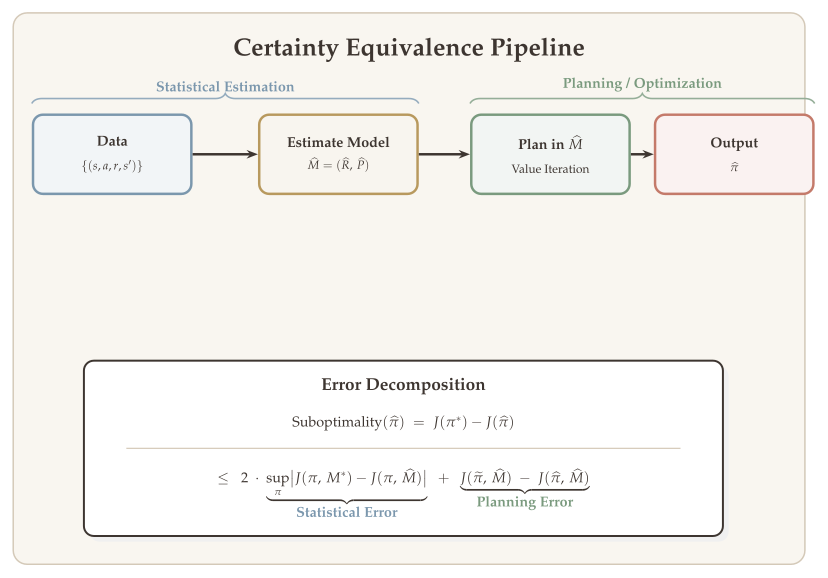
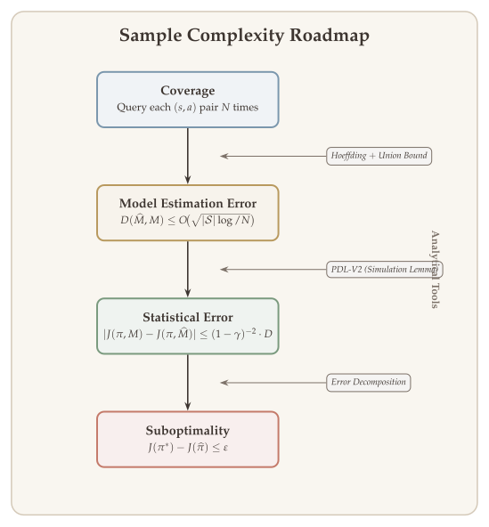

In previous lectures we studied how to find a near-optimal policy of an MDP when the model is known. That is, we only considered the "planning problem," and the question we asked was one of **computational complexity**: how many iterations do we need to find an $\varepsilon$-optimal policy?

Starting from this lecture, we enter the domain of **reinforcement learning**, where we no longer assume any knowledge of the model. Instead, we must learn $\pi^*$ from data. In this setting we can study both sample complexity and computational complexity, but we will mainly focus on **sample complexity**. The central question becomes:

::: {.callout-important}
## The Central Question
*How many data points do we need to find an $\varepsilon$-optimal policy $\widehat{\pi}$, i.e., $\widehat{\pi}$ such that $J(\pi^*) - J(\widehat{\pi}) \leq \varepsilon$?*
:::

A key conceptual insight --- and the main theme of this lecture --- is that the error of a learned policy can often be decomposed into two independent pieces: an **estimation error** (how well we learn the model or value function from data) and a **planning error** (how well we optimize given the learned quantities). This separation is called **certainty equivalence**, and it allows us to reduce RL to a combination of statistical estimation and planning, both of which we already know how to analyze.

## What Will Be Covered {#sec-overview}

1. **Settings of RL** --- Solving MDPs from data: data distributions, data collection processes, hypothesis classes, and loss functions.
2. **Certainty equivalence** --- Decomposing the error of a learned policy as a sum of policy optimization error and estimation error, via three concrete instantiations:
   - Model-based planning
   - Model-free least-squares value iteration
   - Approximate soft policy iteration

## Recap: MDP Planning Methods {#sec-recap-planning}

Before entering the RL setting, let us briefly recall the two families of planning methods we studied in earlier lectures.

**Value-based methods** directly solve the Bellman equation. The prototypical algorithm is value iteration, and the main analysis tool is that the Bellman optimality operator $T$ is a $\gamma$-contraction in $\|\cdot\|_\infty$.

**Policy-based methods** optimize $J(\pi) = \mathbb{E}\bigl[\sum_{t \geq 0} \gamma^t r_t\bigr]$ as a function of $\pi$. Algorithms such as actor-critic, natural policy gradient (NPG), and soft policy iteration need to estimate $Q^\pi$ as a descent direction (except for REINFORCE, which uses the score function instead). Estimating $Q^\pi$ itself amounts to solving the Bellman evaluation equation, and the analysis again relies on the fact that $T^\pi$ is a $\gamma$-contraction.

In both families the common analytical tools are:

- **$\gamma$-contraction** of Bellman operators.
- **Performance difference lemma** (PDL), which relates the gap $J(\pi') - J(\pi)$ to the advantage function.

## Recap: Performance Difference Lemma {#sec-recap-pdl}

The performance difference lemma is a fundamental identity that will be used extensively in this lecture. We recall it here for reference.

Let $\mu$ be the distribution of the initial state. Define $J(\pi) = \mathbb{E}_{s \sim \mu}\bigl[V^\pi(s)\bigr]$. For any two policies $\pi$ and $\pi'$, we have

$$
J(\pi') - J(\pi) = \mathbb{E}_{s \sim d_\mu^{\pi'}}\Bigl[\bigl\langle Q^\pi(s, \cdot),\; \pi'(\cdot \mid s) - \pi(\cdot \mid s)\bigr\rangle_{\mathcal{A}}\Bigr],
$$ {#eq-pdl-v1-inner}

which can equivalently be written as

$$
J(\pi') - J(\pi) = \mathbb{E}_{s \sim d_\mu^{\pi'}}\Bigl[\sum_{a \in \mathcal{A}} Q^\pi(s, a) \cdot \bigl(\pi'(a \mid s) - \pi(a \mid s)\bigr)\Bigr] = \mathbb{E}_{(s, a) \sim d_\mu^{\pi'}}\bigl[A^\pi(s, a)\bigr],
$$ {#eq-pdl-v1-advantage}

where the **advantage function** is $A^\pi(s, a) = Q^\pi(s, a) - V^\pi(s)$, and the **visitation measures** are

$$
d_\mu^\pi(s) = \sum_{t=0}^{\infty} \gamma^t \, \mathbb{P}_\mu^\pi(s_t = s), \qquad d_\mu^\pi(s, a) = \sum_{t=0}^{\infty} \gamma^t \, \mathbb{P}_\mu^\pi(s_t = s,\, a_t = a),
$$ {#eq-visitation}

for all policies $\pi$.

## Statistical Estimation in RL {#sec-stat-estimation}

### Why Focus on Sample Complexity? {#sec-why-sample-complexity}

In RL, because the model is unknown, we face two subproblems:

- **Learning** (estimate the true model or value function $Q^*$) --- a **statistical estimation** problem.
- **Planning** (find the optimal policy given the estimated model) --- a **policy optimization** problem.

A remarkable feature of many RL algorithms is that the errors from these two components can be **separated**. This is precisely the certainty equivalence principle we will develop in this lecture.

### The Core Estimation Problem {#sec-core-estimation}

A common subproblem solved by both value-based and policy-based approaches is **learning value functions** ($Q^*$ or $Q^\pi$). This is equivalent to solving the fixed point of Bellman equations from data.

The Bellman equations are:

$$
Q^*(s, a) = R(s, a) + \mathbb{E}_{s' \sim P(\cdot \mid s, a)}\Bigl[\max_{a'} Q^*(s', a')\Bigr],
$$ {#eq-bellman-opt}

$$
Q^\pi(s, a) = R(s, a) + \mathbb{E}_{s' \sim P(\cdot \mid s, a)}\Bigl[\bigl\langle Q^\pi(s', \cdot),\; \pi(\cdot \mid s')\bigr\rangle_{\mathcal{A}}\Bigr].
$$ {#eq-bellman-eval}

Estimating $Q^*$ or $Q^\pi$ is a statistical estimation problem.

### Aside: Statistical Estimation via Regression {#sec-aside-regression}

Regression is the most common statistical estimation problem and provides a useful analogy. In any estimation problem we need to specify four ingredients:

1. **Model (data distribution).** For instance, $y = f^*(x) + \varepsilon$ where $\varepsilon \sim \mathcal{N}(0, \sigma^2)$, so that $y \sim \mathcal{N}(f^*(x), \sigma^2)$.
2. **Data collection process.** Sample i.i.d.\ $\{x_i\}_{i=1}^N$ with $x_i \sim \mu \in \mathcal{P}(\mathcal{X})$ and $y_i \sim \mathcal{N}(f^*(x_i), \sigma^2)$.
3. **Hypothesis class.** For example, fit $f^*$ within the class of two-layer neural networks.
4. **Loss function.** For example, the least-squares loss:
$$
L(W, v) = \frac{1}{2N} \sum_{i=1}^{N} \bigl[y_i - v^\top \sigma(W x_i)\bigr]^2.
$$

We will now identify these same four elements in the RL setting.

## Four Elements of Statistical Estimation in RL {#sec-four-elements}

Estimating value functions is a statistical problem. Like other statistical problems, we need to specify four aspects.

### 1. Data Distribution: The MDP {#sec-data-distribution}

The data distribution is specified by the **MDP** (discounted or episodic).

In a discounted MDP, given an initial state $s_0$ and any policy $\pi$, the joint distribution of the trajectory $\{(s_t, a_t, r_t) : t \geq 0\}$ is fully specified by the MDP.

### 2. Data Collection Process {#sec-data-collection}

Each data point is a **transition tuple** of the form $(s_t, a_t, r_t, s_{t+1})$, sometimes written $(s, a, r, s')$. There are three main data collection paradigms:

::: {#def-generative-model}
## Generative Model

A **generative model** provides full control over data collection. For any state-action pair $(s, a) \in \mathcal{S} \times \mathcal{A}$, the learner can query the model and observe a reward $r$ and next state $s' \sim P(\cdot \mid s, a)$.
:::

::: {#def-online-rl}
## Online RL

In the **online RL** setting, the learner controls the data collection process by specifying a sequence of policies $\pi^{(1)}, \pi^{(2)}, \ldots, \pi^{(N)}$. Each policy $\pi^{(i)}$ can depend on data collected by previous policies $\pi^{(1)}, \ldots, \pi^{(i-1)}$.
:::

::: {#def-offline-rl}
## Offline RL

In the **offline RL** (batch) setting, the learner has no control over data collection. The dataset consists of transition tuples collected a priori, possibly by unknown or adaptive policies. For example, the dataset might have been collected by an online RL agent. A typical dataset consists of $N$ trajectories of $T$ steps:
$$
\text{Dataset} = \Bigl\{s_1^{(i)}, a_1^{(i)}, r_1^{(i)}, s_2^{(i)}, \ldots, s_T^{(i)}, a_T^{(i)}, r_T^{(i)}, s_{T+1}^{(i)}\Bigr\}_{i=1}^{N},
$$
where trajectory $i$ is collected by policy $\pi^{(i)}$, $i \in [N]$.
:::

### 3. Hypothesis Class {#sec-hypothesis-class}

The hypothesis class specifies the functional assumption used to represent the model or value function. From the Bellman equations, we see two estimation approaches:

- **Model-based:** Estimate $P$ and $R$ first, then solve the Bellman equation on the estimated model.
- **Model-free:** Directly solve the Bellman equation from data, bypassing explicit model estimation.

We can freely use various function classes to represent the MDP model or $Q$-function:

- **Tabular:** $\mathcal{S}$ and $\mathcal{A}$ are both finite (transition kernel is stored as a table).
- **Linear:** e.g., $Q(s, a) = \phi(s, a)^\top \theta^*$ and $P(s' \mid s, a) = \phi(s, a)^\top \psi(s')$.
- **Kernel:** infinite-dimensional linear model.
- **Neural network.**

When $|\mathcal{S}|$ is very large, the tabular approach becomes impractical and we must use **function approximation**.

### 4. Loss Functions {#sec-loss-functions}

We now discuss the loss functions used by model-based and model-free methods.

#### Model-Based Loss Functions {#sec-model-based-loss}

With transition data $(s, a, r, s')$, estimating $R$ and $P$ reduces to standard supervised learning. The key identities are:

$$
\mathbb{E}[r \mid s, a] = R(s, a), \qquad \mathbb{E}\bigl[\mathbb{1}\{s' = s_0\} \mid s, a\bigr] = P(s_0 \mid s, a).
$$ {#eq-model-identities}

- **Estimate $R$:** Use a least-squares loss over a parametric family $\{R_\theta, P_\theta\}_{\theta \in \Theta}$:
$$
L_R(\theta) = \sum_{(s, a, r, s') \in \mathcal{D}} \bigl(r - R_\theta(s, a)\bigr)^2.
$$ {#eq-loss-R}

- **Estimate $P$:** Use a maximum likelihood loss:
$$
L_P(\theta) = \sum_{(s, a, r, s') \in \mathcal{D}} -\log P_\theta(s' \mid s, a).
$$ {#eq-loss-P}

::: {.callout-tip}
## Remark: Alternatives to MLE

MLE is not the only way to estimate $P$. Any method that estimates a conditional distribution works. For instance, when $|\mathcal{S}|$ and $|\mathcal{A}|$ are finite, we can use the **count-based estimator**:

$$
\widehat{P}(s' \mid s, a) = \frac{\#\text{transitions } (s, a) \to s'}{\#\text{visits to } (s, a)} = \frac{\sum_t \mathbb{1}\{(s_t, a_t, s_{t+1}) = (s, a, s')\}}{\sum_t \mathbb{1}\{(s_t, a_t) = (s, a)\}}.
$$ {#eq-count-estimator}
:::

#### Model-Free Loss Functions {#sec-model-free-loss}

Model-free methods are based on two main types of loss functions.

**(i) Mean-Squared Bellman Error (MSBE).** For estimating $Q^*$:

$$
L(Q) = \sum_{(s, a, r, s') \in \mathcal{D}} \Bigl[Q(s, a) - r - \max_{a'} Q(s', a')\Bigr]^2.
$$ {#eq-msbe-optimal}

For estimating $Q^\pi$:

$$
L(Q) = \sum_{(s, a, r, s') \in \mathcal{D}} \Bigl[Q(s, a) - r - \sum_{a' \in \mathcal{A}} \pi(a' \mid s') \cdot Q(s', a')\Bigr]^2.
$$ {#eq-msbe-policy}

The rationale is that the ideal loss is the squared residual of the Bellman equation:

$$
L(Q) = \mathbb{E}_{(s, a) \sim d}\Bigl\{\bigl[Q(s, a) - (\mathcal{T}Q)(s, a)\bigr]^2\Bigr\},
$$ {#eq-bellman-residual-ideal}

where $\mathcal{T}Q$ denotes $TQ$ or $T^\pi Q$, and $d$ is a sampling distribution. Note that $TQ$ and $T^\pi Q$ involve the expectation $\mathbb{E}_{s' \sim P(\cdot \mid s, a)}$. The MSBE replaces this population expectation by a single sample.

::: {.callout-tip}
## Remark: MSBE Is Not Unbiased

A subtle but important caveat is that the MSBE is a **biased** estimator of the Bellman residual. To see why, consider the per-sample loss for estimating $Q^*$:

$$
\ell(Q;\, s, a) = \bigl(Q(s, a) - r - \max_{a'} Q(s', a')\bigr)^2.
$$

Taking the expectation over $(r, s')$ given $(s, a)$:

$$
\begin{aligned}
\mathbb{E}\bigl[\ell(Q;\, s, a)\bigr] &= \mathbb{E}\Bigl[\bigl(Q(s, a) - (TQ)(s, a) + (TQ)(s, a) - r - \max_{a'} Q(s', a')\bigr)^2\Bigr] \\
&= \bigl(Q(s, a) - (TQ)(s, a)\bigr)^2 + \mathrm{Var}\bigl(r + \max_{a'} Q(s', a')\bigr).
\end{aligned}
$$

Therefore:

$$
\text{MSBE}(Q) = \bigl(\text{Bellman Residual}(Q)\bigr)^2 + \text{Variance}\bigl(\text{estimator of } TQ\bigr).
$$

Minimizing MSBE $\neq$ minimizing the Bellman residual. This means we need to be careful when using MSBE. Classical algorithms that use MSBE include **Q-learning** and **temporal difference learning (TD(0))**.
:::

**(ii) Mean-Squared Loss ($\ell_2$-error).** An alternative loss is:

$$
L(Q) = \sum_{(s, a, r, s') \in \mathcal{D}} \bigl(Y - Q(s, a)\bigr)^2,
$$ {#eq-mse-loss}

where $Y$ is a **response variable** constructed from data. This loss can be used for estimating both $Q^*$ and $Q^\pi$. It reduces the problem of solving the Bellman equation to a (sequence of) supervised learning problems, and can thus be easily combined with deep learning. The least-squares loss is commonly used in **deep RL**.

### Least-Squares Estimation for Policy Evaluation {#sec-ls-policy-eval}

::: {#exm-ls-policy-eval}
## Least-Squares Policy Evaluation

To estimate $Q^\pi$, we can sample $(s, a) \sim \mu \in \mathcal{P}(\mathcal{S} \times \mathcal{A})$. For each $(s, a)$, collect a trajectory following $\pi$, starting from $(s, a)$:

$$
(s_0, a_0) = (s, a), \quad s_{t+1} \sim P(\cdot \mid s_t, a_t), \quad a_{t+1} \sim \pi(\cdot \mid s_{t+1}), \quad 0 \leq t \leq T.
$$

Define the response variable as the truncated return:

$$
Y = \sum_{t=0}^{T} \gamma^t \cdot r_t.
$$

Due to discounting, the bias from truncation vanishes:

$$
\bigl|\mathbb{E}[Y \mid (s_0, a_0) = (s, a)] - Q^\pi(s, a)\bigr| \leq \frac{\gamma^T}{1 - \gamma} \to 0 \quad \text{as } T \to \infty.
$$

The loss function is then $(Y - Q(s, a))^2$.
:::

### Fitted Q-Iteration (Least-Squares Value Iteration) {#sec-fitted-q}

::: {#exm-fitted-q}
## Fitted Q-Iteration

Recall value iteration: $Q^{(k+1)} \leftarrow TQ^{(k)}$ (or $Q^{(k+1)} \leftarrow T^\pi Q^{(k)}$ for policy evaluation). We can estimate $TQ^{(k)}$ by regression.

Given a transition tuple $(s, a, r, s')$, define the response variable:

$$
Y = r + \max_{a'} Q^{(k)}(s', a') \qquad \text{(for } Q^*\text{)},
$$ {#eq-fqi-target-optimal}

or

$$
Y = r + \mathbb{E}_{a' \sim \pi(\cdot \mid s')}\bigl[Q^{(k)}(s', a')\bigr] \qquad \text{(for } Q^\pi\text{)}.
$$ {#eq-fqi-target-policy}

Note that $\mathbb{E}[Y \mid s, a] = (TQ^{(k)})(s, a)$. The loss function and update rule are:

$$
L(Q) = \sum_{(s, a, r, s') \in \mathcal{D}} \bigl(Y - Q(s, a)\bigr)^2, \qquad Q^{(k+1)} = \operatorname*{argmin}_{Q \in \mathcal{F}} L(Q),
$$ {#eq-fqi-update}

where $\mathcal{F}$ is the hypothesis class.
:::

::: {.callout-tip}
## Remark: Deep Q-Network (DQN)

As we will see later, fitted Q-iteration gives rise to a popular deep RL algorithm: the **Deep Q-Network (DQN)**. In DQN:

- $\mathcal{F}$ = neural networks (NN).
- $\mathcal{D}$ = i.i.d.\ samples from a memory storage (replay buffer), which stores transitions collected by an online process.
- $\min_{Q \in \mathcal{F}} L(Q)$ is approximately solved by minibatch SGD.
:::

### Combinations of Settings {#sec-combinations}

We can consider all possible combinations of data collection processes and hypothesis classes:

| | **Tabular** | **Function Approximation** |
|---|---|---|
| **Generative model** | | |
| **Offline RL** | | |
| **Online RL** | | |

: Settings of reinforcement learning {#tbl-rl-settings}

Each cell represents a distinct problem setting with its own algorithmic and statistical challenges.

## Why Errors of Learning and Planning Can Be Separated {#sec-certainty-equivalence}

We now arrive at the central theme of this lecture: **certainty equivalence** in model-based RL. The key insight is that the suboptimality of a learned policy decomposes cleanly into a statistical (estimation) error and a planning (optimization) error.

{#fig-ce-pipeline width="95%"}

### Separation of Estimation and Policy Optimization Errors {#sec-error-separation}

Consider model-based RL. Let $M^*$ be the true model and let $\widehat{M}$ be an estimated model. Let $\pi^*$ be the optimal policy on $M^*$:

$$
\pi^* = \operatorname*{argmax}_\pi \; J(\pi, M^*),
$$

where $J(\pi, M) = \mathbb{E}_{s \sim \mu}\bigl[V_M^\pi(s)\bigr]$ and $V_M^\pi$ is the value function of $\pi$ on MDP model $M$.

Let $\widetilde{\pi}$ be the optimal policy on $\widehat{M}$, i.e., $\widetilde{\pi} = \operatorname{argmax}_\pi \; J(\pi, \widehat{M})$. Moreover, let $\widehat{\pi}$ be a policy learned on $\widehat{M}$, which may differ from $\widetilde{\pi}$ (for example, if the planning algorithm has not fully converged).

::: {#thm-error-decomposition}
## Error Decomposition (Certainty Equivalence)

The suboptimality of $\widehat{\pi}$ satisfies:

$$
\begin{aligned}
\text{Suboptimality}(\widehat{\pi}) &= J(\pi^*, M^*) - J(\widehat{\pi}, M^*) \\
&= \underbrace{J(\pi^*, M^*) - J(\pi^*, \widehat{M})}_{\text{(1) model estimation error}} + \underbrace{J(\pi^*, \widehat{M}) - J(\widetilde{\pi}, \widehat{M})}_{\text{(2)} \leq 0} \\
&\quad + \underbrace{J(\widetilde{\pi}, \widehat{M}) - J(\widehat{\pi}, \widehat{M})}_{\text{(3) policy optimization error}} + \underbrace{J(\widehat{\pi}, \widehat{M}) - J(\widehat{\pi}, M^*)}_{\text{(4) model estimation error}}.
\end{aligned}
$$ {#eq-error-decomposition}

Here term (2) $\leq 0$ because $\widetilde{\pi}$ is optimal for $\widehat{M}$. Terms (1) and (4) are model estimation errors because they measure the difference between evaluating a policy on $M^*$ versus $\widehat{M}$. Term (3) is the policy optimization error.

Bounding the right-hand side yields:

$$
\text{Suboptimality}(\widehat{\pi}) \leq \underbrace{2 \sup_\pi \bigl|J(\pi, M^*) - J(\pi, \widehat{M})\bigr|}_{\text{statistical error}} + \underbrace{J(\widetilde{\pi}, \widehat{M}) - J(\widehat{\pi}, \widehat{M})}_{\text{policy optimization error} \;\geq\; 0}.
$$ {#eq-error-bound}
:::

For model-based RL, if $\widehat{\pi}$ is the exact optimal policy on $\widehat{M}$ (i.e., $\widehat{\pi} = \widetilde{\pi}$), then the policy optimization error vanishes, and we only need to control the **statistical error**. We already know how to analyze the planning error from earlier lectures, so the new challenge is purely statistical.

::: {.callout-tip}
## Remark

The question now becomes: **when will the statistical error $\sup_\pi |J(\pi, M^*) - J(\pi, \widehat{M})|$ be small?** We need to relate it to the model estimation error, i.e., to the accuracy of $\widehat{R}$ and $\widehat{P}$.
:::

## Relating Statistical Error to Model Estimation Error --- PDL (V2) {#sec-pdl-v2}

To analyze the statistical error $|J(\pi, M) - J(\pi, \widehat{M})|$, we want to relate it to the difference between $M$ and $\widehat{M}$, that is, to some norm of $(R - \widehat{R})$ and $(P - \widehat{P})$. To this end, we introduce a second version of the performance difference lemma that compares the **same policy on two different MDPs**.

### Performance Difference Lemma (Version 2) {#sec-pdl-v2-statement}

::: {#lem-pdl-v2}
## Performance Difference Lemma --- Version 2

Let $M = (\mathcal{S}, \mathcal{A}, R, P, \mu, \gamma)$ and $\widehat{M} = (\mathcal{S}, \mathcal{A}, \widehat{R}, \widehat{P}, \mu, \gamma)$ be two MDPs with different reward functions and transition kernels but the same state-action spaces, initial distribution, and discount factor. Let $\pi$ be any policy. We let $V_M^\pi$, $Q_M^\pi$ be the value functions of $\pi$ on $M$, and define $V_{\widehat{M}}^\pi$, $Q_{\widehat{M}}^\pi$ similarly. Then:

$$
J(\pi, \widehat{M}) - J(\pi, M) = \mathbb{E}_{(s, a) \sim d_{\widehat{M}}^\pi}\Bigl[\bigl(\widehat{R}(s, a) - R(s, a)\bigr) + \gamma\bigl((\widehat{P} V_M^\pi)(s, a) - (P V_M^\pi)(s, a)\bigr)\Bigr],
$$ {#eq-pdl-v2}

where $d_{\widehat{M}}^\pi(s, a) = \sum_{t=0}^{\infty} \gamma^t \, \mathbb{P}_{\widehat{M}}^\pi(s_t = s,\, a_t = a)$ is the visitation measure of $\pi$ on $\widehat{M}$. Here we omit $\mu$ from the notation because $\widehat{M}$ and $M$ share the same initial distribution.
:::

::: {.callout-tip}
## Remark: Comparison with PDL Version 1

Recall version 1 of the performance difference lemma:

$$
J(\widetilde{\pi}) - J(\pi) = \mathbb{E}_{d_{\widehat{M}}^{\widetilde{\pi}}}\Bigl[\bigl\langle Q^\pi(s, \cdot),\; \widetilde{\pi}(\cdot \mid s) - \pi(\cdot \mid s)\bigr\rangle_{\mathcal{A}}\Bigr].
$$

In version 1, the expectation is with respect to the visitation measure of $\widetilde{\pi}$, and the lemma compares **two different policies on the same MDP**. In version 2, the lemma compares the **same policy on two different MDPs**, and the expectation is with respect to the visitation measure on $\widehat{M}$.
:::

### Proof of Performance Difference Lemma (Version 2) {#sec-pdl-v2-proof}

::: {.proof}

We prove this by direct calculation. Starting from the definition:

$$
J(\pi, \widehat{M}) - J(\pi, M) = \mathbb{E}_\mu\bigl[V_{\widehat{M}}^\pi(s) - V_M^\pi(s)\bigr].
$$ {#eq-pdl-v2-start}

By the tower property, writing $V^\pi(s) = \mathbb{E}_{a \sim \pi(\cdot \mid s)}[Q^\pi(s, a)]$:

$$
J(\pi, \widehat{M}) - J(\pi, M) = \mathbb{E}_{s \sim \mu,\, a \sim \pi(\cdot \mid s)}\bigl[Q_{\widehat{M}}^\pi(s, a) - Q_M^\pi(s, a)\bigr]. \tag{1}
$$

By the Bellman equations on each MDP:

$$
Q_M^\pi(s, a) = R(s, a) + \gamma\, (P V_M^\pi)(s, a), \tag{2}
$$

$$
Q_{\widehat{M}}^\pi(s, a) = \widehat{R}(s, a) + \gamma\, (\widehat{P} V_{\widehat{M}}^\pi)(s, a). \tag{3}
$$

Combining (2) and (3):

$$
\begin{aligned}
Q_{\widehat{M}}^\pi(s, a) - Q_M^\pi(s, a) &= \bigl(\widehat{R}(s, a) - R(s, a)\bigr) + \gamma\bigl((\widehat{P} V_{\widehat{M}}^\pi)(s, a) - (P V_M^\pi)(s, a)\bigr) \\
&= \bigl(\widehat{R}(s, a) - R(s, a)\bigr) + \gamma\bigl((\widehat{P} V_{\widehat{M}}^\pi)(s, a) - (\widehat{P} V_M^\pi)(s, a)\bigr) \\
&\quad + \gamma\bigl((\widehat{P} V_M^\pi)(s, a) - (P V_M^\pi)(s, a)\bigr). \tag{4}
\end{aligned}
$$

Substituting (4) into (1) and applying a recursion argument:

$$
\begin{aligned}
J(\pi, \widehat{M}) - J(\pi, M) &= \mathbb{E}_{\substack{s_0 \sim \mu \\ a_0 \sim \pi(\cdot \mid s_0)}}\Bigl[\bigl(\widehat{R}(s_0, a_0) - R(s_0, a_0)\bigr) + \gamma\bigl((\widehat{P} V_M^\pi)(s_0, a_0) - (P V_M^\pi)(s_0, a_0)\bigr)\Bigr] \\
&\quad + \gamma\, \mathbb{E}_{\substack{s_0 \sim \mu \\ a_0 \sim \pi(\cdot \mid s_0)}}\Bigl[\mathbb{E}_{s_1 \sim \widehat{P}(\cdot \mid s_0, a_0)}\bigl[V_{\widehat{M}}^\pi(s_1) - V_M^\pi(s_1)\bigr]\Bigr].
\end{aligned}
$$

The last term has the same structure as the original expression $J(\pi, \widehat{M}) - J(\pi, M)$, but with $\mu$ replaced by the distribution $\widehat{\mu}$ over $s_1$ induced by $\widehat{P}$. Unrolling this recursion over all time steps, we obtain:

$$
J(\pi, \widehat{M}) - J(\pi, M) = \mathbb{E}_{(s, a) \sim d_{\widehat{M}}^\pi}\Bigl[\bigl(\widehat{R} - R\bigr)(s, a) + \gamma\bigl((\widehat{P} - P) V_M^\pi\bigr)(s, a)\Bigr].
$$

This completes the proof. $\blacksquare$
:::

::: {.callout-tip}
## Remark: Finite-Horizon Version

We also have a similar lemma for the finite-horizon (episodic) setting. Consider two episodic MDPs $M = (\mathcal{S}, \mathcal{A}, R, P, \mu, H)$ and $\widehat{M} = (\mathcal{S}, \mathcal{A}, \widehat{R}, \widehat{P}, \mu, H)$, where $R = \{R_h\}_{h \in [H]}$ and $P = \{P_h\}_{h \in [H]}$. Let $d_{M,h}^\pi(s, a) = \mathbb{P}_M^\pi(s_h = s,\, a_h = a)$ be the visitation measure at step $h$, and let $Q_{M,h}^\pi$, $V_{M,h}^\pi$ be the value functions of $\pi$ on $M$ at step $h$. Then:

$$
J(\pi, \widehat{M}) - J(\pi, M) = \sum_{h=1}^{H} \mathbb{E}_{(s, a) \sim d_{\widehat{M},h}^\pi}\Bigl[\bigl(\widehat{R}_h(s, a) - R_h(s, a)\bigr) + \bigl((\widehat{P}_h V_{M,h+1}^\pi)(s, a) - (P_h V_{M,h+1}^\pi)(s, a)\bigr)\Bigr].
$$
:::

### Bounding the Statistical Error {#sec-bounding-stat-error}

Using PDL-V2, we can now bound the statistical error in terms of model estimation accuracy. Note that for any $(s, a) \in \mathcal{S} \times \mathcal{A}$:

$$
\bigl|\widehat{R}(s, a) - R(s, a)\bigr| \leq \sup_{s, a} \bigl|\widehat{R}(s, a) - R(s, a)\bigr| = \|\widehat{R} - R\|_\infty,
$$ {#eq-R-bound}

$$
\bigl|(\widehat{P} V_M^\pi)(s, a) - (P V_M^\pi)(s, a)\bigr| \leq \bigl\{\sup_{s, a} \|\widehat{P}(\cdot \mid s, a) - P(\cdot \mid s, a)\|_1\bigr\} \cdot \|V_M^\pi\|_\infty.
$$ {#eq-P-bound}

When $\|R\|_\infty \leq 1$, we know that $\|V_M^\pi\|_\infty \leq \frac{1}{1 - \gamma}$.

::: {#def-model-estimation-error}
## Model Estimation Error

We define the **model estimation error** of $\widehat{M}$ as:

$$
D(\widehat{M}, M) = \max\Bigl\{\|\widehat{R} - R\|_\infty,\; \sup_{(s, a) \in \mathcal{S} \times \mathcal{A}} \|\widehat{P}(\cdot \mid s, a) - P(\cdot \mid s, a)\|_1\Bigr\}.
$$ {#eq-model-error-def}
:::

Applying PDL-V2 with the bounds above and using the facts that (i) $|V_M^\pi(s)| \leq \frac{1}{1 - \gamma}$ for all $s \in \mathcal{S}$, and (ii) $\sum_{s, a} d_{\widehat{M}}^\pi(s, a) = \frac{1}{1 - \gamma}$ for all $\pi$, we obtain:

::: {#thm-stat-error-bound}
## Statistical Error Bound

For any policy $\pi$:

$$
\bigl|J(\pi, \widehat{M}) - J(\pi, M)\bigr| \leq \left(\frac{1}{1 - \gamma}\right)^2 \cdot D(\widehat{M}, M).
$$ {#eq-stat-error-bound}
:::

### Final Bound for Model-Based RL {#sec-final-model-based-bound}

Combining the error decomposition ([-@eq-error-bound]) with the statistical error bound ([-@eq-stat-error-bound]), we obtain the following guarantee for model-based RL. Suppose we first estimate $M$ using $\widehat{M}$, then solve a planning problem on $\widehat{M}$ to get $\widehat{\pi}$:

$$
J(\pi^*, M) - J(\widehat{\pi}, M) \leq 2 \cdot \left(\frac{1}{1 - \gamma}\right)^2 \cdot D(\widehat{M}, M) + \bigl[J(\widetilde{\pi}, \widehat{M}) - J(\widehat{\pi}, \widehat{M})\bigr].
$$ {#eq-final-model-based}

The first term is the statistical error controlled by model accuracy, and the second term is the planning error that can be made small using value iteration or policy optimization on $\widehat{M}$.

## Error of Model-Based RL for Estimating $Q$-Functions {#sec-model-based-q}

Another important implication of PDL-V2 is that we can establish an upper bound on the accuracy of model-based RL for **estimating $Q$-functions** directly.

Suppose we have an estimated model $\widehat{M}$.

- **Estimate $Q^*$:** Solve the Bellman optimality equation on $\widehat{M}$:
$$
\widetilde{Q} = \widehat{R} + \widehat{P}\bigl(\max_{a'} \widetilde{Q}(\cdot, a')\bigr).
$$
Here $\widetilde{Q}$ is the optimal value function on $\widehat{M}$, i.e., $\widetilde{Q} = Q_{\widehat{M}}^*$.

- **Estimate $Q^\pi$:** Solve the Bellman evaluation equation on $\widehat{M}$:
$$
\widetilde{Q}^\pi(s, a) = \widehat{R}(s, a) + (\widehat{P}\, \widetilde{V}^\pi)(s, a), \qquad \widetilde{V}^\pi(s) = \bigl\langle \widetilde{Q}^\pi(s, \cdot),\; \pi(\cdot \mid s)\bigr\rangle_{\mathcal{A}}.
$$

We now bound $\|Q^* - \widetilde{Q}\|_\infty$. Bounding $\|\widetilde{Q}^\pi - Q^\pi\|_\infty$ is similar.

### Bounding $|Q^*(s, a) - \widetilde{Q}(s, a)|$ {#sec-bounding-q-error}

::: {#thm-model-based-q-bound}
## Model-Based $Q$-Function Estimation Error

Let $\widetilde{\pi}$ be the optimal policy on $\widehat{M}$, so that $\widetilde{Q} = Q_{\widehat{M}}^{\widetilde{\pi}}$. Then:

$$
\|Q^* - \widetilde{Q}\|_\infty \leq \left(\frac{1}{1 - \gamma}\right)^2 \cdot D(\widehat{M}, M).
$$ {#eq-q-error-bound}
:::

::: {.proof}

For any $(s, a) \in \mathcal{S} \times \mathcal{A}$, we bound both directions.

**Upper bound on $Q^*(s, a) - \widetilde{Q}(s, a)$.** We decompose:

$$
Q^*(s, a) - \widetilde{Q}(s, a) = \bigl(Q^*(s, a) - Q_{\widehat{M}}^{\pi^*}(s, a)\bigr) + \bigl(Q_{\widehat{M}}^{\pi^*}(s, a) - \widetilde{Q}(s, a)\bigr).
$$

The second term satisfies $Q_{\widehat{M}}^{\pi^*}(s, a) - \widetilde{Q}(s, a) = Q_{\widehat{M}}^{\pi^*}(s, a) - Q_{\widehat{M}}^{\widetilde{\pi}}(s, a) \leq 0$ because $\widetilde{\pi}$ is optimal on $\widehat{M}$. Therefore:

$$
Q^*(s, a) - \widetilde{Q}(s, a) \leq Q^*(s, a) - Q_{\widehat{M}}^{\pi^*}(s, a). \tag{A}
$$

This compares the same policy $\pi^*$ on two different environments.

**Lower bound on $Q^*(s, a) - \widetilde{Q}(s, a)$.** Similarly:

$$
\widetilde{Q}(s, a) - Q^*(s, a) = \bigl(\widetilde{Q}(s, a) - Q_M^{\widetilde{\pi}}(s, a)\bigr) + \bigl(Q_M^{\widetilde{\pi}}(s, a) - Q^*(s, a)\bigr).
$$

The second term satisfies $Q_M^{\widetilde{\pi}}(s, a) - Q^*(s, a) \leq 0$ because $\pi^*$ is optimal on $M$. Therefore:

$$
\widetilde{Q}(s, a) - Q^*(s, a) \leq \widetilde{Q}(s, a) - Q_M^{\widetilde{\pi}}(s, a). \tag{B}
$$

**Bounding term (A).** For any fixed $(s^*, a^*) \in \mathcal{S} \times \mathcal{A}$, we apply PDL-V2 with initial distribution $\delta(s^*, a^*)$ (i.e., set $(s_0, a_0) = (s^*, a^*)$):

$$
Q^*(s^*, a^*) - Q_{\widehat{M}}^{\pi^*}(s^*, a^*) = -\mathbb{E}_{d_{\widehat{M},(s^*,a^*)}^{\pi^*}}\Bigl[\bigl(\widehat{R} - R\bigr)(s, a) + \gamma\bigl((\widehat{P} V_M^{\pi^*})(s, a) - (P V_M^{\pi^*})(s, a)\bigr)\Bigr],
$$

where $V_M^{\pi^*} = V^*$ is a fixed function. Taking absolute values and applying the bounds on $\|\widehat{R} - R\|_\infty$ and $\|\widehat{P}(\cdot \mid s, a) - P(\cdot \mid s, a)\|_1$:

$$
\bigl|Q^*(s^*, a^*) - Q_{\widehat{M}}^{\pi^*}(s^*, a^*)\bigr| \leq \frac{1}{1 - \gamma} \cdot \Bigl(\|\widehat{R} - R\|_\infty + \sup_{s, a} \bigl|(P(\cdot \mid s, a) - \widehat{P}(\cdot \mid s, a))^\top V^*\bigr|\Bigr) \leq \left(\frac{1}{1 - \gamma}\right)^2 \cdot D(\widehat{M}, M).
$$

**Bounding term (B).** Similarly:

$$
\widetilde{Q}(s^*, a^*) - Q_M^{\widetilde{\pi}}(s^*, a^*) = \mathbb{E}_{d_{\widehat{M},(s^*,a^*)}^{\widetilde{\pi}}}\Bigl[\bigl(\widehat{R} - R\bigr)(s, a) + \gamma\bigl((\widehat{P} V_M^{\widetilde{\pi}})(s, a) - (P V_M^{\widetilde{\pi}})(s, a)\bigr)\Bigr].
$$

By the same reasoning:

$$
\bigl|\widetilde{Q}(s^*, a^*) - Q_M^{\widetilde{\pi}}(s^*, a^*)\bigr| \leq \frac{1}{1 - \gamma} \cdot \Bigl\{\|\widehat{R} - R\|_\infty + \sup_{s, a} \|\widehat{P}(\cdot \mid s, a) - P(\cdot \mid s, a)\|_1 \cdot \|V_M^{\widetilde{\pi}}\|_\infty\Bigr\} \leq \left(\frac{1}{1 - \gamma}\right)^2 \cdot D(\widehat{M}, M).
$$

**Combining (A) and (B):** Since both $Q^*(s, a) - \widetilde{Q}(s, a)$ and $\widetilde{Q}(s, a) - Q^*(s, a)$ are bounded by $\bigl(\frac{1}{1-\gamma}\bigr)^2 \cdot D(\widehat{M}, M)$, we conclude:

$$
\|Q^* - \widetilde{Q}\|_\infty \leq \left(\frac{1}{1 - \gamma}\right)^2 \cdot D(\widehat{M}, M).
$$

This completes the proof. $\blacksquare$
:::

This result is powerful: it tells us that if we can estimate the model well (i.e., make $D(\widehat{M}, M)$ small), then solving the Bellman equation on the estimated model automatically yields a good approximation to the true optimal $Q$-function. The error amplification factor of $(1-\gamma)^{-2}$ reflects the long-horizon nature of the problem --- errors in the model compound over the effective horizon $1/(1-\gamma)$.

## When Is $D(M, \widehat{M})$ Small? {#sec-when-model-error-small}

The previous section showed that the suboptimality of the certainty-equivalence policy scales with the model estimation error $D(\widehat{M}, M)$. A natural follow-up question is: under what conditions on the dataset can we guarantee that this error is small? The answer revolves around the notion of **coverage**.

### First Sample Complexity Result {#sec-first-sample-complexity}

To make sure $D(\widehat{M}, M)$ is small, the dataset should have **sufficient coverage** over $\mathcal{S} \times \mathcal{A}$.

- In the **tabular case**, we need to observe each $(s, a)$ for many times to estimate $R(s, a)$ and $P(\cdot \mid s, a)$ accurately.
- When $|\mathcal{S}|$ is very large and we assume the environment can be captured by some **parametric functions**, then we need to observe "all the directions the state-action pairs are embedded into." For example, when $R$ is a linear function $R(s,a) = \phi(s,a)^\top \theta$, then we need to observe every direction of the vector space spanned by $\{\phi(s,a) : (s,a) \in \mathcal{S} \times \mathcal{A}\}$. This is sufficient for estimating $\theta$ accurately.

A key insight is that

> Small estimation error **necessitates** data with coverage.

This is a foundational idea. In the online setting, building a good dataset requires the agent to **explore** $\mathcal{S} \times \mathcal{A}$. This leads to the **exploration--exploitation tradeoff**. We will revisit this concept in the next part.

In the following, we focus on the **generative model** setting and establish a concrete bound on $D(\widehat{M}, M)$ under the tabular setting.

## Generative Model {#sec-generative-model}

The generative model is the simplest data-collection mechanism in RL theory. It provides on-demand access to reward and transition samples for any state-action pair, bypassing the exploration challenge entirely. This makes it a clean starting point for understanding sample complexity.

::: {#def-generative-model-oracle}
## Generative Model

A **generative model** of an MDP is an oracle that satisfies the following input-output relationship:

- **Discounted setting:** For any input $(s, a) \in \mathcal{S} \times \mathcal{A}$, it outputs $r \in [0,1]$ and $\widetilde{s} \in \mathcal{S}$ satisfying
  $$
  \mathbb{E}[r] = R(s, a), \qquad \mathbb{P}(\widetilde{s} = s') = P(s' \mid s, a).
  $$
- **Episodic setting:** For any input $(h, s, a) \in [H] \times \mathcal{S} \times \mathcal{A}$, it outputs $r \in [0,1]$ and $\widetilde{s} \in \mathcal{S}$ satisfying
  $$
  \mathbb{E}[r] = R_h(s, a), \qquad \mathbb{P}(\widetilde{s} = s') = P_h(s' \mid s, a).
  $$
:::

::: {.callout-tip}
## How to Collect a Good Dataset with Coverage?

The generative model provides the most direct answer: simply query every state-action pair repeatedly. This guarantees uniform coverage by construction.
:::

### Naive Approach: Empirical Means {#sec-naive-empirical}

Consider the naive approach where we query each $(s, a) \in \mathcal{S} \times \mathcal{A}$ for $N$ times and build an estimated model using **empirical means**:

$$
\widehat{R}(s, a) = \frac{1}{N} \sum_{i=1}^{N} r_i, \qquad \widehat{P}(s' \mid s, a) = \frac{1}{N} \sum_{i=1}^{N} \mathbb{1}\{\widetilde{s}_i = s'\},
$$ {#eq-empirical-estimates}

where $(r_i, \widetilde{s}_i)$ is the output of the generative model after the $i$-th query of $(s, a) \in \mathcal{S} \times \mathcal{A}$.

We define $\widehat{M} = (\mathcal{S}, \mathcal{A}, \widehat{R}, \widehat{P}, \mu, \gamma)$, where $\mu$ is the distribution of the initial state.

**Our goal:** Bound the model estimation error

$$
D(\widehat{M}, M) = \max\!\Bigl\{\|\widehat{R} - R\|_\infty, \;\sup_{(s,a)} \bigl\|\widehat{P}(\cdot \mid s, a) - P(\cdot \mid s, a)\bigr\|_1\Bigr\}.
$$ {#eq-model-error-recall}

Let $\widehat{\pi}$ be the optimal policy of $\widehat{M}$. We know that

$$
\mathrm{Subopt}(\widehat{\pi}) \;\leq\; Q \cdot \Bigl(\frac{1}{1 - \gamma}\Bigr)^2 \cdot D(\widehat{M}, M).
$$

## Sample Complexity of the Model-Based Approach {#sec-sample-complexity-model-based}

::: {.callout-note appearance="simple"}
**Key Question:** To make sure $\mathrm{Subopt}(\widehat{\pi}) \leq \varepsilon$, how large should $N$ be?
:::

We now turn to the main theoretical question: how many generative-model queries are needed for the certainty-equivalence policy to be $\varepsilon$-optimal?

Recall that we build an estimated model by:

(a) Making $N$ queries to the generative model for all $(s, a) \in \mathcal{S} \times \mathcal{A}$.
(b) Constructing $\widehat{R}$ and $\widehat{P}$ using empirical averages.

The **sample complexity** is $N \cdot |\mathcal{S} \times \mathcal{A}|$.

**Question:** How good is $\widehat{\pi} = \operatorname*{argmax}_\pi J(\pi, \widehat{M})$?

To simplify the notation, let us define $\varepsilon_R, \varepsilon_P > 0$ such that

$$
\mathbb{P}\!\Biggl(\sup_{(s,a) \in \mathcal{S} \times \mathcal{A}} \bigl|\widehat{R}(s, a) - R(s, a)\bigr| \leq \varepsilon_R, \;\; \sup_{(s,a) \in \mathcal{S} \times \mathcal{A}} \bigl\|\widehat{P}(\cdot \mid s, a) - P(\cdot \mid s, a)\bigr\|_1 \leq \varepsilon_P\Biggr) \;\geq\; 1 - \delta.
$$ {#eq-model-error-event}

Here the randomness comes from the generative model, and $\delta > 0$.

That is, with high probability,

$$
\|\widehat{R} - R\|_\infty \leq \varepsilon_R, \qquad \sup_{(s,a) \in \mathcal{S} \times \mathcal{A}} \bigl\|\widehat{P}(\cdot \mid s, a) - P(\cdot \mid s, a)\bigr\|_1 \leq \varepsilon_P.
$$

We will use **concentration inequalities** to bound $\varepsilon_R$ and $\varepsilon_P$.

## Bounding the Concentration Errors $\varepsilon_R$ and $\varepsilon_P$ {#sec-concentration-errors}

To bound $\|\widehat{R} - R\|_\infty$ and $\sup_{s,a}\bigl\{\|\widehat{P}(\cdot \mid s, a) - P(\cdot \mid s, a)\|_1\bigr\}$, we use the standard approach:

$$
\textbf{Hoeffding's inequality} \;+\; \textbf{Uniform concentration (union bound).}
$$

### Hoeffding's Inequality {#sec-hoeffding}

::: {#lem-hoeffding}
## Hoeffding's Inequality

Suppose $X_1, \ldots, X_n$ are $n$ i.i.d. and bounded random variables. Assume $X_i \in [a, b]$ for all $i \geq 1$. Let $\mu = \mathbb{E}[X_1]$ be the mean. Then we have

$$
\mathbb{P}\!\Bigl(\frac{1}{n}\sum_{i=1}^{n} X_i - \mu \geq \varepsilon\Bigr) \;\leq\; \exp\!\Bigl(-\frac{2n \varepsilon^2}{(b - a)^2}\Bigr),
$$

$$
\mathbb{P}\!\Bigl(\frac{1}{n}\sum_{i=1}^{n} X_i - \mu \leq -\varepsilon\Bigr) \;\leq\; \exp\!\Bigl(-\frac{2n \varepsilon^2}{(b - a)^2}\Bigr).
$$
:::

### Bounding $\varepsilon_R$: Reward Estimation Error {#sec-bound-eps-r}

For any $(s, a) \in \mathcal{S} \times \mathcal{A}$, when we query the generative model, the rewards $r$ and next states $\widetilde{s}$ are i.i.d. random variables with

$$
\mathbb{E}[r] = R(s, a), \qquad \mathbb{E}\bigl[\mathbb{1}\{\widetilde{s} = s'\}\bigr] = P(\cdot \mid s, a).
$$

Applying Hoeffding's inequality with $a = 0$ and $b = 1$, we have

$$
\mathbb{P}\!\bigl(|\widehat{R}(s, a) - R(s, a)| \geq t\bigr) \;\leq\; 2 \exp(-2Nt^2).
$$ {#eq-hoeffding-reward}

To link ([-@eq-hoeffding-reward]) to a bound on $\|\widehat{R} - R\|_\infty$, we take a **union bound** over all $(s, a) \in \mathcal{S} \times \mathcal{A}$:

$$
\begin{aligned}
\mathbb{P}\!\bigl(\|\widehat{R} - R\|_\infty > t\bigr) &= \mathbb{P}\!\bigl(\exists\, (s, a) \in \mathcal{S} \times \mathcal{A} : |\widehat{R}(s, a) - R(s, a)| > t\bigr) \\
&\leq \sum_{s, a} \mathbb{P}\!\bigl(|\widehat{R}(s, a) - R(s, a)| > t\bigr) \\
&\leq 2 |\mathcal{S}| \cdot |\mathcal{A}| \cdot \exp(-2Nt^2).
\end{aligned}
$$

Setting this equal to $\delta / 2$:

$$
2Nt^2 = \log\!\Bigl(\frac{4|\mathcal{S}| \cdot |\mathcal{A}|}{\delta}\Bigr),
$$

$$
\implies \quad t = C \cdot \sqrt{\frac{\log(|\mathcal{S}| \cdot |\mathcal{A}| / \delta)}{N}},
$$

where $C$ is a constant.

Therefore, we prove that we can set

$$
\varepsilon_R = O\!\Biggl(\sqrt{\frac{\log(|\mathcal{S}||\mathcal{A}|/\delta)}{N}}\Biggr), \qquad \text{and} \quad \|\widehat{R} - R\|_\infty \leq \varepsilon_R
$$ {#eq-eps-r-bound}

with probability at least $1 - \delta/2$.

### Bounding $\varepsilon_P$: Transition Estimation Error {#sec-bound-eps-p}

Now we handle $\sup_{s,a} \|\widehat{P}(\cdot \mid s, a) - P(\cdot \mid s, a)\|_1$.

Note that for any vector $v$, the $\ell_1$ norm admits the variational representation

$$
\|v\|_1 = \sup_{u \in \{\pm 1\}^{|\mathcal{S}|}} u^\top v.
$$

Thus

$$
\sup_{s,a} \bigl\|\widehat{P}(\cdot \mid s, a) - P(\cdot \mid s, a)\bigr\|_1 = \sup_{\substack{(s,a) \in \mathcal{S} \times \mathcal{A} \\ u \in \{\pm 1\}^{|\mathcal{S}|}}} \bigl\{u^\top\bigl(\widehat{P}(\cdot \mid s, a) - P(\cdot \mid s, a)\bigr)\bigr\}.
$$

Here $u^\top \widehat{P}(\cdot \mid s, a) = \frac{1}{N}\sum_{i=1}^{N}\bigl\{\sum_{s'} u(s') \cdot \mathbb{1}\{\widetilde{s}^i = s'\}\bigr\}$ is an average of i.i.d. random variables.

Moreover, $\sum_{s'} u(s') \cdot \mathbb{1}\{\widetilde{s} = s'\} \in [-1, 1]$. By Hoeffding's inequality,

$$
\mathbb{P}\!\bigl(|u^\top \widehat{P}(\cdot \mid s, a) - u^\top P(\cdot \mid s, a)| > t\bigr) \;\leq\; 2\exp\!\Bigl(-\tfrac{1}{2}Nt^2\Bigr).
$$

Thus, taking a union bound over $(s, a) \in \mathcal{S} \times \mathcal{A}$ and $u \in \{\pm 1\}^{|\mathcal{S}|}$, we have

$$
\begin{aligned}
&\mathbb{P}\!\Bigl(\sup_{(s,a) \in \mathcal{S} \times \mathcal{A}} \bigl\|\widehat{P}(\cdot \mid s, a) - P(\cdot \mid s, a)\bigr\|_1 > t\Bigr) \\
&\quad \leq \sum_{\substack{u \in \{\pm 1\}^{|\mathcal{S}|} \\ (s,a) \in \mathcal{S} \times \mathcal{A}}} \mathbb{P}\!\bigl(|u^\top \widehat{P}(\cdot \mid s, a) - u^\top P(\cdot \mid s, a)| > t\bigr) \\
&\quad \leq 2^{|\mathcal{S}|} \cdot |\mathcal{S}| \cdot |\mathcal{A}| \cdot 2\exp\!\Bigl(-\tfrac{1}{2}Nt^2\Bigr).
\end{aligned}
$$

Setting this equal to $\delta / 2$:

$$
\exp\!\Bigl(\tfrac{1}{2}Nt^2\Bigr) \leq 2^{|\mathcal{S}|+2} \cdot |\mathcal{S}| \cdot |\mathcal{A}| / \delta,
$$

$$
\implies \quad t \leq C \cdot \sqrt{\frac{|\mathcal{S}| \log(|\mathcal{S}||\mathcal{A}|/\delta)}{N}}.
$$

Thus, we can set

$$
\varepsilon_P = O\!\Biggl(\sqrt{\frac{|\mathcal{S}| \cdot \log(|\mathcal{S}||\mathcal{A}|/\delta)}{N}}\Biggr).
$$ {#eq-eps-p-bound}

### Combining Everything {#sec-combine-sample-complexity}

Finally, we plug in $\varepsilon_R$ and $\varepsilon_P$ into the suboptimality bound. Recall that

$$
J(\pi^*, M) - J(\widehat{\pi}, M) \;\leq\; \frac{1}{1 - \gamma}\,\varepsilon_R + \frac{1}{(1 - \gamma)^2}\,\varepsilon_P.
$$

We have

$$
J(\pi^*, M) - J(\widehat{\pi}, M) \;\leq\; C \cdot \frac{1}{(1 - \gamma)^2} \cdot \sqrt{\frac{|\mathcal{S}| \cdot \log(|\mathcal{S}||\mathcal{A}|/\delta)}{N}}, \qquad \text{w.p.} \geq 1 - \delta.
$$ {#eq-subopt-final}

Thus, for $\widehat{\pi}$ being $\varepsilon$-optimal, we need

$$
N = O\!\Biggl(\frac{1}{(1 - \gamma)^4} \cdot |\mathcal{S}| \cdot \log(|\mathcal{S}||\mathcal{A}|/\delta) \cdot \frac{1}{\varepsilon^2}\Biggr).
$$

The **total sample complexity** is

$$
|\mathcal{S}| \cdot |\mathcal{A}| \cdot N = \widetilde{O}\!\Biggl(\frac{1}{(1 - \gamma)^4}\,|\mathcal{S}|^2\,|\mathcal{A}|\Biggr).
$$ {#eq-total-sample-complexity}

::: {.callout-tip}
## Is This Optimal?

No. The optimal result is $\widetilde{O}\!\bigl(\frac{1}{(1-\gamma)^3} \cdot |\mathcal{S}||\mathcal{A}|\bigr)$. See [Agarwal et al.] for details.
:::

## Statistical Analysis of Value-Based RL {#sec-statistical-value-based}

We now shift from the model-based perspective to a direct, model-free analysis. Instead of estimating the MDP and then planning, value-based methods estimate the optimal $Q$-function directly from data using regression. The key question is how statistical errors in regression propagate through the iterative Bellman updates.

### Fitted $Q$-Iteration (Least-Squares Value Iteration, LSVI) {#sec-lsvi}

We have introduced the **fitted $Q$-iteration (LSVI)** algorithm. The core idea is:

$$
\text{LSVI} = \textbf{value iteration updates in functional domain via least-squares regression.}
$$

#### LSVI in the Generative Model Setting {#sec-lsvi-generative}

1. **Query** each $(s, a) \in \mathcal{S} \times \mathcal{A}$ $N$ times to the generative model, build a dataset
   $$
   \mathcal{D} = \Bigl\{\bigl(s, a, \{r_i, s_i'\}_{i=1}^{N}\bigr) \;\Big|\; (s, a) \in \mathcal{S} \times \mathcal{A}\Bigr\}.
   $$
   Total number of transition tuples: $|\mathcal{S} \times \mathcal{A}| \cdot N$.

2. **Initialize** $Q^{(0)} =$ zero function.

3. **Update** the $Q$-function by a least-squares regression problem:
   For each $(s, a, r_i, s_i')$ in the dataset, define
   $$
   y_i = r_i + \gamma \max_{a' \in \mathcal{A}} Q^{(k-1)}(s_i', a'),
   $$
   and find $Q^{(k)}$ by
   $$
   Q^{(k)} = \operatorname*{argmin}_{f \in \mathcal{F}} \sum_{(s,a)} \sum_{i=1}^{N} \bigl(y_i - f(s, a)\bigr)^2,
   $$
   where $\mathcal{F}$ is the function class.

4. **Return** $\pi = \mathrm{greedy}(Q^{(K)})$.

#### LSVI under the Offline Setting {#sec-lsvi-offline}

In the offline setting with sampling distribution $\rho$, the algorithm proceeds as follows.

Initialize $Q^{(0)} \in \mathcal{F}$.

For $k = 1, 2, \ldots, K$:

- Collect an offline dataset $\mathcal{D}^{(k)}$ consisting of $N$ transition tuples:
  $$
  \mathcal{D}^{(k)} = \bigl\{(s_i, a_i, r_i, s_i') : (s_i, a_i) \sim \rho, \; (r_i, s_i') \text{ are reward and next state given } (s_i, a_i)\bigr\}.
  $$
- Define the Bellman target: $y_i = r_i + \gamma \max_{a'} Q^{(k-1)}(s_i', a')$.
- Update $Q$-function:
  $$
  Q^{(k)} = \operatorname*{argmin}_{f \in \mathcal{F}} \sum_{i=1}^{N} \bigl[y_i - f(s_i, a_i)\bigr]^2.
  $$
- Return policy $\widehat{\pi} = \mathrm{greedy}(\widehat{Q}^{(K)})$.

### Error Analysis of LSVI {#sec-lsvi-error}

This version of LSVI can be written as

$$
Q^{(k+1)} \;\leftarrow\; \mathcal{T}\,Q^{(k)} + \mathrm{Err}^{(k+1)},
$$

where $\mathrm{Err}^{(k+1)}$ is the **regression error**.

Using the contraction property of the Bellman operator, we have:

$$
\begin{aligned}
\|Q^* - Q^{(k)}\|_\infty &= \|\mathcal{T}Q^* - Q^{(k)}\|_\infty \\
&= \bigl\|\mathcal{T}Q^* - \mathcal{T}Q^{(k-1)}\bigr\|_\infty + \bigl\|Q^{(k)} - \mathcal{T}Q^{(k-1)}\bigr\|_\infty \\
&\leq \gamma \,\|Q^* - Q^{(k-1)}\|_\infty + \|\mathrm{Err}^{(k)}\|_\infty.
\end{aligned}
$$

Unrolling the recursion:

$$
\begin{aligned}
\|Q^* - Q^{(k)}\|_\infty &\leq \|\mathrm{Err}^{(k)}\|_\infty + \gamma\,\|\mathrm{Err}^{(k-1)}\|_\infty + \cdots + \gamma^{k-1}\|\mathrm{Err}^{(1)}\|_\infty + \gamma^k\,\|Q^* - Q^{(0)}\|_\infty \\
&\leq \frac{1}{1 - \gamma}\sup_{k' \in [K]}\|\mathrm{Err}^{(k')}\|_\infty + \underbrace{\frac{\gamma^k}{1 - \gamma}}_{\text{error of vanilla VI}}.
\end{aligned}
$$ {#eq-lsvi-error-recursion}

Here $\mathrm{Err}^{(k)} = Q^{(k)} - \mathcal{T}Q^{(k-1)}$ is the statistical error incurred in each LSVI step. This error is roughly

$$
O\!\Biggl(\sqrt{\frac{\mathrm{Complexity}(\mathcal{F})}{N}}\Biggr),
$$

where $\mathrm{Complexity}(\mathcal{F})$ is the complexity of the function class. For example:

- **Tabular setting:** $\mathrm{Complexity}(\mathcal{F}) = |\mathcal{S} \times \mathcal{A}|$.
- **Linear function:** $\mathrm{Complexity}(\mathcal{F}) = d$.

Thus, when $N$ is sufficiently large and $\mathcal{F}$ is expressive, each regression error is small.

$$
\|Q^{(K)} - Q^*\|_\infty \;\leq\; \underbrace{\frac{1}{1 - \gamma}\sup_{k' \in [K]}\|\mathrm{Err}^{(k')}\|_\infty}_{\text{Regression Error}} + \underbrace{\frac{1}{1 - \gamma} \cdot \gamma^K}_{\text{Planning Error}}.
$$ {#eq-lsvi-decomposition}

Note that $\widehat{\pi} = \mathrm{greedy}(Q^{(K)})$. Then

$$
\bigl|V^*(s) - V^{\widehat{\pi}}(s)\bigr| \;\leq\; \frac{2\,\|Q^{(K)} - Q^*\|_\infty}{1 - \gamma} \;\lesssim\; \Bigl(\frac{1}{1 - \gamma}\Bigr)^2 \cdot \sup_{k' \in [K]}\|\mathrm{Err}^{(k')}\|_\infty,
$$ {#eq-lsvi-subopt}

when $K$ is sufficiently large. In the tabular setting, the regression error scales as $\sqrt{|\mathcal{S}||\mathcal{A}|/N}$.

## Error Decomposition in the General Setting {#sec-error-decomposition-general}

### What We Have Studied So Far {#sec-recap}

Let us take stock of the two analytical tools developed earlier.

1. Using **PDL-V2**, we can compare $V_M^\pi$ and $V_{\widehat{M}}^\pi$ on two MDP environments. Then we can compare $J(\pi^*, M)$ and $J(\widehat{\pi}, \widehat{M})$, with $\widehat{\pi}$ being the optimal policy on $\widehat{M}$. Moreover, we also studied $\|\widetilde{Q} - Q^*\|$, where $\widetilde{Q}$ is the optimal value function on $\widehat{M}$.

2. Using the **contractive property of the Bellman operator**, we establish $\|Q^{(K)} - Q^*\|$ for model-free RL.

So far, we essentially always assume planning is perfect, either using the optimal policy of $\widehat{M}$ or the greedy policy of $\widehat{Q}$. A natural question arises: what about the general setting with general policy update schemes?

### General Setting: Policy Optimization + Statistical Error {#sec-general-policy-opt}

In the general setting, we combine **policy optimization** with **statistical error in policy evaluation**.

- Initialize $\pi_0$ arbitrarily.
- For $k = 0, 1, 2, \ldots$:
  - **Policy evaluation:** Estimate $Q^{\pi_k}$ by $Q_k$.
  - **Policy improvement:** $\pi_{k+1} = \mathrm{Update}(\pi_k, Q_k)$.

#### Why We Care About This {#sec-why-care}

- Suppose each policy evaluation step incurs a statistical error $\mathrm{Err}^{(k)} = Q^{\pi_k} - Q_k$. How will these errors **accumulate** during policy updates?
- Are policy optimization algorithms **robust** to errors in the update directions?

**Example algorithm: Soft policy iteration with estimation.**

- Initialize $\pi_0 =$ uniform policy.
- For $k = 0, 1, \ldots, K$:
  1. Evaluate $Q^{\pi_k}$ approximately using $Q_k$, either by model-free or model-based RL.
  2. Update the policy via
     $$
     \pi_{k+1}(\cdot \mid s) \;\propto\; \pi_k(\cdot \mid s) \cdot \exp\!\bigl(\alpha \cdot Q_k(s, \cdot)\bigr), \qquad \forall\, s \in \mathcal{S}.
     $$

To study this, we need to compare different policies on different environments. This is the most general version of PDL.

## Performance-Difference Lemma (Version 3) {#sec-pdl-v3}

The third version of the PDL is the most powerful: it relates the performance gap between two policies $\pi$ and $\widetilde{\pi}$ on the same MDP to both an optimization error and a statistical estimation error, measured through an arbitrary approximate $Q$-function.

::: {#thm-pdl-v3}
## Performance-Difference Lemma --- Version 3 (Different Policies on Different Environments)

Consider an MDP $M = (\mathcal{S}, \mathcal{A}, R, P, \mu, \gamma)$ and let $\pi$ and $\widetilde{\pi}$ be two policies. In addition, let $\widetilde{Q} : \mathcal{S} \times \mathcal{A} \to \mathbb{R}$ be a given $Q$-function (estimated $Q$-function). We define a function $\widetilde{V} : \mathcal{S} \to \mathbb{R}$ by letting

$$
\widetilde{V}(s) = \bigl\langle \widetilde{Q}(s, \cdot),\, \widetilde{\pi}(\cdot \mid s)\bigr\rangle_{\mathcal{A}}, \qquad \forall\, s \in \mathcal{S}.
$$

(Note: $\widetilde{Q} = R + \gamma P\widetilde{V}$ generally does **not** hold.)

Then we have

$$
\mathbb{E}_{s \sim \mu}\bigl[V^\pi(s) - \widetilde{V}(s)\bigr] = \mathbb{E}_{s \sim d_\mu^\pi}\Bigl[\bigl\langle \widetilde{Q}(s, \cdot),\, \pi(\cdot \mid s) - \widetilde{\pi}(\cdot \mid s)\bigr\rangle_{\mathcal{A}}\Bigr] + \mathbb{E}_{(s,a) \sim d_\mu^\pi}\bigl[e(s, a)\bigr],
$$ {#eq-pdl-v3}

where $e(s, a) = R(s, a) + (P\widetilde{V})(s, a) - \widetilde{Q}(s, a)$ is the **temporal-difference error**, $d_\mu^\pi(s) = \sum_{t \geq 0} \gamma^t \mathbb{P}_\mu^\pi(s_t = s)$ and $d_\mu^\pi(s, a) = \sum_{t \geq 0} \gamma^t \mathbb{P}(s_t = s, a_t = a)$ are the visitation measures induced by $\pi$ on MDP $M$.
:::

### Properties of PDL-V3 {#sec-pdl-v3-properties}

We note that this version of PDL is powerful in the sense that it can compare $\pi$ and $\widetilde{\pi}$ on two different environments. It recovers the previous two versions:

1. **Recover PDL-V1.** Set $\widetilde{Q} = Q_M^{\widetilde{\pi}}$ (value function of $\widetilde{\pi}$ on MDP $M$). Then $\widetilde{V} = V_M^{\widetilde{\pi}}$ and $e(s,a) = 0$ for all $(s,a)$.

2. **Recover PDL-V2.** Set $\widetilde{Q} = Q_{\widehat{M}}^\pi$ (value function of $\pi$ on MDP $\widehat{M}$), $\widetilde{\pi} = \pi$. Then $\widetilde{V} = V_{\widehat{M}}^\pi$. By the Bellman equation, $\widetilde{Q} = \widehat{R} + \gamma \widehat{P}\widetilde{V}$. In ([-@eq-pdl-v3]), the first term $= 0$.
   $$
   e = R + \gamma P\widetilde{V} - \widetilde{Q} = (R - \widehat{R}) + \gamma(P\widetilde{V} - \widehat{P}\widetilde{V}).
   $$
   $$
   \implies J(\pi, M) - J(\pi, \widehat{M}) = \mathbb{E}_{d_\mu^\pi}\bigl[(R - \widehat{R}) + \gamma \cdot (PV_{\widehat{M}}^\pi - \widehat{P}V_{\widehat{M}}^\pi)\bigr].
   $$

### Interpretation via PDL-V3 {#sec-pdl-v3-interpretation}

PDL-V3 shows that the difference between $V^\pi$ and $\widetilde{V}$ decomposes as:

$$
= \underbrace{\mathbb{E}_{s \sim d_\mu^\pi}\bigl[\langle \widetilde{Q}(s, \cdot),\, \pi(\cdot \mid s) - \widetilde{\pi}(\cdot \mid s)\rangle_{\mathcal{A}}\bigr]}_{\text{(I) optimization error}} + \underbrace{\mathbb{E}_{(s,a) \sim d_\mu^\pi}\bigl[e(s, a)\bigr]}_{\text{(II) statistical error}}.
$$

Usually, we set $\widetilde{\pi}$ as the current policy and $\widetilde{Q}$ is the update direction. Thus:

- **Term (I)** is the **policy optimization error**.
- **Term (II)** is the **TD error** with respect to $\widetilde{\pi}$ and the true model $M$. Thus, Term (II) is the **statistical estimation error**.

Recall the convergence result of soft-policy iteration: we can directly analyze Term (I).

### Proof of PDL-V3 {#sec-proof-pdl-v3}

We want to show:

$$
\mathbb{E}_{s \sim \mu}\bigl[V^\pi(s) - \widetilde{V}(s)\bigr] = \mathbb{E}_{s \sim d_\mu^\pi}\bigl[\langle \widetilde{Q}(s, \cdot),\, \pi(\cdot \mid s) - \widetilde{\pi}(\cdot \mid s)\rangle_{\mathcal{A}}\bigr] + \mathbb{E}_{(s,a) \sim d_\mu^\pi}\bigl[e(s, a)\bigr].
$$

We prove it by direct calculation:

$$
\mathbb{E}_{s \sim d_\mu^\pi}\bigl[\langle \widetilde{Q}(s, \cdot),\, \pi(\cdot \mid s)\rangle\bigr] = \mathbb{E}_{(s,a) \sim d_\mu^\pi}\bigl[\widetilde{Q}(s, a)\bigr].
$$

Therefore,

$$
\mathbb{E}_{s \sim d_\mu^\pi}\bigl[\langle \widetilde{Q},\, \pi\rangle\bigr] + \mathbb{E}_{(s,a) \sim d_\mu^\pi}\bigl[e(s, a)\bigr]
$$

$$
= \mathbb{E}_{(s,a) \sim d_\mu^\pi}\bigl[R(s, a) + \gamma(P\widetilde{V})(s, a)\bigr] = \mathbb{E}_{s \sim \mu}\bigl[V^\pi(s)\bigr] + \mathbb{E}_{(s,a) \sim d_\mu^\pi}\bigl[\gamma(P\widetilde{V})(s, a)\bigr].
$$

Moreover, $\langle \widetilde{Q}(s, \cdot),\, \widetilde{\pi}(\cdot \mid s)\rangle = \widetilde{V}(s)$.

Thus, we just need to show

$$
\mathbb{E}_{s \sim d_\mu^\pi}\bigl[\widetilde{V}(s)\bigr] - \mathbb{E}_{(s,a) \sim d_\mu^\pi}\bigl[\gamma(P\widetilde{V})(s, a)\bigr] = \mathbb{E}_\mu\bigl[\widetilde{V}(s)\bigr].
$$

This is true because we can write

$$
\mathbb{E}_{(s,a) \sim d_\mu^\pi}\bigl[(P\widetilde{V})(s, a)\bigr] = \sum_{s} \sum_{t=0}^{\infty} \gamma^{t+1} \mathbb{P}_\mu^\pi(s_{t+1} = s) \cdot \widetilde{V}(s) = \sum_{s} \sum_{t=1}^{\infty} \gamma^t \cdot \mathbb{P}(s_t = s) \cdot \widetilde{V}(s),
$$

$$
\mathbb{E}_{s \sim d_\mu^\pi}\bigl[\widetilde{V}(s)\bigr] = \sum_{s} \sum_{t=0}^{\infty} \gamma^t \cdot \mathbb{P}(s_t = s) \cdot \widetilde{V}(s).
$$

The difference is exactly $\mathbb{E}_\mu[\widetilde{V}(s)]$, which completes the proof. $\blacksquare$

## Error Analysis of Approximate Soft-Policy Iteration {#sec-approx-spi}

Armed with PDL-V3, we can now analyze the full regret of approximate soft-policy iteration, where each policy evaluation step carries statistical error.

Let $\pi_0, \ldots, \pi_K$ be the sequence of policies constructed by the approximate SPI, where

$$
\pi_{k+1}(\cdot \mid s) \;\propto\; \pi_k(\cdot \mid s) \cdot \exp\!\bigl(\alpha \cdot Q_k(s, \cdot)\bigr), \qquad \forall\, s \in \mathcal{S}.
$$

Equivalently,

$$
\pi_{k+1}(\cdot \mid s) = \operatorname*{argmax}_{\pi(\cdot \mid s) \in \Delta(\mathcal{A})} \bigl\langle Q_k(s, \cdot),\, \pi(\cdot \mid s)\bigr\rangle_{\mathcal{A}} - \frac{1}{\alpha}\,\mathrm{KL}\bigl(\pi(\cdot \mid s) \,\|\, \pi_k(\cdot \mid s)\bigr).
$$ {#eq-spi-update}

**Performance metric:**

$$
\mathrm{Regret} = \sum_{k=0}^{K} \bigl[J(\pi^*, M) - J(\pi_k, M)\bigr].
$$ {#eq-regret-def}

### Regret Decomposition {#sec-regret-decomp}

Let $V_k(s) = \langle Q_k(s, \cdot),\, \pi_k(\cdot \mid s)\rangle_{\mathcal{A}}$. We can write

$$
J(\pi^*, M) - J(\pi_k, M) = \mathbb{E}_{s_0 \sim \mu}\bigl[V_M^{\pi^*}(s_0) - V_k(s_0)\bigr] + \mathbb{E}_{s_0 \sim \mu}\bigl[V_k(s_0) - V_M^{\pi_k}(s_0)\bigr].
$$

Let us use PDL-V3 on the two terms.

**First term.** Applying PDL-V3 with $\pi = \pi^*$, $\widetilde{\pi} = \pi_k$, $\widetilde{Q} = Q_k$:

$$
\mathbb{E}_{s_0 \sim \mu}\bigl[V_M^{\pi^*}(s_0) - V_k(s_0)\bigr] = \mathbb{E}_{s \sim d_\mu^{\pi^*}}\bigl[\langle Q_k(s, \cdot),\, \pi^*(\cdot \mid s) - \pi_k(\cdot \mid s)\rangle\bigr] + \mathbb{E}_{(s,a) \sim d_\mu^{\pi^*}}\bigl[e_k(s, a)\bigr],
$$

where $d_\mu^{\pi^*}$ is the visitation measure of $\pi^*$ on MDP $M$, and $e_k(s,a) = R(s,a) + PV_k(s,a) - Q_k(s,a)$.

**Second term.** We have

$$
\mathbb{E}_{s_0 \sim \mu}\bigl[V_k(s_0) - V_M^{\pi_k}(s_0)\bigr] = -\mathbb{E}_{s_0 \sim \mu}\bigl[V_M^{\pi_k}(s_0) - V_k(s_0)\bigr] = -\mathbb{E}_{(s,a) \sim d_\mu^{\pi_k}}\bigl[e_k(s, a)\bigr],
$$

where $d_\mu^{\pi_k}$ is the visitation measure of $\pi_k$ on MDP $M$.

Therefore, we have:

$$
\begin{aligned}
\mathrm{Regret} &= \underbrace{\mathbb{E}_{s \sim d_\mu^{\pi^*}}\!\Biggl[\sum_{k=0}^{K} \bigl\langle Q_k(s, \cdot),\, \pi^*(\cdot \mid s) - \pi_k(\cdot \mid s)\bigr\rangle\Biggr]}_{\text{(a)}} \\
&\quad + \underbrace{\sum_{k=0}^{K} \mathbb{E}_{(s,a) \sim d_\mu^{\pi^*}}\bigl[e_k(s, a)\bigr]}_{\text{(b)}} - \underbrace{\sum_{k=0}^{K} \mathbb{E}_{(s,a) \sim d_\mu^{\pi_k}}\bigl[e_k(s, a)\bigr]}_{\text{(c)}}.
\end{aligned}
$$ {#eq-regret-three-terms}

Thus, we have decomposed the regret into 3 terms:

- **(a)** = **policy optimization error**.
- **(b) & (c)** = **statistical estimation errors**. When $e_k \approx 0$, we have $Q_k \approx Q^{\pi_k}$.

### Analyzing (b) and (c): Offline Setting {#sec-analyze-bc}

Suppose $Q^{\pi_k}$ is estimated in the offline setting where $(s, a, r, s')$ is sampled by drawing $(s, a)$ i.i.d. from $\rho$, and $s' \sim P(\cdot \mid s, a)$. As we have seen before, $\rho$ has to be nice in the sense that it **covers** $\mathcal{S} \times \mathcal{A}$.

**Assumption:** $\rho$ is nice in the sense that

$$
\sup_{(s,a) \in \mathcal{S} \times \mathcal{A}} \frac{d_\mu^\pi(s,a)}{\rho(s,a)} \;\leq\; C_\rho.
$$

Then using the **Cauchy--Schwarz inequality**,

$$
\begin{aligned}
\Bigl|\mathbb{E}_{(s,a) \sim d_\mu^\pi}\bigl[e_k(s, a)\bigr]\Bigr| &= \Bigl|\mathbb{E}_\rho\!\Bigl[\frac{d_\mu^\pi}{\rho}(s, a) \cdot e_k(s, a)\Bigr]\Bigr| \\
&\leq \sqrt{\mathbb{E}_\rho\!\Bigl[\Bigl(\frac{d_\mu^\pi(s,a)}{\rho(s,a)}\Bigr)^2\Bigr]} \cdot \sqrt{\mathbb{E}_\rho\bigl[e_k(s,a)^2\bigr]} \\
&\leq C_\rho \cdot \sqrt{\mathbb{E}_\rho\bigl[e_k(s,a)^2\bigr]} = C_\rho \cdot \|Q_k - \mathcal{T}^{\pi_k} Q_k\|_\rho,
\end{aligned}
$$

where $\|f\|_\rho = \sqrt{\mathbb{E}_{(s,a) \sim \rho}[f^2(s,a)]}$ and $\mathcal{T}^{\pi_k}$ is the Bellman operator for policy $\pi_k$. The quantity $\|Q_k - \mathcal{T}^{\pi_k}Q_k\|_\rho$ is the **mean-squared Bellman error**.

Thus,

$$
\text{(b)} + \text{(c)} \;\leq\; 2K \cdot C_\rho \cdot \sup_k \|Q_k - \mathcal{T}^{\pi_k}Q_k\|_\rho.
$$ {#eq-bc-bound}

### Analyzing (a): Policy Optimization Error {#sec-analyze-a}

We can study the policy update of $\{\pi_k(\cdot \mid s)\}_{k \geq 0}$ for each $s \in \mathcal{S}$ separately. Recall that $\pi_k(\cdot \mid s)$ is updated using **mirror descent**.

We have the following theorem:

::: {#thm-mirror-descent}
## Convergence of Mirror Descent

Let $F : \Delta([d]) \to \mathbb{R}^d$ be a bounded mapping in the sense that $\|F(x)\|_\infty \leq G$ for all $x$. Define

$$
x_0 = \mathrm{unif}([d]), \qquad x_{k+1} \leftarrow \operatorname*{argmax}_{x \in \Delta([d])} \bigl\langle F(x_k),\, x\bigr\rangle - \frac{1}{\alpha}\,\mathrm{KL}(x \,\|\, x_k).
$$

Then for any $x^*$ we have

$$
\sum_{k=0}^{K} \bigl\langle F(x_k),\, x^* - x_k\bigr\rangle \;\leq\; \frac{1}{\alpha}\,\mathrm{KL}(x^* \,\|\, x^0) + \frac{\alpha}{2}\,\Bigl(\frac{1}{1 - \gamma}\Bigr)^2 \cdot (K + 1)
$$

$$
\leq \frac{1}{\alpha}\log d + \frac{\alpha}{2}\,G^2 \cdot (K + 1).
$$
:::

Directly applying this theorem, we have for all $s \in \mathcal{S}$:

$$
\sum_{k=0}^{K} \bigl\langle Q_k(s, \cdot),\, \pi^*(\cdot \mid s) - \pi_k(\cdot \mid s)\bigr\rangle \;\leq\; \frac{1}{\alpha}\log d + \frac{\alpha}{2}\,\Bigl(\frac{1}{1 - \gamma}\Bigr)^2 \cdot (K + 1)
$$

$$
\leq \frac{1}{1 - \gamma}\sqrt{(K+1) \cdot 2} \;\leq\; \frac{2}{1 - \gamma}\sqrt{K}.
$$

Then, taking expectations over $s \sim d_\mu^{\pi^*}$, we have

$$
\text{(a)} \;\leq\; 2 \cdot \Bigl(\frac{1}{1 - \gamma}\Bigr)^2 \cdot \sqrt{K}.
$$ {#eq-term-a-bound}

### Final Regret Bound {#sec-final-regret}

Finally, we have:

$$
\sum_{k=0}^{K}\bigl[J(\pi^*) - J(\pi_k)\bigr] \;\leq\; 2 \cdot \Bigl(\frac{1}{1 - \gamma}\Bigr)^2 \cdot \sqrt{K} \;+\; 2K \cdot C_\rho \cdot \sup_k \|Q_k - \mathcal{T}^{\pi_k}Q_k\|_\rho.
$$ {#eq-final-regret}

This bound cleanly separates the two sources of error: the first term is the policy optimization error (which grows sublinearly in $K$ at rate $\sqrt{K}$), and the second term is the cumulative statistical estimation error (which grows linearly in $K$ but is controlled by the mean-squared Bellman error of each iterate). Balancing these two terms determines the optimal number of iterations and the required estimation accuracy per step.

## Chapter Summary {#sec-chapter-summary}

This chapter developed the **certainty equivalence** principle: the suboptimality of a learned policy can be decomposed into a statistical estimation error and a planning/optimization error. We applied this principle across three algorithmic paradigms.

### Summary of Results

| Approach | Key Idea | Error Bound | PDL Version |
|:---|:---|:---|:---|
| **Model-based CE** | Estimate $\widehat{M}$, plan in $\widehat{M}$ | $\leq 2 \cdot (1-\gamma)^{-2} \cdot D(\widehat{M}, M) + \text{planning error}$ | V2 |
| **LSVI (model-free)** | Fitted Q-iteration via regression | $\leq (1-\gamma)^{-2} \cdot \sup_k \|\mathrm{Err}^{(k)}\|_\infty + \gamma^K/(1-\gamma)$ | Contraction |
| **Approx. SPI** | Soft policy iteration + estimation | $\mathrm{Regret} \leq (1-\gamma)^{-2}\sqrt{K} + K \cdot C_\rho \cdot \sup_k \|e_k\|_\rho$ | V3 |

: Summary of the three certainty-equivalence approaches. {#tbl-ch5-summary .striped .hover}

### Key Concepts

- **Certainty equivalence:** treat the estimated model/value function as if it were the truth, then plan accordingly. The estimation and planning errors separate.
- **PDL-V2 (Simulation Lemma):** bounds how much a policy's value changes when evaluated on $M$ versus $\widehat{M}$, via the model estimation error $D(\widehat{M}, M)$.
- **PDL-V3:** the most general form, decomposing the gap into a policy optimization term and a TD error term.
- **Coverage:** small estimation error requires data that covers $\mathcal{S} \times \mathcal{A}$; the generative model achieves this by querying every $(s,a)$ pair.
- **Sample complexity:** in the tabular generative model setting, $\widetilde{O}\bigl(|\mathcal{S}|^2 |\mathcal{A}| / (1-\gamma)^4\bigr)$ samples suffice for an $\varepsilon$-optimal policy.

### Logic Flow

{#fig-ch5-logic-flow width="95%"}

### Sample Complexity Roadmap

{#fig-ch5-roadmap width="80%"}

::: {.callout-tip}
## Looking Ahead
In the next chapter we will study **exploration** in online reinforcement learning, where the agent must actively collect data while simultaneously learning a good policy. We will see how the exploration--exploitation tradeoff arises naturally from the coverage requirements identified in this lecture, and develop algorithms --- $\varepsilon$-greedy, UCB, and Thompson sampling --- that navigate this tradeoff.
:::
