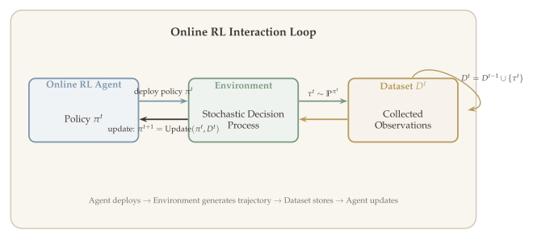
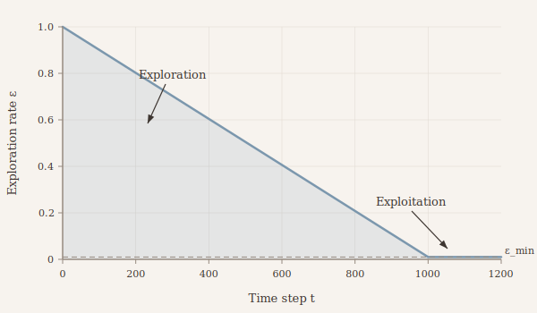
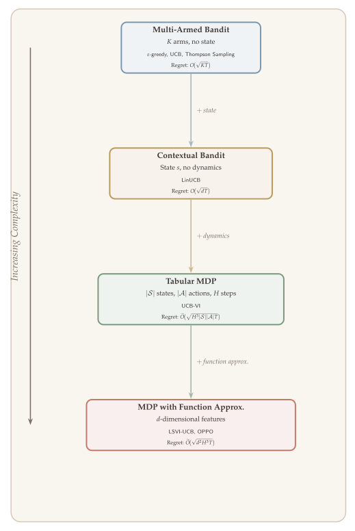

In reinforcement learning, collecting high-quality data is not a passive task --- it is a strategic one. Unlike supervised learning, where a fixed dataset is provided upfront, an RL agent must decide which actions to take and, in doing so, determines the data it will learn from. This creates a fundamental tension: the agent must *explore* the environment to discover which actions yield the best outcomes, while simultaneously *exploiting* its current knowledge to accumulate reward. This tension, known as the exploration--exploitation tradeoff, is the central challenge of online reinforcement learning.

Exploration is, in essence, the problem of designing good data collection strategies. A poorly exploring agent may converge to a suboptimal policy because it never gathers enough information about promising alternatives. A purely exploring agent wastes valuable episodes on uninformative actions when it could be reaping rewards. The algorithms we develop in this lecture --- $\varepsilon$-greedy, upper confidence bound (UCB), and Thompson sampling --- represent increasingly sophisticated ways to navigate this tradeoff.

We begin with the simplest setting, the multi-armed bandit, where the ideas are cleanest and the analysis most transparent. Each algorithm illustrates a distinct philosophy: $\varepsilon$-greedy separates exploration and exploitation through randomization, UCB merges them via optimistic reward estimates, and Thompson sampling achieves the same through posterior randomization. These principles extend naturally to the full MDP setting and to deep RL, as we will see in later lectures.

::: {.callout-important}
## The Central Question
*How should an agent balance exploring unknown actions to gather information with exploiting its current knowledge to maximize cumulative reward?*
:::


## What Will Be Covered {#sec-overview}

- **Setting of online RL:** The interaction protocol, sample complexity, and the regret criterion.
- **Exploration in multi-armed bandits:** Three foundational algorithms:
  - $\varepsilon$-greedy exploration,
  - Upper confidence bound (UCB),
  - Thompson sampling.
- **Regret analysis:** Formal regret bounds for $\varepsilon$-greedy ($\widetilde{O}(T^{2/3})$) and UCB ($\widetilde{O}(\sqrt{T})$).
- **Key examples:** Multi-armed bandits, linear bandits, and contextual bandits as special cases of the online RL framework.


## Setting of Online RL {#sec-online-rl}

### The Online Interaction Protocol {#sec-protocol}

In the online setting, the agent has no prior knowledge or data. It learns how to make decisions *only through interacting with the environment*. This is sometimes called "learning by doing," in contrast with offline RL, which is "learning from data."

The environment is modeled as a stochastic decision process, which may be a bandit or an episodic MDP. The agent interacts with the environment according to the following protocol.

{#fig-online-rl-loop width="90%"}

The loop repeats for $t = 1, 2, \ldots, T$:

1. The agent selects a policy $\pi^t$.
2. The policy is deployed in the environment, generating a trajectory $\tau^t \sim \mathbb{P}^{\pi^t}$.
3. The trajectory is saved to the dataset: $D^t = D^{t-1} \cup \{\tau^t\}$.
4. The agent updates its policy: $\pi^{t+1} = \text{Update}(\pi^t, D^t)$.


### Sample Efficiency and Regret {#sec-sample-efficiency}

In the online setting, we assume that the RL agent interacts with the environment for many iterations. In each iteration the agent deploys a policy, collects a trajectory, and gets some rewards and observations. The central theoretical question is again **sample efficiency**:

> *How many samples do we need to find an $\varepsilon$-optimal policy?*

The total number of samples is $\text{\#samples} = (\text{\#iterations}) \times (\text{\#steps per iteration})$. For simplicity, when dealing with multi-stage problems we consider **episodic settings** where the number of steps per episode is $H$. If we run an RL algorithm for $T$ iterations, the total sample count is $T \cdot H$.

Sample complexity focuses on *finding* a good policy, but that policy might never be executed during training. One could imagine deploying a fixed behavior policy and running offline RL at the end --- but then we would waste all the reward during training. We therefore want the *executed* policies to also perform well. To capture this desideratum, we use the notion of **regret**.


### Regret {#sec-regret}

Consider a finite-horizon stochastic decision process $\mathcal{M}$. The agent interacts with $\mathcal{M}$ for $T$ episodes according to the following protocol.

For $t = 1, 2, \ldots, T$:

- At the beginning of the $t$-th episode, the agent specifies a policy $\pi^t$.
- The policy $\pi^t$ generates a trajectory $\tau^t = (o_1^t, a_1^t, \ldots, o_H^t, a_H^t, o_{H+1}^t)$ as follows:
  - $o_1^t \sim \mu \in \Delta(\mathcal{O})$ (or generated adversarially).
  - $\tau_1^t = (o_1^t)$. The partial histories $\{\tau_h^t\}$ accumulate observations and actions.
  - $a_h^t \sim \pi^t(\cdot \mid \tau_h^t)$.
  - $o_{h+1}^t \sim P(\cdot \mid \tau_h^t, a_h^t)$.
  - The reward $r_h^t$ has mean $\mathbb{E}[r_h^t \mid \tau_h^t, a_h^t] = R(\tau_h^t, a_h^t)$.

The **performance** of policy $\pi^t$ is

$$
J(\pi^t) = \mathbb{E}\left[\sum_{h=1}^{H} r_h^t\right].
$$

The **suboptimality** of $\pi^t$ is $J(\pi^*) - J(\pi^t)$.

To capture the cumulative cost of learning, we aggregate the per-episode suboptimality over all $T$ episodes into a single quantity called the **regret**.

::: {#def-regret}
## Regret
The **regret** of an online RL algorithm over $T$ episodes is defined as the sum of the suboptimality terms:

$$
\text{Regret}(T) = \sum_{t=1}^{T} \bigl(J(\pi^*) - J(\pi^t)\bigr).
$$ {#eq-regret}

Equivalently, regret measures the difference between the optimal cumulative reward over $T$ episodes and the cumulative reward actually collected by the algorithm.
:::

::: {.callout-tip}
## Remarks on Regret

1. **Sublinear growth.** Regret$(T)$ grows in $T$, but we want $\text{Regret}(T) = o(T)$, meaning the regret grows sub-linearly. An algorithm achieving this is called **no-regret**.

2. **Polynomial dependence on problem size.** More concretely, we seek $\text{Regret}(T) = o(T) \cdot \text{poly}(\text{size})$, where the polynomial factor depends on problem dimensions such as $|\mathcal{A}|$, $|\mathcal{S}|$, $H$, etc.

3. **From no-regret to $\varepsilon$-optimal policy.** Suppose $\text{Regret}(T) = T^{\alpha}$ with $\alpha < 1$. If we return a random policy $\widehat{\pi}$ drawn uniformly from $\{\pi^1, \ldots, \pi^T\}$, then
$$
\mathbb{E}[\text{SubOpt}(\widehat{\pi})] = \frac{1}{T}\sum_{t=1}^{T}\bigl[J(\pi^*) - J(\pi^t)\bigr] = \frac{\text{Regret}(T)}{T} = T^{\alpha - 1}.
$$
Setting $T^{\alpha - 1} = \varepsilon$ gives $T = (1/\varepsilon)^{1/(1-\alpha)}$. After this many episodes, we obtain an $\varepsilon$-optimal policy.

4. **Theoretical interest.** Regret is mainly of interest for the sake of theory; in practice, sample complexity is often the more natural metric.
:::


### Examples {#sec-examples}

To make the online RL framework concrete, we consider several important special cases.

::: {#exm-mab}
## Multi-Armed Bandit
In the multi-armed bandit (MAB), there is no observation, $|\mathcal{A}|$ is finite, and $H = 1$. Let $\mathcal{A} = \{a_1, a_2, \ldots, a_m\}$. The reward function satisfies

$$
\mathbb{E}[r \mid a] = R^*(a), \qquad R^*: \mathcal{A} \to [0,1].
$$

The regret simplifies to

$$
\text{Regret}(T) = T \cdot \max_{a \in \mathcal{A}} R^*(a) - \sum_{t=1}^{T} \mathbb{E}_{a \sim \pi^t}\bigl[R^*(a)\bigr].
$$ {#eq-regret-mab}
:::

::: {#exm-linear-bandit}
## Bandit with Function Approximation
The action set $\mathcal{A}$ can be infinite, and the reward function $R^* \in \mathcal{F}$ belongs to some function class. For example, in a **linear bandit**, $R^* \in \mathcal{F}_{\text{lin}}$, meaning there exists $\theta^* \in \mathbb{R}^d$ such that

$$
R(a) = \phi(a)^\top \theta^*.
$$

In bandits, a policy is $\pi \in \Delta(\mathcal{A})$.
:::

::: {#exm-contextual-bandit}
## Contextual Bandit
At each iteration, the agent observes a context $x^t \in \mathcal{X}$. A policy $\pi: \mathcal{X} \to \Delta(\mathcal{A})$ maps contexts to distributions over actions. The contexts $\{x^t\}$ can be adversarially generated and thus are nonstationary (not following a fixed distribution).

The reward function

$$
R^*(x, a) = \mathbb{E}[r^t \mid x^t = x]
$$

is fixed across all $t \geq 1$. The optimal policy is

$$
\pi^*(x) = \operatorname*{argmax}_{a} R^*(x, a), \qquad (\pi^* = \text{greedy}(R^*)).
$$

The regret becomes

$$
\text{Regret}(T) = \sum_{t=1}^{T} \Bigl(R^*\bigl(x^t, \pi^*(x^t)\bigr) - \mathbb{E}_{a^t \sim \pi^t(\cdot \mid x^t)}\bigl[R^*(x^t, a^t)\bigr]\Bigr).
$$ {#eq-regret-contextual}

To handle large $|\mathcal{X}|$ and $|\mathcal{A}|$, we often assume $R^*$ belongs to some function class. For example, in a **linear contextual bandit**,

$$
R(x, a) = \phi(x, a)^\top \theta^*.
$$

Note the nesting of generality:
$$
\text{Linear contextual bandit} \supseteq \text{Linear bandit} \supseteq \text{Multi-armed bandit}.
$$
:::


### The Exploration--Exploitation Tradeoff {#sec-tradeoff}

{#fig-exploration-exploitation width="80%"}

The foundational challenge in online learning is the **exploration--exploitation tradeoff**.

We want to find the optimal policy $\pi^*$, but we do not know the true environment. We must find $\pi^*$ from data, which requires solving a statistical problem (e.g., estimating the transition function or value function). But we also need to decide *how* to collect data. High-quality data --- meaning data with good coverage --- leads to better estimation accuracy.

In addition, because we care about regret, we cannot spend all iterations on data collection. We need to also deploy near-optimal policies. This gives rise to the fundamental tension:

- **Exploration:** Collect data that has good coverage (e.g., $\pi = \text{Unif}(\mathcal{A})$ in MAB).
- **Exploitation:** Deploy policies we believe are near-optimal (e.g., $\pi = \text{greedy}(\widehat{R})$, where $\widehat{R}$ is an estimated reward function).


## Exploration in Multi-Armed Bandits {#sec-mab}

We first focus on multi-armed bandits and introduce several exploration algorithms. These methods also apply to MDPs in general.

**Setup.** There are $m$ actions, $\mathcal{A} = \{a_1, \ldots, a_m\}$. For $t = 1, 2, \ldots, T$, in the $t$-th round, we pick an arm $a^t$ and observe reward $r^t$. The expected reward satisfies

$$
\mathbb{E}[r^t \mid a^t = a] = R(a), \qquad \forall\, a \in \mathcal{A}.
$$

Let $a^* = \operatorname*{argmax}_{a \in \mathcal{A}} R^*(a)$. The optimal policy always pulls $a^*$.


### $\varepsilon$-Greedy Exploration {#sec-eps-greedy}

The $\varepsilon$-greedy strategy is a simple-to-implement exploration method. In each round, we first flip a biased coin with $\mathbb{P}(\text{head}) = \varepsilon_t$:

- **If head (with probability $\varepsilon_t$):** uniformly choose an action $a \in \mathcal{A}$ with probability $1/|\mathcal{A}|$. *(Explore.)*
- **If tail (with probability $1 - \varepsilon_t$):** take the best action according to the current estimate of $R$. *(Exploit.)*

A natural question is: what should the current estimate of $R$ be in each round?


#### Constructing the Reward Estimator $\widehat{R}^t$ {#sec-reward-estimator}

Before the $t$-th iteration, we have $(t-1)$ action--reward pairs $\{a^\ell, r^\ell\}_{\ell \leq t-1}$, where each $a^\ell \in \{a_1, \ldots, a_m\}$. We can estimate each $R(a)$ using the **empirical mean** of the rewards from rounds where arm $a$ was pulled:

$$
\widehat{R}^t(a) = \frac{1}{n^t(a)} \sum_{\ell=1}^{t-1} \mathbb{1}\{a^\ell = a\} \cdot r^\ell,
$$ {#eq-reward-estimator}

where the **visit count** is

$$
n^t(a) = 1 + \sum_{\ell=1}^{t-1} \mathbb{1}\{a^\ell = a\} = 1 + \text{\# pulls of arm } a \text{ in the first } (t-1) \text{ rounds}.
$$

Equivalently,

$$
\widehat{R}^t(a) = \frac{1}{1 + \sum_{\ell=1}^{t-1}\mathbb{1}\{a^\ell = a\}} \sum_{\ell=1}^{t-1} \mathbb{1}\{a^\ell = a\} \cdot r^\ell.
$$

::: {.callout-tip}
## Why Add 1 in $n^t(a)$?
We add $1$ to the count to avoid division by zero when arm $a$ has never been pulled. By choosing $n^t(a) = 1 + \sum_{k=1}^{t-1}\mathbb{1}\{a^k = a\}$, we ensure $n^t(a) \geq 1$ for all $t \geq 1$ and $a \in \mathcal{A}$.
:::

::: {.callout-tip}
## A Regression Perspective on $\widehat{R}^t$
The estimator $\widehat{R}^t$ can be viewed as the solution to a **ridge regression** problem. Consider

$$
\min_{R \in \mathbb{R}^{|\mathcal{A}|}} \left\{ \sum_{k=1}^{t-1} \bigl(r^k - \phi(a^k)^\top R\bigr)^2 + \|R\|_2^2 \right\},
$$

where $\phi$ is the canonical feature, i.e., $\phi(a) = e_a$ is the standard basis vector with a $1$ in the position corresponding to arm $a$ and $0$ elsewhere.

**Exercise:** Verify that $\widehat{R}^t$ defined in ([-@eq-reward-estimator]) is the solution to this ridge regression problem.
:::


#### The $\varepsilon$-Greedy Algorithm {#sec-eps-greedy-alg}

The complete algorithm is as follows.

**$\varepsilon$-Greedy Algorithm.**
For $t = 1, 2, \ldots, T$:

1. Update the reward estimator $\widehat{R}^t$.
2. With probability $\varepsilon_t$, sample $a^t \sim \text{Unif}(\mathcal{A})$.
3. With probability $1 - \varepsilon_t$, set $a^t = \operatorname*{argmax}_{a \in \mathcal{A}} \widehat{R}^t(a)$.


#### Is $\varepsilon$-Greedy Effective? {#sec-eps-greedy-effective}

The answer is nuanced: **theoretically, no; empirically, yes in many cases.**

Why is it not theoretically optimal? Consider using a fixed $\varepsilon$. When $t$ is very large and $\mathcal{A}$ is finite, we accumulate $\Omega(\varepsilon \cdot T / m)$ observations of each arm. In this regime, $\|\widehat{R} - R\|_\infty$ is very small, so we can safely trust $\operatorname*{argmax}_a \widehat{R}(a)$. However, $\varepsilon$-greedy tells us to *always explore*, even when we do not need to. Thus, $\varepsilon$-greedy with constant $\varepsilon$ is not efficient.

**Asymptotic regret of $\varepsilon$-greedy.** For constant $\varepsilon$, the per-episode regret converges to

$$
\lim_{T \to \infty} \frac{R(T)}{T} = \varepsilon \cdot \frac{1}{|\mathcal{A}|} \sum_{a \in \mathcal{A}} \bigl[R(a^*) - R(a)\bigr].
$$ {#eq-eps-greedy-asymptotic}

The right-hand side is the regret incurred when uniformly exploring $\mathcal{A}$ in a single iteration. Because the regret grows linearly with $T$, constant $\varepsilon$-greedy is **not** a no-regret algorithm.


#### $\varepsilon$-Greedy with Decaying $\varepsilon_t$ {#sec-eps-greedy-decay}

As shown above, we do not need to explore when $\widehat{R}^t$ is accurate, which is the case when $t$ is large. Thus, a better approach is to set $\varepsilon_t$ as a **decreasing function** of $t$.

::: {.callout-tip}
## Practical Implementation
This is what is used in practice:

1. **Warm-start period:** During an initial period, the agent takes completely random actions. Set a "learning starts" parameter.
2. **Decay schedule:** Starting from a large $\varepsilon$ (e.g., 1.0), gradually decrease to a small value (e.g., 0.05).
:::


#### Regret Analysis for $\varepsilon$-Greedy {#sec-eps-greedy-regret}

We now show that setting a small $\varepsilon_t$ (depending on $t$) yields a no-regret algorithm. For simplicity, we use a constant $\varepsilon$ but let it depend on $T$.

::: {#thm-eps-greedy-regret}
## Regret of $\varepsilon$-Greedy
Set $\varepsilon = T^{-1/3}\bigl(|\mathcal{A}| \cdot \log(T|\mathcal{A}|)\bigr)^{1/3}$. Then the regret of the $\varepsilon$-greedy algorithm satisfies

$$
\text{Regret}(T) = O\!\left(T^{2/3} \bigl(|\mathcal{A}| \cdot \log(T|\mathcal{A}|)\bigr)^{1/3}\right)
$$

with high probability.
:::

::: {.proof}
We consider the regret incurred during exploration and exploitation rounds separately.

**Exploration rounds.** If the $t$-th round is an exploration round, the expected immediate regret is

$$
\text{reg}_t = \mathbb{E}\bigl[R(a^*) - R(a_t)\bigr] = \frac{\varepsilon}{|\mathcal{A}|} \sum_{a \in \mathcal{A}} \bigl[R(a^*) - R(a)\bigr] \leq \varepsilon.
$$

**Exploitation rounds.** When we choose $a_t = \operatorname*{argmax}_a \widehat{R}^t(a)$ in the $t$-th round, a key result we use is that, for all $a \in \mathcal{A}$ and all $t \in [T]$,

$$
\bigl|\widehat{R}^t(a) - R(a)\bigr| \leq \widetilde{O}\!\left(\frac{1}{\sqrt{n^t(a)}}\right).
$$

This gives us two bounds:

$$
\bigl|\widehat{R}^t(a^t) - R(a^t)\bigr| \lesssim \frac{1}{\sqrt{n^t(a^t)}}, \qquad \bigl|R(a^*) - \widehat{R}^t(a^*)\bigr| \lesssim \frac{1}{\sqrt{n^t(a^*)}}.
$$

Since $a^t = \operatorname*{argmax}_a \widehat{R}^t(a)$, we have $\widehat{R}^t(a^t) \geq \widehat{R}^t(a^*)$, and therefore

$$
\text{reg}_t = R(a^*) - R(a^t) \leq \widehat{R}^t(a^*) + \frac{1}{\sqrt{n^t(a^*)}} - \widehat{R}^t(a^t) + \frac{1}{\sqrt{n^t(a^t)}} \leq \frac{1}{\sqrt{n^t(a^*)}} + \frac{1}{\sqrt{n^t(a^t)}}.
$$

In the $t$-th round, each arm has been explored at least $\varepsilon \cdot t / |\mathcal{A}|$ times in expectation. We can therefore replace $n^t(a^*)$ and $n^t(a^t)$ by $\varepsilon \cdot t / |\mathcal{A}|$, giving

$$
\text{reg}_t \lesssim \sqrt{\frac{|\mathcal{A}|}{\varepsilon \cdot t}}.
$$

**Overall regret.** Summing over all rounds,

$$
\text{Regret}(T) \lesssim \sum_{t=1}^{T} \left(\varepsilon + \sqrt{\frac{|\mathcal{A}|}{\varepsilon \cdot t}}\right) = T\varepsilon + \sqrt{\frac{|\mathcal{A}|}{\varepsilon}} \cdot \sum_{t=1}^{T} \frac{1}{\sqrt{t}}.
$$

Since $\sum_{t=1}^T 1/\sqrt{t} \sim O(\sqrt{T})$, we obtain

$$
\text{Regret}(T) \lesssim T\varepsilon + \sqrt{\frac{|\mathcal{A}| T}{\varepsilon}}.
$$

Balancing the two terms by setting $\varepsilon = \bigl(|\mathcal{A}|/T\bigr)^{1/3}$ gives

$$
\text{Regret}(T) = \widetilde{O}\!\left(|\mathcal{A}|^{1/3} \, T^{2/3}\right).
$$

This completes the proof. $\blacksquare$
:::


## Efficient Exploration: Optimism in the Face of Uncertainty (UCB) {#sec-ucb}

### Motivation {#sec-ucb-motivation}

The $\varepsilon$-greedy algorithm is suboptimal because it artificially separates exploration from exploitation. In every round, it either explores (uniformly at random) or exploits (greedily), but never does both at the same time. Can we design an algorithm that combines exploration and exploitation more systematically?

The answer is **optimism in the face of uncertainty**, also known as the **upper confidence bound (UCB)** method.


### The UCB Algorithm {#sec-ucb-alg}

Consider the MAB case. For any $t \geq 1$, in each iteration we maintain two functions:

- $\widehat{R}^t: \mathcal{A} \to [0,1]$ --- the estimated reward function based on data collected before the $t$-th iteration.
- $b^t: \mathcal{A} \to \mathbb{R}$ --- a **bonus function** that reflects the uncertainty we have about each arm.

We then define a new reward function estimator $R^t$ by adding the bonus:

$$
R^t(a) = \text{Truncate}_{[0,1]}\!\bigl(\widehat{R}^t(a) + b^t(a)\bigr), \qquad \forall\, a \in \mathcal{A}.
$$

The policy $\pi^t \in \Delta(\mathcal{A})$ is defined as the greedy policy with respect to $R^t$:

$$
\pi^t(a) = \mathbb{1}\{a = \operatorname*{argmax}_{a'} R^t(a')\}.
$$

That is, $\pi^t$ is a **deterministic** policy that chooses $a^t = \operatorname*{argmax}_{a} R^t(a)$.

**Constructing $\widehat{R}^t$ and $b^t$.** Given data $D^t = \{(a^k, r^k): k \leq t-1\}$:

$$
\widehat{R}^t(a) = \frac{1}{n^t(a)} \sum_{k=1}^{t-1} \mathbb{1}\{a^k = a\} \cdot r^k, \qquad n^t(a) = 1 + \sum_{k=1}^{t-1} \mathbb{1}\{a^k = a\}.
$$

$$
b^t(a) = \beta \cdot \sqrt{\frac{1}{n^t(a)}}, \qquad \text{where} \quad \beta = C \cdot \sqrt{\log(T|\mathcal{A}|/\delta)}.
$$ {#eq-ucb-bonus}

Intuitively, $b^t(a)$ reflects the **uncertainty** about arm $a$ after we have collected data $D^t$: arms that have been pulled fewer times have larger bonuses.


### Intuition Behind UCB {#sec-ucb-intuition}

{#fig-ucb-selection width="80%"}

The UCB algorithm smoothly balances exploration and exploitation through a single mechanism. The estimated reward $\widehat{R}^t$ captures what we have learned so far (exploitation), while the bonus $b^t$ captures what we are uncertain about (exploration). By taking

$$
a^t = \operatorname*{argmax}_{a}\bigl\{\widehat{R}^t(a) + b^t(a)\bigr\},
$$

we choose an action either because $\widehat{R}^t$ is large (exploit) or because $b^t$ is large (explore).

```{=html}
<div class="figure-container">
  <div id="fig-ucb-intuition"></div>
  <div class="figure-caption">Figure 6.2: UCB selects the arm with the highest upper confidence bound. Arm 2 has a lower estimated reward than arm 1 but higher uncertainty, making its UCB the largest.</div>
</div>
<script>
document.addEventListener('DOMContentLoaded', () => {
  // Generate Gaussian-shaped curves for three arms
  const N = 200;
  const xArr = Array.from({length: N}, (_, i) => i / (N - 1));
  function gauss(x, mu, sig, amp) { return amp * Math.exp(-0.5 * ((x - mu) / sig) ** 2); }

  const y1m = xArr.map(x => gauss(x, 0.25, 0.06, 0.65));
  const y1u = xArr.map(x => gauss(x, 0.25, 0.066, 0.85));
  const y1l = xArr.map(x => gauss(x, 0.25, 0.054, 0.45));

  const y2m = xArr.map(x => gauss(x, 0.55, 0.10, 0.45));
  const y2u = xArr.map(x => gauss(x, 0.55, 0.12, 0.80));
  const y2l = xArr.map(x => gauss(x, 0.55, 0.08, 0.20));

  const y3m = xArr.map(x => gauss(x, 0.80, 0.08, 0.35));
  const y3u = xArr.map(x => gauss(x, 0.80, 0.088, 0.60));
  const y3l = xArr.map(x => gauss(x, 0.80, 0.072, 0.15));

  const c1 = warmtonePalette[0], c2 = warmtonePalette[1], c3 = warmtonePalette[3];
  const traces = [
    {x:xArr, y:y1u, mode:'lines', line:{dash:'dash', color:c1}, name:'\u0052\u0302\u1D57 + b\u1D57 (arm 1)'},
    {x:xArr, y:y1m, mode:'lines', line:{color:c1, width:2}, name:'\u0052\u0302\u1D57 (arm 1)'},
    {x:xArr, y:y1l, mode:'lines', line:{dash:'dot', color:c1}, name:'\u0052\u0302\u1D57 \u2212 b\u1D57 (arm 1)', showlegend:false},
    {x:xArr, y:y2u, mode:'lines', line:{dash:'dash', color:c2}, name:'\u0052\u0302\u1D57 + b\u1D57 (arm 2)'},
    {x:xArr, y:y2m, mode:'lines', line:{color:c2, width:2}, name:'\u0052\u0302\u1D57 (arm 2)'},
    {x:xArr, y:y2l, mode:'lines', line:{dash:'dot', color:c2}, name:'\u0052\u0302\u1D57 \u2212 b\u1D57 (arm 2)', showlegend:false},
    {x:xArr, y:y3u, mode:'lines', line:{dash:'dash', color:c3}, name:'\u0052\u0302\u1D57 + b\u1D57 (arm 3)'},
    {x:xArr, y:y3m, mode:'lines', line:{color:c3, width:2}, name:'\u0052\u0302\u1D57 (arm 3)'},
    {x:xArr, y:y3l, mode:'lines', line:{dash:'dot', color:c3}, name:'\u0052\u0302\u1D57 \u2212 b\u1D57 (arm 3)', showlegend:false}
  ];
  const layout = themeLayout({
    width:650, height:380,
    title:{text:'UCB: Greedy on Upper Confidence Bounds', font:{family:figFontHeading, size:16, color:css('--fig-text')}},
    xaxis: Object.assign(themeAxis('Action space'), {showticklabels:false}),
    yaxis: themeAxis('Reward estimate'),
    margin:{l:50, r:20, t:50, b:40},
    showlegend:true,
    legend: Object.assign({x:1.02, y:1, font:{size:10}}, legendStyle()),
    annotations: [{
      x:0.55, y:0.84, text:'UCB selects arm 2:<br>highest upper bound',
      showarrow:true, arrowhead:2, ax:60, ay:-30,
      font:{family:figFont, size:11, color:c2}
    }]
  });
  Plotly.newPlot('fig-ucb-intuition', traces, layout, plotlyConfig);
});
</script>
```

If we set $\beta = 0$, then the agent is purely exploiting its learned knowledge. On the other hand, $b^t(a)$ reflects the uncertainty of the estimator $\widehat{R}^t$. If we were to choose $a^t = \operatorname*{argmax}_{a \in \mathcal{A}}\{b^t(a)\}$, then we would be purely exploring by collecting data from the most uncertain arm. By adding $b^t$ to $\widehat{R}^t$, UCB smoothly interpolates between these two extremes.


### Why UCB Works: Optimism in the Face of Uncertainty {#sec-ucb-analysis}

The reason UCB works is that $b^t$ characterizes the uncertainty of $\widehat{R}^t$, in the sense that, with probability at least $1 - \delta$,

$$
\bigl|\widehat{R}^t(a) - R^*(a)\bigr| \leq b^t(a), \qquad \forall\, a \in \mathcal{A}.
$$

In other words, the set $\{R : |\widehat{R}^t(a) - R(a)| < b^t(a),\; \forall a \in \mathcal{A}\}$ is a $(1-\delta)$-confidence set for $R^*$.

::: {#lem-confidence}
## Confidence Bound
With probability at least $1 - \delta$, for all $t \in [T]$ and $a \in \mathcal{A}$,

$$
\bigl|\widehat{R}^t(a) - R^*(a)\bigr| \leq 2\sqrt{\frac{\log(T|\mathcal{A}|/\delta)}{n^t(a)}}.
$$ {#eq-confidence}
:::

This lemma is a direct consequence of Hoeffding's inequality and a union bound over $\mathcal{A}$.

By this lemma, when $C \geq 2$, we can show that $\widehat{R}^t(a) + b^t(a) \geq R^*(a)$. Moreover, since $R^* \in [0,1]$, the truncation on $(\widehat{R}^t(a) + b^t(a))$ preserves this inequality, i.e., $R^t$ is also an upper bound of $R^*$.

Therefore, with probability $1 - \delta$,

$$
R^t(a) \geq R^*(a) \qquad \text{for all } t \in [T] \text{ and all } a \in \mathcal{A}.
$$

This property gives the name (UCB / optimism) of the algorithm.


### Regret Decomposition {#sec-ucb-regret-decomposition}

Let us see why UCB works by decomposing the immediate regret in the $t$-th iteration:

$$
J(\pi^*) - J(\pi^t) = \langle R^*, \pi^*\rangle_{\mathcal{A}} - \langle R^*, \pi^t\rangle_{\mathcal{A}}.
$$

We decompose this into three terms:

$$
= \underbrace{\langle R^* - R^t, \pi^*\rangle_{\mathcal{A}}}_{\text{(i)}} + \underbrace{\langle R^t, \pi^* - \pi^t\rangle_{\mathcal{A}}}_{\text{(ii)}} + \underbrace{\langle R^t - R^*, \pi^t\rangle_{\mathcal{A}}}_{\text{(iii)}}.
$$

We now bound each term:

- **(i) $\leq 0$** because of UCB: $R^t(a) \geq R^*(a)$ for all $a$.
- **(ii) $\leq 0$** because $\pi^t = \text{greedy}(R^t)$, so $\langle R^t, \pi^t\rangle \geq \langle R^t, \pi^*\rangle$.
- **(iii)** $= \langle R^t - R^*, \pi^t\rangle_{\mathcal{A}} \leq 2 \langle b^t, \pi^t\rangle_{\mathcal{A}}$, because $(\widehat{R}^t(a) + b^t(a)) - R^*(a) \leq 2\,b^t(a)$.

Since $\pi^t$ is a deterministic policy that chooses $a^t$, term (iii) equals $2\,b^t(a^t)$. Therefore,

$$
J(\pi^*) - J(\pi^t) \leq 2\,b^t(a^t) = 2C\sqrt{\log(T|\mathcal{A}|/\delta)} \cdot \frac{1}{\sqrt{n^t(a^t)}}.
$$


### Summing the Regret {#sec-ucb-sum}

Now we can bound the total regret:

$$
\text{Regret}(T) \leq 2 \sum_{t=1}^{T} b^t(a^t) = 2C\sqrt{\log(T|\mathcal{A}|/\delta)} \cdot \sum_{t=1}^{T} \sqrt{\frac{1}{n^t(a^t)}}.
$$

To sum $\sqrt{1/n^t(a^t)}$, we note that $\{n^t(a^t)\}_{t=1}^T$ can be rearranged as $\{1, 2, \ldots, n^T(a_1)\} \cup \{1, 2, \ldots, n^T(a_2)\} \cup \cdots \cup \{1, 2, \ldots, n^T(a_m)\}$. Thus,

$$
\sum_{t=1}^{T} \sqrt{\frac{1}{n^t(a^t)}} = \sum_{a \in \mathcal{A}} \sum_{i=1}^{n^T(a)} \frac{1}{\sqrt{i}} \leq \sum_{a \in \mathcal{A}} 2\sqrt{n^T(a)},
$$

where we used $\sum_{i=1}^K 1/\sqrt{i} \leq 2\sqrt{K}$.

Note that $\sum_{a \in \mathcal{A}} n^T(a) = T$. By the Cauchy--Schwarz inequality,

$$
\sum_{a} \sqrt{n^T(a)} \leq \sqrt{|\mathcal{A}|} \cdot \sqrt{T}.
$$

::: {#thm-ucb-regret}
## Regret of UCB
Choosing $C \geq 2$ in $b^t$ (so that $b^t(a) = C\sqrt{\log(T|\mathcal{A}|/\delta) / n^t(a)}$), then with probability at least $1 - \delta$,

$$
\text{Regret}(T) \leq 2C\sqrt{\log(T|\mathcal{A}|/\delta)} \cdot \sqrt{|\mathcal{A}| \cdot T} = \widetilde{O}\!\bigl(\sqrt{|\mathcal{A}| \cdot T}\bigr).
$$ {#eq-ucb-regret}
:::

This is a $\widetilde{O}(\sqrt{T})$ regret bound, which is a significant improvement over the $\widetilde{O}(T^{2/3})$ rate of $\varepsilon$-greedy.

::: {.callout-tip}
## Remarks on UCB

The idea of UCB has two key components:

1. **Optimistic reward function.** By constructing a UCB ($R^t \geq R^*$) and executing its greedy policy, we eliminate one difficult term in the regret decomposition. The term $\langle R^* - R^t, \pi^*\rangle_{\mathcal{A}}$ is hard to control because we do not have data from $\pi^*$; by ensuring $R^t \geq R^*$, we simply bound it by $0$.

2. **Bounded total bonus.** The regret is bounded by $\sum_{t=1}^T 2\,b^t(a^t)$, the total bias due to UCB evaluated on the collected data. The sum $\sum_{t=1}^T b^t(a^t)$ can be bounded because
$$
\sum_{t=1}^T \bigl(b^t(a^t)\bigr)^2 = \widetilde{O}(1) \qquad \text{(polylogarithmic in } T\text{)}.
$$
This holds because $(b^t(a^t))^2$ is the in-sample estimation error, which is $\widetilde{O}(1/n^t(a^t))$, and $\sum_{t=1}^T 1/t \asymp \log T$.
:::


## Thompson Sampling (Posterior Sampling) {#sec-thompson}

{#fig-thompson-sampling width="95%"}

### Motivation {#sec-thompson-motivation}

Recall the idea of UCB:

- Estimate the reward function based on data: $\widehat{R}^t$.
- Quantify the uncertainty of $\widehat{R}^t$: $|\widehat{R}^t(a) - R(a)| \leq b^t(a)$, where $b^t(a) \propto 1/\sqrt{n^t(a)}$ and $n^t(a)$ is the number of pulls of arm $a$ in the first $t - 1$ rounds.
- Maximize UCB: $a^t = \operatorname*{argmax}_a \{\widehat{R}^t(a) + b^t(a)\}$.

UCB replaces the unknown reward with a deterministic optimistic estimate. **Thompson sampling** takes a different approach: instead of a deterministic bonus, it adds *random noise* calibrated to the uncertainty.

The core idea of Thompson sampling is:

$$
a^t = \operatorname*{argmax}_{a} \bigl\{\widehat{R}^t(a) + \text{Noise}^t(a)\bigr\},
$$

where the noise is scaled to the uncertainty. This uses a **random** reward function to explore.


### The Thompson Sampling Algorithm {#sec-thompson-alg}

For $t = 1, 2, \ldots, T$:

1. Before the $t$-th round, compute $\widehat{R}^t$ and $n^t$.
2. Sample a **random reward function**:
$$
R^t(a) \sim \mathcal{N}\!\left(\widehat{R}^t(a),\; \frac{1}{n^t(a)}\right).
$$ {#eq-thompson-sample}
Equivalently,
$$
R^t(a) = \widehat{R}^t(a) + \frac{1}{\sqrt{n^t(a)}} \cdot Z(a), \qquad Z(a) \sim \mathcal{N}(0, 1).
$$
3. Take action $a^t = \operatorname*{argmax}_a \{R^t(a)\}$.

::: {.callout-tip}
## Key Distinction
The noise in Thompson sampling is added to the **reward function** (or, more generally, the model or value function). It is *not* added to the actions. This is a crucial conceptual point: exploration happens through randomized *beliefs*, not randomized *actions*.
:::


### Why $\mathcal{N}(\widehat{R}^t(a), 1/n^t(a))$? {#sec-thompson-posterior}

The sampling distribution in ([-@eq-thompson-sample]) is not arbitrary --- it arises naturally from a Bayesian perspective. Recall that $n^t(a) = 1 + \sum_{\ell=1}^{t-1} \mathbb{1}\{a^\ell = a\}$.

Assume a **prior** distribution over the reward function: $R(a) \sim \mathcal{N}(0, 1)$ for all $a \in \mathcal{A}$, independently across arms.

After observing $\sum_{\ell=1}^{t-1}\mathbb{1}\{a^\ell = a\}$ pulls of arm $a$ and the corresponding sum of rewards $\sum_{\ell=1}^{t-1}\mathbb{1}\{a^\ell = a\} \cdot r^\ell$, the **posterior** distribution of $R(a)$ is

$$
R(a) \mid \text{data} \;\sim\; \mathcal{N}\!\left(\widehat{R}^t(a),\; \frac{1}{n^t(a)}\right).
$$

Thompson sampling simply draws from this posterior and acts greedily with respect to the sample. This is why it is also called **posterior sampling**. The posterior variance $1/n^t(a)$ is large for rarely pulled arms (encouraging exploration) and small for frequently pulled arms (encouraging exploitation) --- achieving a natural, data-driven balance between exploration and exploitation without any explicit bonus term.
Thus, $\mathcal{N}\bigl(\widehat{R}^t(a),\, \frac{1}{n^t(a)}\bigr)$ is the posterior of the reward function under a Gaussian prior.

::: {.callout-tip}
## Remark

1. You might wonder: why a Gaussian prior? We know that $R(a) \in [0,1]$, right? It is okay that we use a wrong prior, as long as it covers the true range of $R$ (i.e., $[0,1]$). The Bayesian version of the law of large numbers ensures that the posterior distribution converges to the true value of $R$ when $n^t \to \infty$.

2. A nice property of the Gaussian posterior is that it can be **easily calculated** and **sampled** from.
:::


## Exploration in RL {#sec-exploration-rl}

Having developed the core exploration ideas --- UCB and Thompson Sampling --- in the bandit setting, we now turn to the far richer setting of reinforcement learning. In an MDP, the agent must explore not just to learn reward functions but also to learn transition dynamics, and the consequences of exploration propagate across multiple time steps.

- We will mainly focus on UCB algorithms.
- We will also discuss Thompson Sampling.


## Optimism in RL {#sec-optimism-rl}

### Online Learning in Tabular MDP: UCB-VI {#sec-ucb-vi}

To extend the bandit UCB algorithm to episodic MDP, the direct idea is to find an upper bound on $Q^*$ by adding a bonus. The source of the bonus comes from the estimation uncertainty of the reward function in the bandit setting. In an MDP, we need to:

1. Estimate the transition $\{P_h\}$ and reward function $\{R_h\}$.
2. Run a planning algorithm on the estimated model, e.g., value iteration (VI).

In the online bandit setting, the UCB algorithm involves:

1. Estimate $R^*$ using the empirical mean $\widehat{R}^t$ (with a very small bias due to setting $n^t(a) = 1 + \sum_{k=1}^{t} \mathbb{1}\{a^k = a\}$).
2. Solve a planning problem with $\{\widehat{R}^t + b^t\}$.

Following the same idea, in an MDP we need to:

1. Estimate $R = \{R_h\}$ and $P = \{P_h\}$ using empirical means $\widehat{R}^t$, $\widehat{P}^t$.
2. Plan with the estimated model $\widehat{R}^t = \{\widehat{R}_h^t\}$ and $\widehat{P}^t = \{\widehat{P}_h^t\}$ and a bonus function $\widehat{b}^t = \{\widehat{b}_h^t\}$, where $\widehat{b}_h^t : \mathcal{S} \times \mathcal{A} \to \mathbb{R}$.

**Data collection.** Before the $t$-th episode, our collected dataset is

$$
\mathcal{D}^t = \bigl\{ (s_h^k, a_h^k, r_h^k) \bigr\}_{h \in [H],\, k \in [t-1]}.
$$

**Visitation counts.** Define the visitation counts:

$$
n^t(h, s, a) = 1 + \sum_{k=1}^{t-1} \mathbb{1}\{s_h^k = s,\, a_h^k = a\},
$$ {#eq-visitation-count-sa}

$$
n^t(h, s, a, s') = \sum_{k=1}^{t-1} \mathbb{1}\{s_h^k = s,\, a_h^k = a\} \cdot \mathbb{1}\{s_{h+1}^k = s'\},
$$ {#eq-visitation-count-sas}

$$
r^t(h, s, a) = \sum_{k=1}^{t-1} \mathbb{1}\{s_h^k = s,\, a_h^k = a\} \cdot r_h^k.
$$ {#eq-cumulative-reward}

**Estimated model.** Define the estimated model $\widehat{R}$, $\widehat{P}$ by letting

$$
\widehat{R}_h^t(s, a) = \frac{r^t(h, s, a)}{n^t(h, s, a)},
$$ {#eq-estimated-reward}

$$
\widehat{P}_h^t(s' \mid s, a) = \frac{n^t(h, s, a, s')}{n^t(h, s, a)}.
$$ {#eq-estimated-transition}

Then we use $\widehat{R}^t$ and $\widehat{P}^t$ to solve an **optimistic** version of the planning problem. Here let us consider VI.

#### Planning Phase of UCB-VI {#sec-ucb-vi-planning}

The planning phase of UCB-VI proceeds as follows:

> **Set** $Q_{H+1}^t = 0$, $V_{H+1}^t = 0$.
>
> **For** $h = H, H-1, \ldots, 1$:
>
> $$
> Q_h^t(s, a) = \operatorname{Truncate}_{[0,\, H - h + 1]} \Bigl( \widehat{R}_h^t(s, a) + (\widehat{P}_h^t V_{h+1}^t)(s, a) + b_h^t(s, a) \Bigr),
> $$ {#eq-ucb-vi-q-update}
>
> $$
> V_h^t(s) = \max_a \, Q_h^t(s, a).
> $$
>
> **Return** $\pi^t = \operatorname{greedy}(Q^t)$.

**Bonus function.** The bonus function is defined as

$$
b_h^t(s, a) = C \cdot H \sqrt{S} \cdot \sqrt{\frac{\log(|\mathcal{S}||\mathcal{A}|HT/\delta)}{n^t(h, s, a)}},
$$ {#eq-ucb-vi-bonus}

which reflects the uncertainty of estimating $R_h$ and $P_h V_{h+1}^t$.

#### Optimism in UCB-VI {#sec-ucb-vi-optimism}

In the planning stage, at each step, given $V_{h+1}^t$, we aim to solve $Q_h \leftarrow R_h + P_h V_{h+1}^t$. But we don't have access to $R_h$ and $P_h$. Thus we replace them by empirical means:

$$
R_h(s, a) \approx \frac{1}{n^t(h, s, a)} \sum_{k=1}^{t-1} \mathbb{1}\{s_h^k = s,\, a_h^k = a\} \cdot r_h^k = \widehat{R}_h^t(s, a),
$$

$$
(P_h V_{h+1}^t)(s, a) \approx \frac{1}{n^t(h, s, a)} \sum_{k=1}^{t-1} \mathbb{1}\{s_h^k = s,\, a_h^k = a\} \cdot V_{h+1}^t(s_{h+1}^k) = (\widehat{P}_h^t V_{h+1}^t)(s, a).
$$

Here $V_{h+1}^t$ is treated as a fixed function. The purpose of adding a bonus term $b_h^t$ is to dominate the estimation error.

::: {#lem-ucb-vi-confidence}
## Confidence in UCB-VI

With probability at least $1 - \delta/2$, we have

$$
\Bigl| \bigl(\widehat{R}_h^t(s,a) + (\widehat{P}_h^t V)(s,a)\bigr) - \bigl(R_h(s,a) + (P_h V)(s,a)\bigr) \Bigr| \leq b_h^t(s,a)
$$ {#eq-ucb-vi-confidence}

for all $t \in [T]$, $h \in [H]$, $s \in \mathcal{S}$, $a \in \mathcal{A}$, and all $V: \mathcal{S} \to [0, H]$.
:::

Therefore, we have

$$
Q_h^t(s, a) \geq R_h(s, a) + (P_h V_{h+1}^t)(s, a) = (\mathcal{T}_h Q_{h+1}^t)(s, a),
$$

where $\mathcal{T}_h$ denotes the Bellman operator. Optimism in UCB-VI means that $Q_h^t \geq \mathcal{T}_h Q_{h+1}^t$ for all $t \in [T]$ and $h \in [H]$. This further implies $Q_h^t \geq Q_h^*$.

#### Regret Bound of UCB-VI {#sec-ucb-vi-regret}

The following theorem establishes the regret guarantee for UCB-VI.

::: {#thm-ucb-vi-regret}
## Regret of UCB-VI

Choosing the bonus function as

$$
b_h^t(s, a) = C \cdot H\sqrt{S} \cdot \sqrt{\frac{\log(|\mathcal{S}||\mathcal{A}|HT/\delta)}{n^t(h, s, a)}},
$$

for all $h \in [H]$, $t \in [H]$, $(s, a) \in \mathcal{S} \times \mathcal{A}$, with probability at least $1 - \delta$, we have

$$
\operatorname{Regret}(T) = \mathcal{O}\Bigl(H^2 \sqrt{|\mathcal{S}|^2 |\mathcal{A}| T} \cdot \log\bigl(|\mathcal{S}| |\mathcal{A}| TH / \delta\bigr)\Bigr) = \widetilde{\mathcal{O}}\Bigl(H^2 \sqrt{|\mathcal{S}|^2 |\mathcal{A}| T}\Bigr).
$$ {#eq-ucb-vi-regret}
:::


## Model-Free Version: LSVI-UCB and OPPO {#sec-model-free}

UCB-VI is a model-based algorithm. It combines:

1. **Model-based planning:** estimate $\widehat{R}^t$, $\widehat{P}^t$.
2. **Add bonus functions** to compensate for estimation uncertainty.

We can change model-based planning to model-free planning, with **value-based** (value iteration) and **policy-based** (soft-policy iteration) approaches.


### LSVI-UCB {#sec-lsvi-ucb}

LSVI-UCB stands for Least-Squares Value Iteration with UCB bonus. It replaces explicit model estimation with direct value function estimation via least squares, while retaining the optimistic exploration bonus.

**Data collection.** Before the $t$-th episode, our collected dataset is

$$
\mathcal{D}^t = \bigl\{ (s_h^k, a_h^k, r_h^k) \bigr\}_{h \in [H],\, k \in [t-1]}.
$$

**Visitation counts.** Define the visitation counts:

$$
n^t(h, s, a) = 1 + \sum_{k=1}^{t-1} \mathbb{1}\{s_h^k = s,\, a_h^k = a\},
$$

$$
n^t(h, s, a, s') = \sum_{k=1}^{t-1} \mathbb{1}\{s_h^k = s,\, a_h^k = a\} \cdot \mathbb{1}\{s_{h+1}^k = s'\},
$$

$$
r^t(h, s, a) = \sum_{k=1}^{t-1} \mathbb{1}\{s_h^k = s,\, a_h^k = a\} \cdot r_h^k.
$$

We use $\mathcal{D}^t$ to estimate $\{Q_h^*, V_h^*\}_{h \in [H]}$. Recall the Bellman equation:

$$
Q_h^* = R_h + P_h V_{h+1}^*, \qquad V_{h+1}^* = 0,
$$

$$
V_h^*(s) = \max_a \, Q_h^*(s, a).
$$

#### Estimating $\{Q_h^*\}_{h \in [H]}$ {#sec-lsvi-ucb-estimation}

Let $\phi: \mathcal{S} \times \mathcal{A} \to \mathbb{R}^{|\mathcal{S}||\mathcal{A}|}$ denote the canonical features.

> **Initialize:** $V_{H+1}^t = 0$.
>
> **For** $h = H, H-1, \ldots, 1$:
>
> $$
> \widehat{Q}_h^t \leftarrow \operatorname*{argmin}_{Q \in \mathbb{R}^{|\mathcal{S}||\mathcal{A}|}} \sum_{k=1}^{t-1} \bigl(\phi(s_h^k, a_h^k)^\top Q - r_h^k - V_h^t(s_{h+1}^k)\bigr)^2 + \|Q\|_2^2,
> $$ {#eq-lsvi-ucb-regression}
>
> $$
> Q_h^t(s, a) \leftarrow \operatorname{Truncate}_{[0,\, H-h+1]} \bigl(\widehat{Q}_h^t(s,a) + b_h^t(s,a)\bigr),
> $$
>
> $$
> V_h^t(s) \leftarrow \max_a \, Q_h^t(s, a).
> $$
>
> **Return** $\pi^t = \operatorname{greedy}(Q_h^t)$.

::: {.callout-tip}
## Remark
This is the same as UCB-VI in the tabular case. They are different in the function approximation setting.
:::


### Optimistic Policy Optimization (OPPO) {#sec-oppo}

OPPO combines soft policy iteration (SPI) with UCB bonuses [Cai et al.]. While LSVI-UCB uses value-based planning, OPPO takes a policy-based approach, updating policies via mirror descent while maintaining optimism through bonus functions.

Recall that we have introduced soft policy iteration, which generates a sequence of policies $\{\pi^{(k)}\}_{k \geq 1}$ in the following fashion.

> **Initialize** $\pi^{(1)}$ as the uniform policy. Here we start from $k = 1$.
>
> **For** $k = 1, 2, \ldots, K$:
>
> - Define $Q_h^{(k)} \approx Q_h^{\pi^{(k)}}$ for all $h \in [H+1]$.
>
> - Update policy:
>   $$
>   \pi_h^{(k+1)}(a \mid s) \propto \pi_h^{(k)}(a \mid s) \cdot \exp\bigl(\alpha \cdot Q_h^{(k)}(s, a)\bigr),
>   $$
>
>   or equivalently,
>   $$
>   \pi(\cdot \mid s) = \operatorname*{argmax}_{\nu \in \Delta(\mathcal{A})} \Bigl\{ \langle Q_h^{(k)}(s, \cdot),\, \nu \rangle_\mathcal{A} - \tfrac{1}{\alpha} \operatorname{KL}\bigl(\nu \,\|\, \pi^{(k)}(\cdot \mid s)\bigr) \Bigr\}.
>   $$

In SPI, $Q_h^{(k)}$ does not need to be exactly $Q_h^{\pi^{(k)}}$. We allow estimation errors, as long as they can be controlled. In fact, from the optimization perspective, because we run mirror descent per state $s$, we can feed arbitrary $Q_h^{(k)}$ as the ascent direction. But a bad $Q_h^{(k)}$ will incur a large statistical error.

Following this reasoning, we can apply SPI as the planning method in online RL. The main modification is that we need to construct **optimistic estimators** of $Q^{\pi^t}$.

Note that $Q^\pi$ satisfies the Bellman evaluation equation:

$$
Q_{H+1}^\pi = 0, \qquad V_{H+1}^\pi = 0,
$$

$$
Q_h^\pi(s, a) = R_h(s, a) + (P_h V_{h+1}^\pi)(s, a),
$$

$$
V_h^\pi(s) = \langle Q_h^\pi(s, \cdot),\, \pi_h(\cdot \mid s) \rangle_\mathcal{A}.
$$

Since $R$ and $P$ are unknown, we again estimate $R_h + P_h V_{h+1}^\pi$ using the estimated model, and add an additional bonus to explore.

#### Algorithm: OPPO {#sec-oppo-algorithm}

> **Initialize** $\pi^1$ by letting $\pi_h^0(\cdot \mid s) = \operatorname{Unif}(\mathcal{A})$ for all $h \in [H]$, $s \in \mathcal{S}$.
>
> **For** $t = 1, 2, \ldots, T$:
>
> - Execute $\pi^t$ to get $\{(s_h^t, a_h^t, r_h^t)\}_{h \in [H]}$.
> - Estimate model by dataset $\mathcal{D}^t = \{(s_h^k, a_h^k, r_h^k)\}_{h \in [H],\, k \in [t-1]}$.
> - Define $\{\widehat{R}_h^t,\, \widehat{P}_h^t,\, b_h^t\}$ in the same way as in UCB-VI.
> - **Get $Q^t$ by evaluating $\pi^{(t-1)}$ with optimism:**
>
>   $V_{H+1}^t = 0$.
>
>   For $h = H, H-1, \ldots, 1$:
>   $$
>   Q_h^t(s, a) = \operatorname{Truncate}_{[0,\, H-h+1]} \Bigl( \widehat{R}_h^t(s, a) + (\widehat{P}_h^t V_h^t)(s, a) + b_h^t(s, a) \Bigr),
>   $$
>   $$
>   V_h^t(s) = \langle Q_h^t(s, \cdot),\, \pi_h^t(\cdot \mid s) \rangle_\mathcal{A}.
>   $$
>
> - **Update policy by mirror descent update based on $Q_h^t$:**
>   $$
>   \pi_h^t(\cdot \mid s) \propto \pi_h^{t-1}(\cdot \mid s) \cdot \exp\bigl(\alpha \cdot Q_h^t(s, \cdot)\bigr), \qquad \forall \, h \in [H],\, s \in \mathcal{S}.
>   $$

Note that here optimism means that

$$
Q_h^t(s, a) \geq R_h(s, a) + (P_h V_{h+1}^t)(s, a).
$$

This further implies that

$$
Q_h^t(s, a) \geq Q_h^{\pi^{t-1}}(s, a), \qquad \forall \, (s, a) \in \mathcal{S} \times \mathcal{A},\quad \forall \, h \in [H].
$$

That is, we only construct UCBs for $\{Q_h^{\pi^t}\}$. In contrast, UCB-VI constructs UCBs for $Q_h^*$.

**Regret of OPPO.** The regret decomposes as

$$
\begin{aligned}
\operatorname{Regret}(\text{OPPO}) &= \underbrace{\text{Policy optimization error}}_{\text{error of SPI}} + \underbrace{\text{Statistical error}}_{\text{exploration}} \\
&= \mathcal{O}\bigl(H^2 \sqrt{\log|\mathcal{A}| \cdot T}\bigr) + \widetilde{\mathcal{O}}\bigl(H^2 \sqrt{|\mathcal{S}|^2 |\mathcal{A}| \cdot T}\bigr) = \widetilde{\mathcal{O}}\bigl(H^2 \sqrt{|\mathcal{S}| \cdot |\mathcal{A}| \cdot T}\bigr).
\end{aligned}
$$

The statistical error is the same as UCB-VI.


### Thompson Sampling in RL {#sec-thompson-sampling-rl}

Thompson Sampling provides an elegant alternative to UCB-based exploration in the MDP setting. Instead of constructing explicit confidence bonuses, we inject randomness that is calibrated to the estimation uncertainty.

It is very easy to implement Thompson Sampling in RL:

- **Replace** the bonus $b_h^t(s,a) \propto \sqrt{\frac{1}{n^t(h,s,a)}}$ **by a Gaussian noise** $\mathcal{N}\bigl(0,\, C \cdot \frac{1}{n^t(h,s,a)}\bigr)$.
- **Add noise** to the model estimator $\{\widehat{R}^t, \widehat{P}^t\}$ or the value function estimator $\{\widehat{Q}^t\}$. Then solve the randomized problem.

#### Value Iteration + Thompson Sampling {#sec-vi-ts}

> - Before the $t$-th episode, compute $\{\widehat{R}^t, \widehat{P}^t, n^t\}$.
> - $V_{H+1}^t = 0$.
> - Sample a random $Q$-function:
>   $$
>   \widetilde{Q}_h^t(s, a) = \widehat{R}_h^t(s, a) + (\widehat{P}_h^t V_{h+1}^t)(s, a),
>   $$
>   $$
>   Q_h^t(s, a) \sim \mathcal{N}\Bigl(\widetilde{Q}_h^t(s, a),\, \frac{c}{n^t(h, s, a)}\Bigr),
>   $$
>   $$
>   V_h^t(s) = \max_a \, Q_h^t(s, a).
>   $$
> - Execute $\pi^t \leftarrow \operatorname{greedy}(Q^t)$.


## Theory of UCB-VI {#sec-theory-ucb-vi}

We now sketch the regret analysis for UCB-VI. Similar to the analysis of UCB in the bandit setting, the proof is based on three steps.

### Regret Analysis for UCB-VI {#sec-ucb-vi-proof-sketch}

**Step 1: Performance difference decomposition.** Use the performance difference lemma to decompose $J(\pi^*) - J(\pi^t)$ into three terms:

1. Bellman error on the trajectory of $\pi^*$.
2. Policy optimization error.
3. Bellman error on the trajectory of $\pi^t$.

We have used this decomposition when analyzing offline RL. The decomposition of $J(\pi^*) - J(\pi^t)$ relies on the performance difference lemma (version 3):

$$
J(\pi^*) - J(\pi^t) = \underbrace{\mathbb{E}_{s_1 \sim \mu}\bigl[V_1^*(s_1) - V_1^t(s_1)\bigr]}_{(\text{I})} + \underbrace{\mathbb{E}_{s_1 \sim \mu}\bigl[V_1^t - V_1^{\pi^t}(s_1)\bigr]}_{(\text{II})}.
$$

By PDL (version 3),

$$
(\text{I}) = \sum_{h=1}^{H} \mathbb{E}_{s \sim d_h^{\pi^*}} \bigl[ \langle Q_h^t(s, \cdot),\, \pi_h^*(\cdot \mid s) - \pi_h^t(\cdot \mid s) \rangle_\mathcal{A} \bigr] + \sum_{h=1}^{H} \mathbb{E}_{(s,a) \sim d_h^{\pi^*}} \bigl[ e_h^t(s, a) \bigr],
$$

$$
(\text{II}) = -\sum_{h=1}^{H} \mathbb{E}_{(s,a) \sim d_h^{\pi^t}} \bigl[ e_h^t(s, a) \bigr],
$$

where $d_h^{\pi} \in \Delta(\mathcal{S} \times \mathcal{A})$ and $d_h^{\pi} \in \Delta(\mathcal{S})$ are the visitation measures induced by $\pi$, and

$$
e_h^t(s, a) = \bigl(R_h(s, a) + (P_h V_{h+1}^t)(s, a)\bigr) - Q_h^t(s, a).
$$

Thus we have shown that

$$
J(\pi^*) - J(\pi^t) = \underbrace{\mathbb{E}_{(s,a) \sim d_h^{\pi^*}} \bigl[ e_h^t(s, a) \bigr]}_{\text{(1)}} + \underbrace{\mathbb{E}_{s \sim d_h^{\pi^*}} \bigl[ \langle Q_h^t,\, \pi^* - \pi^t \rangle_\mathcal{A} \bigr]}_{\text{(2)}} - \underbrace{\mathbb{E}_{(s,a) \sim d_h^{\pi^t}} \bigl[ e_h^t(s, a) \bigr]}_{\text{(3)}}.
$$

**Step 2: Use optimism (UCB) to argue that (1) $\leq 0$.** By the construction of the bonus function,

$$
\Bigl| \bigl(\widehat{R}_h^t(s,a) + (\widehat{P}_h^t V)(s,a)\bigr) - \bigl(R_h(s,a) + (P_h V)(s,a)\bigr) \Bigr| \leq b_h^t(s, a)
$$

for all $V: \mathcal{S} \to [0, H]$. As a result,

$$
0 \leq \bigl(\widehat{R}_h^t + \widehat{P}_h^t V_{h+1}^t + b_h^t\bigr) - \bigl(R_h + P_h V_{h+1}^t\bigr) \leq 2 \cdot b_h^t.
$$

Moreover, since we truncate $Q_h^t$ to $[0, H-h]$, we have

$$
(\text{UCB}) \qquad 0 \leq -e_h^t = Q_h^t - (R_h + P_h V_{h+1}^t) \leq 2 \cdot \min\{b_h^t,\, H\}.
$$

Since $e_h^t \leq 0$, this implies (1) $\leq 0$.

Besides, $\pi^t = \operatorname{greedy}(Q^t)$, so (2) $\leq 0$.

Therefore, we have the following: with probability at least $1 - \delta$,

$$
J(\pi^*) - J(\pi^t) \leq \mathbb{E}_{s_1 \sim \mu}\bigl[V_1^t(s_1) - V_1^{\pi^t}(s_1)\bigr] = \sum_{h=1}^{H} \mathbb{E}_{(s,a) \sim d_h^{\pi^t}} \bigl[ -e_h^t(s, a) \bigr].
$$

**Step 3: Bound (3) by the sum of bonus terms on data.** In the last step, we want to relate

$$
\mathbb{E}_{(s,a) \sim d_h^{\pi^t}} \bigl[ -e_h^t(s, a) \bigr] \quad \text{to} \quad b_h^t(s_h^t, a_h^t) \quad \text{(bonus on data)}.
$$

Since we execute $\pi^t$ in the $t$-th iteration, $(s_h^t, a_h^t) \sim d_h^{\pi^t}$. Thus

$$
\mathbb{E}_{(s,a) \sim d_h^{\pi^t}} \bigl[ -e_h^t(s, a) \bigr] \quad \text{and} \quad -e_h^t(s_h^t, a_h^t)
$$

differ only by a mean-zero term. This term is actually a **martingale-difference term**.

Besides, $-e_h^t(s_h^t, a_h^t) \leq 2 \cdot \min\{H,\, b_h^t(s_h^t, a_h^t)\}$.

In fact, we can show that, with probability at least $1 - \delta/2$,

$$
\sum_{t=1}^{T} \sum_{h=1}^{H} \mathbb{E}_{(s,a) \sim d_h^{\pi^t}} \bigl[ -e_h^t(s, a) \bigr] \leq 2 \cdot \sum_{t=1}^{T} \sum_{h=1}^{H} \min\bigl\{H,\, b_h^t(s_h^t, a_h^t)\bigr\} + C \cdot H \sqrt{\log(TH/\delta) \cdot T}.
$$

**Bounding the sum of bonuses.** Finally, we need to handle $\sum_{t=1}^{T} \sum_{h=1}^{H} \min\{H,\, b_h^t(s_h^t, a_h^t)\}$. Since

$$
b_h^t(s, a) = C \cdot H\sqrt{S} \cdot \sqrt{\frac{\log(|\mathcal{S}||\mathcal{A}|HT/\delta)}{n^t(h, s, a)}},
$$

we apply Cauchy--Schwarz:

$$
\sum_{t=1}^{T} \sum_{h=1}^{H} \min\bigl\{H,\, b_h^t(s_h^t, a_h^t)\bigr\} \leq H\sqrt{S} \cdot \sqrt{\log(|\mathcal{S}||\mathcal{A}|T/\delta)} \cdot \sum_{t=1}^{T} \sum_{h=1}^{H} \frac{1}{\sqrt{n^t(h, s_h^t, a_h^t)}}.
$$

Using a counting argument similar to the bandit case,

$$
\lesssim H\sqrt{S} \cdot \sqrt{\log(|\mathcal{S}||\mathcal{A}|HT/\delta)} \cdot \sqrt{|\mathcal{S}||\mathcal{A}|HT \cdot \sum_{(h,s,a)} \Bigl(\sum_{i=1}^{n^T(h,s,a)} \frac{1}{i}\Bigr)}
$$

$$
\lesssim H^2 |\mathcal{S}| \sqrt{|\mathcal{A}|T} \cdot \bigl(\log T + \sqrt{\log(|\mathcal{S}||\mathcal{A}|H/\delta)}\bigr) \lesssim \log T.
$$

Therefore, with probability at least $1 - \delta$,

$$
\operatorname{Regret}(T) = \widetilde{\mathcal{O}}\bigl(H^2 \cdot |\mathcal{S}| \cdot \sqrt{|\mathcal{A}|T}\bigr).
$$ {#eq-ucb-vi-regret-final}

This completes the regret analysis. $\blacksquare$

::: {.callout-tip}
## Remark: Tightness in $|\mathcal{S}|$
This regret is not optimal in $|\mathcal{S}|$. See Chapter 7.4 of [AJKS] for an analysis achieving an upper bound of $\widetilde{\mathcal{O}}\bigl(H^2 \sqrt{|\mathcal{S}| \cdot |\mathcal{A}| \cdot T} + H^3 |\mathcal{S}|^2 |\mathcal{A}|\bigr)$. The rate $H^2 \sqrt{|\mathcal{S}||\mathcal{A}|T}$ is tight in $|\mathcal{S}|$ but not in $H$.
:::


## Exploration in Deep RL {#sec-exploration-deep-rl}

In the tabular setting, exploration bonuses based on visitation counts $1/\sqrt{n^t(h,s,a)}$ are natural and well-understood. However, in deep RL, where the state space $\mathcal{S}$ can be enormous or continuous (e.g., images), exact visitation counts are infeasible. We now discuss practical exploration strategies used in deep RL.

{#fig-deep-rl-exploration width="95%"}


### $\varepsilon$-Greedy Exploration {#sec-epsilon-greedy}

$\varepsilon$-greedy is the most common exploration method and the default choice in many deep RL implementations. It was used in the original DQN paper (Mnih et al., 2015) that achieved human-level performance on Atari games.

{#fig-eps-greedy-schedule width="75%"}

**Discrete $\mathcal{A}$:**

- In each step, with probability $\varepsilon_t$, take action $a_t \sim \operatorname{Unif}(\mathcal{A})$.
- Gradually decrease $\varepsilon_t$.

A typical schedule is:

```python
epsilon_start = 1.0
epsilon_end = 0.01
epsilon_decay = 1000
epsilon = max(epsilon_end, epsilon_start - (epsilon_start - epsilon_end) * (step / epsilon_decay))
```

**Continuous $\mathcal{A}$:** For example, $\mathcal{A} = [a_{\text{low}}, a_{\text{high}}]$.

- In each step, add Gaussian noise $\mathcal{N}(0, \sigma_t^2)$ to the action $a_t$.
- Clip to $\mathcal{A}$.

This is the approach used in the **DDPG** algorithm, where $\mu_\theta(s): \mathcal{S} \to \mathcal{A}$ is the actor network, and the executed action is

$$
\operatorname{Clip}_{\mathcal{A}}\bigl[\mu_\theta(s_t) + \varepsilon_t\bigr], \qquad \varepsilon_t \sim \mathcal{N}(0, \sigma_t^2).
$$


### Count-Based Exploration (Pseudo-Count) {#sec-pseudo-count}

When the state space is large or continuous, we cannot maintain exact visitation counts. The idea of pseudo-count exploration is to use a **density estimator** $\rho$ to predict the density of each state $s$ given the history.

**Note:** Here $|\mathcal{S}| = \infty$. For example, $s$ = image.

The density $\rho(s)$ wants to approximate $\frac{n^t(s)}{t-1}$, the empirical frequency of visits to state $s$ before the $t$-th step, for each $s$.

**Update procedure.** Suppose we observe $s_t = s^*$ at the $t$-th step. With exact counts, we would set:

- $t \leftarrow t - 1$,
- $n^{t+1}(s^*) \leftarrow n^t(s^*) + 1$,
- $n^{t+1}(s) \leftarrow n^t(s)$ for $s \neq s^*$,
- $\rho^{\text{new}} \leftarrow \frac{n^{t+1}}{t+1}$.

With neural networks, we can do the same: after observing $s_t = s^*$, add this data point and update the density model to obtain $\rho^{\text{new}}$.

A good density model satisfies

$$
\rho^{\text{new}}(s^*) \geq \rho(s^*) \qquad \text{if } s^* \text{ is used to update } \rho^{\text{new}}.
$$

**Recovering pseudo-counts from densities.** Now we can use $\rho$ and $\rho^{\text{new}}$ to recover $n^t(s)$. With

$$
\rho(s^*) = \frac{\widehat{n}^t(s^*)}{\widehat{n}_{\text{total}}}, \qquad \rho^{\text{new}}(s^*) = \frac{\widehat{n}^t(s^*) + 1}{\widehat{n}_{\text{total}} + 1},
$$

we can solve for $\widehat{n}^t(s^*)$:

$$
\widehat{n}^t(s^*) = \frac{\rho(s^*) \cdot \bigl(1 - \rho^{\text{new}}(s^*)\bigr)}{\rho^{\text{new}}(s^*) - \rho(s^*)}.
$$ {#eq-pseudo-count}

**Derivation.** From the expressions above:

$$
\rho^{\text{new}}(s^*) - \rho(s^*) = \frac{\widehat{n}_{\text{total}} - n^t(s^*)}{\widehat{n}_{\text{total}} (\widehat{n}_{\text{total}} + 1)}, \tag{3}
$$

$$
1 - \rho^{\text{new}}(s^*) = \frac{\widehat{n}_{\text{total}} - n^t(s^*)}{\widehat{n}_{\text{total}} + 1}, \tag{4}
$$

$$
\rho(s^*) = \frac{n^t(s^*)}{\widehat{n}_{\text{total}}}. \tag{5}
$$

Computing (4) $\times$ (5) / (3) yields ([-@eq-pseudo-count]). $\blacksquare$

**Bonus function:** $1 / \sqrt{\widehat{n}^t(s)}$.

We can also do the same for $(s, a)$, but empirically there seems no strong improvement.

#### Key Insight of the Density Function {#sec-pseudo-count-insight}

The bonus derived from pseudo-counts takes the form

$$
\text{bonus} = \sqrt{\frac{\rho^{\text{new}}(s^*) - \rho(s^*)}{\rho(s^*) \cdot (1 - \rho^{\text{new}}(s^*))}}.
$$

- If $s^*$ is **novel**, $\rho^{\text{new}}(s^*) - \rho(s^*)$ is large, so the bonus is large.
- If $s^*$ is **not novel**, $\rho^{\text{new}}(s^*) - \rho(s^*) \approx 0$, so the bonus is approximately zero.

We don't need $\rho$ to be accurate; we only need $\rho$ to tell which state $s$ is novel.

#### Implementation of Pseudo-Count {#sec-pseudo-count-implementation}

```python
def compute_pseudocount(density_model, state):
    # 1. Get rho(s) - probability before update
    with torch.no_grad():
        rho = density_model(state)

    # 2. Update model to increase probability of this state
    density_model.optimizer.zero_grad()
    prob = density_model(state)
    loss = -torch.log(prob)  # Negative log likelihood
    loss.backward()
    density_model.optimizer.step()

    # 3. Get rho_new(s) - probability after update
    with torch.no_grad():
        rho_prime = density_model(state)

    # 4. Compute pseudo-count
    n_hat = rho * (1 - rho_prime) / (rho_prime - rho + 1e-8)

    return max(0, n_hat)  # Ensure non-negative
```


### Use Prediction Error as "Novelty" (Bonus) {#sec-prediction-error-bonus}

An alternative approach to count-based exploration is to use the prediction error of a learned model as a novelty signal. Given data $\mathcal{D} = \{(s_i, a_i, r_i, s_{i+1})\}$ and a target function $f^*(s, a)$ we want to fit, we can use

$$
r(s, a) = \bigl[f(s, a) - f^*(s, a)\bigr]^2
$$

as a bonus function. In regions with many data points, the prediction error is low (low novelty). In regions with few data points, the prediction error is high (high novelty).

**Choice of $f^*$:**

1. **Next state $s'$** --- this leads to the **Intrinsic Curiosity Module (ICM)**.
2. **A random network $f_0(s, a)$** --- this leads to **Random Network Distillation (RND)**.

**ICM (Curiosity-driven Exploration by Self-supervised Prediction).** Proposed by Pathak et al. (2017), the Intrinsic Curiosity Module learns a forward dynamics model in a learned feature space. The agent receives an intrinsic reward proportional to the prediction error:

$$
r^{\mathrm{int}}_t = \|\widehat{\phi}(s_{t+1}; s_t, a_t) - \phi(s_{t+1})\|^2,
$$

where $\phi$ is a learned feature encoder and $\widehat{\phi}$ is a forward model predicting the next state's features. By working in a learned feature space (rather than raw pixels), ICM avoids being distracted by irrelevant visual noise (e.g., a TV showing random images in the background).

**RND (Exploration by Random Network Distillation).** Proposed by Burda et al. (2019), RND uses a simpler and more scalable approach. It maintains two networks:

- A **fixed, randomly initialized** target network $f_{\mathrm{target}}(s)$,
- A **trained** predictor network $f_{\mathrm{pred}}(s)$.

The intrinsic reward is the prediction error:

$$
r^{\mathrm{int}}_t = \|f_{\mathrm{pred}}(s_t) - f_{\mathrm{target}}(s_t)\|^2.
$$

Since $f_{\mathrm{pred}}$ is trained on visited states, the prediction error is small for frequently visited states and large for novel ones. RND achieved state-of-the-art results on hard-exploration Atari games like Montezuma's Revenge, which require the agent to explore many rooms without receiving any extrinsic reward for long periods.

::: {.callout-tip}
## Remark: Intrinsic vs. Extrinsic Reward

In practice, the total reward used for training combines extrinsic and intrinsic components:

$$
r_t = r^{\mathrm{ext}}_t + \beta \cdot r^{\mathrm{int}}_t,
$$

where $\beta > 0$ controls the exploration intensity. A common practice is to decay $\beta$ over training, shifting from exploration to exploitation.
:::

## Chapter Summary {#sec-chapter-summary}

This chapter studied **exploration** --- the problem of actively collecting informative data while simultaneously learning a good policy. Starting from multi-armed bandits, we developed three exploration strategies and then extended them to full MDPs.

### Summary of Exploration Algorithms

| Algorithm | Strategy | Regret | Key Idea |
|:---|:---|:---|:---|
| **$\varepsilon$-Greedy** | Random exploration | $O(T^{2/3})$ | Explore uniformly at random with probability $\varepsilon_t$ |
| **UCB** | Optimism | $O(\sqrt{KT \log T})$ | Select $\operatorname{argmax}_a \widehat{R}(a) + b(a)$; optimistic under uncertainty |
| **Thompson Sampling** | Posterior sampling | $O(\sqrt{KT \log T})$ | Sample from posterior, act on sample; Bayesian exploration |
| **UCB-VI** | Optimism in MDPs | $\widetilde{O}(\sqrt{H^3 |\mathcal{S}||\mathcal{A}| T})$ | Bonus-augmented value iteration for episodic MDPs |
| **LSVI-UCB** | Optimism + linear FA | $\widetilde{O}(\sqrt{d^3 H^3 T})$ | UCB-VI with linear function approximation |
| **OPPO** | Optimism + policy opt. | $\widetilde{O}(\sqrt{d^2 H^3 T})$ | Optimistic NPG with linear function approximation |

: Summary of exploration algorithms. {#tbl-ch6-summary .striped .hover}

### Hierarchy of Exploration Problems

{#fig-exploration-hierarchy width="80%"}

### Key Concepts

- **Exploration--exploitation tradeoff:** exploiting the current best estimate may miss better alternatives; exploring uncertain options incurs short-term cost but gathers information.
- **Optimism in the face of uncertainty (OFU):** add an exploration bonus $b(a) = O(1/\sqrt{n(a)})$ so that uncertain arms/states are preferred. Optimism ensures regret is bounded even in the worst case.
- **Coverage from exploration:** UCB-style algorithms naturally achieve coverage because the bonus drives the agent to visit underexplored regions of $\mathcal{S} \times \mathcal{A}$.
- **From bandits to MDPs:** the same optimism principle extends from bandits (UCB) to tabular MDPs (UCB-VI) to linear MDPs (LSVI-UCB, OPPO).

### References {#sec-ch6-references}

- P. Auer, N. Cesa-Bianchi, and P. Fischer, "Finite-time analysis of the multiarmed bandit problem," *Machine Learning*, vol. 47, pp. 235--256, 2002.
- W. R. Thompson, "On the likelihood that one unknown probability exceeds another in view of the evidence of two samples," *Biometrika*, vol. 25, pp. 285--294, 1933.
- M. G. Azar, I. Osband, and R. Munos, "Minimax regret bounds for reinforcement learning," *ICML*, 2017.
- C. Jin, Z. Allen-Zhu, S. Bubeck, and M. I. Jordan, "Is Q-learning provably efficient?" *NeurIPS*, 2018.
- C. Jin, Z. Yang, Z. Wang, and M. I. Jordan, "Provably efficient reinforcement learning with linear function approximation," *COLT*, 2020.
- Q. Cai, Z. Yang, C. Jin, and Z. Wang, "Provably efficient exploration in policy optimization," *ICML*, 2020.
- M. Bellemare, S. Srinivasan, G. Ostrovski, T. Schaul, D. Saxton, and R. Munos, "Unifying count-based exploration and intrinsic motivation," *NeurIPS*, 2016.
- D. Pathak, P. Agrawal, A. A. Efros, and T. Darrell, "Curiosity-driven exploration by self-supervised prediction," *ICML*, 2017.
- Y. Burda, H. Edwards, A. Storkey, and O. Klimov, "Exploration by random network distillation," *ICLR*, 2019.

::: {.callout-tip}
## Looking Ahead
In the next chapter we will study **deep reinforcement learning methods** --- the practical algorithms that combine the theoretical ideas from this lecture (exploration, value estimation, policy optimization) with neural network function approximation. We will cover DQN, DDPG, TD3, SAC, A2C, and PPO, and see how engineering innovations like experience replay, target networks, and clipped objectives are essential to making RL work at scale.
:::
