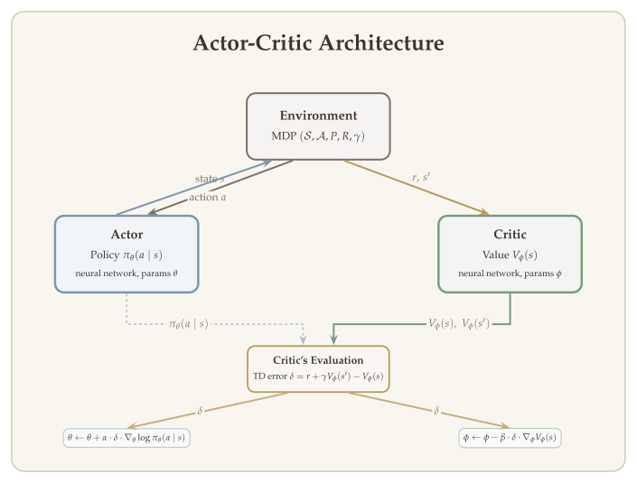

In previous lectures, we developed the theoretical foundations of reinforcement learning --- value iteration, policy iteration, Q-learning, and policy gradient methods --- all under the assumption that we can represent value functions and policies exactly, whether via tables or linear function approximation. In practice, the state and action spaces of real-world problems (robotic control, game playing, autonomous driving) are far too large for exact representation. Deep reinforcement learning bridges this gap by using neural networks as powerful function approximators for both value functions and policies.

This lecture covers the most important deep RL algorithms, divided into two families: **value-based methods** (DQN, DDPG, TD3, SAC) that learn Q-functions and derive policies from them, and **policy-based methods** (Actor-Critic with neural networks, A2C, PPO) that directly optimize parameterized policies. Along the way, we will see how practical engineering innovations --- experience replay, target networks, clipped objectives --- are essential to making these algorithms work.

::: {.callout-important}
## The Central Question
*How can we scale reinforcement learning to high-dimensional, continuous state and action spaces using deep neural networks as function approximators?*
:::

## What Will Be Covered {#sec-overview}

- **Value-based methods**
  - Deep Q-Networks (DQN) and variants
  - Deep Deterministic Policy Gradient (DDPG) and TD3
  - Soft Actor-Critic (SAC)
- **Policy-based methods**
  - Actor-Critic with neural networks
  - Advantage Actor-Critic (A2C)
  - Proximal Policy Optimization (PPO)


## Part (a): Value-Based Methods {#sec-value-based}

Value-based deep RL methods approximate the optimal Q-function $Q^*$ using neural networks and derive policies greedily from the learned Q-values. We begin with DQN for discrete action spaces, then extend to continuous actions via DDPG, TD3, and SAC.

### Deep Q-Networks (DQN) {#sec-dqn}

#### Recall: Least-Squares Value Iteration {#sec-lsvi-recall}

To motivate DQN, we first recall **least-squares value iteration (LSVI)**, which performs approximate planning using a function class $\mathcal{F}$. Consider the offline setting with a sampling distribution $\rho$.

::: {.callout-note}
## Algorithm: Fitted Q-Iteration (FQI)

**Initialize** $Q^{(0)} \in \mathcal{F}$.

**For** $k = 1, 2, \ldots, K$:

1. **Collect** an offline dataset $\mathcal{D}^{(k)}$ consisting of $N$ transition tuples:
$$
\mathcal{D}^{(k)} = \bigl\{ (s_i, a_i, r_i, s_i') : (s_i, a_i) \sim \rho, \; (r_i, s_i') \text{ are reward and next state given } (s_i, a_i) \bigr\}.
$$

2. **Define Bellman target:**
$$
y_i = r_i + \gamma \cdot \max_{a'} Q^{(k-1)}(s_i', a').
$$ {#eq-fqi-target}

3. **Update Q-function:**
$$
Q^{(k)} = \operatorname*{argmin}_{f \in \mathcal{F}} \sum_{i=1}^{N} \bigl[ y_i - f(s_i, a_i) \bigr]^2.
$$ {#eq-fqi-update}

4. **Return policy** $\widehat{\pi} = \text{greedy}(\widehat{Q}^{(K)})$.

This algorithm is also known as **fitted Q-iteration (FQI)**.
:::

FQI provides the conceptual backbone for DQN. The key idea is to iteratively regress Q-values onto Bellman targets computed from the previous iterate. DQN adapts this framework to the online, neural-network setting with several crucial modifications.

{#fig-dqn-pipeline width="90%"}

#### From FQI to DQN {#sec-fqi-to-dqn}

FQI is the backbone of the **deep Q-network (DQN)** algorithm. DQN has a few particular modifications and differences:

**1. Experience Replay.** The offline dataset is not collected from a fixed policy. Instead, we store past experiences in a **replay buffer** (memory) as the dataset. The experiences are collected by running an $\varepsilon$-greedy policy (or other exploration methods) with respect to the current Q-function (Q-network). To update the Q-function, we sample transition tuples from the memory. This is known as **experience replay**.

Why experience replay? It allows us to separate training (updating the Q-network) from data collection. When data collection is slow, we can run multiple environments to collect data and save to a shared memory. This is justified by the separation between planning and estimation errors.

::: {.callout-tip}
## Remark: Experience Replay Buffer

The replay buffer stores $N$ transition tuples $(s, a, r, \text{done}, s')$. New transitions are added on the left and old transitions are removed on the right (FIFO). To form a training batch, we **sample randomly** from the buffer to construct mini-batches. This random sampling breaks temporal correlations between consecutive transitions and provides i.i.d.-like training data for the neural network.
:::

**2. Neural network function class.** $\mathcal{F}$ is a class of neural networks. The neural network least-squares problem
$$
\min_{f_\theta \in \mathcal{F}_{\text{NN}}} \sum_{(s,a,r,s') \in \mathcal{D}} \bigl( y - f_\theta(s, a) \bigr)^2
$$
is trained via **mini-batch stochastic gradient descent**:
$$
\text{grad} = \bigl( y - f_\theta(s, a) \bigr) \cdot \nabla_\theta f_\theta(s, a).
$$ {#eq-dqn-gradient}

**3. Target network.** The target $y$ is computed based on a **target network** $f_{\theta_{\text{tgt}}}$. The target network $f_{\theta_{\text{tgt}}}$ and the Q-network $f_\theta$ have the same architecture but different weights. The target network parameters $\theta_{\text{tgt}}$ are **fixed** when training $f_\theta$. Then we set $\theta_{\text{tgt}} = \theta$ when the Q-network has been trained for a large number of iterations, and repeat.

The overall DQN training loop works as follows:

- Multiple environments run the $\varepsilon$-greedy policy with respect to $f_\theta$, saving data to the **replay buffer**.
- Training data is sampled from the replay buffer and used to update the Q-network via SGD:
$$
\theta \leftarrow \theta - \alpha \bigl[ \bigl( y - f_\theta(s, a) \bigr) \cdot \nabla_\theta f_\theta(s, a) \bigr],
$$ {#eq-dqn-sgd}
where $y = r + \gamma \cdot \max_{a'} f_{\theta_{\text{tgt}}}(s', a')$.
- The **target network** $f_{\theta_{\text{tgt}}}$ is periodically copied from the Q-network.

#### From Q-Table to DQN {#sec-q-table-to-dqn}

In tabular Q-learning, the Q-function is stored as a table mapping each (state, action) pair to a value. In DQN, a neural network $Q_\theta : \mathcal{S} \to \mathbb{R}^{|\mathcal{A}|}$ takes a state as input and outputs Q-values for **all actions simultaneously**. This architecture only works for **discrete** action spaces (e.g., Atari games), where the network outputs one Q-value per action.

#### Q-Network and Target Network {#sec-q-target-network}

The relationship between the Q-network and the target network is:

- The **target network** is used to calculate target values, which are used to compute the loss for the Q-network.
- The **Q-network** is updated using gradient methods with respect to the least-squares loss.
- The **target network is fixed for $T_{\text{target}}$ steps** when training the Q-network.
- After every $T_{\text{target}}$ gradient descent steps, **update the target network using the Q-network**.

::: {.callout-tip}
## Remark: States in Atari Games

For Atari games, the state representation involves two preprocessing steps:

1. **Preprocess the input:** Reduce the state space to $84 \times 84$ and convert to grayscale. This reduces the three color channels (RGB) to 1.

2. **Stack four frames together as a state.** This handles the problem of temporal limitation. With a single frame, we cannot tell where the ball is moving; with multiple frames, the direction of motion becomes apparent.
:::

#### Code: Training the Q-Network {#sec-dqn-code}

The following code (from Stable-Baselines3/DQN) illustrates the core training loop:

```python
for _ in range(gradient_steps):
    # Sample replay buffer
    replay_data = self.replay_buffer.sample(batch_size, env=self._vec_normalize_env)

    with th.no_grad():
        # Compute the next Q-values using the target network
        next_q_values = self.q_net_target(replay_data.next_observations)
        # Follow greedy policy: use the one with the highest value
        next_q_values, _ = next_q_values.max(dim=1)
        # Avoid potential broadcast issue
        next_q_values = next_q_values.reshape(-1, 1)
        # 1-step TD target
        target_q_values = replay_data.rewards + (1 - replay_data.dones) * self.gamma * next_q_values

    # Get current Q-values estimates
    current_q_values = self.q_net(replay_data.observations)

    # Retrieve the q-values for the actions from the replay buffer
    current_q_values = th.gather(current_q_values, dim=1, index=replay_data.actions.long())

    # Compute Huber loss (less sensitive to outliers)
    loss = F.smooth_l1_loss(current_q_values, target_q_values)

    # Optimize the policy
    self.policy.optimizer.zero_grad()
    loss.backward()
```

#### Improvement: Addressing Over-Estimation {#sec-over-estimation}

A well-known issue with DQN is **over-estimation** of Q-values. When computing the target value, we use
$$
y = r + \gamma \cdot \max_{a} Q_{\text{tgt}}(s', a),
$$
where $(s, a, r, s') \sim \text{replay memory}$. Here $Q_{\text{tgt}}$ is an estimator of $Q^*$. When $Q_{\text{tgt}}$ has estimation error, taking $\max_a$ will lead to a **maximization bias**.

::: {.callout-tip}
## Remark: Maximization Bias Experiment

Consider a simple experiment illustrating maximization bias:

- $\mathcal{A} = 100$ actions, with a random reward function $R \in \mathbb{R}^{100}$ where $R \sim \text{Unif}([0, 1])^{\otimes 100}$.
- Observed rewards: $r \sim \mathcal{N}(R, I)$ (Gaussian noise).

**Method 1 (Vanilla):** Use all data to estimate $R$ (as $\widehat{R}$). Estimate $\max_a R(a)$ by $\max_a \widehat{R}(a)$.

**Method 2 (Split):** Split data and construct two estimators $\widehat{R}_1, \widehat{R}_2$. Let $\widehat{a} = \operatorname*{argmax}_a \widehat{R}_1(a)$, then use estimator $\widehat{R}_2(\widehat{a})$.

Repeating 100 times, the vanilla method consistently **overestimates** the true maximum, while the split method is centered around zero error. This demonstrates that using the same data to both select and evaluate the best action introduces systematic upward bias.
:::

#### Double DQN (DDQN) {#sec-ddqn}

To mitigate over-estimation, **Double DQN** decouples action selection from action evaluation:

**DQN target** (when sampling $(s, a, r, s')$ from buffer):
$$
y = r + \gamma \cdot \max_{a} Q_{\text{tgt}}(s', a).
$$ {#eq-dqn-target}

**DDQN target** (when sampling $(s, a, r, s')$ from buffer):
$$
\widetilde{a} = \operatorname*{argmax}_{a} Q_{\text{network}}(s', a), \qquad y = r + \gamma \cdot Q_{\text{tgt}}(s', \widetilde{a}).
$$ {#eq-ddqn-target}

The key difference is that DDQN uses the **current Q-network** to select the best action (compute the argmax) and then **plugs in the argmax to the target network** to get the target value. This separation reduces the maximization bias.

The loss remains:
$$
\text{Loss}(Q_{\text{network}}) = \bigl( y - Q_{\text{network}}(s, a) \bigr)^2.
$$


### Deep Deterministic Policy Gradient (DDPG) {#sec-ddpg}

#### Motivation: Extending DQN to Continuous Actions {#sec-ddpg-motivation}

DQN only works for discrete action spaces because it requires computing $\max_a Q(s, a)$ over all actions, which is feasible only when $|\mathcal{A}|$ is finite. DDPG (and its improvement TD3) is a popular method for **robotic control** and other continuous-action tasks.

Although there is "policy gradient" in the name, DDPG is fundamentally a **value-based** algorithm because it tries to solve the Bellman equation:
$$
Q^*(s, a) = R(s, a) + \gamma \cdot \mathbb{E}_{s'} \Bigl[ \max_{a' \in \mathcal{A}} Q^*(s', a') \Bigr].
$$ {#eq-bellman-continuous}

Here, $\max_{a \in \mathcal{A}}$ is hard to compute because $\mathcal{A}$ is continuous. The key idea is to **train another network to compute $\operatorname*{argmax}_a Q(s, a)$**.

#### Actor and Critic Networks {#sec-actor-critic-networks}

Similar to DQN:

1. We use a neural network to approximate $Q^*$ (the **critic**).
2. We use a target network to transform solving the Bellman equation into a regression problem: $[y - Q(s,a)]^2$, where $y$ is computed based on $(r, s')$ and the target network.

The ideal target value is $y = r + \max_{a'} Q_{\text{tgt}}(s', a')$, but we cannot compute this max over a continuous action space. DDPG proposes to use an **actor network** (policy) to approximate $\operatorname*{argmax}_a Q_{\text{tgt}}(s, a)$.

The algorithm uses neural networks to represent both the policy and the value function, and thus falls in the **actor-critic framework**. We call the Q-function the **critic** and the policy $\mu$ the **actor**.

- **Critic network:** Maps $(\text{state}, \text{action}) \in \mathbb{R}^{d_s} \times \mathbb{R}^{d_a}$ to $Q(s, a) \in \mathbb{R}$.
- **Actor network:** Maps $\text{state} \in \mathbb{R}^{d_s}$ to $\text{action} \in \mathbb{R}^{d_a}$.

Each actor network represents a **deterministic policy**.

The goal is:

- **Actor** $= \operatorname*{argmax}_a$ **Critic**
- **Critic** $=$ Solution to the Bellman equation

#### Four Networks in DDPG {#sec-ddpg-four-networks}

With target networks, there are **4 networks** in total:

| Network | Notation | Parameterization |
|---------|----------|-----------------|
| Critic network | $Q: \mathcal{S} \times \mathcal{A} \to \mathbb{R}$ | $Q(s, a;\, \theta_Q)$ |
| Critic target network | $Q': \mathcal{S} \times \mathcal{A} \to \mathbb{R}$ | $Q'(s, a;\, \theta_{Q'})$ |
| Actor network | $\mu: \mathcal{S} \to \mathcal{A}$ | $\mu(s;\, \theta_\mu)$ |
| Actor target network | $\mu': \mathcal{S} \to \mathcal{A}$ | $\mu'(s;\, \theta_{\mu'})$ |

The goals are:
$$
\mu(s) = \operatorname*{argmax}_a Q(s, a), \qquad \mu'(s) = \operatorname*{argmax}_a Q'(s, a),
$$
and
$$
Q(s, a) = R(s, a) + \mathbb{E}_{s'} \bigl[ Q'(s', \mu'(s')) \bigr].
$$ {#eq-ddpg-bellman}

#### Loss Functions {#sec-ddpg-loss}

When target networks $\mu', Q'$ are given, and a transition $(s, a, r, s')$ is sampled from the replay buffer $\mathcal{D}$ (where $a$ is the action stored in the buffer, i.e., the action taken previously at state $s$):

**Critic loss** (least-squares loss function):
$$
y = r + \gamma \cdot Q'(s', \mu'(s')), \qquad L_C(Q) = \bigl( y - Q(s, a) \bigr)^2.
$$ {#eq-ddpg-critic-loss}

The parameter $\theta_Q$ is updated using $\nabla L_C(Q)$. Note that target networks are used in computing $y$.

**Actor loss** (maximize Q-value):
$$
L_A(\mu) = -Q(s, \mu(s)).
$$ {#eq-ddpg-actor-loss}

The parameter $\theta_\mu$ is updated using $\nabla L_A(\mu)$.

#### Update Target Networks {#sec-ddpg-target-update}

Target networks track the actor and critic networks **smoothly** via soft updates at each iteration:
$$
\theta_{Q'} \leftarrow (1 - \tau) \cdot \theta_{Q'} + \tau \cdot \theta_Q, \qquad \theta_{\mu'} \leftarrow (1 - \tau) \cdot \theta_{\mu'} + \tau \cdot \theta_\mu,
$$ {#eq-ddpg-soft-update}

where $\tau$ is a very small number (e.g., $0.005$).

::: {.callout-tip}
## Remark: Soft Update

DQN can also use this soft update method for its target network. With soft updates, the target network does not change very much after each iteration, providing more stable training targets compared to the periodic hard copy used in the original DQN.
:::

#### Exploration in DDPG {#sec-ddpg-exploration}

The actor network $\mu$ is deployed in the environment and generates data stored in the memory buffer. To explore the environment, we directly add Gaussian noise to $\mu(s)$ and clip it to the range of $\mathcal{A}$:
$$
a = \text{Clip}_{\mathcal{A}} \bigl[ \mu(s) + \xi \bigr], \qquad \xi \sim \mathcal{N}(0, \sigma^2).
$$ {#eq-ddpg-exploration}


### Twin Delayed DDPG (TD3) {#sec-td3}

TD3 is an improved version of DDPG with **3 modifications**:

1. **Twinning:** TD3 uses **two sets of target critic networks** $Q_1'$ and $Q_2'$ to reduce over-estimation.

2. **Delayed update:** The actor $\mu$ is not updated in each step. Rather, $\mu$ is updated every $N$ steps (e.g., $N = 2$).

3. **Noise smoothing in target computation:**
$$
\widetilde{a}' = \text{Clip}_{\mathcal{A}} \bigl[ \mu'(s') + \varepsilon \bigr], \qquad \varepsilon \sim \mathcal{N}(0, \sigma^2) \text{ (a small Gaussian noise)}.
$$ {#eq-td3-noise}

#### TD3 Updates {#sec-td3-updates}

We have **6 networks** in total: $(\mu, Q_1, Q_2)$ and $(\mu', Q_1', Q_2')$.

With $(s, a, r, s')$, the target value is computed as follows:

1. Add noise to smooth $\mu'$:
$$
\widetilde{a}' = \text{Clip}_{\mathcal{A}} \bigl( \mu'(s') + \varepsilon \bigr).
$$ {#eq-td3-smoothed-action}

2. Take the minimum of the two target critics (the "min" reduces over-estimation):
$$
y = r + \gamma \cdot \min \bigl\{ Q_1'(s', \widetilde{a}'), \; Q_2'(s', \widetilde{a}') \bigr\}.
$$ {#eq-td3-target}

**Loss of $Q_1$ and $Q_2$:**
$$
L_C(Q_1) = \bigl( y - Q_1(s, a) \bigr)^2, \qquad L_C(Q_2) = \bigl( y - Q_2(s, a) \bigr)^2.
$$ {#eq-td3-critic-loss}

**Loss of $\mu$** (computed only every $N$ steps):
$$
L_A(\mu) = -Q_1(s, \mu(s)),
$$ {#eq-td3-actor-loss}
or alternatively $L_A(\mu) = -\min \bigl\{ Q_1(s, \mu(s)), \; Q_2(s, \mu(s)) \bigr\}$.

**Update of target networks** (soft update):
$$
\theta_{Q_1'} \leftarrow (1 - \tau) \, \theta_{Q_1'} + \tau \, \theta_{Q_1}, \qquad \theta_{Q_2'} \leftarrow (1 - \tau) \, \theta_{Q_2'} + \tau \, \theta_{Q_2}, \qquad \theta_{\mu'} \leftarrow (1 - \tau) \, \theta_{\mu'} + \tau \, \theta_\mu.
$$ {#eq-td3-soft-update}


### Soft Actor-Critic (SAC) {#sec-sac}

#### Motivation and Softmax Bellman Equation {#sec-sac-motivation}

**Soft Actor-Critic (SAC)** is very similar to TD3 and it tries to solve the **softmax Bellman equation** (the optimality equation of entropy-regularized RL). It uses the trick of using two target networks to reduce over-estimation. But it does **not** use action noise to explore, because:

1. The policy $\pi$ in SAC is **stochastic**.
2. Entropy regularization encourages $\pi$ to be stochastic.

SAC can be used for both **discrete** and **continuous** action spaces.

The **softmax Bellman equation** is:
$$
V^*(s) = \beta \cdot \log \Bigl( \int \exp\bigl( \tfrac{1}{\beta} \cdot Q^*(s, a) \bigr) \, da \Bigr),
$$
$$
Q^*(s, a) = R(s, a) + \gamma \cdot \mathbb{E}_{s'} \bigl[ V^*(s') \bigr],
$$
$$
\pi^*(a \mid s) \propto \exp\bigl( \tfrac{1}{\beta} \cdot Q^*(s, a) \bigr).
$$ {#eq-softmax-bellman}

#### Equivalent Form {#sec-sac-equivalent}

The softmax Bellman equation can be equivalently written as:
$$
V^*(s) = \mathbb{E}_{a \sim \pi^*} \bigl[ Q^*(s, a) - \beta \cdot \log \pi^*(a \mid s) \bigr],
$$
$$
Q^*(s, a) = R(s, a) + \mathbb{E}_{s', a' \sim \pi^*} \bigl[ Q^*(s', a') - \beta \cdot \log \pi^*(a' \mid s') \bigr],
$$
$$
\pi^*(a \mid s) \propto \exp\bigl( \tfrac{1}{\beta} \cdot Q^*(s, a) \bigr).
$$ {#eq-sac-equivalent}

The optimal policy $\pi^*(\cdot \mid s)$ is the solution to:
$$
\max_\pi \; \mathbb{E}_{a \sim \pi} \bigl[ Q^*(s, a) - \beta \cdot \log \pi(a \mid s) \bigr].
$$ {#eq-sac-greedy}

This defines a new "greedy" policy by solving the entropy-regularized problem with respect to the Q-network. Using the Bellman equation, the critic $\pi$ enters the Bellman target.

#### Loss Functions of SAC {#sec-sac-loss}

Sample $(s, a, r, s')$ from the replay buffer. Let $\pi, Q_1, Q_2$ be the actor and critics, and $\pi', Q_1', Q_2'$ be the target networks.

**Target value:**

1. Sample $a' \sim \pi(\cdot \mid s')$.
2. Compute:
$$
y = r + \gamma \cdot \min \bigl\{ Q_1'(s', a') - \beta \log \pi(a' \mid s'), \; Q_2'(s', a') - \beta \log \pi(a' \mid s') \bigr\}.
$$ {#eq-sac-target}

**Critic loss:**
$$
L(Q_1) = \bigl( y - Q_1(s, a) \bigr)^2, \qquad L(Q_2) = \bigl( y - Q_2(s, a) \bigr)^2.
$$ {#eq-sac-critic-loss}

**Actor loss** (sample $\widetilde{a} \sim \pi(\cdot \mid s)$):
$$
L(\pi) = -\bigl( Q_1(s, \widetilde{a}) - \beta \cdot \log \pi(\widetilde{a} \mid s) \bigr),
$$ {#eq-sac-actor-loss}
or alternatively:
$$
L(\pi) = -\Bigl( \min \bigl\{ Q_1(s, \widetilde{a}), \; Q_2(s, \widetilde{a}) \bigr\} - \beta \cdot \log \pi(\widetilde{a} \mid s) \Bigr).
$$

**Update target networks:** Soft update (same as DDPG/TD3).

**Exploration (generate data):** Take actions according to the stochastic policy $\pi$ (no added noise needed).

#### Constructing Actor and Critic Networks {#sec-sac-networks}

We want $\pi(a \mid s)$ to be a neural-network-based probability distribution.

**Continuous $\mathcal{A}$:**

- **Critic:** $Q: \mathcal{S} \times \mathcal{A} \to \mathbb{R}$ is a standard neural network.
- **Actor:** Uses the **reparameterization trick**:
$$
\pi_\theta(\cdot \mid s) \sim \mathcal{N}\bigl( \mu_\theta(s), \; \sigma_\theta^2(s) \cdot I \bigr),
$$ {#eq-sac-reparam}
where $\mu_\theta: \mathcal{S} \to \mathbb{R}^{d_a}$ and $\sigma_\theta: \mathcal{S} \to \mathbb{R}$ are neural networks. Equivalently:
$$
a = \mu_\theta(s) + \sigma_\theta(s) \cdot \zeta, \qquad \zeta \sim \mathcal{N}(0, I).
$$

If $\mathcal{A}$ is bounded (e.g., $\mathcal{A} = [-1, 1]$), we can define:
$$
a = \tanh\bigl( \mu_\theta(s) + \sigma_\theta(s) \cdot \zeta \bigr), \qquad \tanh(x) = \frac{e^x - e^{-x}}{e^x + e^{-x}}.
$$

**Discrete $\mathcal{A}$:**

- **Critic:** $Q: \mathcal{S} \to \mathbb{R}^{|\mathcal{A}|}$ is a neural network (same architecture as DQN).
- **Actor:** $\pi(a \mid s) = \text{Softmax}\bigl( f_\theta(s, a) \bigr)$, where $f_\theta: \mathcal{S} \to \mathbb{R}^{|\mathcal{A}|}$ is a neural network that outputs **logits**.


### Comparison of Value-Based Methods {#sec-value-based-comparison}

The following table compares all value-based deep RL methods along five key dimensions: how data is collected, what networks are trained, the loss functions used, and how targets are stabilized.

| | **DQN** | **DDPG** | **TD3** | **SAC** |
|:---|:---|:---|:---|:---|
| **Data** | Replay buffer; $\varepsilon$-greedy | Replay buffer; actor + noise | Replay buffer; actor + noise | Replay buffer; stochastic $\pi$ |
| **Networks** | $Q_\theta$, $Q_{\theta^-}$ | $\mu_\theta$, $Q_\phi$, $\mu'$, $Q'$ | $\mu$, $Q_1$, $Q_2$, $\mu'$, $Q_1'$, $Q_2'$ | $\pi_\theta$, $Q_1$, $Q_2$, $Q_1'$, $Q_2'$ |
| **Critic loss** | $(y - Q_\theta(s,a))^2$ | $(y - Q_\phi(s,a))^2$ | $(y - Q_i(s,a))^2$, $i{=}1,2$ | $(y - Q_i(s,a))^2$, $i{=}1,2$ |
| **Target $y$** | $r + \gamma \max_{a'} Q_{\theta^-}$ | $r + \gamma \, Q'(s', \mu'(s'))$ | $r + \gamma \min_i Q_i'(s', \widetilde{a}')$ | $r + \gamma [\min_i Q_i' - \alpha \log \pi]$ |
| **Actor loss** | N/A (greedy) | $-Q_\phi(s, \mu_\theta(s))$ | $-Q_1(s, \mu_\theta(s))$ | $-[Q(s, \widetilde{a}) - \alpha \log \pi]$ |
| **Target update** | Hard copy (periodic) | Soft ($\tau \approx 0.005$) | Soft | Soft |
| **Overestimation fix** | (Double DQN variant) | None | Twin critics + min | Twin critics + min |
| **Actions** | Discrete | Continuous | Continuous | Both |

: Comparison of value-based deep RL methods. {#tbl-value-based-comparison .striped .hover}


## Part (b): Policy-Based Methods {#sec-policy-based}

Policy-based methods directly optimize a parameterized policy $\pi_\theta$ using gradient ascent on the expected return. Combined with a learned value function (the critic), these become **actor-critic** methods. We cover Actor-Critic with neural networks, Advantage Actor-Critic (A2C), and Proximal Policy Optimization (PPO).

### Actor-Critic with Neural Networks {#sec-ac-nn}

#### Policy Gradient Theorem {#sec-pg-theorem}

Let $\pi_\theta: \mathcal{S} \to \Delta(\mathcal{A})$ be a stochastic policy with parameter $\theta$. Consider $J(\pi_\theta)$ as a function of $\theta$, where $R(\tau) = \sum_{t=0}^{\infty} \gamma^t r_t$ is a random variable (the discounted return of a trajectory).

::: {#thm-policy-gradient}
## Policy Gradient Theorem

The policy gradient theorem states that:

**Form 1 (REINFORCE):**
$$
\nabla_\theta J(\pi_\theta) = \mathbb{E}_{\tau \sim \pi_\theta} \Biggl[ R(\tau) \cdot \Biggl( \sum_{t=0}^{\infty} \nabla_\theta \log \pi_\theta(a_t \mid s_t) \Biggr) \Biggr].
$$ {#eq-pg-form1}

**Form 2 (with baseline):**
$$
\nabla_\theta J(\pi_\theta) = \mathbb{E}_{(s,a) \sim d_\mu^{\pi_\theta}} \bigl[ \bigl( Q^{\pi_\theta}(s, a) - b(s) \bigr) \cdot \nabla_\theta \log \pi_\theta(a \mid s) \bigr],
$$ {#eq-pg-form2}

where $b$ is any function of $s$. Taking $b = V^{\pi_\theta}$ gives:
$$
\nabla_\theta J(\pi_\theta) = \mathbb{E} \bigl[ A^{\pi_\theta}(s, a) \cdot \nabla_\theta \log \pi_\theta(a \mid s) \bigr].
$$ {#eq-pg-advantage}
:::

This theorem is fundamental to all policy gradient methods. It tells us that the gradient of the expected return has a simple form involving the log-probability of actions weighted by how good those actions are.

{#fig-policy-gradient-landscape width="80%"}

#### REINFORCE and Its Limitations {#sec-reinforce}

Based on Form 1, we get the **REINFORCE** algorithm: sample a trajectory $\{(s_t, a_t, r_t)\}_{t=0}^{T}$ and approximate the expectation by:
$$
\Biggl( \sum_{t=0}^{T} \nabla_\theta \log \pi_\theta(a_t \mid s_t) \Biggr) \cdot \Biggl( \sum_{t=0}^{T} \gamma^t r_t \Biggr).
$$

This approach suffers from **high variance**, because we sample a dependent trajectory, and $\sum_{t=0}^{T} \nabla_\theta \log \pi_\theta(a_t \mid s_t)$ might have a large variance.

#### Actor-Critic Methods {#sec-ac-methods}

{#fig-actor-critic width="80%"}

To reduce variance, actor-critic methods use:
$$
\nabla_\theta J(\pi_\theta) = \mathbb{E}_{s, a \sim d_\mu^{\pi_\theta}} \bigl[ \nabla_\theta \log \pi_\theta(a \mid s) \cdot Q^{\pi_\theta}(s, a) \bigr],
$$ {#eq-ac-gradient}
and use data to **estimate** $Q^{\pi_\theta}$.

**How to estimate $Q^{\pi_\theta}$? Temporal difference learning.**

- At current critic $Q_\phi: \mathcal{S} \times \mathcal{A} \to \mathbb{R}$:
- Draw sample $(s, a, r, s', a')$ where $a \sim \pi_\theta(\cdot \mid s)$ and $a' \sim \pi_\theta(\cdot \mid s')$.
- TD target: $y = r + Q_\phi(s', a')$.
- Loss: $L(\phi) = (y - Q_\phi(s, a))^2$.
- Update: $\phi \leftarrow \phi - \alpha \cdot \nabla L(\phi)$.

::: {.callout-tip}
## Remark: On-Policy vs. Off-Policy

Here, we do not use a target network. TD learning here is an **on-policy** algorithm.

- **On-policy:** Evaluating $\pi$ using data sampled from $\pi$.
- **Off-policy:** Estimating $Q^\pi$ without using data from $\pi$.

DQN is off-policy because we do not have data from $\pi^*$. In actor-critic, when evaluating $\pi_\theta$ (estimating $Q^{\pi_\theta}$), we do not necessarily need experience replay. We can use a target network, but experience replay is not needed.
:::

#### Policy Network and Value Network {#sec-policy-value-network}

To implement actor-critic methods with neural networks, we need to specify the network architectures for the policy (actor) and value function (critic). We first recall the relationship between $V^\pi$ and $Q^\pi$.

::: {#def-state-value}
## State-Value Function

$$V_\pi(s) = \sum_a \pi(a \mid s) \cdot Q_\pi(s, a).$$ {#eq-state-value}
:::

In practice, both the policy and value function are represented as neural networks, which are trained end-to-end.

::: {#def-function-approx}
## Function Approximation Using Neural Networks

- Approximate the policy function $\pi(a \mid s)$ by $\pi(a \mid s; \boldsymbol{\theta})$ (**actor**).
- Approximate the value function $Q_\pi(s, a)$ by $q(s, a; \mathbf{w})$ (**critic**).
:::

#### Training {#sec-ac-training}

**Update the policy network (actor) by policy gradient:**

- Seek to increase state-value: $V(s; \boldsymbol{\theta}, \mathbf{w}) = \sum_a \pi(a \mid s; \boldsymbol{\theta}) \cdot q(s, a; \mathbf{w})$.
- Compute policy gradient:
$$
\frac{\partial V(s; \boldsymbol{\theta})}{\partial \boldsymbol{\theta}} = \mathbb{E}_A \biggl[ \frac{\partial \log \pi(A \mid s, \boldsymbol{\theta})}{\partial \boldsymbol{\theta}} \cdot q(s, A; \mathbf{w}) \biggr].
$$ {#eq-ac-policy-gradient}
- Perform gradient ascent.

**Update the value network (critic) by TD learning:**

- Predicted action-value: $q_t = q(s_t, a_t; \mathbf{w})$.
- TD target: $y_t = r_t + \gamma \cdot q(s_{t+1}, a_{t+1}; \mathbf{w})$.
- Gradient:
$$
\frac{\partial (q_t - y_t)^2 / 2}{\partial \mathbf{w}} = (q_t - y_t) \cdot \frac{\partial \, q(s_t, a_t; \mathbf{w})}{\partial \mathbf{w}}.
$$ {#eq-ac-critic-gradient}
- Perform gradient descent.


### Advantage Actor-Critic (A2C) {#sec-a2c}

#### Policy Gradient with TD Error {#sec-pg-td-error}

The policy gradient theorem can be rewritten as:
$$
\nabla_\theta J(\pi_\theta) = \mathbb{E}_{(s,a) \sim d_\mu^{\pi_\theta}} \bigl[ \nabla_\theta \log \pi_\theta(a \mid s) \cdot A^{\pi_\theta}(s, a) \bigr].
$$ {#eq-pg-advantage-form}

Intuitively, estimating the **advantage** is better than estimating $Q^{\pi_\theta}$ because the advantage is centered:
$$
\sum_a A^{\pi_\theta}(s, a) \cdot \pi_\theta(a \mid s) = 0.
$$

But how to estimate $A^{\pi_\theta}$? One could estimate $Q^{\pi_\theta}$ and $V^{\pi_\theta}$ separately, but a better method is to use a **single value function** $V^{\pi_\theta}$ and notice that:
$$
\nabla_\theta J(\pi_\theta) = \mathbb{E}_{(s,a) \sim d_\mu^{\pi_\theta}} \Bigl[ \nabla_\theta \log \pi_\theta(a \mid s) \cdot \bigl( r + \gamma \cdot V^{\pi_\theta}(s') - V^{\pi_\theta}(s) \bigr) \Bigr],
$$ {#eq-a2c-td-error}

where $r + \gamma \cdot V^{\pi_\theta}(s') - V^{\pi_\theta}(s)$ is the **TD error**. This works because:
$$
\mathbb{E} \bigl[ r + \gamma \cdot V^{\pi_\theta}(s') - V^{\pi_\theta}(s) \;\big|\; s_t = s, \, a_t = a \bigr] = A^{\pi_\theta}(s, a).
$$

#### The A2C Algorithm {#sec-a2c-algorithm}

This leads to the **Advantage Actor-Critic (A2C)** algorithm:

::: {.callout-note}
## Algorithm: A2C

**Step 1.** Estimate $V^{\pi_\theta}$ using on-policy TD learning (using critic network $V_\phi$):

- TD target: $y = r + \gamma \cdot V_\phi(s')$.
- Loss: $(y - V_\phi(s_t))^2$.
- Gradient for $\phi$: $(y - V_\phi(s)) \cdot \nabla_\phi V_\phi(s)$.

**Step 2.** Update $\pi_\theta$ using $[\text{TD error}] \times [\nabla_\theta \log \pi_\theta(a_t \mid s_t)]$:

- Gradient for $\theta$: $(r + \gamma \cdot V_\phi(s') - V_\phi(s)) \cdot \nabla_\theta \log \pi_\theta(a \mid s)$.
- Actor loss: $(r + \gamma \cdot V(s') - V(s)) \cdot \log \pi_\theta(a \mid s)$.

This is an **on-policy** algorithm with data collected using $\pi_\theta$: $(s, a, r, s') \sim \pi_\theta$.
:::

::: {.callout-tip}
## Remark: Implementation Details

In terms of implementation, we roll out multiple trajectories using $\pi_\theta$, and use these trajectories (rollout buffer) as a batch to compute the actor and critic losses, and corresponding gradients. Then update $\theta$ and $\phi$. The buffer size equals $n_{\text{steps}} \times n_{\text{envs}}$, and the batch size equals the buffer size --- all data in the rollout buffer is used for computing the gradient.
:::

#### Bias-Variance Tradeoff in Policy Evaluation {#sec-bias-variance}

**TD learning (TD(0)):** Uses $r_t + V(s_{t+1})$ to estimate $V^\pi(s_t)$.

- **Biased estimator** because $\mathbb{E}(r_t + V(s_{t+1})) = T^\pi V \neq V^\pi$ (unless $V = V^\pi$).
- **Low variance** because $V$ is a fixed function; randomness only comes from a single transition.

**Monte Carlo (TD(1)):** Uses $\sum_{\ell \geq t} \gamma^{\ell - t} r_\ell$ to estimate $V^\pi(s_t)$.

- **Unbiased estimator.**
- **High variance** because randomness comes from the whole trajectory.

How to strike a balance? **$N$-step lookahead.**

#### Extension: $N$-Step Lookahead {#sec-n-step}

In the previous A2C algorithm, we use the following properties:
$$
\mathbb{E} \bigl[ r_t + \gamma \cdot V^{\pi_\theta}(s_{t+1}) \mid s_t = s, \, a_t = a \bigr] = A^{\pi_\theta}(s, a), \quad \forall \, s, a,
$$
$$
\mathbb{E} \bigl[ r_t + \gamma \cdot V^{\pi_\theta}(s_{t+1}) - V^{\pi_\theta}(s_t) \mid s_t = s \bigr] = 0, \quad \forall \, s.
$$

The first property leads to the actor update (TD error $\times$ $\nabla \log \pi$), and the second leads to the critic update (TD learning).

The $N$-step return interpolates between the single-step TD target ($N = 1$) and the full Monte Carlo return ($N = \infty$), offering a principled way to control the bias-variance tradeoff.

::: {#def-n-step-return}
## $N$-Step Return

In general, given a value function $V: \mathcal{S} \to \mathbb{R}$ and any integer $N$, let $(s_0, a_0, s_1, a_1, \ldots, s_T, a_T, \ldots)$ be a trajectory sampled from a policy $\pi$. Define the **$N$-step return**:
$$
G_t^{(N)} = r_t + \gamma \cdot r_{t+1} + \gamma^2 \cdot r_{t+2} + \cdots + \gamma^{N-1} \cdot r_{t+N-1} + V(s_{t+N}).
$$ {#eq-n-step-return}
:::

Key properties:

- If $V = V^\pi$, then $\mathbb{E}\bigl[ G_t^{(N)} \mid s_t = s, \, a_t = a \bigr] = Q^\pi(s, a)$ for all $N \geq 1$.
- Consider the equation $\mathbb{E}\bigl[ G_t^{(N)} \mid s_t = s \bigr] = V(s)$. This equation has a unique solution $V = V^\pi$.

#### Critic Loss with $N$-Step Returns {#sec-n-step-critic}

**Critic loss:**
$$
y_t = G_t^{(N)}, \qquad \text{Loss}(V_\phi) = \sum_t \bigl( y_t - V_\phi(s_t) \bigr)^2.
$$ {#eq-n-step-critic-loss}

**Critic update direction:**
$$
\sum_t \bigl( y_t - V_\phi(s_t) \bigr) \cdot \nabla_\phi V_\phi(s_t),
$$
computed based on trajectories sampled from $\pi_\theta$.

::: {.callout-tip}
## Remark: How to Choose $N$?

- $N = 1$: Standard TD learning (called TD(0)).
- $N = \infty$: Monte Carlo sampling, where $G_t^\infty = \sum_{\ell \geq t} \gamma^{\ell - t} r_\ell$ (called TD(1)).

**TD($\lambda$):** Take a weighted sum over all $N$! Define the **$\lambda$-return**:
$$
G_t^\lambda = (1 - \lambda) \sum_{n=1}^{\infty} \lambda^{n-1} \cdot G_t^{(n)} = (1 - \lambda) \cdot \bigl( G_t^{(1)} + \lambda \cdot G_t^{(2)} + \cdots \bigr), \qquad \lambda \in (0, 1).
$$ {#eq-lambda-return}
:::

#### TD($\lambda$) for Critic Estimation {#sec-td-lambda}

The $\lambda$-return $G_t^\lambda$ satisfies:
$$
\mathbb{E}\bigl[ G_t^\lambda \mid s_t = s \bigr] = V(s) \quad \text{has solution} \quad V = V^\pi.
$$

Therefore, we can apply a TD learning algorithm with TD target $= G_t^\lambda$:

- Loss: $(G_t^\lambda - V_\phi(s_t))^2$.
- Update direction: $(G_t^\lambda - V_\phi(s_t)) \cdot \nabla_\phi V_\phi(s_t)$.

#### Generalized Advantage Estimation (GAE) {#sec-gae}

Using $\lambda$-return, if $V = V^\pi$ in the computation of $G_t^\lambda$, we have:
$$
\mathbb{E}\bigl[ G_t^\lambda - V^\pi(s_t) \mid s_t = s, \, a_t = a \bigr] = A^\pi(s, a).
$$ {#eq-gae-property}

Thus, we can use $G_t^\lambda - V(s_t)$ (computed using the current critic $V$) as an estimator of the advantage. This is called **Generalized Advantage Estimation (GAE)**.

**An equivalent computation of GAE.** Define the **single-step TD error**:
$$
\delta_t^V = r_t + V(s_{t+1}) - V(s_t).
$$ {#eq-td-error}

Then we can write:
$$
G_t^{(n)} - V(s_t) = \delta_t^V + \gamma \cdot \delta_{t+1}^V + \gamma^2 \cdot \delta_{t+2}^V + \cdots + \gamma^{n-1} \cdot \delta_{t+n-1}^V.
$$ {#eq-n-step-td-decomposition}

This follows from a telescoping argument:
$$
G_t^{(n)} - V(s_t) = \underbrace{r_t + \gamma V(s_{t+1}) - V(s_t)}_{\delta_t^V} + \gamma \cdot \bigl( G_{t+1}^{(n-1)} - V(s_{t+1}) \bigr),
$$
which by recursion gives $\delta_t^V + \gamma \cdot \delta_{t+1}^V + \cdots + \gamma^{n-1} \cdot \delta_{t+n-1}^V$.

Therefore:
$$
\text{GAE}_t^V = (1 - \lambda) \sum_{n=1}^{\infty} \lambda^{n-1} \bigl( G_t^{(n)} - V(s_t) \bigr) = \sum_{\ell=0}^{\infty} (\lambda \gamma)^\ell \cdot \delta_{t+\ell}^V.
$$ {#eq-gae-formula}

This is how GAE is implemented in practice.

**Practical implementation of GAE:**
$$
\text{GAE}_t^V \approx \sum_{\ell=t}^{T} (\gamma \lambda)^{\ell - t} \cdot \delta_\ell^V,
$$ {#eq-gae-practical}
where:

- $V$: current critic.
- $T$: horizon of episode (last step of trajectory).
- $\delta_\ell^V = \begin{cases} r_\ell + V(s_{\ell+1}) - V(s_\ell) & \text{if } \ell \neq T \text{ (not last step)}, \\ r_\ell - V(s_\ell) & \text{if } \ell = T \text{ (last step, i.e., "done")}. \end{cases}$

#### Implementation of GAE {#sec-gae-implementation}

The following code computes GAE by iterating backwards through the trajectory:

```python
advantages = np.zeros((self.n_workers, self.worker_steps), dtype=np.float32)
last_advantage = 0

last_value = values[:, -1]

for t in reversed(range(self.worker_steps)):
    mask = 1.0 - done[:, t]           # If "done" (t+1 = T), V(s_{t+1}) = 0
    last_value = last_value * mask
    last_advantage = last_advantage * mask

    delta = rewards[:, t] + self.gamma * last_value - values[:, t]

    last_advantage = delta + self.gamma * self.lambda_ * last_advantage

    advantages[:, t] = last_advantage

    last_value = values[:, t]

return advantages
```

#### Implementation of A2C in StableBaselines3 {#sec-a2c-implementation}

The StableBaselines3 implementation includes:

- Entropy regularization in the actor loss.
- Return and advantage values are computed in the **rollout buffer**.

The training function computes:

- **GAE computation** in the rollout buffer: iterates backwards, computing `delta = rewards[step] + gamma * next_values * next_non_terminal - values[step]` and accumulating `last_gae_lam = delta + gamma * gae_lambda * next_non_terminal * last_gae_lam`.
- **Returns:** `self.returns = self.advantages + self.values`.
- **Normalized advantage:** `advantages = (advantages - advantages.mean()) / (advantages.std() + 1e-8)`.
- **Policy gradient loss:** `policy_loss = -(advantages * log_prob).mean()`.
- **Value loss:** `value_loss = F.mse_loss(rollout_data.returns, values)`.
- **Entropy loss:** to favor exploration.
- **Total loss:** `loss = policy_loss + self.ent_coef * entropy_loss + self.vf_coef * value_loss`.


### Proximal Policy Optimization (PPO) {#sec-ppo}

#### Motivation: Soft Policy Iteration with Neural Networks {#sec-ppo-motivation}

Recall that the **performance difference lemma (PDL)** gives us the descent direction for policy optimization:
$$
J(\pi') - J(\pi) = \mathbb{E}_{(s,a) \sim d_\mu^{\pi'}} \bigl[ \langle Q^\pi(s, \cdot), \, \pi'(\cdot \mid s) - \pi(\cdot \mid s) \rangle_{\mathcal{A}} \bigr].
$$

Here, let $\pi = \pi_{\text{old}}$ (the current policy) and $\pi' = \pi_\theta$ (the new policy we want to optimize). Notice that $\langle Q^\pi(s, \cdot), \pi(\cdot \mid s) \rangle = V^\pi(s)$. We can equivalently write:
$$
J(\pi_\theta) - J(\pi_{\text{old}}) = \mathbb{E}_{(s,a) \sim d_\mu^{\pi_\theta}} \bigl[ A^{\pi_{\text{old}}}(s, a) \bigr].
$$ {#eq-pdl}

The idea of **soft policy iteration** is:

1. Estimate the update direction $A^{\pi_{\text{old}}}$ (via $Q^{\pi_{\text{old}}}$).
2. Move $\pi_\theta$ along the direction of $A^{\pi_{\text{old}}}$ (estimated) with a small stepsize ($\pi_{\text{new}} = \pi_{\text{old}} + \text{small step}$). For example, update using mirror descent.

#### From Soft Policy Iteration to PPO {#sec-soft-pi-to-ppo}

When we parameterize $\pi_\theta$ using a function (e.g., neural network), a challenge in implementing policy mirror descent is that we cannot update each $\pi(\cdot \mid s)$ separately. We can only construct a loss function:
$$
F(\theta) = \mathbb{E}_{(s,a) \sim d_\mu^{\pi_\theta}} \bigl[ A^{\pi_{\text{old}}}(s, a) \bigr].
$$

**Problem:** We do not have data from $d_\mu^{\pi_\theta}$ because we have not executed $\pi_\theta$ yet.

**Fix:** Approximate $F$ using **importance sampling**:
$$
L(\theta) = \mathbb{E}_{\substack{s \sim d_\mu^{\pi_{\text{old}}} \\ a \sim \pi_\theta(\cdot \mid s)}} \bigl[ A^{\pi_{\text{old}}}(s, a) \bigr] = \mathbb{E}_{(s,a) \sim d_\mu^{\pi_{\text{old}}}} \biggl[ \frac{\pi_\theta(a \mid s)}{\pi_{\text{old}}(a \mid s)} \cdot A^{\pi_{\text{old}}}(s, a) \biggr].
$$ {#eq-ppo-surrogate}

Here $L(\theta) \approx F(\theta)$ if $\pi_\theta$ and $\pi_{\text{old}}$ are close. This objective leads to **Proximal Policy Optimization (PPO)**.

#### The PPO Clipped Objective {#sec-ppo-clipped}

![The PPO clipped surrogate objective. Left: when the advantage A > 0 (good action), the objective rises linearly with the ratio r(theta) but is clipped flat when r > 1+e, preventing the policy from changing too much. Right: when A < 0 (bad action), the objective descends but is clipped flat when r < 1-e. In both cases, clipping ensures gradients vanish when the policy ratio leaves the trust region [1-e, 1+e].](figures/ppo-clipped-objective.svg){#fig-ppo-clipped width="80%"}

PPO updates $\pi_{\text{old}}$ using the gradient of a loss function that is similar to the importance-sampled surrogate. At the same time, we want to make sure $\pi_\theta$ and $\pi_{\text{old}}$ are close. To ensure this, we **clip the density ratio** and write:
$$
L^{\text{clip}}(\theta) = \mathbb{E}_{(s,a) \sim d_\mu^{\pi_{\text{old}}}} \Bigl[ \min \bigl\{ p(\theta; s, a) \cdot A^{\pi_{\text{old}}}(s, a), \; \text{Clip}\bigl( p(\theta; s, a), \, 1 - \varepsilon, \, 1 + \varepsilon \bigr) \cdot A^{\pi_{\text{old}}}(s, a) \bigr\} \Bigr],
$$ {#eq-ppo-clip}

where the **importance sampling ratio** is:
$$
p(\theta; s, a) = \frac{\pi_\theta(a \mid s)}{\pi_{\text{old}}(a \mid s)},
$$ {#eq-ppo-ratio}
and the clip function is:
$$
\text{Clip}(x, 1 - \varepsilon, 1 + \varepsilon) = \begin{cases} 1 - \varepsilon & \text{if } x \leq 1 - \varepsilon, \\ x & \text{if } x \in [1 - \varepsilon, 1 + \varepsilon], \\ 1 + \varepsilon & \text{if } x \geq 1 + \varepsilon. \end{cases}
$$

By clipping $p(\theta; s, a)$ to $[1 - \varepsilon, 1 + \varepsilon]$, we approximately ensure that $\pi_\theta$ is close to $\pi_{\text{old}}$, at least on trajectories generated by $\pi_{\text{old}}$. Why? If $\pi_\theta / \pi_{\text{old}}$ is too large or too small, we clip it and the gradient becomes $0$.

#### Gradient Analysis of the Clipped Loss {#sec-ppo-gradient}

The following table summarizes the behavior of the clipped objective in different cases:

| Case | $p_t(\theta)$ | $A_t$ | Return of min | Clipped? | Sign | Gradient |
|------|-----------|--------|---------------|----------|------|----------|
| 1 | $\in [1-\varepsilon, 1+\varepsilon]$ | $+$ | $p_t(\theta) A_t$ | no | $+$ | passes |
| 2 | $\in [1-\varepsilon, 1+\varepsilon]$ | $-$ | $p_t(\theta) A_t$ | no | $-$ | passes |
| 3 | $< 1-\varepsilon$ | $+$ | $p_t(\theta) A_t$ | no | $+$ | passes |
| 4 | $< 1-\varepsilon$ | $-$ | $(1-\varepsilon) A_t$ | yes | $-$ | **zero** |
| 5 | $> 1+\varepsilon$ | $+$ | $(1+\varepsilon) A_t$ | yes | $+$ | **zero** |
| 6 | $> 1+\varepsilon$ | $-$ | $p_t(\theta) A_t$ | no | $-$ | passes |

The key insight is that clipping prevents the objective from benefiting when the ratio moves **too far** in the direction that would increase the objective. When $A > 0$ and $p > 1 + \varepsilon$ (case 5), the policy is already taking this action much more than before, so we stop the gradient. When $A < 0$ and $p < 1 - \varepsilon$ (case 4), the policy is already avoiding this action, so we again stop the gradient.

#### Implementation of PPO {#sec-ppo-implementation}

::: {.callout-note}
## Algorithm: PPO

**Critic loss:** There are many ways to construct the critic loss. For example, TD(0):
$$
y_t = r_t + V_\phi(s_{t+1}), \qquad L(\phi) = \bigl( y_t - V_\phi(s_t) \bigr)^2.
$$
In Stable-Baselines3, **GAE** is used.

**Actor loss:**
$$
L^{\text{clip}}(\theta) = \min \bigl\{ p_t(\theta) \cdot \widehat{A}_t, \; \text{Clip}\bigl( p_t(\theta), \, 1 - \varepsilon, \, 1 + \varepsilon \bigr) \cdot \widehat{A}_t \bigr\},
$$
where $p_t(\theta) = \pi_\theta(a_t \mid s_t) / \pi_{\text{old}}(a_t \mid s_t)$ and $\widehat{A}_t$ is the estimated GAE.

**Training loop:**

- $\pi_{\text{old}}$ and the rollout buffer (data) are fixed for $T = n_{\text{epochs}} \times \frac{\text{buffer size}}{\text{batch size}}$ steps.
- Initialize $\pi_\theta^0 = \pi_{\text{old}}$.
- For $t = 1, 2, \ldots, T$:
  - Estimate a mini-batch stochastic gradient $g^t = \nabla L^{\text{clip}}(\theta^t)$.
  - $\theta^{t+1} \leftarrow \text{update}(\theta^t, g^t)$.
  - Monitor $\text{KL}(\pi_{\text{old}}, \pi_\theta) = \mathbb{E}_{a \sim \pi_{\text{old}}} [\log \pi_{\text{old}}(a \mid s) - \log \pi_\theta(a \mid s)]$ to track if $\pi_\theta$ is far from $\pi_{\text{old}}$.

**Data collection:** We collect $n_{\text{steps}} \times n_{\text{envs}}$ (= buffer size) transition tuples from $\pi_{\text{old}}$ as the training data for updating both policy and value. We update $\pi_\theta$ and $V_\phi$ for $n_{\text{epochs}}$ epochs (sample reuse when updating $\pi_\theta$). Total number of gradient steps $= n_{\text{epochs}} \times \frac{\text{buffer size}}{\text{batch size}}$.
:::

#### Code: Building the Actor Loss in PPO {#sec-ppo-code}

```python
# train for n_epochs epochs
for epoch in range(self.n_epochs):
    approx_kl_divs = []
    # Do a complete pass on the rollout buffer
    for rollout_data in self.rollout_buffer.get(self.batch_size):
        actions = rollout_data.actions
        if isinstance(self.action_space, spaces.Discrete):
            actions = actions.long().flatten()

        values, log_prob, entropy = self.policy.evaluate_actions(
            rollout_data.observations, actions)
        values = values.flatten()
        # Normalize advantage
        advantages = rollout_data.advantages
        advantages = (advantages - advantages.mean()) / (advantages.std() + 1e-8)

        # ratio between old and new policy, should be one at the first iteration
        ratio = th.exp(log_prob - rollout_data.old_log_prob)

        # clipped surrogate loss
        policy_loss_1 = advantages * ratio
        policy_loss_2 = advantages * th.clamp(ratio, 1 - clip_range, 1 + clip_range)
        policy_loss = -th.min(policy_loss_1, policy_loss_2).mean()
```

#### Comparisons Between A2C and PPO {#sec-a2c-ppo-comparison}

| Property | PPO | A2C |
|----------|-----|-----|
| **Buffer Size** | $n_{\text{steps}} \times n_{\text{envs}}$ | $n_{\text{steps}} \times n_{\text{envs}}$ |
| **Gradient Steps per Rollout** | $n_{\text{epochs}} \times \frac{n_{\text{steps}} \times n_{\text{envs}}}{n_{\text{batch}}}$ | 1 |
| **Sample Reuse** | Multiple passes (sample reuse) | Single pass (no reuse) |
| **Sample Efficiency** | Higher | Lower |
| **Updates Frequency** | Fewer updates (more steps per rollout) | Frequent updates (smaller rollouts) |

#### Summary: A2C vs. PPO Actor Loss {#sec-summary-a2c-ppo}

**A2C:** The actor loss in A2C directly updates the policy $\pi_\theta$ based on the log-probability of actions and the advantage:
$$
\mathcal{L}_{\text{actor}}^{\text{A2C}} = -\mathbb{E}_t \bigl[ \widehat{A}_t \cdot \log \pi_\theta(a_t \mid s_t) \bigr].
$$

Here $\widehat{A}_t$ measures how much better the chosen action $a_t$ is compared to the baseline value $V(s_t)$.

**PPO:** PPO modifies the actor loss by introducing a **clipping mechanism**:
$$
\mathcal{L}_{\text{actor}}^{\text{PPO}} = -\mathbb{E}_t \Bigl[ \min \bigl( r_t(\theta) \widehat{A}_t, \; \text{clip}(r_t(\theta), 1 - \varepsilon, 1 + \varepsilon) \, \widehat{A}_t \bigr) \Bigr],
$$
where $r_t(\theta) = \frac{\pi_\theta(a_t \mid s_t)}{\pi_{\text{old}}(a_t \mid s_t)}$ is the importance sampling ratio. Clipping ensures $r_t(\theta)$ stays within $[1 - \varepsilon, 1 + \varepsilon]$, preventing overly large updates to the policy.

**Advantage term:** Both A2C and PPO use **Generalized Advantage Estimation (GAE)** to compute the advantage:
$$
\widehat{A}_t = \sum_{k=0}^{\infty} (\gamma \lambda)^k \delta_{t+k}, \qquad \delta_t = r_t + \gamma V(s_{t+1}) - V(s_t),
$$ {#eq-gae-summary}
where $\gamma$ is the discount factor and $\lambda$ is the GAE bias-variance trade-off parameter.

### Comparison of Policy-Based Methods {#sec-policy-based-comparison}

| | **A2C** | **PPO** |
|:---|:---|:---|
| **Data** | On-policy rollouts ($n_{\text{steps}} \times n_{\text{envs}}$); discarded after update | On-policy rollouts; **reused for $n_{\text{epochs}}$ passes** |
| **Networks** | Policy $\pi_\theta(a \mid s)$, Value $V_\phi(s)$ | Policy $\pi_\theta(a \mid s)$, Value $V_\phi(s)$ |
| **Critic loss** | $(G_t^\lambda - V_\phi(s_t))^2$ (GAE returns) | $(G_t^\lambda - V_\phi(s_t))^2$ (GAE returns) |
| **Actor loss** | $-\widehat{A}_t \cdot \log \pi_\theta(a_t \mid s_t)$ | $-\min\{r_t \widehat{A}_t,\; \text{Clip}(r_t, 1{\pm}\varepsilon)\widehat{A}_t\}$ |
| **Advantage** | GAE: $\sum_{\ell=0}^{T} (\gamma\lambda)^\ell \delta_{t+\ell}$ | GAE (same) |
| **Gradient steps** | 1 per rollout | $n_{\text{epochs}} \times \frac{\text{buffer}}{\text{batch}}$ per rollout |
| **Trust region** | None (single gradient step) | Clipped ratio $r_t \in [1{-}\varepsilon, 1{+}\varepsilon]$ |
| **Sample efficiency** | Lower (no reuse) | Higher (multi-epoch reuse) |
| **Entropy bonus** | $c_{\text{ent}} \cdot H(\pi_\theta)$ | $c_{\text{ent}} \cdot H(\pi_\theta)$ |

: Comparison of policy-based methods. {#tbl-policy-based-comparison .striped .hover}


## Chapter Summary {#sec-chapter-summary}

This chapter covered the **deep RL algorithms** that combine neural network function approximation with the theoretical foundations from earlier chapters. The algorithms fall into two families: value-based methods (which learn $Q^*$ directly) and policy-based methods (which optimize $J(\pi_\theta)$ via gradients).

### Summary of Deep RL Algorithms

| Algorithm | Family | Key Innovation | Action Space |
|:---|:---|:---|:---|
| **DQN** | Value-based | Experience replay + target network | Discrete |
| **Double DQN** | Value-based | Decoupled argmax to reduce overestimation | Discrete |
| **DDPG** | Actor-critic | Deterministic policy gradient + continuous actions | Continuous |
| **TD3** | Actor-critic | Twin critics + delayed actor updates | Continuous |
| **SAC** | Actor-critic | Entropy-regularized (softmax Bellman) + auto $\alpha$ | Continuous |
| **A2C** | Policy gradient | Advantage actor-critic, on-policy | Both |
| **PPO** | Policy gradient | Clipped surrogate objective (trust region) | Both |

: Summary of deep RL algorithms. {#tbl-ch7-summary .striped .hover}

### Key Concepts

- **Experience replay:** store transitions in a buffer and sample mini-batches, breaking temporal correlation and enabling sample reuse.
- **Target networks:** use a slowly-updated copy of the Q-network to compute regression targets, stabilizing training.
- **Entropy regularization (SAC):** adding $\alpha \cdot H(\pi)$ to the objective encourages exploration and avoids premature convergence to deterministic policies.
- **Generalized Advantage Estimation (GAE):** interpolates between 1-step TD ($\lambda=0$) and Monte Carlo ($\lambda=1$) to balance bias and variance in the critic.
- **Clipped surrogate (PPO):** constrains the policy ratio $r(\theta) \in [1-\varepsilon, 1+\varepsilon]$, preventing destructive large updates while allowing multiple gradient steps per rollout.

### Algorithm Specifications {#sec-algorithm-specs}

The following tables provide a detailed specification for each algorithm, covering data collection, network architecture, loss functions, and key hyperparameters.

#### DQN (Deep Q-Network)

| Component | Specification |
|:---|:---|
| **Data collection** | Off-policy. Execute $\varepsilon$-greedy w.r.t. $Q_\theta$; store $(s, a, r, \text{done}, s')$ in replay buffer; sample random mini-batches |
| **Networks** | Q-network $Q_\theta: \mathcal{S} \to \mathbb{R}^{|\mathcal{A}|}$, Target network $Q_{\theta^-}$ (same architecture) |
| **Critic loss** | $L(\theta) = \bigl(y - Q_\theta(s, a)\bigr)^2$, \quad $y = r + \gamma \max_{a'} Q_{\theta^-}(s', a')$ |
| **Actor loss** | N/A --- policy is $\operatorname{argmax}_a Q_\theta(s, a)$ |
| **Target update** | Hard copy: $\theta^- \leftarrow \theta$ every $T_{\text{target}}$ steps |
| **Exploration** | $\varepsilon$-greedy: $\varepsilon$ decays from $1.0$ to $0.01$ over training |
| **Action space** | Discrete only |

: DQN specification. {.striped .hover}

#### Double DQN

| Component | Specification |
|:---|:---|
| **Data collection** | Same as DQN |
| **Networks** | Same as DQN: $Q_\theta$ and $Q_{\theta^-}$ |
| **Critic loss** | $L(\theta) = \bigl(y - Q_\theta(s, a)\bigr)^2$, \quad $\widetilde{a} = \operatorname{argmax}_{a'} Q_\theta(s', a')$, \quad $y = r + \gamma \, Q_{\theta^-}(s', \widetilde{a})$ |
| **Actor loss** | N/A --- policy is $\operatorname{argmax}_a Q_\theta(s, a)$ |
| **Target update** | Same as DQN |
| **Key difference** | Decouples action selection ($Q_\theta$) from evaluation ($Q_{\theta^-}$) to reduce overestimation |
| **Action space** | Discrete only |

: Double DQN specification. {.striped .hover}

#### DDPG (Deep Deterministic Policy Gradient)

| Component | Specification |
|:---|:---|
| **Data collection** | Off-policy. Execute $\text{Clip}_{\mathcal{A}}[\mu_\theta(s) + \xi]$, $\xi \sim \mathcal{N}(0, \sigma^2)$; store in replay buffer |
| **Networks** | Actor $\mu_\theta: \mathcal{S} \to \mathcal{A}$, Critic $Q_\phi: \mathcal{S} \times \mathcal{A} \to \mathbb{R}$, Target actor $\mu'_{\theta'}$, Target critic $Q'_{\phi'}$ — **4 networks** |
| **Critic loss** | $L(\phi) = \bigl(y - Q_\phi(s, a)\bigr)^2$, \quad $y = r + \gamma \, Q'_{\phi'}(s', \mu'_{\theta'}(s'))$ |
| **Actor loss** | $L(\theta) = -Q_\phi(s, \mu_\theta(s))$ |
| **Target update** | Soft: $\theta' \leftarrow (1-\tau)\theta' + \tau\theta$, \quad $\phi' \leftarrow (1-\tau)\phi' + \tau\phi$, \quad $\tau \approx 0.005$ |
| **Exploration** | Gaussian noise on deterministic action: $\mu(s) + \mathcal{N}(0, \sigma^2)$ |
| **Action space** | Continuous only |

: DDPG specification. {.striped .hover}

#### TD3 (Twin Delayed DDPG)

| Component | Specification |
|:---|:---|
| **Data collection** | Off-policy. Same as DDPG (actor + Gaussian noise, replay buffer) |
| **Networks** | Actor $\mu$, Critics $Q_1, Q_2$, Target actor $\mu'$, Target critics $Q_1', Q_2'$ — **6 networks** |
| **Critic loss** | $L(Q_i) = (y - Q_i(s, a))^2$ for $i = 1,2$; \quad $\widetilde{a}' = \text{Clip}[\mu'(s') + \varepsilon]$, \quad $y = r + \gamma \min\{Q_1'(s', \widetilde{a}'), Q_2'(s', \widetilde{a}')\}$ |
| **Actor loss** | $L(\theta) = -Q_1(s, \mu_\theta(s))$, updated every $N$ steps (delayed) |
| **Target update** | Soft (same as DDPG) |
| **Exploration** | Same as DDPG |
| **Improvements** | (1) Twin critics to reduce overestimation, (2) Delayed actor updates, (3) Target policy smoothing |
| **Action space** | Continuous only |

: TD3 specification. {.striped .hover}

#### SAC (Soft Actor-Critic)

| Component | Specification |
|:---|:---|
| **Data collection** | Off-policy. Execute stochastic policy $\pi_\theta$; store in replay buffer. **No added noise** — entropy regularization provides exploration |
| **Networks** | Actor $\pi_\theta(\cdot \mid s)$, Critics $Q_1, Q_2$, Target critics $Q_1', Q_2'$ — **5 networks** (+ optional target actor) |
| **Critic loss** | $L(Q_i) = (y - Q_i(s, a))^2$; \quad $a' \sim \pi(\cdot \mid s')$, \quad $y = r + \gamma \bigl[\min\{Q_1'(s', a'), Q_2'(s', a')\} - \alpha \log \pi(a' \mid s')\bigr]$ |
| **Actor loss** | $L(\theta) = -\bigl[Q(s, \widetilde{a}) - \alpha \log \pi_\theta(\widetilde{a} \mid s)\bigr]$, \quad $\widetilde{a} \sim \pi_\theta(\cdot \mid s)$ via reparameterization |
| **Target update** | Soft (same as DDPG/TD3) |
| **Exploration** | Stochastic policy + entropy bonus $\alpha \cdot H(\pi)$; $\alpha$ can be auto-tuned |
| **Action space** | Continuous (also applicable to discrete) |

: SAC specification. {.striped .hover}

#### A2C (Advantage Actor-Critic)

| Component | Specification |
|:---|:---|
| **Data collection** | On-policy. Run $\pi_\theta$ in $n_{\text{envs}}$ parallel environments for $n_{\text{steps}}$ steps. Rollout buffer of size $n_{\text{steps}} \times n_{\text{envs}}$. **Data discarded after each update** |
| **Networks** | Policy $\pi_\theta(a \mid s)$, Value $V_\phi(s)$ — may share a backbone with separate heads |
| **Critic loss** | $L(\phi) = (G_t^\lambda - V_\phi(s_t))^2$, where $G_t^\lambda$ is the GAE return |
| **Actor loss** | $L(\theta) = -\widehat{A}_t \cdot \log \pi_\theta(a_t \mid s_t) - c_{\text{ent}} \cdot H(\pi_\theta)$ |
| **Target update** | None — on-policy, no target networks |
| **Exploration** | Stochastic policy + entropy bonus $c_{\text{ent}} \cdot H(\pi)$ |
| **Action space** | Both discrete and continuous |

: A2C specification. {.striped .hover}

#### PPO (Proximal Policy Optimization)

| Component | Specification |
|:---|:---|
| **Data collection** | On-policy. Same as A2C, but data is **reused for $n_{\text{epochs}}$ passes** (sample reuse via importance sampling) |
| **Networks** | Policy $\pi_\theta(a \mid s)$, Value $V_\phi(s)$ — may share a backbone |
| **Critic loss** | $L(\phi) = (G_t^\lambda - V_\phi(s_t))^2$, where $G_t^\lambda$ is the GAE return |
| **Actor loss** | $L^{\text{clip}}(\theta) = -\min\bigl\{r_t(\theta) \widehat{A}_t,\; \text{Clip}(r_t(\theta), 1 \pm \varepsilon) \widehat{A}_t\bigr\} - c_{\text{ent}} \cdot H(\pi_\theta)$; \quad $r_t(\theta) = \pi_\theta(a_t \mid s_t) / \pi_{\text{old}}(a_t \mid s_t)$ |
| **Target update** | None — on-policy |
| **Exploration** | Stochastic policy + entropy bonus |
| **Key difference** | Clipped ratio $r_t \in [1-\varepsilon, 1+\varepsilon]$ replaces trust-region constraint; allows multiple gradient steps per rollout |
| **Action space** | Both discrete and continuous |

: PPO specification. {.striped .hover}

### References {#sec-ch7-references}

- V. Mnih, K. Kavukcuoglu, D. Silver, et al., "Human-level control through deep reinforcement learning," *Nature*, vol. 518, pp. 529--533, 2015.
- H. van Hasselt, A. Guez, and D. Silver, "Deep reinforcement learning with double Q-learning," *AAAI*, 2016.
- T. P. Lillicrap, J. J. Hunt, A. Pritzel, et al., "Continuous control with deep reinforcement learning," *ICLR*, 2016.
- S. Fujimoto, H. van Hoof, and D. Meger, "Addressing function approximation error in actor-critic methods," *ICML*, 2018.
- T. Haarnoja, A. Zhou, P. Abbeel, and S. Levine, "Soft actor-critic: Off-policy maximum entropy deep reinforcement learning with a stochastic actor," *ICML*, 2018.
- V. Mnih, A. P. Badia, M. Mirza, et al., "Asynchronous methods for deep reinforcement learning," *ICML*, 2016.
- J. Schulman, F. Wolski, P. Dhariwal, A. Radford, and O. Klimov, "Proximal policy optimization algorithms," *arXiv:1707.06347*, 2017.
- J. Schulman, P. Moritz, S. Levine, M. Jordan, and P. Abbeel, "High-dimensional continuous control using generalized advantage estimation," *ICLR*, 2016.
- R. J. Williams, "Simple statistical gradient-following algorithms for connectionist reinforcement learning," *Machine Learning*, vol. 8, pp. 229--256, 1992.

::: {.callout-tip}
## Looking Ahead
In the next chapter we will study **transformer architectures** --- the neural network design that powers modern large language models. We will see how transformers are increasingly used as function approximators within RL systems, and how the paradigm of reinforcement learning from human feedback (RLHF) combines the RL objectives studied in this course with the transformer architecture.
:::
