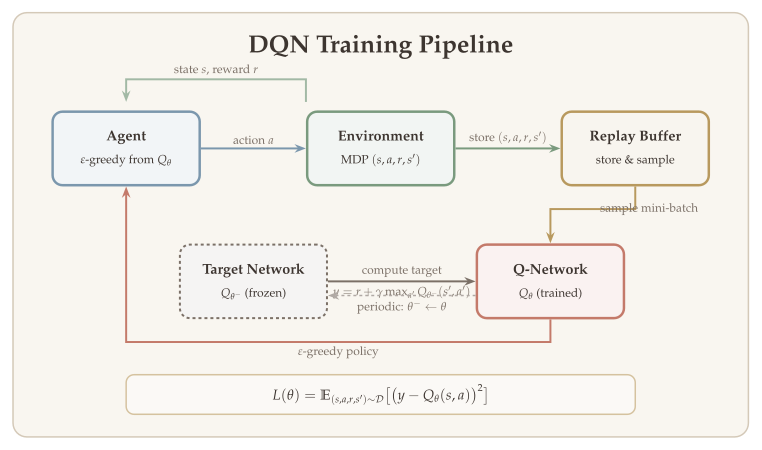

In previous lectures, we developed the theoretical foundations of reinforcement learning --- value iteration, policy iteration, Q-learning, and policy gradient methods --- all under the assumption that we can represent value functions and policies exactly, whether via tables or linear function approximation. In practice, the state and action spaces of real-world problems (robotic control, game playing, autonomous driving) are far too large for exact representation. Deep reinforcement learning bridges this gap by using neural networks as powerful function approximators. This chapter focuses on **value-based methods** that learn Q-functions and derive policies from them: DQN, DDPG, TD3, and SAC.

::: {.callout-important}
## The Central Question
*How can we scale reinforcement learning to high-dimensional state and action spaces by using deep neural networks to approximate optimal value functions?*
:::

## What Will Be Covered {#sec-overview}

- Deep Q-Networks (DQN) and Double DQN
- Deep Deterministic Policy Gradient (DDPG)
- Twin Delayed DDPG (TD3)
- Soft Actor-Critic (SAC)


Value-based deep RL methods approximate the optimal Q-function $Q^*$ using neural networks and derive policies greedily from the learned Q-values. We begin with DQN for discrete action spaces, then extend to continuous actions via DDPG, TD3, and SAC.

## Deep Q-Networks (DQN) {#sec-dqn}

### Recall: Least-Squares Value Iteration {#sec-lsvi-recall}

To motivate DQN, we first recall **least-squares value iteration (LSVI)**, which performs approximate planning using a function class $\mathcal{F}$. Consider the offline setting with a sampling distribution $\rho$.

::: {.callout-note}
## Algorithm: Fitted Q-Iteration (FQI)

**Initialize** $Q^{(0)} \in \mathcal{F}$.

**For** $k = 1, 2, \ldots, K$:

1. **Collect** an offline dataset $\mathcal{D}^{(k)}$ consisting of $N$ transition tuples:
$$
\mathcal{D}^{(k)} = \bigl\{ (s_i, a_i, r_i, s_i') : (s_i, a_i) \sim \rho, \; (r_i, s_i') \text{ are reward and next state given } (s_i, a_i) \bigr\}.
$$

2. **Define Bellman target:**
$$
y_i = r_i + \gamma \cdot \max_{a'} Q^{(k-1)}(s_i', a').
$$ {#eq-fqi-target}

3. **Update Q-function:**
$$
Q^{(k)} = \operatorname*{argmin}_{f \in \mathcal{F}} \sum_{i=1}^{N} \bigl[ y_i - f(s_i, a_i) \bigr]^2.
$$ {#eq-fqi-update}

4. **Return policy** $\widehat{\pi} = \text{greedy}(\widehat{Q}^{(K)})$.

This algorithm is also known as **fitted Q-iteration (FQI)**.
:::

FQI provides the conceptual backbone for DQN. The key idea is to iteratively regress Q-values onto Bellman targets computed from the previous iterate. DQN adapts this framework to the online, neural-network setting with several crucial modifications.

{#fig-dqn-pipeline width="90%"}

### From FQI to DQN {#sec-fqi-to-dqn}

FQI is the backbone of the **deep Q-network (DQN)** algorithm. DQN has a few particular modifications and differences:

**1. Experience Replay.** The offline dataset is not collected from a fixed policy. Instead, we store past experiences in a **replay buffer** (memory) as the dataset. The experiences are collected by running an $\varepsilon$-greedy policy (or other exploration methods) with respect to the current Q-function (Q-network). To update the Q-function, we sample transition tuples from the memory. This is known as **experience replay**.

Why experience replay? It allows us to separate training (updating the Q-network) from data collection. When data collection is slow, we can run multiple environments to collect data and save to a shared memory. This is justified by the separation between planning and estimation errors.

::: {.callout-tip}
## Remark: Experience Replay Buffer

The replay buffer stores $N$ transition tuples $(s, a, r, \text{done}, s')$. New transitions are added on the left and old transitions are removed on the right (FIFO). To form a training batch, we **sample randomly** from the buffer to construct mini-batches. This random sampling breaks temporal correlations between consecutive transitions and provides i.i.d.-like training data for the neural network.
:::

**2. Neural network function class.** $\mathcal{F}$ is a class of neural networks. The neural network least-squares problem
$$
\min_{f_\theta \in \mathcal{F}_{\text{NN}}} \sum_{(s,a,r,s') \in \mathcal{D}} \bigl( y - f_\theta(s, a) \bigr)^2
$$
is trained via **mini-batch stochastic gradient descent**:
$$
\text{grad} = \bigl( y - f_\theta(s, a) \bigr) \cdot \nabla_\theta f_\theta(s, a).
$$ {#eq-dqn-gradient}

**3. Target network.** The target $y$ is computed based on a **target network** $f_{\theta_{\text{tgt}}}$. The target network $f_{\theta_{\text{tgt}}}$ and the Q-network $f_\theta$ have the same architecture but different weights. The target network parameters $\theta_{\text{tgt}}$ are **fixed** when training $f_\theta$. Then we set $\theta_{\text{tgt}} = \theta$ when the Q-network has been trained for a large number of iterations, and repeat.

The overall DQN training loop works as follows:

- Multiple environments run the $\varepsilon$-greedy policy with respect to $f_\theta$, saving data to the **replay buffer**.
- Training data is sampled from the replay buffer and used to update the Q-network via SGD:
$$
\theta \leftarrow \theta - \alpha \bigl[ \bigl( y - f_\theta(s, a) \bigr) \cdot \nabla_\theta f_\theta(s, a) \bigr],
$$ {#eq-dqn-sgd}
where $y = r + \gamma \cdot \max_{a'} f_{\theta_{\text{tgt}}}(s', a')$.
- The **target network** $f_{\theta_{\text{tgt}}}$ is periodically copied from the Q-network.

### From Q-Table to DQN {#sec-q-table-to-dqn}

In tabular Q-learning, the Q-function is stored as a table mapping each (state, action) pair to a value. In DQN, a neural network $Q_\theta : \mathcal{S} \to \mathbb{R}^{|\mathcal{A}|}$ takes a state as input and outputs Q-values for **all actions simultaneously**. This architecture only works for **discrete** action spaces (e.g., Atari games), where the network outputs one Q-value per action.

### Q-Network and Target Network {#sec-q-target-network}

The relationship between the Q-network and the target network is:

- The **target network** is used to calculate target values, which are used to compute the loss for the Q-network.
- The **Q-network** is updated using gradient methods with respect to the least-squares loss.
- The **target network is fixed for $T_{\text{target}}$ steps** when training the Q-network.
- After every $T_{\text{target}}$ gradient descent steps, **update the target network using the Q-network**.

::: {.callout-tip}
## Remark: States in Atari Games

For Atari games, the state representation involves two preprocessing steps:

1. **Preprocess the input:** Reduce the state space to $84 \times 84$ and convert to grayscale. This reduces the three color channels (RGB) to 1.

2. **Stack four frames together as a state.** This handles the problem of temporal limitation. With a single frame, we cannot tell where the ball is moving; with multiple frames, the direction of motion becomes apparent.
:::

### Code: Training the Q-Network {#sec-dqn-code}

The following code (from Stable-Baselines3/DQN) illustrates the core training loop:

```python
for _ in range(gradient_steps):
    # Sample replay buffer
    replay_data = self.replay_buffer.sample(batch_size, env=self._vec_normalize_env)

    with th.no_grad():
        # Compute the next Q-values using the target network
        next_q_values = self.q_net_target(replay_data.next_observations)
        # Follow greedy policy: use the one with the highest value
        next_q_values, _ = next_q_values.max(dim=1)
        # Avoid potential broadcast issue
        next_q_values = next_q_values.reshape(-1, 1)
        # 1-step TD target
        target_q_values = replay_data.rewards + (1 - replay_data.dones) * self.gamma * next_q_values

    # Get current Q-values estimates
    current_q_values = self.q_net(replay_data.observations)

    # Retrieve the q-values for the actions from the replay buffer
    current_q_values = th.gather(current_q_values, dim=1, index=replay_data.actions.long())

    # Compute Huber loss (less sensitive to outliers)
    loss = F.smooth_l1_loss(current_q_values, target_q_values)

    # Optimize the policy
    self.policy.optimizer.zero_grad()
    loss.backward()
```

### Improvement: Addressing Over-Estimation {#sec-over-estimation}

A well-known issue with DQN is **over-estimation** of Q-values. When computing the target value, we use
$$
y = r + \gamma \cdot \max_{a} Q_{\text{tgt}}(s', a),
$$
where $(s, a, r, s') \sim \text{replay memory}$. Here $Q_{\text{tgt}}$ is an estimator of $Q^*$. When $Q_{\text{tgt}}$ has estimation error, taking $\max_a$ will lead to a **maximization bias**.

::: {.callout-tip}
## Remark: Maximization Bias Experiment

Consider a simple experiment illustrating maximization bias:

- $\mathcal{A} = 100$ actions, with a random reward function $R \in \mathbb{R}^{100}$ where $R \sim \text{Unif}([0, 1])^{\otimes 100}$.
- Observed rewards: $r \sim \mathcal{N}(R, I)$ (Gaussian noise).

**Method 1 (Vanilla):** Use all data to estimate $R$ (as $\widehat{R}$). Estimate $\max_a R(a)$ by $\max_a \widehat{R}(a)$.

**Method 2 (Split):** Split data and construct two estimators $\widehat{R}_1, \widehat{R}_2$. Let $\widehat{a} = \operatorname*{argmax}_a \widehat{R}_1(a)$, then use estimator $\widehat{R}_2(\widehat{a})$.

Repeating 100 times, the vanilla method consistently **overestimates** the true maximum, while the split method is centered around zero error. This demonstrates that using the same data to both select and evaluate the best action introduces systematic upward bias.
:::

### Double DQN (DDQN) {#sec-ddqn}

To mitigate over-estimation, **Double DQN** decouples action selection from action evaluation:

**DQN target** (when sampling $(s, a, r, s')$ from buffer):
$$
y = r + \gamma \cdot \max_{a} Q_{\text{tgt}}(s', a).
$$ {#eq-dqn-target}

**DDQN target** (when sampling $(s, a, r, s')$ from buffer):
$$
\widetilde{a} = \operatorname*{argmax}_{a} Q_{\text{network}}(s', a), \qquad y = r + \gamma \cdot Q_{\text{tgt}}(s', \widetilde{a}).
$$ {#eq-ddqn-target}

The key difference is that DDQN uses the **current Q-network** to select the best action (compute the argmax) and then **plugs in the argmax to the target network** to get the target value. This separation reduces the maximization bias.

The loss remains:
$$
\text{Loss}(Q_{\text{network}}) = \bigl( y - Q_{\text{network}}(s, a) \bigr)^2.
$$


## Deep Deterministic Policy Gradient (DDPG) {#sec-ddpg}

### Motivation: Extending DQN to Continuous Actions {#sec-ddpg-motivation}

DQN only works for discrete action spaces because it requires computing $\max_a Q(s, a)$ over all actions, which is feasible only when $|\mathcal{A}|$ is finite. DDPG (and its improvement TD3) is a popular method for **robotic control** and other continuous-action tasks.

Although there is "policy gradient" in the name, DDPG is fundamentally a **value-based** algorithm because it tries to solve the Bellman equation:
$$
Q^*(s, a) = R(s, a) + \gamma \cdot \mathbb{E}_{s'} \Bigl[ \max_{a' \in \mathcal{A}} Q^*(s', a') \Bigr].
$$ {#eq-bellman-continuous}

Here, $\max_{a \in \mathcal{A}}$ is hard to compute because $\mathcal{A}$ is continuous. The key idea is to **train another network to compute $\operatorname*{argmax}_a Q(s, a)$**.

{#fig-ddpg-architecture width="90%"}

### Actor and Critic Networks {#sec-actor-critic-networks}

Similar to DQN:

1. We use a neural network to approximate $Q^*$ (the **critic**).
2. We use a target network to transform solving the Bellman equation into a regression problem: $[y - Q(s,a)]^2$, where $y$ is computed based on $(r, s')$ and the target network.

The ideal target value is $y = r + \max_{a'} Q_{\text{tgt}}(s', a')$, but we cannot compute this max over a continuous action space. DDPG proposes to use an **actor network** (policy) to approximate $\operatorname*{argmax}_a Q_{\text{tgt}}(s, a)$.

The algorithm uses neural networks to represent both the policy and the value function, and thus falls in the **actor-critic framework**. We call the Q-function the **critic** and the policy $\mu$ the **actor**.

- **Critic network:** Maps $(\text{state}, \text{action}) \in \mathbb{R}^{d_s} \times \mathbb{R}^{d_a}$ to $Q(s, a) \in \mathbb{R}$.
- **Actor network:** Maps $\text{state} \in \mathbb{R}^{d_s}$ to $\text{action} \in \mathbb{R}^{d_a}$.

Each actor network represents a **deterministic policy**.

The goal is:

- **Actor** $= \operatorname*{argmax}_a$ **Critic**
- **Critic** $=$ Solution to the Bellman equation

### Four Networks in DDPG {#sec-ddpg-four-networks}

With target networks, there are **4 networks** in total:

| Network | Notation | Parameterization |
|---------|----------|-----------------|
| Critic network | $Q: \mathcal{S} \times \mathcal{A} \to \mathbb{R}$ | $Q(s, a;\, \theta_Q)$ |
| Critic target network | $Q': \mathcal{S} \times \mathcal{A} \to \mathbb{R}$ | $Q'(s, a;\, \theta_{Q'})$ |
| Actor network | $\mu: \mathcal{S} \to \mathcal{A}$ | $\mu(s;\, \theta_\mu)$ |
| Actor target network | $\mu': \mathcal{S} \to \mathcal{A}$ | $\mu'(s;\, \theta_{\mu'})$ |

The goals are:
$$
\mu(s) = \operatorname*{argmax}_a Q(s, a), \qquad \mu'(s) = \operatorname*{argmax}_a Q'(s, a),
$$
and
$$
Q(s, a) = R(s, a) + \mathbb{E}_{s'} \bigl[ Q'(s', \mu'(s')) \bigr].
$$ {#eq-ddpg-bellman}

### Loss Functions {#sec-ddpg-loss}

When target networks $\mu', Q'$ are given, and a transition $(s, a, r, s')$ is sampled from the replay buffer $\mathcal{D}$ (where $a$ is the action stored in the buffer, i.e., the action taken previously at state $s$):

**Critic loss** (least-squares loss function):
$$
y = r + \gamma \cdot Q'(s', \mu'(s')), \qquad L_C(Q) = \bigl( y - Q(s, a) \bigr)^2.
$$ {#eq-ddpg-critic-loss}

The parameter $\theta_Q$ is updated using $\nabla L_C(Q)$. Note that target networks are used in computing $y$.

**Actor loss** (maximize Q-value):
$$
L_A(\mu) = -Q(s, \mu(s)).
$$ {#eq-ddpg-actor-loss}

The parameter $\theta_\mu$ is updated using $\nabla L_A(\mu)$.

### Update Target Networks {#sec-ddpg-target-update}

Target networks track the actor and critic networks **smoothly** via soft updates at each iteration:
$$
\theta_{Q'} \leftarrow (1 - \tau) \cdot \theta_{Q'} + \tau \cdot \theta_Q, \qquad \theta_{\mu'} \leftarrow (1 - \tau) \cdot \theta_{\mu'} + \tau \cdot \theta_\mu,
$$ {#eq-ddpg-soft-update}

where $\tau$ is a very small number (e.g., $0.005$).

::: {.callout-tip}
## Remark: Soft Update

DQN can also use this soft update method for its target network. With soft updates, the target network does not change very much after each iteration, providing more stable training targets compared to the periodic hard copy used in the original DQN.
:::

### Exploration in DDPG {#sec-ddpg-exploration}

The actor network $\mu$ is deployed in the environment and generates data stored in the memory buffer. To explore the environment, we directly add Gaussian noise to $\mu(s)$ and clip it to the range of $\mathcal{A}$:
$$
a = \text{Clip}_{\mathcal{A}} \bigl[ \mu(s) + \xi \bigr], \qquad \xi \sim \mathcal{N}(0, \sigma^2).
$$ {#eq-ddpg-exploration}


## Twin Delayed DDPG (TD3) {#sec-td3}

{#fig-td3-improvements width="95%"}

TD3 is an improved version of DDPG with **3 modifications**:

1. **Twinning:** TD3 uses **two sets of target critic networks** $Q_1'$ and $Q_2'$ to reduce over-estimation.

2. **Delayed update:** The actor $\mu$ is not updated in each step. Rather, $\mu$ is updated every $N$ steps (e.g., $N = 2$).

3. **Noise smoothing in target computation:**
$$
\widetilde{a}' = \text{Clip}_{\mathcal{A}} \bigl[ \mu'(s') + \varepsilon \bigr], \qquad \varepsilon \sim \mathcal{N}(0, \sigma^2) \text{ (a small Gaussian noise)}.
$$ {#eq-td3-noise}

### TD3 Updates {#sec-td3-updates}

We have **6 networks** in total: $(\mu, Q_1, Q_2)$ and $(\mu', Q_1', Q_2')$.

With $(s, a, r, s')$, the target value is computed as follows:

1. Add noise to smooth $\mu'$:
$$
\widetilde{a}' = \text{Clip}_{\mathcal{A}} \bigl( \mu'(s') + \varepsilon \bigr).
$$ {#eq-td3-smoothed-action}

2. Take the minimum of the two target critics (the "min" reduces over-estimation):
$$
y = r + \gamma \cdot \min \bigl\{ Q_1'(s', \widetilde{a}'), \; Q_2'(s', \widetilde{a}') \bigr\}.
$$ {#eq-td3-target}

**Loss of $Q_1$ and $Q_2$:**
$$
L_C(Q_1) = \bigl( y - Q_1(s, a) \bigr)^2, \qquad L_C(Q_2) = \bigl( y - Q_2(s, a) \bigr)^2.
$$ {#eq-td3-critic-loss}

**Loss of $\mu$** (computed only every $N$ steps):
$$
L_A(\mu) = -Q_1(s, \mu(s)),
$$ {#eq-td3-actor-loss}
or alternatively $L_A(\mu) = -\min \bigl\{ Q_1(s, \mu(s)), \; Q_2(s, \mu(s)) \bigr\}$.

**Update of target networks** (soft update):
$$
\theta_{Q_1'} \leftarrow (1 - \tau) \, \theta_{Q_1'} + \tau \, \theta_{Q_1}, \qquad \theta_{Q_2'} \leftarrow (1 - \tau) \, \theta_{Q_2'} + \tau \, \theta_{Q_2}, \qquad \theta_{\mu'} \leftarrow (1 - \tau) \, \theta_{\mu'} + \tau \, \theta_\mu.
$$ {#eq-td3-soft-update}


## Soft Actor-Critic (SAC) {#sec-sac}

{#fig-sac-architecture width="90%"}

### Motivation and Softmax Bellman Equation {#sec-sac-motivation}

**Soft Actor-Critic (SAC)** is very similar to TD3 and it tries to solve the **softmax Bellman equation** (the optimality equation of entropy-regularized RL). It uses the trick of using two target networks to reduce over-estimation. But it does **not** use action noise to explore, because:

1. The policy $\pi$ in SAC is **stochastic**.
2. Entropy regularization encourages $\pi$ to be stochastic.

SAC can be used for both **discrete** and **continuous** action spaces.

The **softmax Bellman equation** is:
$$
V^*(s) = \beta \cdot \log \Bigl( \int \exp\bigl( \tfrac{1}{\beta} \cdot Q^*(s, a) \bigr) \, da \Bigr),
$$
$$
Q^*(s, a) = R(s, a) + \gamma \cdot \mathbb{E}_{s'} \bigl[ V^*(s') \bigr],
$$
$$
\pi^*(a \mid s) \propto \exp\bigl( \tfrac{1}{\beta} \cdot Q^*(s, a) \bigr).
$$ {#eq-softmax-bellman}

### Equivalent Form {#sec-sac-equivalent}

The softmax Bellman equation can be equivalently written as:
$$
V^*(s) = \mathbb{E}_{a \sim \pi^*} \bigl[ Q^*(s, a) - \beta \cdot \log \pi^*(a \mid s) \bigr],
$$
$$
Q^*(s, a) = R(s, a) + \mathbb{E}_{s', a' \sim \pi^*} \bigl[ Q^*(s', a') - \beta \cdot \log \pi^*(a' \mid s') \bigr],
$$
$$
\pi^*(a \mid s) \propto \exp\bigl( \tfrac{1}{\beta} \cdot Q^*(s, a) \bigr).
$$ {#eq-sac-equivalent}

The optimal policy $\pi^*(\cdot \mid s)$ is the solution to:
$$
\max_\pi \; \mathbb{E}_{a \sim \pi} \bigl[ Q^*(s, a) - \beta \cdot \log \pi(a \mid s) \bigr].
$$ {#eq-sac-greedy}

This defines a new "greedy" policy by solving the entropy-regularized problem with respect to the Q-network. Using the Bellman equation, the critic $\pi$ enters the Bellman target.

### Loss Functions of SAC {#sec-sac-loss}

Sample $(s, a, r, s')$ from the replay buffer. Let $\pi, Q_1, Q_2$ be the actor and critics, and $\pi', Q_1', Q_2'$ be the target networks.

**Target value:**

1. Sample $a' \sim \pi(\cdot \mid s')$.
2. Compute:
$$
y = r + \gamma \cdot \min \bigl\{ Q_1'(s', a') - \beta \log \pi(a' \mid s'), \; Q_2'(s', a') - \beta \log \pi(a' \mid s') \bigr\}.
$$ {#eq-sac-target}

**Critic loss:**
$$
L(Q_1) = \bigl( y - Q_1(s, a) \bigr)^2, \qquad L(Q_2) = \bigl( y - Q_2(s, a) \bigr)^2.
$$ {#eq-sac-critic-loss}

**Actor loss** (sample $\widetilde{a} \sim \pi(\cdot \mid s)$):
$$
L(\pi) = -\bigl( Q_1(s, \widetilde{a}) - \beta \cdot \log \pi(\widetilde{a} \mid s) \bigr),
$$ {#eq-sac-actor-loss}
or alternatively:
$$
L(\pi) = -\Bigl( \min \bigl\{ Q_1(s, \widetilde{a}), \; Q_2(s, \widetilde{a}) \bigr\} - \beta \cdot \log \pi(\widetilde{a} \mid s) \Bigr).
$$

**Update target networks:** Soft update (same as DDPG/TD3).

**Exploration (generate data):** Take actions according to the stochastic policy $\pi$ (no added noise needed).

### Constructing Actor and Critic Networks {#sec-sac-networks}

We want $\pi(a \mid s)$ to be a neural-network-based probability distribution.

**Continuous $\mathcal{A}$:**

- **Critic:** $Q: \mathcal{S} \times \mathcal{A} \to \mathbb{R}$ is a standard neural network.
- **Actor:** Uses the **reparameterization trick**:
$$
\pi_\theta(\cdot \mid s) \sim \mathcal{N}\bigl( \mu_\theta(s), \; \sigma_\theta^2(s) \cdot I \bigr),
$$ {#eq-sac-reparam}
where $\mu_\theta: \mathcal{S} \to \mathbb{R}^{d_a}$ and $\sigma_\theta: \mathcal{S} \to \mathbb{R}$ are neural networks. Equivalently:
$$
a = \mu_\theta(s) + \sigma_\theta(s) \cdot \zeta, \qquad \zeta \sim \mathcal{N}(0, I).
$$

If $\mathcal{A}$ is bounded (e.g., $\mathcal{A} = [-1, 1]$), we can define:
$$
a = \tanh\bigl( \mu_\theta(s) + \sigma_\theta(s) \cdot \zeta \bigr), \qquad \tanh(x) = \frac{e^x - e^{-x}}{e^x + e^{-x}}.
$$

**Discrete $\mathcal{A}$:**

- **Critic:** $Q: \mathcal{S} \to \mathbb{R}^{|\mathcal{A}|}$ is a neural network (same architecture as DQN).
- **Actor:** $\pi(a \mid s) = \text{Softmax}\bigl( f_\theta(s, a) \bigr)$, where $f_\theta: \mathcal{S} \to \mathbb{R}^{|\mathcal{A}|}$ is a neural network that outputs **logits**.


## Comparison of Value-Based Methods {#sec-value-based-comparison}

The following table compares all value-based deep RL methods along five key dimensions: how data is collected, what networks are trained, the loss functions used, and how targets are stabilized.

::: {.column-page}

| | **DQN** | **DDPG** | **TD3** | **SAC** |
|:---|:---|:---|:---|:---|
| **Data** | Replay buffer; $\varepsilon$-greedy | Replay buffer; actor + noise | Replay buffer; actor + noise | Replay buffer; stochastic $\pi$ |
| **Networks** | $Q_\theta$, $Q_{\theta^-}$ (2 nets) | $\mu_\theta$, $Q_\phi$, targets (4 nets) | $\mu$, $Q_1$, $Q_2$, targets (6 nets) | $\pi_\theta$, $Q_1$, $Q_2$, targets (5 nets) |
| **Critic loss** | $(y - Q_\theta(s,a))^2$ | $(y - Q_\phi(s,a))^2$ | $(y - Q_i(s,a))^2$ for $i{=}1,2$ | $(y - Q_i(s,a))^2$ for $i{=}1,2$ |
| **Target $y$** | $r + \gamma \max_{a'} Q_{\theta^-}(s',a')$ | $r + \gamma \, Q'(s', \mu'(s'))$ | $r + \gamma \min_i Q_i'(s', \widetilde{a}')$ | $r + \gamma [\min_i Q_i'(s',a') - \alpha \log \pi(a' \mid s')]$ |
| **Actor loss** | N/A (greedy argmax) | $-Q_\phi(s, \mu_\theta(s))$ | $-Q_1(s, \mu_\theta(s))$ | $-[Q(s, \widetilde{a}) - \alpha \log \pi(\widetilde{a} \mid s)]$ |
| **Target update** | Hard copy every $T$ steps | Soft: $\tau \approx 0.005$ | Soft: $\tau \approx 0.005$ | Soft: $\tau \approx 0.005$ |
| **Overestimation fix** | Double DQN variant | None | Twin critics + min | Twin critics + min |
| **Actions** | Discrete | Continuous | Continuous | Both |

: Comparison of value-based deep RL methods. {#tbl-value-based-comparison .striped .hover}

:::


## Chapter Summary {#sec-chapter-summary}

This chapter covered the **value-based deep RL algorithms** that approximate optimal Q-functions using neural networks and derive policies from the learned Q-values. The following table summarizes the algorithms covered.

### Summary of Value-Based Algorithms

| Algorithm | Family | Key Innovation | Action Space |
|:---|:---|:---|:---|
| **DQN** | Value-based | Experience replay + target network | Discrete |
| **Double DQN** | Value-based | Decoupled argmax to reduce overestimation | Discrete |
| **DDPG** | Actor-critic | Deterministic policy gradient + continuous actions | Continuous |
| **TD3** | Actor-critic | Twin critics + delayed actor updates | Continuous |
| **SAC** | Actor-critic | Entropy-regularized (softmax Bellman) + auto $\alpha$ | Continuous |

: Summary of value-based deep RL algorithms. {#tbl-ch7-summary .striped .hover}

### Key Concepts

- **Experience replay:** store transitions in a buffer and sample mini-batches, breaking temporal correlation and enabling sample reuse.
- **Target networks:** use a slowly-updated copy of the Q-network to compute regression targets, stabilizing training.
- **Overestimation and Double DQN:** the max operator introduces upward bias; Double DQN decouples action selection from evaluation to mitigate this.
- **Soft updates:** smoothly track the Q-network via $\theta^- \leftarrow (1 - \tau)\theta^- + \tau\theta$, providing more stable targets than periodic hard copies.
- **Entropy regularization (SAC):** adding $\alpha \cdot H(\pi)$ to the objective encourages exploration and avoids premature convergence to deterministic policies.

### Algorithm Specifications {#sec-algorithm-specs}

The following tables provide a detailed specification for each algorithm, covering data collection, network architecture, loss functions, and key hyperparameters.

#### DQN (Deep Q-Network)

| Component | Specification |
|:---|:---|
| **Data collection** | Off-policy. Execute $\varepsilon$-greedy w.r.t. $Q_\theta$; store $(s, a, r, \text{done}, s')$ in replay buffer; sample random mini-batches |
| **Networks** | Q-network $Q_\theta: \mathcal{S} \to \mathbb{R}^{|\mathcal{A}|}$, Target network $Q_{\theta^-}$ (same architecture) |
| **Critic loss** | $L(\theta) = \bigl(y - Q_\theta(s, a)\bigr)^2$, \quad $y = r + \gamma \max_{a'} Q_{\theta^-}(s', a')$ |
| **Actor loss** | N/A --- policy is $\operatorname{argmax}_a Q_\theta(s, a)$ |
| **Target update** | Hard copy: $\theta^- \leftarrow \theta$ every $T_{\text{target}}$ steps |
| **Exploration** | $\varepsilon$-greedy: $\varepsilon$ decays from $1.0$ to $0.01$ over training |
| **Action space** | Discrete only |

: DQN specification. {.striped .hover}

#### Double DQN

| Component | Specification |
|:---|:---|
| **Data collection** | Same as DQN |
| **Networks** | Same as DQN: $Q_\theta$ and $Q_{\theta^-}$ |
| **Critic loss** | $L(\theta) = \bigl(y - Q_\theta(s, a)\bigr)^2$, \quad $\widetilde{a} = \operatorname{argmax}_{a'} Q_\theta(s', a')$, \quad $y = r + \gamma \, Q_{\theta^-}(s', \widetilde{a})$ |
| **Actor loss** | N/A --- policy is $\operatorname{argmax}_a Q_\theta(s, a)$ |
| **Target update** | Same as DQN |
| **Key difference** | Decouples action selection ($Q_\theta$) from evaluation ($Q_{\theta^-}$) to reduce overestimation |
| **Action space** | Discrete only |

: Double DQN specification. {.striped .hover}

#### DDPG (Deep Deterministic Policy Gradient)

| Component | Specification |
|:---|:---|
| **Data collection** | Off-policy. Execute $\text{Clip}_{\mathcal{A}}[\mu_\theta(s) + \xi]$, $\xi \sim \mathcal{N}(0, \sigma^2)$; store in replay buffer |
| **Networks** | Actor $\mu_\theta: \mathcal{S} \to \mathcal{A}$, Critic $Q_\phi: \mathcal{S} \times \mathcal{A} \to \mathbb{R}$, Target actor $\mu'_{\theta'}$, Target critic $Q'_{\phi'}$ — **4 networks** |
| **Critic loss** | $L(\phi) = \bigl(y - Q_\phi(s, a)\bigr)^2$, \quad $y = r + \gamma \, Q'_{\phi'}(s', \mu'_{\theta'}(s'))$ |
| **Actor loss** | $L(\theta) = -Q_\phi(s, \mu_\theta(s))$ |
| **Target update** | Soft: $\theta' \leftarrow (1-\tau)\theta' + \tau\theta$, \quad $\phi' \leftarrow (1-\tau)\phi' + \tau\phi$, \quad $\tau \approx 0.005$ |
| **Exploration** | Gaussian noise on deterministic action: $\mu(s) + \mathcal{N}(0, \sigma^2)$ |
| **Action space** | Continuous only |

: DDPG specification. {.striped .hover}

#### TD3 (Twin Delayed DDPG)

| Component | Specification |
|:---|:---|
| **Data collection** | Off-policy. Same as DDPG (actor + Gaussian noise, replay buffer) |
| **Networks** | Actor $\mu$, Critics $Q_1, Q_2$, Target actor $\mu'$, Target critics $Q_1', Q_2'$ — **6 networks** |
| **Critic loss** | $L(Q_i) = (y - Q_i(s, a))^2$ for $i = 1,2$; \quad $\widetilde{a}' = \text{Clip}[\mu'(s') + \varepsilon]$, \quad $y = r + \gamma \min\{Q_1'(s', \widetilde{a}'), Q_2'(s', \widetilde{a}')\}$ |
| **Actor loss** | $L(\theta) = -Q_1(s, \mu_\theta(s))$, updated every $N$ steps (delayed) |
| **Target update** | Soft (same as DDPG) |
| **Exploration** | Same as DDPG |
| **Improvements** | (1) Twin critics to reduce overestimation, (2) Delayed actor updates, (3) Target policy smoothing |
| **Action space** | Continuous only |

: TD3 specification. {.striped .hover}

#### SAC (Soft Actor-Critic)

| Component | Specification |
|:---|:---|
| **Data collection** | Off-policy. Execute stochastic policy $\pi_\theta$; store in replay buffer. **No added noise** — entropy regularization provides exploration |
| **Networks** | Actor $\pi_\theta(\cdot \mid s)$, Critics $Q_1, Q_2$, Target critics $Q_1', Q_2'$ — **5 networks** (+ optional target actor) |
| **Critic loss** | $L(Q_i) = (y - Q_i(s, a))^2$; \quad $a' \sim \pi(\cdot \mid s')$, \quad $y = r + \gamma \bigl[\min\{Q_1'(s', a'), Q_2'(s', a')\} - \alpha \log \pi(a' \mid s')\bigr]$ |
| **Actor loss** | $L(\theta) = -\bigl[Q(s, \widetilde{a}) - \alpha \log \pi_\theta(\widetilde{a} \mid s)\bigr]$, \quad $\widetilde{a} \sim \pi_\theta(\cdot \mid s)$ via reparameterization |
| **Target update** | Soft (same as DDPG/TD3) |
| **Exploration** | Stochastic policy + entropy bonus $\alpha \cdot H(\pi)$; $\alpha$ can be auto-tuned |
| **Action space** | Continuous (also applicable to discrete) |

: SAC specification. {.striped .hover}

### References {#sec-ch7-references}

- V. Mnih, K. Kavukcuoglu, D. Silver, et al., "Human-level control through deep reinforcement learning," *Nature*, vol. 518, pp. 529--533, 2015.
- H. van Hasselt, A. Guez, and D. Silver, "Deep reinforcement learning with double Q-learning," *AAAI*, 2016.
- T. P. Lillicrap, J. J. Hunt, A. Pritzel, et al., "Continuous control with deep reinforcement learning," *ICLR*, 2016.
- S. Fujimoto, H. van Hoof, and D. Meger, "Addressing function approximation error in actor-critic methods," *ICML*, 2018.
- T. Haarnoja, A. Zhou, P. Abbeel, and S. Levine, "Soft actor-critic: Off-policy maximum entropy deep reinforcement learning with a stochastic actor," *ICML*, 2018.

::: {.callout-tip}
## Looking Ahead
In the next chapter we will study **policy-based deep RL methods** --- Actor-Critic with neural networks, Advantage Actor-Critic (A2C), and Proximal Policy Optimization (PPO) --- which directly optimize parameterized policies using gradient ascent on the expected return.
:::
