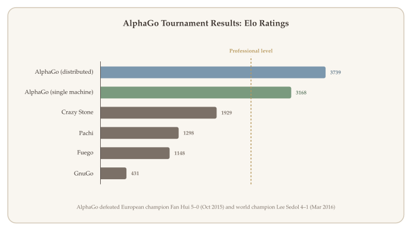
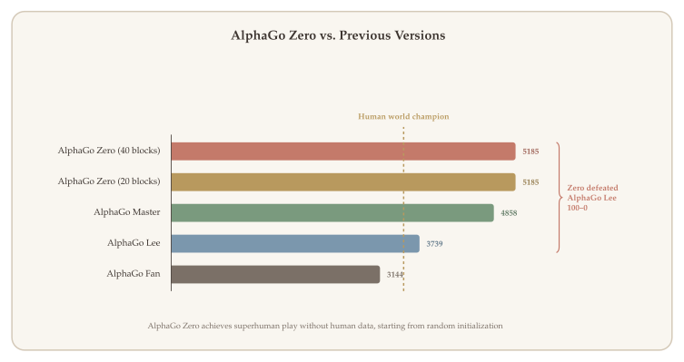

DeepMind's AlphaGo (Silver et al., 2016) was the first computer program to defeat a professional human player at the ancient board game of Go --- a milestone that many researchers had predicted was still a decade away. Go's enormous state space ($\sim 10^{170}$ legal positions) makes brute-force search infeasible, so AlphaGo combines deep neural network function approximation with Monte Carlo tree search (MCTS) in a principled pipeline: learn a policy from human games, refine it through self-play, train a value network to evaluate positions, and use all three components at game time to guide lookahead search.

This lecture walks through each stage of the AlphaGo training and execution pipeline, connecting the ideas to the MDP framework, policy gradient methods, and exploration--exploitation tradeoffs studied in earlier chapters. We then describe AlphaGo Zero, which achieves even stronger play by removing the dependence on human data entirely.

::: {.callout-important}
## The Central Question
*How can we combine deep learning, self-play reinforcement learning, and Monte Carlo tree search to achieve superhuman performance in complex strategic games?*
:::

## What Will Be Covered {#sec-overview}

- **Go as an MDP:** The game of Go formulated as a Markov decision process --- state representation, action space, and terminal rewards.
- **Policy network architecture:** A convolutional neural network that maps board positions to move probabilities.
- **Behavior cloning:** Training the policy network by imitation learning from a dataset of expert human games.
- **Policy gradient self-play:** Improving the policy network through REINFORCE with self-play against previous versions.
- **Value network:** Learning a state-value function to predict the winner from any board position.
- **Monte Carlo tree search (MCTS):** Combining the policy network, value network, and rollouts in a four-step search procedure used at execution time.
- **AlphaGo Zero:** Removing human data and using MCTS itself as the training signal for the policy network.

## Go as an MDP {#sec-go-mdp}

Go is a two-player, deterministic, perfect-information board game played on a $19 \times 19$ grid. Players alternate placing black and white stones, and the game ends when both players pass. The winner is determined by which player controls more territory on the board.

We formulate Go as an MDP:

- **State** $s_t$: The current board configuration. In the original AlphaGo, each state is represented as a $19 \times 19 \times 48$ tensor encoding stone positions, liberties, capture information, and move history. In AlphaGo Zero, a simpler $19 \times 19 \times 17$ representation is used (8 planes of history for each player plus a color-to-play indicator).
- **Action** $a_t$: Placing a stone at one of the $19 \times 19 = 361$ intersections (or passing). The action space is $\mathcal{A} = \{1, 2, \ldots, 361\}$.
- **Transition**: Deterministic --- placing a stone at position $a_t$ on board state $s_t$ produces the next board state $s_{t+1}$ according to the rules of Go (including captures).
- **Reward**: Sparse --- the reward is $0$ at all intermediate steps and $+1$ (win) or $-1$ (loss) at the terminal state.

::: {.callout-note appearance="simple"}
Because the opponent's moves are part of the environment from the agent's perspective, the effective transition function is stochastic (it depends on the opponent's policy). The agent must learn to play well against a range of opponent strategies.
:::

## The AlphaGo Training Pipeline {#sec-training-pipeline}

{#fig-training-pipeline width="100%"}

AlphaGo's training has three stages, each building on the previous one:

1. **Behavior cloning:** Train a policy network $\pi(a \mid s; \boldsymbol{\theta})$ by imitating human expert moves.
2. **Policy gradient self-play:** Improve the policy network by playing against previous versions of itself.
3. **Value network training:** Train a value network $v(s; \mathbf{w})$ to predict the expected outcome from each position.

At execution time (actually playing Go), AlphaGo uses **Monte Carlo tree search** (MCTS) to select moves, guided by the policy and value networks.

## Policy and Value Network Architectures {#sec-policy-network}

{#fig-neural-network width="95%"}

The **policy network** is a deep convolutional neural network (CNN) that takes a board state $s$ as input and outputs a probability distribution over all legal moves:

$$
\pi(a \mid s; \boldsymbol{\theta}) = P(\text{play at position } a \mid \text{board state } s).
$$

The architecture consists of:

- **Layer 1:** $5 \times 5$ convolution with 192 filters and ReLU activation.
- **Layers 2--12:** Eleven $3 \times 3$ convolutional layers, each with 192 filters and ReLU.
- **Layer 13:** $1 \times 1$ convolution with 1 filter, followed by softmax over all 361 positions.

The output is a vector $\mathbf{p} \in \mathbb{R}^{361}$ of move probabilities. The convolutional structure is a natural fit for the 2D board: each filter captures local spatial patterns such as captures, connections, and eye formations.

The **value network** shares the same convolutional architecture (13 layers with 192 filters) but has separate parameters. It differs in the output layers: after the convolutional backbone, it adds a fully connected layer with 256 hidden units (ReLU), followed by a single scalar output with $\tanh$, producing $v \in [-1, 1]$. The value network input includes one extra feature plane (color to play), making its input $19 \times 19 \times 49$.

## Step 1: Behavior Cloning {#sec-behavior-cloning}

The first training stage uses **behavior cloning** (imitation learning) to initialize the policy network from human expert games.

### Dataset {#sec-bc-dataset}

The training data comes from the **KGS Go Server**, consisting of approximately 160,000 games played by strong amateur and professional players. From these games, approximately 29 million state--action pairs $(s, a)$ are extracted, where $s$ is a board position and $a$ is the move chosen by the human player.

### Training Objective {#sec-bc-objective}

Behavior cloning treats move prediction as a **classification problem**. Given a board state $s$, the network should predict the human expert's move $a^*$. The training minimizes the **cross-entropy loss**:

$$
L(\boldsymbol{\theta}) = -\sum_{(s, a^*) \in \mathcal{D}} \log \pi(a^* \mid s; \boldsymbol{\theta}),
$$ {#eq-bc-loss}

where $\mathcal{D}$ is the dataset of state--action pairs.

::: {.callout-tip}
## Remark: Behavior Cloning is Not RL
Behavior cloning is supervised learning, not reinforcement learning. The network learns to mimic the data distribution without any notion of reward or long-term consequences. This is fast and simple but limited: the network can only be as good as the humans it imitates.
:::

### Performance {#sec-bc-performance}

The behavior-cloned policy network achieves approximately **57% accuracy** in predicting human expert moves --- impressive given the complexity of Go, where many reasonable moves exist in any given position. This policy alone plays at a strong amateur level but is far from professional strength.

## Step 2: Policy Gradient Self-Play {#sec-policy-gradient}

The behavior-cloned policy provides a good initialization, but it is limited by the quality of human play. To go further, AlphaGo uses **policy gradient methods** to improve the policy through self-play.

### Self-Play Setup {#sec-self-play-setup}

The self-play procedure works as follows:

- **Player (current model):** Uses the latest policy parameters $\boldsymbol{\theta}$.
- **Opponent:** Uses parameters $\boldsymbol{\theta}^{\text{old}}$ sampled uniformly at random from a pool of previous parameter snapshots.

Using a pool of past opponents (rather than always playing against the latest version) prevents overfitting to a single opponent and stabilizes training.

### REINFORCE Update {#sec-reinforce-update}

Each game of self-play produces a trajectory $(s_1, a_1, s_2, a_2, \ldots, s_T)$ with terminal reward:

$$
r_T = \begin{cases} +1 & \text{if the player wins,} \\ -1 & \text{if the player loses.} \end{cases}
$$

The policy is updated using the **REINFORCE** algorithm (policy gradient). Letting $z_t = \pm r_T$ denote the outcome from the perspective of the player at time $t$:

$$
\boldsymbol{\theta} \leftarrow \boldsymbol{\theta} + \alpha \sum_{t=1}^{T} z_t \, \nabla_{\boldsymbol{\theta}} \log \pi(a_t \mid s_t; \boldsymbol{\theta}).
$$ {#eq-reinforce-alphago}

This update increases the probability of moves that led to wins and decreases the probability of moves that led to losses.

::: {.callout-note appearance="simple"}
In REINFORCE, the reward $z_t$ is the same for all moves within a single game --- every move in a winning game is reinforced equally. This is a crude credit assignment strategy, but it works well in practice because the policy network already has a strong initialization from behavior cloning.
:::

## Step 3: Value Network {#sec-value-network}

The value network $v(s; \mathbf{w})$ approximates the state-value function under the self-play policy $\pi$:

$$
v(s; \mathbf{w}) \approx V^\pi(s) = \mathbb{E}\bigl[r_T \mid s_t = s, \; a_{t:T} \sim \pi\bigr].
$$

The value network takes a board state as input and outputs a single scalar prediction of the expected game outcome (between $-1$ and $+1$).

### Training {#sec-value-training}

The value network is trained by regression on positions from self-play games. For each position $s_t$ encountered during self-play with outcome $z \in \{-1, +1\}$, the training minimizes the **mean squared error**:

$$
L(\mathbf{w}) = \sum_{(s_t, z) \in \mathcal{D}} \bigl(v(s_t; \mathbf{w}) - z\bigr)^2.
$$ {#eq-value-loss}

::: {.callout-note appearance="simple"}
In the original AlphaGo (2016), the policy and value networks are trained as **separate** networks with independent parameters. In AlphaGo Zero (2017), they are replaced by a single dual-head network --- see @sec-zero-architecture.
:::

## Monte Carlo Tree Search {#sec-mcts}

During execution (actually playing a game), AlphaGo does **not** simply sample from the policy network. Instead, it uses **Monte Carlo tree search** (MCTS) to perform lookahead search, combining the policy network, value network, and fast rollouts.

### Why Lookahead Search? {#sec-why-lookahead}

Human Go players succeed by thinking ahead: "If I play here, my opponent will respond there, then I should play..." If you could exhaustively search all possible continuations, you would play perfectly. Of course, the branching factor of Go (around 250 legal moves per position) makes exhaustive search impossible. MCTS addresses this by intelligently sampling a subset of the game tree.

### The Four Steps of MCTS {#sec-mcts-steps}

{#fig-mcts width="100%"}

Every simulation of MCTS consists of four steps:

1. **Selection:** The player selects an action to explore (imaginary, not an actual game move).
2. **Expansion:** The opponent responds; the tree grows by one node to a new state.
3. **Evaluation:** The new state is evaluated using both the value network and a fast rollout.
4. **Backup:** The evaluation result is used to update the action-value estimates in the tree.

AlphaGo repeats these four steps many times (thousands of simulations) for each real move. After all simulations are complete, the actual move is chosen based on the visit counts.

### Step 1: Selection {#sec-mcts-selection}

Given the current state $s_t$ at the root of the search tree, we must decide which action to explore. For each valid action $a$, we compute a score:

$$
\text{score}(a) = Q(a) + \eta \cdot \frac{\pi(a \mid s_t; \boldsymbol{\theta})}{1 + N(a)},
$$ {#eq-selection-score}

where:

- $Q(a)$ is the current action-value estimate for action $a$ (computed by MCTS, initially zero).
- $\pi(a \mid s_t; \boldsymbol{\theta})$ is the prior probability from the policy network.
- $N(a)$ is the number of times action $a$ has been selected so far in the search.
- $\eta > 0$ is an exploration constant.

The action with the highest score is selected.

::: {.callout-tip}
## Remark: Connection to UCB
The selection formula ([-@eq-selection-score]) is closely related to the **Upper Confidence Bound** (UCB) exploration strategy from multi-armed bandits (Chapter 6). The first term $Q(a)$ encourages exploitation (choosing actions that have performed well), while the second term $\frac{\pi(a \mid s_t; \boldsymbol{\theta})}{1 + N(a)}$ encourages exploration of actions that have been tried fewer times, weighted by the policy network's prior.
:::

### Step 2: Expansion {#sec-mcts-expansion}

After the player selects action $a_t$, the opponent's response determines the new state. The opponent's action $a_t'$ is sampled from the policy network applied to the opponent's board view $s_t'$:

$$
a_t' \sim \pi(\cdot \mid s_t'; \boldsymbol{\theta}).
$$

This produces a new state $s_{t+1}$. The transition model is the rules of Go, and the policy network is used to model the opponent's behavior.

::: {.callout-note appearance="simple"}
The true transition probability $p(s_{t+1} \mid s_t, a_t)$ depends on the opponent's policy, which is unknown at game time. AlphaGo approximates this by using its own policy network as a model of the opponent.
:::

### Step 3: Evaluation {#sec-mcts-evaluation}

The new state $s_{t+1}$ is evaluated by combining two sources:

1. **Value network:** Compute $v(s_{t+1}; \mathbf{w})$, the learned estimate of the state's value.
2. **Fast rollout:** Play the game out to the end using a fast (but weaker) rollout policy, alternating player and opponent moves $a_k \sim \pi(\cdot \mid s_k; \boldsymbol{\theta})$ and $a_k' \sim \pi(\cdot \mid s_k'; \boldsymbol{\theta})$. Record the terminal reward $r_T \in \{-1, +1\}$.

The combined evaluation is:

$$
V(s_{t+1}) = \frac{1}{2} v(s_{t+1}; \mathbf{w}) + \frac{1}{2} r_T.
$$ {#eq-evaluation}

Averaging the value network estimate with the rollout outcome provides a more robust evaluation than either alone.

### Step 4: Backup {#sec-mcts-backup}

After repeating the simulation many times, each child node of $a_t$ accumulates multiple recorded values $V^{(1)}, V^{(2)}, \ldots$ from different simulations. The action-value is updated as the mean of all recorded evaluations:

$$
Q(a_t) = \text{mean}\bigl(V^{(1)}, V^{(2)}, \ldots\bigr).
$$ {#eq-backup}

These updated $Q$ values feed back into the selection step ([-@eq-selection-score]) for subsequent simulations.

### Decision Making after MCTS {#sec-mcts-decision}

After all simulations are complete, AlphaGo selects the action with the **highest visit count**:

$$
a_t = \arg\max_a \; N(a).
$$ {#eq-mcts-decision}

The visit count $N(a)$ reflects how many times action $a$ was selected during the search. Actions that are consistently promising (high $Q$ values) attract more visits, so the most-visited action is a robust choice.

::: {.callout-note appearance="simple"}
For the next move, MCTS starts from scratch: $Q(a)$ and $N(a)$ are re-initialized to zero, and the simulation process repeats from the new board state.
:::

### Tournament Results {#sec-results}

{#fig-results width="95%"}

## Summary: Training and Execution {#sec-summary}

The complete AlphaGo system separates into two phases:

**Training** (offline, three stages):

1. Train a policy network using **behavior cloning** from human games.
2. Improve the policy network using **policy gradient** with self-play.
3. Train a **value network** to predict game outcomes.

**Execution** (online, at game time):

- Select each move by running **Monte Carlo tree search**, which uses the policy network (for action priors and opponent modeling), the value network (for position evaluation), and rollouts (for supplementary evaluation).
- The actual move is the most-visited action after MCTS.

## AlphaGo Zero {#sec-alphago-zero}

{#fig-zero-pipeline width="80%"}

AlphaGo Zero (Silver et al., 2017) is a significantly simplified and more powerful successor to AlphaGo. Three key differences set it apart:

1. **No human data:** AlphaGo Zero does not use behavior cloning. It learns entirely from self-play, starting from random initialization.
2. **MCTS as training signal:** Instead of policy gradient self-play, AlphaGo Zero uses MCTS visit counts as the training target for the policy network.
3. **Shared dual-head network:** Instead of separate policy and value networks, AlphaGo Zero uses a single neural network with shared parameters and two output heads.

### Dual-Head Network Architecture {#sec-zero-architecture}

{#fig-zero-architecture width="85%"}

A central architectural change in AlphaGo Zero is that the policy and value functions are represented by a **single neural network** $f_\theta$ with shared parameters:

$$
f_\theta(s) = (\mathbf{p}, \, v),
$$

where $\mathbf{p} \in \mathbb{R}^{362}$ is a vector of move probabilities (including pass) and $v \in [-1, 1]$ is a scalar value estimate. The network has three components:

1. **Shared residual backbone.** The input board state $s$ (a $19 \times 19 \times 17$ tensor: 8 history planes per player plus a color-to-play plane) is processed by a convolutional layer followed by 19 (or 39 in the larger version) **residual blocks**. Each residual block contains two convolutional layers with batch normalization and ReLU activations, plus a skip connection. The residual backbone extracts shared features that are useful for both move prediction and position evaluation.

2. **Policy head.** A $1 \times 1$ convolution, batch normalization, ReLU, then a fully connected layer mapping to $\mathbb{R}^{362}$, followed by softmax to produce move probabilities $\mathbf{p}$.

3. **Value head.** A $1 \times 1$ convolution, batch normalization, ReLU, a fully connected layer to a hidden layer of size 256 with ReLU, then a final fully connected layer to a single scalar, followed by $\tanh$ to produce $v \in [-1, 1]$.

::: {.callout-tip}
## Why Share Parameters?
Parameter sharing between the policy and value functions has two benefits: (a) the shared residual backbone learns richer features because it is trained on both the policy and value objectives simultaneously, and (b) it is computationally more efficient --- a single forward pass produces both the move probabilities needed for MCTS selection and the value estimate needed for leaf evaluation.
:::

### Training the Policy Network {#sec-zero-policy}

In AlphaGo Zero, the dual-head network $f_\theta$ is trained to match the MCTS search distribution (for the policy head) and game outcomes (for the value head). At each training step:

1. Observe state $s_t$ and compute $(\mathbf{p}, v) = f_\theta(s_t)$.
2. Run MCTS from $s_t$ and compute the normalized visit counts: $\boldsymbol{\pi}_{\text{MCTS}} = \text{normalize}\bigl[N(a = 1), \;\ldots,\; N(a = 362)\bigr]$.
3. Play the game to completion to obtain the terminal outcome $z \in \{-1, +1\}$.
4. Compute the combined loss:
$$
L(\theta) = \underset{\text{value loss}}{(z - v)^2} \;-\; \underset{\text{policy loss}}{\boldsymbol{\pi}_{\text{MCTS}}^\top \log \mathbf{p}} \;+\; c \|\theta\|^2,
$$ {#eq-zero-loss}
where $c$ is an L2 regularization coefficient.
5. Update the parameters: $\theta \leftarrow \theta - \alpha \, \nabla_\theta L(\theta)$.

The idea is that MCTS, by performing extensive lookahead search, produces a better action distribution than the raw policy network. By training the network to match MCTS, the policy steadily improves, which in turn makes MCTS even stronger in subsequent iterations.

### Results {#sec-zero-results}

{#fig-zero-comparison width="95%"}

AlphaGo Zero defeated the original AlphaGo by a score of **100--0**. This demonstrates that:

- Self-play from scratch, without human data, can surpass human-level performance.
- For the game of Go, human knowledge may actually be **harmful** --- it can constrain the search space and introduce human biases.

::: {.callout-tip}
## Is Behavior Cloning Useless?
For Go, AlphaGo Zero shows that human data is unnecessary and potentially limiting. But this does not mean behavior cloning is always useless. Consider a surgery robot: would you want it to learn from scratch through trial and error, without ever observing human surgeons? In domains where exploration is costly or dangerous, initializing from human demonstrations can be essential.
:::

## References {#sec-references}

- Silver, D. et al. (2016). Mastering the game of Go with deep neural networks and tree search. *Nature*, 529, 484--489.
- Silver, D. et al. (2017). Mastering the game of Go without human knowledge. *Nature*, 550, 354--359.
