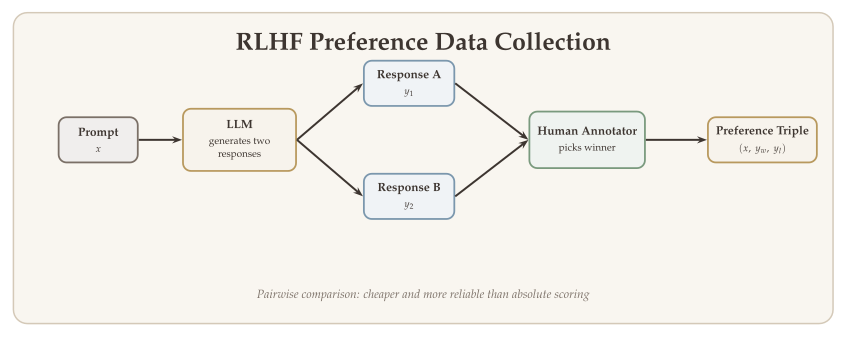

The most consequential application of reinforcement learning in recent years is not a game or a robot --- it is the alignment of large language models (LLMs) with human preferences. Every modern conversational AI system, from ChatGPT to Claude to Gemini, uses RL-based post-training to transform a raw language model into a helpful, harmless, and honest assistant. This lecture develops the theory and algorithms behind this pipeline: from pretraining and supervised finetuning through reward modeling, PPO-based alignment, and Direct Preference Optimization (DPO).

The central insight is that training an LLM can be naturally decomposed into two phases. **Pretraining** teaches the model to predict text (behavior cloning from the internet). **Post-training** uses RL to optimize the model's behavior according to human judgments of quality --- a problem that maps directly onto the MDP and policy optimization frameworks developed earlier in this course. We also examine the side effects of RLHF --- length bias, annotator bias, and reward hacking --- which motivate the move to verifiable rewards in the next chapter.

::: {.callout-important}
## The Central Question
*How can we align a pretrained language model with human preferences using reinforcement learning, and what are the trade-offs of different preference optimization algorithms?*
:::

## What Will Be Covered {#sec-overview}

- **Transformer decoder recap:** The architecture of a decoder-only LLM --- self-attention, multi-head attention, and autoregressive generation.
- **LLM training pipeline:** Pretraining (next-token prediction) and supervised finetuning (SFT) as imitation learning, with rigorous loss functions.
- **SFT data quality:** What makes good finetuning data, the LIMA finding, and the superficial alignment hypothesis.
- **From imitation to optimization:** Why imitating demonstrations is not enough, and the generation--verification gap that makes scalar feedback so powerful.
- **Why RLHF?** The gap between predicting text and producing helpful responses, and why RL is needed to close it.
- **RLHF data collection:** Pairwise feedback, LM-generated feedback, Constitutional AI, and outcome vs. process reward models.
- **The InstructGPT pipeline:** Data collection, reward model training, and PPO optimization.
- **Reward modeling:** The Bradley--Terry model for learning human preferences.
- **Contextual bandit interpretation:** Human labeling as entropy-regularized reward maximization, and the connection to maximum-entropy inverse RL.
- **PPO for LLMs:** The MDP formulation of text generation, actor-critic architecture, and the KL-regularized policy optimization objective.
- **PPO practical challenges:** The four-model burden, memory costs, and training instability.
- **Direct Preference Optimization (DPO):** Bypassing the reward model by reparameterizing the reward in terms of the policy.
- **Side effects of RLHF:** Length bias, annotator bias, reward hacking, and open questions.

## Transformer Decoder Recap {#sec-transformer-recap}

Before developing the RL pipeline, we briefly review the transformer decoder architecture that underlies all modern LLMs. A decoder-only LLM is a **conditional probability machine**: given a sequence of tokens $z_{1:t}$, it outputs a distribution over the next token:

$$
\mathbb{P}_{\text{LLM}}(z_{t+1} = \cdot \mid \text{prompt} = z_{1:t}).
$$

### Architecture {#sec-architecture}

The transformer decoder processes an input token sequence through the following components:

1. **Token and position embedding:** Each discrete token $z_t$ is mapped to a continuous vector $x_t = W_E z_t + \text{pe}_t \in \mathbb{R}^d$, where $W_E \in \mathbb{R}^{d \times V}$ is the embedding matrix ($V$ = vocabulary size) and $\text{pe}_t$ is a positional embedding.

2. **Softmax self-attention:** Given input vectors $z_1, \ldots, z_L \in \mathbb{R}^d$, each position $\ell$ computes:

$$
v_\ell = V z_\ell, \quad k_\ell = K z_\ell, \quad q_\ell = Q z_\ell, \qquad V, K, Q \in \mathbb{R}^{D \times d},
$$

and the attention output is a weighted average of values:

$$
p_\ell(j) = \frac{\exp(\langle q_\ell, k_j \rangle / \sqrt{d})}{\sum_{i=1}^{L} \exp(\langle q_\ell, k_i \rangle / \sqrt{d})}, \qquad \bar{z}_\ell = \sum_{j=1}^{L} p_\ell(j) \cdot v_j.
$$ {#eq-self-attention}

In a decoder, **causal masking** restricts attention so that position $\ell$ can only attend to positions $j \leq \ell$. This ensures that during generation, the model never peeks at future tokens --- the prediction of $w_{\ell+1}$ depends only on the tokens seen so far, exactly matching the autoregressive factorization $P(w_{\ell+1} \mid w_1, \ldots, w_\ell)$.

3. **Multi-head self-attention:** $H$ parallel attention heads $\{V^{(h)}, K^{(h)}, Q^{(h)}\}_{h \in [H]}$ operate on different subspaces. Their outputs are combined via output matrices $O^{(h)} \in \mathbb{R}^{d' \times d}$:

$$
\bar{z}_\ell = \sum_{h=1}^{H} O^{(h)} \bar{z}_\ell^{(h)}, \qquad \bar{z}_\ell^{(h)} = \sum_{j=1}^{L} p_\ell^{(h)}(j) \cdot v_j^{(h)}.
$$ {#eq-multi-head}

4. **Feedforward layer + residual connection:** A two-layer MLP adds nonlinearity, and residual connections ease gradient flow: $x \mapsto x + \text{MLP}(\text{Attention}(x))$.

5. **Layer normalization:** Normalizes each feature vector to stabilize training.

6. **Softmax output:** The final feature vector is mapped to logits over the vocabulary via an unembedding matrix $W_U \in \mathbb{R}^{V \times d}$, then converted to probabilities via softmax.

### Autoregressive Generation {#sec-generation}

An LLM generates text one token at a time. Starting from an initial prompt $\text{pt} = \{z_1, \ldots, z_K\}$:

1. Sample $z_{t+1} \sim \mathbb{P}_{\text{LLM}}(\cdot \mid z_{1:t})$.
2. Append $z_{t+1}$ to the sequence.
3. Repeat until $z_{t+1} = \text{[EOS]}$ (end of sequence).

The probability over the full generated sequence factorizes autoregressively:

$$
\mathbb{P}_{\text{LLM}}(z_{K+1:T} \mid z_{1:K}) = \prod_{t=K}^{T-1} \mathbb{P}_{\text{LLM}}(z_{t+1} \mid z_{1:t}).
$$ {#eq-autoregressive}

::: {.callout-note appearance="simple"}
**Temperature scaling:** The sampling distribution can be sharpened or flattened by dividing the logits by a temperature parameter $\tau > 0$ before softmax: $\text{prob} = \text{Softmax}(\text{logits} / \tau)$. Setting $\tau \to 0$ recovers greedy decoding ($z_{t+1} = \arg\max_z [\text{logit}]_z$).
:::

## The LLM Training Pipeline {#sec-pipeline}

### Pretraining {#sec-pretraining}

**Pretraining** trains the LLM on a massive corpus of text (books, websites, code) using **next-token prediction**. Given a document $\{z_1, z_2, \ldots, z_{T+1}\}$, the loss is:

$$
L(\theta) = -\sum_{t=1}^{T} \log \mathbb{P}_\theta(z_{t+1} \mid z_{1:t}).
$$ {#eq-pretraining-loss}

This is maximum likelihood estimation (MLE), or equivalently, **behavior cloning** from the data distribution --- the model imitates the patterns in the training corpus without any notion of task performance.

Concretely, for each position $t$, the transformer computes a logit vector $f_{\text{NN}}(z_{1:t}) \in \mathbb{R}^V$ (one entry per vocabulary token), and the loss at position $t$ is the cross-entropy between the softmax of this logit vector and the one-hot encoding of the true next token $z_{t+1}$:

$$
-\log \mathbb{P}_\theta(z_{t+1} \mid z_{1:t}) = -[f_{\text{NN}}(z_{1:t})]_{z_{t+1}} + \log \sum_{z \in \text{Vocab}} \exp\bigl([f_{\text{NN}}(z_{1:t})]_z\bigr).
$$ {#eq-pretraining-loss-explicit}

### Supervised Finetuning (SFT) {#sec-sft}

After pretraining, the model can generate fluent text but does not reliably follow instructions. **Supervised finetuning** further trains the model on a curated dataset of (question, answer) pairs $\{(q_i, a_i)\}_{i \in [N]}$:

$$
L(\theta) = -\sum_{i=1}^{N} \log \mathbb{P}_\theta(a_i \mid q_i).
$$ {#eq-sft-loss}

This is again imitation learning: the model learns to imitate the demonstration answers. For SFT on classification tasks (e.g., spam detection), the prediction head is modified: the original linear output layer ($d \to V$) is replaced with a task-specific head ($d \to C$, where $C$ is the number of classes). The bottom layers of the pretrained model serve as a **feature extractor** and can be frozen or finetuned.

::: {.callout-note appearance="simple"}
Both pretraining and SFT are forms of **imitation learning** (behavior cloning). The key difference is the data source: pretraining uses raw internet text, while SFT uses curated instruction--response pairs. Neither stage involves reinforcement learning.
:::

{#fig-llm-training-pipeline width="80%"}

## SFT Data Quality {#sec-sft-data-quality}

The quality and composition of the SFT dataset has an outsized impact on the resulting model. Several large-scale instruction-tuning datasets have been developed:

- **FLAN** (Wei et al., 2022): Instruction tuning at scale --- thousands of NLP tasks reformulated as instruction--response pairs, demonstrating that diverse instructions improve zero-shot generalization.
- **Alpaca** (Taori et al., 2023): 52,000 instruction--response pairs generated by GPT-3.5, showing that synthetic data from a strong model can cheaply produce a capable instruction follower.
- **OpenAssistant** (Köpf et al., 2023): A crowdsourced, multi-turn conversation dataset with human quality ratings.
- **ShareGPT**: User-shared conversations with ChatGPT, providing naturalistic instruction--response pairs from real usage.

### The LIMA Finding {#sec-lima}

A striking result from Zhou et al. (2023) challenges the assumption that more SFT data is always better. **LIMA** (Less Is More for Alignment) finetunes a 65B-parameter LLaMA model on only **1,000 carefully curated examples** and achieves performance comparable to models trained on orders of magnitude more data. Human evaluators preferred LIMA's outputs over those of Alpaca (52K examples) in the majority of comparisons.

This suggests a **superficial alignment hypothesis**: SFT primarily teaches the model *format and style* --- how to structure a response, when to use bullet points, how to be concise --- rather than new knowledge. The factual knowledge and reasoning capabilities come overwhelmingly from pretraining. A small number of high-quality examples suffices to "unlock" these capabilities in the instruction-following format.

::: {.callout-tip}
## Hallucination Risk
If the SFT dataset contains facts not present in the pretraining data, the model learns to confidently generate information it has no basis for --- this is a major source of **hallucination**. The safest SFT data elicits knowledge the model already has, rather than teaching new facts. An emerging practice called **midtraining** --- continued pretraining on curated, domain-specific text before SFT --- aims to expand the model's knowledge base before the alignment stage.
:::

## From Imitation to Optimization {#sec-imitation-to-optimization}

SFT and RLHF solve fundamentally different problems. Understanding the distinction is key to appreciating why RL is necessary.

**SFT is imitation.** The objective is to match the data distribution:

$$
\min_\pi \; \text{KL}\bigl(\widehat{p}(\cdot \mid x) \,\|\, \pi(\cdot \mid x)\bigr),
$$ {#eq-sft-as-imitation}

where $\widehat{p}$ is the empirical distribution of demonstration responses. The model learns to produce outputs that *look like* the training data. This is behavior cloning, subject to the same fundamental limitation as in robotics (Chapter 1): the model can only be as good as the demonstrations it imitates.

**RLHF is optimization.** The objective is to maximize a quality measure:

$$
\max_\pi \; \mathbb{E}_{y \sim \pi(\cdot \mid x)}\bigl[R(x, y)\bigr],
$$ {#eq-rlhf-as-optimization}

where $R(x, y)$ is a reward function capturing human preferences. The model learns to produce outputs that are *judged as high quality*, potentially surpassing the quality of any individual demonstration.

### The Generation--Verification Gap {#sec-generation-verification-gap}

The key insight enabling RLHF is the **generation--verification gap**: it is much easier to *judge* quality than to *produce* it. A chess amateur can reliably tell which of two positions is stronger, even though they cannot play at grandmaster level. A reader can judge which of two essays is more coherent, even though they could not write either one. This asymmetry means that **scalar feedback** (which response is better?) is both cheaper to collect and more informative than **demonstration data** (write a perfect response).

Because verification is easier than generation, human preference judgments can guide the model beyond the quality frontier of the demonstration data. This is impossible with pure imitation --- SFT can only approach the average quality of the demonstrations, never exceed it.

{#fig-generation-verification-gap width="65%"}

## Why RLHF? {#sec-why-rlhf}

After SFT, the model can follow instructions, but it may still produce responses that are unhelpful, incorrect, verbose, or harmful. The core problem is that imitation learning optimizes for **matching the data distribution**, not for **producing high-quality responses**.

RLHF (Reinforcement Learning from Human Feedback) addresses this by:

- **Aligning with human values:** Teaching the model to produce responses that humans judge as helpful and harmless.
- **Improving reasoning capabilities:** RL-based training can elicit capabilities beyond what appears in the SFT data.

The post-training adaptation enables the model to:

- Follow natural language instructions reliably.
- Avoid harmful or misleading outputs.
- Respond according to human preference rather than simply mimicking training data.
- Improve core skills like reasoning and code generation.

## The InstructGPT Pipeline {#sec-instructgpt}

The InstructGPT approach (Ouyang et al., 2022) established the standard RLHF pipeline with three stages:

$$
\text{Base Model} \;\xrightarrow{\text{SFT}}\; \text{SFT Model} \;\xrightarrow{\text{Reward Model}}\; \text{RM} \;\xrightarrow{\text{PPO}}\; \text{Aligned Model}
$$

1. **Collect demonstration data and train an SFT model** (supervised finetuning on $\sim$10k human-written instruction--response pairs).
2. **Collect comparison data and train a reward model** (human labelers rank model outputs; $\sim$100k comparisons).
3. **Optimize the policy against the reward model using PPO** (reinforcement learning).

## RLHF Data Collection {#sec-rlhf-data-collection}

### Pairwise Preference Feedback {#sec-pairwise-feedback}

The standard approach to collecting RLHF data is **pairwise comparison**: given a prompt $x$ and two model responses $y_1, y_2$, a human annotator selects the better one. The InstructGPT guidelines instruct annotators to evaluate responses along three axes:

1. **Helpful:** Does the response address the user's request?
2. **Truthful:** Is the response factually accurate? Does it avoid making unsupported claims?
3. **Harmless:** Does the response avoid generating toxic, biased, or dangerous content?

Pairwise comparison is preferred over absolute scoring because it is more **reliable** --- humans find it easier to say "A is better than B" than to assign a numerical score on a 1--10 scale. However, it is still expensive: InstructGPT required approximately 100,000 pairwise comparisons from a team of trained annotators.

{#fig-rlhf-data-collection width="80%"}

### LM-Generated Feedback {#sec-lm-feedback}

The cost of human annotation has motivated the use of **language models as judges**. Instead of (or in addition to) human labelers, a strong LM evaluates response pairs:

- **GPT-4 as judge:** Zheng et al. (2023) showed that GPT-4's pairwise preferences agree with human annotators at roughly the same rate that two human annotators agree with each other.
- **UltraFeedback** (Cui et al., 2023): A large-scale preference dataset generated by having GPT-4 score and compare responses from multiple models, providing a cheaper alternative to human annotation.

::: {.callout-note appearance="simple"}
Using an LM as a judge introduces its own biases: LMs tend to prefer longer responses, responses in a confident tone, and responses that match their own generation style. These biases propagate into the reward model and ultimately into the aligned policy.
:::

### Constitutional AI {#sec-constitutional-ai}

**Constitutional AI** (Bai et al., 2022) takes LM-generated feedback a step further: instead of collecting any human preference labels, the model **critiques its own outputs** against a set of written principles (a "constitution"). The process is:

1. Generate a response to a prompt.
2. Ask the model to critique the response against each constitutional principle (e.g., "Is this response helpful?" "Could this response be harmful?").
3. Ask the model to revise its response based on the critique.
4. Use the (original, revised) pair as preference data for training.

This approach eliminates human labelers from the feedback loop entirely, relying instead on the model's ability to apply explicit principles. It has proven effective for reducing harmful outputs while maintaining helpfulness.

### Outcome vs. Process Reward Models {#sec-orm-prm-preview}

There are two approaches to reward modeling that differ in **granularity**:

- **Outcome Reward Model (ORM):** Scores the complete response as a whole --- a single scalar for the entire (question, answer) pair. This is the standard approach used in InstructGPT and most RLHF systems.
- **Process Reward Model (PRM):** Scores each intermediate reasoning step. Lightman et al. (2023) showed that PRMs significantly outperform ORMs for mathematical reasoning, because they provide denser supervision and better credit assignment.

We discuss ORMs and PRMs in detail in Chapter 11, where the distinction becomes central to training reasoning models.

## Step 1: Data Collection and Reward Model {#sec-reward-model}

### Preference Data {#sec-preference-data}

After the SFT stage, we denote the finetuned model as $\pi^{\text{sft}}(\cdot \mid \cdot)$, a conditional distribution over output sequences. Given a user query $x$, we sample two candidate responses:

$$
y_1, y_2 \stackrel{\text{i.i.d.}}{\sim} \pi^{\text{sft}}(\cdot \mid x).
$$

A human labeler then chooses the **preferred** response:

- $y_c$: the **chosen** (better) response.
- $y_r$: the **rejected** (worse) response.

The resulting dataset is $\mathcal{D} = \{(x^{(i)}, y_c^{(i)}, y_r^{(i)})\}_{i \in [N]}$.

### The Bradley--Terry Model {#sec-bradley-terry}

We assume there exists an underlying **golden reward function** $r^*: (x, y) \to \mathbb{R}$ that scores any response $y$ to question $x$. The **Bradley--Terry model** posits that human preferences follow a logistic model:

$$
\mathbb{P}(y_1 \succ y_2 \mid x) = \sigma\bigl(r^*(x, y_1) - r^*(x, y_2)\bigr),
$$ {#eq-bradley-terry}

where $\sigma(u) = \frac{\exp(u)}{\exp(u) + 1}$ is the logistic (sigmoid) function.

::: {#def-bradley-terry}
## Bradley--Terry Preference Model
Given two responses $y_1$ and $y_2$ to prompt $x$, the probability that a human prefers $y_1$ is:

$$
\mathbb{P}(y_1 \succ y_2 \mid x) = \frac{\exp(r^*(x, y_1))}{\exp(r^*(x, y_1)) + \exp(r^*(x, y_2))}.
$$
:::

### Contextual Bandit Interpretation {#sec-contextual-bandit}

Human labeling can be interpreted as a **contextual bandit** problem:

- **Context:** $s = (x, y_1, y_2)$ (the question and two candidate answers).
- **Action:** $\mathcal{A} = \{\succ, \prec\}$ (which response is better).
- **Reward:** $R(s, a) = r^*(x, y_1) - r^*(x, y_2)$ if $a = \text{``}\succ\text{''}$, and $r^*(x, y_2) - r^*(x, y_1)$ if $a = \text{``}\prec\text{''}$.

Under this formulation, the human labeler's policy is:

$$
\nu(a) = \frac{\exp(R(s, a))}{\sum_{b \in \mathcal{A}} \exp(R(s, b))},
$$

which is exactly the **entropy-regularized greedy policy** --- the optimal policy of an entropy-regularized RL problem.

This connection reveals that learning $r^*$ from human labeling data is equivalent to a problem known as **maximum-entropy inverse RL**: given i.i.d. trajectories from the optimal policy of an entropy-regularized RL problem, recover the underlying reward function.

### Estimating the Reward Model {#sec-reward-estimation}

The reward model $r_\phi$ uses the same transformer architecture as $\pi^{\text{sft}}$, but with a **linear prediction head** that outputs a scalar reward instead of a token distribution. The bottom layers are initialized from the SFT model.

The loss function is the negative log-likelihood under the Bradley--Terry model:

$$
L(r_\phi) = -\mathbb{E}_{(x, y_c, y_r) \sim \mathcal{D}} \bigl[\log \sigma\bigl(r_\phi(x, y_c) - r_\phi(x, y_r)\bigr)\bigr].
$$ {#eq-reward-loss}

::: {.callout-note appearance="simple"}
The reward model $r_\phi$ is evaluated only when the **entire** response has been generated --- it scores complete (question, answer) pairs, not individual tokens. However, as a transformer, it can also process partial sequences (question + partial answer) as input, which is useful for the value function in PPO.
:::

## Step 2: RL Finetuning via PPO {#sec-ppo}

After learning a reward model $r_\phi$, we fix it and optimize the policy using **entropy-regularized RL**.

### Policy Optimization Problem {#sec-policy-objective}

The policy optimization objective is:

$$
\max_\pi \; \mathbb{E}_{x \sim \rho} \Bigl\{ \mathbb{E}_{y \sim \pi(\cdot \mid x)} \bigl[r_\phi(x, y)\bigr] - \eta \cdot \text{KL}\bigl(\pi(\cdot \mid x) \,\|\, \pi^{\text{sft}}(\cdot \mid x)\bigr) \Bigr\},
$$ {#eq-ppo-objective-informal}

where:

- $\rho$ is a dataset of questions (prompts).
- $r_\phi(x, y)$ is the learned reward model.
- The **KL regularization** term ensures the optimized policy $\pi$ stays close to $\pi^{\text{sft}}$, preventing reward hacking and mode collapse.

::: {.callout-note appearance="simple"}
This form is commonly seen but is not fully rigorous, because $y$ is a sequence of tokens and $\pi(\cdot \mid x)$ is a distribution over tokens at each step, so the KL divergence at the sequence level does not directly decompose in this way. We make this precise next.
:::

### MDP Formulation {#sec-mdp-formulation}

To make the optimization rigorous, we formulate text generation as a deterministic MDP:

- **Initial state:** $s_0 = x$ (the question/prompt).
- **Action:** $a_t \in \text{Token Space}$ (the next token to generate).
- **Transition:** $s_{t+1} = s_t \cup \{a_t\}$ --- deterministic, just appending the token to the sequence.
- **Termination:** The episode ends when $a_t = \text{[EOS]}$ (end-of-sequence token), at which point $r_t = r_\phi(s_{t+1})$. Otherwise, $r_t = 0$.

This is a **deterministic transition, sparse reward** MDP. The state at time $t$ is:

$$
s_t = (s_1, \; a_1, a_2, \ldots, a_t),
$$

consisting of the question followed by the first $t$ tokens of the answer.

The rigorous policy optimization objective becomes:

$$
\max_\pi \; \mathbb{E}_{s_1 \sim \rho} \; \mathbb{E}_{a_t \sim \pi(\cdot \mid s_t)} \left[\sum_{t \geq 1} r_t - \eta \cdot \text{KL}\bigl(\pi(\cdot \mid s_t) \,\|\, \pi^{\text{sft}}(\cdot \mid s_t)\bigr)\right],
$$ {#eq-ppo-objective-rigorous}

where:

- $\sum_{t \geq 1} r_t = r_\phi(s_1, y)$ with $y = (a_1, \ldots, a_T)$ being the full answer.
- The KL regularization is evaluated **per token** over the trajectory: $\text{KL} = \mathbb{E}_{\{s_t\} \sim \pi(\cdot \mid s_1)} \left[\eta \sum_{t \geq 1} \text{KL}\bigl(\pi(\cdot \mid s_t) \,\|\, \pi^{\text{ref}}(\cdot \mid s_t)\bigr)\right]$.

### Actor-Critic for PPO {#sec-actor-critic}

The optimization is solved using **PPO + online RL** with a fixed reward model. This requires training both an **actor model** (the policy) and a **critic model** (the value function).

**Critic model:** The critic $V_\delta(s_t)$ maps the state $s_t = (s_1, a_1, \ldots, a_t)$ to a scalar estimate of the cumulative reward:

$$
R(s_1) = -\eta \sum_{t=1}^{T} \log \frac{\pi(a_t \mid s_t)}{\pi^{\text{sft}}(a_t \mid s_t)} + r_\phi(x, y),
$$

which is the cumulative reward over the episode (including KL regularization). The critic is initialized from the SFT model.

**Critic loss:** Sample $x = s_1 \sim \rho$, generate $y = (a_1, \ldots, a_T) \sim \pi^{\text{old}}$ (the rollout policy), and minimize:

$$
L_{\text{critic}}(\delta) = \sum_{t=1}^{T} \bigl(V_\delta(s_t) - R(s_1)\bigr)^2.
$$ {#eq-critic-loss}

**Actor loss (PPO with GAE):** The actor is updated using the clipped PPO objective with **generalized advantage estimation** (GAE):

$$
L_{\text{actor}}(\pi) = \mathbb{E}_{\substack{x \sim \rho \\ y \sim \pi^{\text{old}}(\cdot \mid x)}} \left[\sum_{t=1}^{T} \min\bigl\{r_t(\pi) \cdot A_t, \; \text{clip}\bigl(r_t(\pi), 1-\varepsilon, 1+\varepsilon\bigr) \cdot A_t\bigr\}\right],
$$ {#eq-actor-loss}

where:

- $r_t(\pi) = \frac{\pi(a_t \mid s_t)}{\pi^{\text{old}}(a_t \mid s_t)}$ is the importance sampling ratio.
- $A_t$ is the **generalized advantage estimation**, computed based on the trajectory $(x, y)$ and the critic's value predictions.

## PPO: Practical Challenges {#sec-ppo-challenges}

While PPO is the standard algorithm for RLHF, it presents significant practical difficulties that motivate simpler alternatives:

1. **Four models simultaneously.** PPO requires maintaining four large language models in memory during training:
   - The **policy** $\pi_\theta$ (being trained).
   - The **reference policy** $\pi^{\text{sft}}$ (frozen SFT model, for KL computation).
   - The **reward model** $r_\phi$ (frozen, for scoring responses).
   - The **value function** $V_\delta$ (critic, being trained alongside the policy).

2. **Memory: $\sim$4$\times$ the cost of SFT.** Storing four copies of a large model (plus their optimizer states for the two being trained) requires roughly four times the GPU memory of supervised finetuning.

3. **Very finicky.** PPO is sensitive to hyperparameters: the KL coefficient $\eta$, the clipping parameter $\varepsilon$, the learning rates for actor and critic, and the quality of the reward model all interact in complex ways. Small changes can cause training instability, reward hacking, or mode collapse.

4. **On-policy: expensive rollouts.** PPO is an on-policy algorithm --- it must generate fresh responses from the current policy at each training step. This means running full autoregressive generation (which is slow for LLMs) interleaved with gradient updates. Off-policy approaches like DPO avoid this cost entirely.

{#fig-ppo-four-models width="75%"}

::: {.callout-note appearance="simple"}
These challenges have driven the field toward simpler alternatives: DPO (which eliminates the reward model and critic) and GRPO (which eliminates the critic while keeping the reward model). We cover DPO next; GRPO is developed in Chapter 11.
:::

## Direct Preference Optimization (DPO) {#sec-dpo}

PPO is effective but difficult to train --- it requires maintaining four models simultaneously (policy, reference, reward, and value). **Direct Preference Optimization** (DPO; Rafailov et al., 2023) sidesteps this complexity by reducing the problem to supervised learning on preference data.

### Key Idea {#sec-dpo-idea}

Consider the entropy-regularized optimization problem:

$$
\max_{\pi(\cdot \mid x)} \; \mathbb{E}_{y \sim \pi(\cdot \mid x)} \bigl[r(x, y)\bigr] - \eta \cdot \text{KL}\bigl(\pi(\cdot \mid x) \,\|\, \pi^{\text{sft}}(\cdot \mid x)\bigr).
$$

This has a closed-form solution:

$$
\pi^{\text{new}}(y \mid x) = \frac{\pi^{\text{sft}}(y \mid x) \cdot \exp\bigl(\frac{1}{\eta} r(x, y)\bigr)}{Z(x)},
$$ {#eq-dpo-optimal-policy}

where $Z(x) = \sum_y \pi^{\text{sft}}(y \mid x) \cdot \exp\bigl(\frac{1}{\eta} r(x, y)\bigr)$ is a normalization constant.

### Reward Reparameterization {#sec-dpo-reparameterization}

Rearranging ([-@eq-dpo-optimal-policy]), we can express the reward in terms of the policy:

$$
r(x, y) = \eta \cdot \log \frac{\pi^{\text{new}}(y \mid x)}{\pi^{\text{sft}}(y \mid x)} + \eta \cdot \log Z(x).
$$ {#eq-reward-reparameterization}

Since $\log Z(x)$ is independent of $y$, the **reward difference** between two responses cancels it:

$$
r(x, y_c) - r(x, y_r) = \eta \cdot \log \frac{\pi(y_c \mid x)}{\pi^{\text{sft}}(y_c \mid x)} - \eta \cdot \log \frac{\pi(y_r \mid x)}{\pi^{\text{sft}}(y_r \mid x)}.
$$

### The DPO Loss {#sec-dpo-loss}

Substituting into the Bradley--Terry log-likelihood, we obtain the **DPO loss**:

$$
L_{\text{DPO}}(\pi) = -\mathbb{E}_{(x, y_c, y_r) \sim \mathcal{D}} \left[\log \sigma\!\left(\eta \cdot \log \frac{\pi(y_c \mid x)}{\pi^{\text{sft}}(y_c \mid x)} - \eta \cdot \log \frac{\pi(y_r \mid x)}{\pi^{\text{sft}}(y_r \mid x)}\right)\right].
$$ {#eq-dpo-loss}

::: {.callout-tip}
## DPO vs. PPO
- **DPO is computationally easier and more stable** than PPO: it only requires the policy and a frozen reference model, with no reward model or critic.
- **Mathematically equivalent** to PPO + reward modeling in the population (infinite data) case.
- **DPO is offline** (trains on a fixed dataset) while **PPO is online** (generates new samples during training).
- **In practice, PPO often outperforms DPO** when trained properly, mainly because the offline dataset in DPO has insufficient coverage of the policy's own distribution.
- **Empirical comparison:** On the AlpacaFarm benchmark, PPO achieves a 46.8% win rate and DPO achieves 46.8% (simulated) --- essentially tied. Most top open-source RLHF models use DPO due to its simplicity, making it the default for academic and open-source alignment work.
:::

{#fig-dpo-vs-ppo width="80%"}

## Side Effects of RLHF {#sec-side-effects}

RLHF is effective but not without costs. Understanding the side effects of preference optimization is important both for practitioners and for evaluating alignment claims.

{#fig-rlhf-side-effects width="60%"}

### Length Effects {#sec-length-effects}

RLHF strongly increases response length. Reward models tend to correlate length with quality: longer, more detailed responses score higher. As a result, RLHF-trained models produce responses that are substantially longer than their SFT counterparts. Singhal et al. (2024) document a strong Pareto front: win-rate against the SFT model increases with response length, and much of the apparent "improvement" from RLHF is simply "similar output, but much longer / more details." Disentangling genuine quality improvement from length inflation remains an open problem, particularly because pairwise human judgments are themselves biased toward longer responses.

### Annotator Bias and Style {#sec-annotator-bias}

The demographics and preferences of human annotators leak into the aligned model:

- **Cultural and political biases:** Religious, political, and cultural preferences of the annotator pool shift model behavior. Different annotator populations produce meaningfully different reward models, and therefore different aligned models.
- **Factuality underestimation:** Human annotators tend to underestimate factual errors and inconsistencies in model outputs. Assertive, confident-sounding text fools annotators into rating it higher, even when it contains factual mistakes.
- **Style over substance:** Annotators' quality judgments are heavily influenced by surface-level style preferences --- lists, bullet points, and structured formatting dominate over actual content quality.

This raises a fundamental question: **whose preferences are we optimizing?** The aligned model reflects the biases of its annotator pool, not some objective notion of helpfulness.

### Reward Hacking {#sec-reward-hacking}

As the policy optimizes against the reward model, it discovers and exploits flaws in the reward model's judgments:

- Longer responses receive higher reward (but are not genuinely better).
- Confident-sounding nonsense scores well --- the reward model cannot reliably distinguish confident correctness from confident error.
- The KL penalty mitigates reward hacking by keeping the policy close to the SFT model, but does not eliminate it.

### Open Questions {#sec-open-questions}

Several fundamental questions about RLHF remain unresolved:

- **On-policy vs. off-policy:** Is the expensive on-policy generation of PPO truly necessary, or can off-policy methods like DPO achieve the same quality? Evidence is mixed.
- **Multi-objective alignment:** How do we optimize for multiple, sometimes conflicting objectives (helpful AND harmless AND honest)? Current methods use a single scalar reward, which conflates these goals.
- **Iterative/online DPO:** Can DPO be made iterative --- generate new preference data from the current policy, retrain, repeat --- to close the gap with PPO?
- **Beyond pairwise comparisons:** Can we move beyond binary preference data to richer feedback signals (rankings, natural language critiques, process-level annotations)?

These questions motivate the move toward **verifiable rewards** --- objective, non-gameable reward signals --- which we develop in the next chapter.

## Summary: From SFT to DPO {#sec-summary}

The two main approaches to post-training LLMs each make different tradeoffs:

| | **PPO (RLHF)** | **DPO** |
|---|---|---|
| **Requires reward model** | Yes | No |
| **Requires critic/value model** | Yes | No |
| **Online/Offline** | Online | Offline |
| **Models at training time** | 4 (policy, reference, reward, value) | 2 (policy, reference) |
| **Stability** | Harder to tune | More stable |
| **Sample efficiency** | Higher (online) | Lower (offline) |

For algorithms that eliminate the value model while retaining online generation --- GRPO and its variants --- see Chapter 11, which also covers the application of RL to reasoning models with verifiable rewards.

## References {#sec-references}

- Ouyang, L. et al. (2022). Training language models to follow instructions with human feedback. *NeurIPS*.
- Rafailov, R. et al. (2023). Direct preference optimization: Your language model is secretly a reward model. *NeurIPS*.
- Zhou, C. et al. (2023). LIMA: Less is more for alignment. *NeurIPS*.
- Bai, Y. et al. (2022). Constitutional AI: Harmlessness from AI feedback. *arXiv preprint*.
- Lightman, H. et al. (2023). Let's verify step by step. *arXiv preprint*.
- Singhal, P. et al. (2024). A long way to go: Investigating length correlations in RLHF. *arXiv preprint*.
- Zheng, L. et al. (2023). Judging LLM-as-a-judge with MT-Bench and Chatbot Arena. *NeurIPS*.
- Lambert, N. (2025). The State of Post-Training. *Talk*.
- LLM Post-Training: A Deep Dive into Reasoning Large Language Models (2025).

## Appendix: Transformer Architectures {#sec-appendix-transformers}

This appendix provides a comprehensive, self-contained introduction to transformer architectures. It covers motivations, a taxonomy of transformer-based language models, and builds the architecture component by component --- from token embeddings and attention mechanisms through multi-head attention, positional encodings, feedforward layers, residual connections, and layer normalization. It concludes with exercises on parameter counting (GPT-3) and a mathematical framework for analyzing transformer circuits.

### What Will Be Covered {#sec-app-overview}

- **Motivations:** Why transformers are revolutionary --- large language models, vision transformers, and applications beyond NLP.
- **Language tasks:** Generative tasks (conditional generation) versus discriminative tasks (classification).
- **Three types of transformer-based language models:** Encoder-only, decoder-only, and encoder-decoder architectures.
- **Transformer architecture in detail:** The forward function from input tokens to output predictions.
- **Prediction head and loss function:** Softmax decoding, cross-entropy loss, and maximum likelihood estimation.
- **Token embeddings:** One-hot encoding, word embeddings (Word2Vec, GloVe), and the embedding matrix.
- **Attention mechanism:** Cross-attention, self-attention, and the matrix form of scaled dot-product attention.
- **Three caveats and their solutions:** Position embeddings, causal masking, and feedforward (MLP) layers.
- **Multi-head attention:** Parallel attention heads and the output projection matrix.
- **Residual connections and layer normalization:** Training stability via pre-norm and post-norm designs.
- **Putting it all together:** The complete transformer decoder block.
- **Key model examples:** BERT (encoder-only), Vision Transformer (encoder-only), GPT (decoder-only), and encoder-decoder models (T5).
- **Exercises:** GPT-3 parameter counting and transformer circuits with the residual stream framework.

### Motivations {#sec-motivations}

Transformer models are revolutionary. The seminal paper "Attention Is All You Need" (Vaswani et al., 2017) introduced the transformer architecture, replacing recurrent and convolutional sequence-to-sequence models with a purely attention-based design. This architectural shift enabled unprecedented parallelism during training and led to dramatic scaling of model size and capability.

Today, transformer-based models dominate the LMSYS Chatbot Arena Leaderboard (Chiang et al., 2024), with the top-ranked models including GPT-4 (OpenAI), Claude 3 (Anthropic), Gemini (Google), and Llama 3 (Meta). These models power conversational AI systems used by hundreds of millions of people worldwide.

::: {.callout-note appearance="simple"}
Transformers have proven remarkably versatile, achieving state-of-the-art results far beyond natural language processing.
:::

#### Transformers beyond NLP {#sec-beyond-nlp}

The transformer architecture has demonstrated impressive performance across a wide range of domains:

- **Protein folding:** AlphaFold2 (Jumper et al., 2021) uses transformer-based attention mechanisms to predict 3D protein structures with remarkable accuracy, a breakthrough published on the cover of *Nature*.
- **Image classification:** The Vision Transformer (ViT) (Dosovitskiy et al., 2020) applies the standard transformer encoder to sequences of image patches, outperforming ResNet-based baselines with substantially less compute.
- **ML for systems:** Zhou et al. (2020) showed that a transformer-based compiler model (GO-one) can speed up the compilation of other transformer models, demonstrating the power of ML-for-systems approaches.

#### Language Tasks {#sec-language-tasks}

Before diving into transformer architectures, it is helpful to distinguish the two broad categories of language tasks:

1. **Generative tasks (conditional generation):** The model generates text conditioned on some input (text or image). Examples include translation and code generation. The goal is to model $P(\text{text} \mid \text{text/image})$.

2. **Discriminative tasks (classification):** The model predicts a label given text input. Examples include part-of-speech tagging and sentiment analysis. The goal is to model $P(\text{label} \mid \text{text})$.

Different transformer architectures are designed to handle these different task types, as we discuss next.

### Three Types of Transformer-Based Language Models {#sec-three-types}

Transformer-based language models come in three major architectural variants, each suited to different task types. Understanding the distinctions between them is essential for choosing the right architecture for a given application.

#### Encoder-Only Transformers {#sec-encoder-only}

The first task type is **feature extraction followed by downstream discriminative tasks**. Encoder-only transformers are designed for this purpose.

- **Input:** A sequence of tokens $w_1, \ldots, w_L$, where $L$ is the sequence length.
- **Output:** A sequence of feature vectors $z_1, z_2, \ldots, z_L \in \mathbb{R}^d$.
- **Key characteristic:** Each feature $z_\ell$ depends on the **entire** input sequence $\{w_1, \ldots, w_L\}$ for all $\ell \in [L]$.

The encoder-only transformer creates a sequence of token-level features of the input, which are then used for downstream tasks. These downstream tasks are trained separately using the extracted features:

- **Token-level tasks:** Part-of-speech classification --- use each $z_\ell$ to predict the label of $w_\ell$.
- **Sentence-level tasks:** Sentiment analysis --- aggregate $z_1, \ldots, z_L$ and feed into a classifier.

**Key examples:** BERT (Devlin et al., 2018), Vision Transformer (ViT) (Dosovitskiy et al., 2020).

#### Decoder-Only Transformers {#sec-decoder-only}

The second task type is **(conditional) autoregressive generation**. Decoder-only transformers are designed for this purpose.

- **Input:** A sequence of tokens $w_1, w_2, \ldots, w_L$.
- **Output:** A sequence of features $z_1, z_2, \ldots, z_L$.
- **Key characteristic:** Each feature $z_\ell$ depends **only** on $w_1, w_2, \ldots, w_\ell$ (the model cannot look into the future --- this is the autoregressive property).
- The model predicts $w_{\ell+1}$ using $z_\ell$ only, via a **softmax prediction layer**.

**Key examples:** The GPT family (GPT-2, GPT-3, GPT-4), Llama, Mistral.

##### Autoregressive LLMs: Predict the Next Token {#sec-autoregressive-llm}

The core task of a decoder-only transformer is next-token prediction. Given a context, the model outputs a probability distribution over the vocabulary for the next token:

$$
\text{``I''} \quad \text{``am''} \quad \text{``a''} \quad \text{``Yale''} \quad ? \quad \Longrightarrow \quad P(w_5 \mid w_{1:4})
$$

An **autoregressive LLM** is defined as:

$$
\text{Autoregressive LLM} = \text{Decoder-only TF} + \text{Prediction Head}
$$

which models $P_\theta(w_{L+1} \mid w_1, \ldots, w_L)$.

##### Autoregressive Generation {#sec-autoregressive-generation}

During generation, the model produces tokens one at a time, each conditioned on all previously generated tokens. For example, given the prompt "My name is X.":

$$
\begin{aligned}
&P(\text{``I''} \mid \text{prompt} = \text{``My name is X.''}) \\
&P(\text{``am''} \mid \text{prompt} = \text{``My name is X. I''}) \\
&P(\text{``a''} \mid \text{prompt} = \text{``My name is X. I am''}) \\
&P(\text{``Yale''} \mid \text{prompt} = \text{``My name is X. I am a''}) \\
&P(\text{``student''} \mid \text{prompt} = \text{``My name is X. I am a Yale''})
\end{aligned}
$$

At each step, the model outputs $P_\theta(\text{next word} \mid \text{prompt})$. The input tokens are fed in, and the output tokens are generated autoregressively --- each new output is appended to the input for the next step.

#### Encoder-Decoder Transformers {#sec-encoder-decoder}

The third model type is the **encoder-decoder transformer** --- the original transformer architecture from Vaswani et al. (2017).

- **Task:** Machine translation (and other conditional generation tasks).
- **Architecture:** The encoder processes the input sequence into features, and the decoder generates the output sequence autoregressively, attending to the encoder's features via cross-attention.

For example, in machine translation: the encoder processes ("Hello", "world", "!") into features, and the decoder generates ("Bonjour", "le", "monde", "!") one token at a time. At each decoding step, the decoder attends to the full encoder output while generating the next target token.

::: {.callout-tip}
### Remark: Current Popularity of Architectures
Encoder-decoder models and encoder-only LLMs are not popular today. **Decoder-only** models are by far the most popular --- the GPT family, Llama, Mistral, and others all use this architecture. Decoder-only models can perform discriminative tasks as well (via prompting). The main exception is the Vision Transformer (ViT), which uses an encoder-only architecture.
:::

{#fig-transformer-three-types width="90%"}

### Architectures of Transformers {#sec-architectures}

This is the most important and most technically involved part of this lecture. There are many components in transformer neural networks, and to understand the architecture we need to understand the **forward function**: how an input language token sequence is transformed into the output.

#### Mental Picture {#sec-mental-picture}

The high-level data flow through a transformer is:

$$
\underbrace{w_1, w_2, \ldots, w_L}_{\text{Input tokens } (L \times V)} \;\longrightarrow\; \boxed{\text{Transformer}} \;\longrightarrow\; \underbrace{z_1, z_2, \ldots, z_L}_{\text{Features } (L \times d)} \;\longrightarrow\; \boxed{\text{Prediction Layer}} \;\longrightarrow\; \underbrace{\ell_1, \ell_2, \ldots, \ell_L}_{\text{Loss}}
$$

where the transformer block contains:

- **Embedding** (token + position)
- **Multi-head attention**
- **MLP (feedforward) layers**
- **Layer normalization**
- **Residual connections**

For reference, GPT-3 uses the following dimensions:

| Symbol | Meaning | GPT-3 Value |
|--------|---------|-------------|
| $V$ | Vocabulary size | 50,257 |
| $d$ | Model dimension | 12,288 |
| $L$ | Sequence length (context window) | 2,048 |

::: {.callout-note appearance="simple"}
The prediction layer (often called the **prediction head**) is chosen depending on the task. It is possible to have a single loss (e.g., for classifying a sentence) or a per-token loss (e.g., for next-token prediction).
:::

{#fig-transformer-decoder-overview width="90%"}

We now describe each component in detail.

#### Prediction Head {#sec-prediction-head}

The prediction head is designed according to the task and determines the loss function.

**For discriminative tasks**, we choose the corresponding loss:

- **Sentiment analysis:** Aggregate $z_1, \ldots, z_L$ (e.g., $z = \frac{1}{L}\sum_{\ell=1}^{L} z_\ell$), then feed into a softmax linear classifier: $P(\text{positive} \mid z) \propto \exp(w^\top z)$.
- **Part-of-speech classification:** Use each $z_\ell$ to predict the label of $w_\ell$ via softmax linear multi-class classification.

**For autoregressive generation:** Use $z_\ell$ to predict $w_{\ell+1}$ via softmax linear classification.

##### Output Distribution: Decoding (Unembedding) + Softmax {#sec-softmax}

To convert the transformer's feature vector into a probability distribution over the vocabulary, we need two ingredients: a decoding (unembedding) matrix and the softmax function.

The **softmax function** converts any $N$ real numbers $\{v_i\}_{i \in [N]}$ into a probability distribution over $[N] = \{1, \ldots, N\}$:

::: {#def-softmax}
### Softmax Function
For any $N$ real numbers $\{v_i\}_{i \in [N]}$, the softmax function produces a probability distribution $P \in \mathbb{R}^N$ defined by:

$$
P(i) = \frac{\exp(v_i)}{\sum_{j=1}^{N} \exp(v_j)}.
$$

Equivalently, we write $P(i) \propto \exp(v_i)$.
:::

The key insight is that softmax always gives us a valid probability distribution: all entries are non-negative and sum to one.

Now, at each position $\ell$, the transformer outputs a feature vector $z_\ell \in \mathbb{R}^d$. To produce a distribution over the vocabulary $[N]$ (where $N = V$), we use a **decoding matrix** (also called the **unembedding matrix**) $W_U \in \mathbb{R}^{N \times d}$:

$$
z_\ell \in \mathbb{R}^d \;\xrightarrow{W_U}\; W_U z_\ell \in \mathbb{R}^N \;\xrightarrow{\text{Softmax}}\; \text{distribution over } [N].
$$

This is a **softmax linear model**: a linear mapping followed by softmax normalization.

#### Loss Function for Decoder-Only Models {#sec-loss-function}

With the prediction head defined, we can now specify the training objective for decoder-only models.

At each token position $\ell \in [L]$, the transformer outputs $z_\ell \in \mathbb{R}^d$. After unembedding and softmax, we obtain a distribution $p_\ell \in \Delta_V$ over the vocabulary. The next token $w_{\ell+1}$ is represented as a one-hot vector in $\mathbb{R}^V$.

The **cross-entropy loss** is:

$$
\text{Loss}(\theta) = -\sum_{\ell=1}^{L-1} w_{\ell+1}^\top \log p_\ell = -\sum_{\ell=1}^{L-1} \log P_\theta(w_{\ell+1} \mid w_1, \ldots, w_{\ell-1}).
$$ {#eq-cross-entropy}

::: {.callout-tip}
### Remark: Cross-Entropy and MLE
The cross-entropy loss in ([-@eq-cross-entropy]) is equivalent to maximum likelihood estimation (MLE). Minimizing the cross-entropy is the same as maximizing the log-likelihood of the observed next tokens given their contexts.
:::

#### Token Embedding {#sec-token-embedding}

Before the transformer can process text, we need to convert discrete tokens into continuous vectors. This is the role of the **token embedding** layer.

A token is approximately a word (though in practice, tokenizers may split or merge words --- for instance, 110 words can become 162 tokens). Each token $w_\ell$ takes a value in the vocabulary, and is initially represented as a **one-hot vector** $w_\ell \in \mathbb{R}^V$.

##### One-Hot Encoding {#sec-one-hot}

Each word is represented as a vector with as many values as there are words in the vocabulary. Each column represents one possible word:

- "the" $\to (1, 0, 0, \ldots, 0)$
- "good" $\to (0, 0, 1, \ldots, 0)$
- "movie" $\to (0, 0, 0, \ldots, 1, \ldots, 0)$

For large vocabularies ($\sim$100k columns), these vectors are very long and contain all zeros except for one entry. This is a very **sparse** representation.

##### Word Embedding {#sec-word-embedding}

The key idea of word embedding is to map each word index to a **continuous** vector through a **lookup table**. Each word $w$ is associated with a vector $x_w \in \mathbb{R}^d$, computed via the **embedding matrix** $W_E \in \mathbb{R}^{d \times V}$ (learned from data):

$$
x_i = W_E w_i.
$$ {#eq-embedding}

Since $w_i$ is a one-hot vector, the product $W_E w_i$ simply selects the $i$-th column of $W_E$. The embedding can be trained **end-to-end** with the model. Popular pre-trained word embeddings include **Word2Vec** and **GloVe**.

##### Why Word Embeddings? {#sec-why-embeddings}

Word embeddings equip words with a notion of "distance," which captures semantic similarity. The standard measure is **cosine similarity**:

$$
\cos(u, v) = \frac{u^\top v}{\|u\| \cdot \|v\|}.
$$

Key properties of word embeddings:

- **Similar words are close** in the embedded space.
- **Word2Vec encodes semantic meaning:** The famous example "king" $-$ "man" $+$ "woman" $\approx$ "queen" demonstrates that linear relationships in the embedding space correspond to semantic relationships.
- Once in Euclidean space, it is easy to operate using calculus (gradients, optimization, etc.).

##### Summary So Far {#sec-summary-so-far}

The data flow up to this point is:

$$
\underbrace{\text{Input}}_{L \times V} \;\xrightarrow{\text{Embedding } (d \times V)}\; \underbrace{L \times d}_{\text{embedded tokens}} \;\xrightarrow{\text{Attention, MLP, Normalization}}\; \underbrace{L \times d}_{\text{features}} \;\xrightarrow{\text{Decoding + Softmax } (V \times d)}\; \underbrace{\text{Output}}_{L \times V}
$$

We now turn to the core of the transformer: the **attention mechanism**.

#### Attention Mechanism {#sec-attention}

Attention is one of the most important ideas in modern deep learning. At a high level:

::: {.callout-note appearance="simple"}
**Attention** treats each word's representation as a **query** to access and incorporate information from **a set of values**. Attention is *weighted averaging* --- a soft lookup that is very powerful when the weights are learned.
:::

In a standard **lookup table**, a query matches exactly one key and returns its value. In **attention**, the query matches all keys *softly* (with weights between 0 and 1), and the keys' values are multiplied by the weights and summed.

##### Cross-Attention {#sec-cross-attention}

We begin with the general form of attention, called **cross-attention**, before specializing to self-attention.

Suppose we have a set of (key, value) pairs $\{(k_i, v_i)\}_{i \in [L]}$, where $k_i \in \mathbb{R}^{d_1}$ and $v_i \in \mathbb{R}^{d'}$ (the value dimension $d'$ may differ from the key dimension $d_1$). Now we have a query $q \in \mathbb{R}^{d_1}$.

The question is: how do we find the "value" associated with query $q$?

**Step 1: Compute similarity** between $q$ and each key $k_i$:

$$
e = (q^\top k_1, \ldots, q^\top k_L) \in \mathbb{R}^L.
$$

**Step 2: Normalize via softmax** to obtain attention weights:

$$
\alpha = \text{Softmax}(e) = \text{distribution over } [L],
$$

where

$$
\text{Softmax}\{k_1^\top q, \ldots, k_L^\top q\} \quad \Longrightarrow \quad \alpha_i = \frac{\exp(k_i^\top q / \sqrt{d_1})}{\sum_{j=1}^{L} \exp(k_j^\top q / \sqrt{d_1})}.
$$

Here $\alpha_i$ represents the probability that $k_i$ is closest to $q$.

**Step 3: Aggregate** the values according to the attention weights:

$$
h = \sum_{i=1}^{L} \alpha_i \cdot v_i \in \mathbb{R}^{d'}.
$$

The output is the pair $(q, h)$, where $h$ is the context-aware representation.

::: {.callout-tip}
### Remark: Attention Scores and Alternatives
The vector $(k_1^\top q, \ldots, k_L^\top q)$ is called the **attention score**. Similarity is captured by the dot product $k_i^\top q$. While softmax is the standard normalization, other functions (e.g., ReLU) can also be used.
:::

##### Permutation Invariance of Attention {#sec-permutation-invariance}

A fundamental property of the attention output is **permutation invariance**:

$$
\sum_{i=1}^{L} \alpha_i \cdot v_i = \sum_{i=1}^{L} \frac{\exp(q^\top k_i / \sqrt{d_1})}{\sum_{j=1}^{L} \exp(q^\top k_j / \sqrt{d_1})} \cdot v_i
$$

remains the same if we permute the key-value pairs $\{(k_i, v_i)\}_{i \in [L]}$, because the sum $\sum_{i=1}^{L}$ is invariant to ordering.

This is a significant issue for language modeling, because **ordering matters** in natural language: "united states" $\neq$ "states united." We will address this with position embeddings (see @sec-position-embedding).

##### Self-Attention {#sec-self-attention}

Self-attention is an attention module where the **query, key, and value** are all computed from the **same** input vectors. Given input embeddings $x_1, \ldots, x_L \in \mathbb{R}^d$, we compute:

- Keys: $k_i = W_K x_i$, using $W_K \in \mathbb{R}^{d \times d_1}$
- Queries: $q_i = W_Q x_i$, using $W_Q \in \mathbb{R}^{d \times d_1}$
- Values: $v_i = W_V x_i$, using $W_V \in \mathbb{R}^{d \times d_1}$

The attention weights for position $\ell$ are:

$$
\alpha_\ell = \text{Softmax}\left(\left\{\frac{q_\ell^\top k_j}{\sqrt{d_1}}\right\}_{j \in [L]}\right) \in \Delta_L,
$$ {#eq-self-attn-weights}

where $\alpha_\ell$ is a distribution over $\{1, \ldots, L\}$. The entry $\alpha_{\ell,j}$ captures the similarity between $\{x_\ell, x_j\}$.

The output at position $\ell$ is:

$$
h_\ell = \sum_{j=1}^{L} \alpha_{\ell,j} \, v_j = \sum_{j=1}^{L} \alpha_{\ell,j} \, (W_V x_j).
$$ {#eq-self-attn-output}

In words: each position $\ell$ computes a weighted average of the value vectors, where the weights reflect how relevant each other position $j$ is to position $\ell$.

##### Matrix Form of Self-Attention {#sec-matrix-self-attention}

The self-attention computation can be expressed compactly in matrix notation. Let $X \in \mathbb{R}^{L \times d}$ be the matrix with rows $x_1, \ldots, x_L$.

- Map into queries, keys, values: $Q = X W_Q$, $K = X W_K$, $V = X W_V \in \mathbb{R}^{L \times d_1}$, where $W_Q, W_K, W_V \in \mathbb{R}^{d \times d_1}$.
- Calculate the attention score matrix: $E = Q K^\top \in \mathbb{R}^{L \times L}$.
- Apply softmax to each row: $P = \text{Softmax}(E / \sqrt{d_1}) \in \mathbb{R}^{L \times L}$.
- Compute the output:

$$
\text{Output} = P V = \text{Softmax}\!\left(\frac{Q K^\top}{\sqrt{d_1}}\right) \cdot V.
$$ {#eq-matrix-self-attention}

This is the famous **scaled dot-product attention** formula.

{#fig-scaled-dot-product-attention width="55%"}

#### Three Caveats of Self-Attention {#sec-three-caveats}

Before self-attention can serve as a building block for a full transformer, we must address three important limitations:

1. **Self-attention is permutation invariant** --- it has no inherent notion of order. We need to include position information.
2. **Attention scores are computed between all token pairs** --- in a decoder-only model, we need to **mask the future**. During training, we feed the whole sentence as input but need to compute $\sum_{\ell \geq 1} \log P_\theta(w_\ell \mid w_{1:\ell-1})$.
3. **The output $\text{output}_\ell = \sum_{j=1}^{L} \alpha_{\ell,j} \, W_V x_j$ is a weighted average of linear functions** of the embeddings --- we need to add nonlinearities via fully connected layers.

The solutions are:

1. **Position embeddings** --- include position "$\ell$" in the input.
2. **Causal masking** --- prevent attending to future tokens.
3. **Feedforward (MLP) layers** --- add nonlinearity after each attention layer.

We now describe each solution in detail.

#### Position Embedding {#sec-position-embedding}

We want to include token position in the input. The key trick in transformers is to **add** the position embedding to the token embedding:

$$
\text{emb}(\text{token}, \text{position}) = \text{emb}(\text{token}) + \text{emb}(\text{position}).
$$

That is, for token $w_i$ at position $i$:

$$
x_i = \text{emb}(w_i) + \text{pe}_i \in \mathbb{R}^d,
$$ {#eq-position-embedding}

where $\text{pe}_i \in \mathbb{R}^d$ is the positional embedding vector for position $i$, and $d$ is the dimension of the word (token) embedding.

::: {.callout-note appearance="simple"}
**Note:** Position embeddings are only added at the first layer of the attention module. Both token values and position values are discrete: position $\in \mathbb{R}^L$ as a one-hot vector.
:::

There are **three major practices** for position embedding:

##### 1. Absolute (Learned) Positional Embedding {#sec-absolute-pos}

Each position $\ell$ maps to a learned vector $\text{pe}_\ell \in \mathbb{R}^d$, trained directly as parameters. The full set of positional embeddings is $\{\text{pe}_1, \ldots, \text{pe}_L\} \in \mathbb{R}^{L \times d}$.

##### 2. Sinusoidal Positional Embedding {#sec-sinusoidal-pos}

Instead of learning position vectors, we can use a fixed sinusoidal encoding. The positional embedding vector at position $t$ is:

$$
\vec{p}_t = \begin{pmatrix} \sin(\omega_1 \cdot t) \\ \cos(\omega_1 \cdot t) \\ \sin(\omega_2 \cdot t) \\ \cos(\omega_2 \cdot t) \\ \vdots \\ \sin(\omega_{d/2} \cdot t) \\ \cos(\omega_{d/2} \cdot t) \end{pmatrix} \in \mathbb{R}^d,
$$ {#eq-sinusoidal}

where $\omega_1, \ldots, \omega_{d/2}$ are fixed frequencies.

A key property of sinusoidal embeddings is that they encode **relative positional information** through a rotation matrix. Define:

$$
M_{\varphi, \omega} = \begin{pmatrix} \cos(\omega \varphi) & \sin(\omega \varphi) \\ -\sin(\omega \varphi) & \cos(\omega \varphi) \end{pmatrix}.
$$ {#eq-rotation-matrix}

Then:

$$
M_{\varphi, \omega} \begin{pmatrix} \sin(\omega \cdot t) \\ \cos(\omega \cdot t) \end{pmatrix} = \begin{pmatrix} \sin(\omega(t + \varphi)) \\ \cos(\omega(t + \varphi)) \end{pmatrix}.
$$

This means that the positional encoding at position $t + \varphi$ can be obtained from the encoding at position $t$ by applying the rotation matrix $M_{\varphi, \omega}$. When $\varphi \approx 0$, $M_{\varphi, \omega} \approx I$, so nearby positions have similar embeddings.

##### 3. Relative Positional Embedding {#sec-relative-pos}

Instead of embedding absolute positions, we can learn embedding vectors for **relative positions**: $0, -1, -2, -3, \ldots$ This maps each pair of positions $(i, j)$ to a learned vector $\vec{P}_{i-j}$.

The attention score at position $i$ is modified to:

$$
\alpha_i = \text{Softmax}\left(\left\{q_i^\top (k_j + \vec{P}_{i-j})\right\}_{j \in [L]}\right).
$$ {#eq-relative-pos-attn}

Compare this with absolute embedding, where we would have $(q_i + \vec{P}_i)^\top (k_j + \vec{P}_j)$. Relative positional embedding directly captures the distance between positions rather than their absolute locations.

::: {.callout-tip}
### Remark: RoPE in Llama
Relative positional embedding is the popular choice today. **RoPE** (Rotary Position Embedding), used in the Llama family of models, is a specific implementation of relative positional embedding based on rotation matrices. The sinusoidal embedding can be viewed as a special case of relative positional encoding.
:::

{#fig-position-embeddings width="90%"}

#### Causal Masking {#sec-causal-masking}

In a decoder-only model, the feature $z_\ell$ should only depend on tokens $w_1, \ldots, w_\ell$ --- we must not allow the model to "see the future." To enforce this, we manually set:

$$
\alpha_{\ell,j} = 0 \quad \text{for all } j > \ell.
$$

To achieve this in practice, we define a **mask matrix**:

$$
\text{Mask}_{\ell,j} = \begin{cases} 0 & \text{if } j \leq \ell, \\ -\infty & \text{if } j > \ell. \end{cases}
$$ {#eq-causal-mask}

The masked attention score is then:

$$
\text{Attention score} = \text{Softmax}\!\left(Q K^\top + \text{Mask}\right).
$$ {#eq-masked-attention}

After the softmax, the $-\infty$ entries become **zero**, effectively preventing any information flow from future positions.

::: {.callout-note appearance="simple"}
Causal masking is only used in **decoder** transformers. Encoder-only models (like BERT) use a full attention mask (all ones), allowing each position to attend to every other position.
:::

#### Feedforward (MLP) Layers {#sec-mlp-layers}

The third limitation of self-attention is that its output is a weighted average of linear functions --- there are no elementwise nonlinearities. Stacking more self-attention layers just re-averages value vectors. The fix is to add a **feedforward network** to post-process each output vector.

At position $\ell$, the attention output is $\text{output}_\ell = \sum_{j=1}^{L} \alpha_{\ell,j} \cdot v_j \in \mathbb{R}^{d_1}$. The **MLP** is a 2-layer neural network applied independently to each position:

$$
m_\ell = \text{MLP}(\text{output}_\ell) = W_2 \cdot \sigma(W_1 \, \text{output}_\ell + b_1) + b_2,
$$ {#eq-mlp}

where:

- $W_1 \in \mathbb{R}^{d_1 \times d_f}$, $b_1 \in \mathbb{R}^{d_f}$ (first layer)
- $W_2 \in \mathbb{R}^{d_f \times d_1}$, $b_2 \in \mathbb{R}^{d_1}$ (second layer)
- $\sigma$ is a nonlinear activation (ReLU or GELU)
- $d_f \gg d_1$ --- the hidden dimension is much larger than the model dimension (in GPT-3, $d_f = 4d$)

The same MLP is applied **independently** for each position $\ell \in [L]$. The intuition is that the feedforward network processes the result of attention, adding the nonlinearity needed for deep learning.

#### From Self-Attention to Transformer {#sec-self-attention-to-transformer}

We now have all the ingredients to build the full transformer architecture. Instead of using a single attention module, we use **multi-head self-attention** with multiple attention heads in parallel, and repeat the blocks for multiple layers. The feature dimension $d$ does not change across layers.

##### Multi-Head Attention {#sec-multi-head-attention}

Multi-head attention runs $H$ attention heads in parallel, each operating on a different subspace of the input.

- $H$ = number of attention heads.
- Each head $h$ has three weight matrices $\{W_K^h, W_Q^h, W_V^h\}_{h \in [H]}$, each in $\mathbb{R}^{d \times d_1}$.
- The head dimension is $d_1 = d / H$.
- The output of head $h$ at position $\ell$: $\text{output}_\ell^h = \sum_{j=1}^{L} \alpha_{\ell,j}^h \, v_j^h \in \mathbb{R}^{d_1}$.
- The outputs from all heads are **concatenated** and then multiplied by the **output matrix** $W_O \in \mathbb{R}^{d \times d}$:

$$
\text{Final output} = W_O \begin{pmatrix} \text{output}^1 \\ \text{output}^2 \\ \vdots \\ \text{output}^H \end{pmatrix} \in \mathbb{R}^d.
$$ {#eq-app-multi-head}

::: {#exm-multi-head}
### Multi-Head Attention with $H = 3$
At each position $\ell$, let $x_\ell \in \mathbb{R}^d$ be the input, with $d = 3 d_1$. We can view $x_\ell$ as three blocks: $x_\ell = (x_\ell^{(1)}, x_\ell^{(2)}, x_\ell^{(3)})$, where each $x_\ell^{(h)} \in \mathbb{R}^{d_1}$.

- Head $h$ looks at the subspace corresponding to $x_\ell^{(h)} \in \mathbb{R}^{d_1}$.
- The output of head $h$: $\text{output}^h = \sum_{j=1}^{L} \alpha_{\ell,j}^h \cdot v_j^h$.
- The final output combines all heads: $\text{final output} = W_O [\text{output}^1; \text{output}^2; \text{output}^3] \in \mathbb{R}^d$.

Each head can learn to attend to different types of information (e.g., syntactic vs. semantic relationships), and the output matrix $W_O$ mixes the outputs across heads.
:::

#### Transformer Architecture: Residual Connections and Layer Normalization {#sec-residual-and-norm}

The full transformer architecture repeats multi-head attention (MHA) blocks, with two additional components for training stability:

1. **Residual connections**
2. **Layer normalization**

##### Residual Connections {#sec-residual-connections}

Instead of computing $X^{(i)} = \text{Layer}(X^{(i-1)})$, we let:

$$
X^{(i)} = X^{(i-1)} + \text{Layer}(X^{(i-1)}).
$$

In the context of multi-head attention:

$$
X \;\longmapsto\; X + \text{MHA}(X),
$$ {#eq-residual}

where both $X$ and $\text{MHA}(X)$ are in $\mathbb{R}^{L \times d}$. We add the input directly to the output of multi-head attention. This **biases the mapping toward the identity**, so the network only needs to learn the "residual" correction from the previous layer. Residual connections are a trick borrowed from ResNets that helps deep models train much more effectively.

##### Layer Normalization {#sec-layer-norm}

Normalization is applied to each feature vector **individually**. For a vector $x \in \mathbb{R}^d$:

1. **Mean:** $\mu = \frac{1}{d} \sum_{j=1}^{d} x_j$.

2. **Standard deviation:** $\sigma = \sqrt{\frac{1}{d} \sum_{j=1}^{d} (x_j - \mu)^2}$.

3. **Normalization:** $v = \frac{x - \mu}{\sigma + \varepsilon}$, where $\varepsilon$ is a small number to avoid numerical instability.

**LayerNorm** applies the mapping $x \mapsto v$ independently for all vectors $x_1, x_2, \ldots, x_L \in \mathbb{R}^d$ in the sequence.

##### Pre-Norm vs. Post-Norm {#sec-pre-post-norm}

There are two common designs for placing layer normalization within a transformer block:

**Post-norm** (original transformer):

$$
\text{MHA} \to \text{Add \& Norm} \to \text{FFN} \to \text{Add \& Norm}
$$

**Pre-norm** (more popular now):

$$
\text{Norm} \to \text{MHA} \to \text{Add} \to \text{Norm} \to \text{FFN} \to \text{Add}
$$

The pre-norm design is more popular today because it provides better **training stability**: gradients flow more smoothly through the residual connections when normalization is applied before (rather than after) each sublayer.

#### The Complete Transformer Decoder Block {#sec-complete-decoder}

Putting everything together, the complete decoder-only transformer consists of:

1. **Input:** Token sequence $w_1, \ldots, w_L$ ($L \times V$).
2. **Token embedding:** $W_E$ maps tokens to $L \times d$.
3. **Add position embeddings:** $x_\ell = \text{emb}(w_\ell) + \text{pe}_\ell$ ($L \times d$).
4. **Repeat for $n_{\text{layer}}$ blocks:**
   - Masked multi-head attention ($d \times d_1$, $d_1 = d/H$)
   - Add & Norm (residual connection + layer normalization)
   - Feed-forward network
   - Add & Norm
5. **Decoder layer** outputs features ($L \times d$).
6. **Unembedding + Softmax** produces final output ($L \times V$).

Each block consists of self-attention, Add & Norm, feed-forward, and Add & Norm. That is the complete transformer decoder.

{#fig-transformer-decoder-block width="50%"}

### Revisiting Encoder-Only and Decoder-Only Models {#sec-revisit-models}

Now that we understand the full architecture, we can revisit the three model types and highlight their key differences:

- **Encoder-only:** Does not use causal masking. In training, randomly **mask** (hide) some tokens and predict them. The attention mask is all ones (every position attends to every other position).
- **Decoder-only:** Uses **causal masking** to mask the future. Trained to predict the next token. The attention mask is lower-triangular.
- **Encoder-decoder:** The output of the encoder is fed into decoder blocks, attended by features of the decoder using **cross-attention** (at each layer of the decoder).

#### BERT: Encoder-Only {#sec-bert}

**BERT** (Bidirectional Encoder Representations from Transformers; Devlin et al., 2018) is an encoder-only language model with two pre-training objectives:

1. **Masked Language Model (MLM):** Mask some percentage (15%) of the input tokens at random, and train the model to predict the masked tokens.
2. **Next Sentence Prediction (NSP):** Predict whether sentence B is the next sentence of sentence A (less commonly used).

The pre-trained model is then **fine-tuned** to downstream tasks (sentiment analysis, question answering, etc.). Because BERT uses no causal masking, its attention mask is all ones --- every token can attend to every other token, making representations truly bidirectional.

#### Vision Transformer (ViT) {#sec-vit}

The **Vision Transformer** (Dosovitskiy et al., 2021) applies the standard transformer encoder to **tokenized image patches**:

1. Convert a 2D image into a sequence of patches (e.g., a $96 \times 96$ image with $32 \times 32$ patches yields $3 \times 3 = 9$ tokens, each of dimension $3 \times 32 \times 32 = 3072$).
2. Linearly project each flattened patch into the model dimension $d$.
3. Add positional embeddings.
4. Feed the patch embeddings to a standard transformer encoder (multi-head attention + feedforward + layer norm).

ViT demonstrates that the transformer architecture, originally designed for NLP, transfers remarkably well to computer vision with minimal modification.

#### GPT: Decoder-Only {#sec-gpt}

**GPT** (Generative Pre-trained Transformer; Radford et al., 2018) is a decoder-only language model. The pre-training objective is **next word prediction**:

$$
L_1(\mathcal{U}) = \sum_i \log P(u_i \mid u_{i-k}, \ldots, u_{i-1}; \Theta).
$$ {#eq-gpt-objective}

Key points about the GPT family:

- For smaller models (GPT-2), the pre-trained model is **fine-tuned** to downstream tasks.
- Larger models (GPT-3 and beyond) can operate in **zero-shot** or **few-shot** mode, performing tasks with no or minimal task-specific training.
- The causal attention mask is **lower-triangular**: each position can only attend to itself and previous positions.

#### Encoder-Decoder Models {#sec-encoder-decoder-models}

The original transformer (Vaswani et al., 2017) is an encoder-decoder architecture. **T5** (Raffel et al., 2020) extends this idea as a unified text-to-text model for transfer learning on various NLP tasks.

- The **prompt** is fed to the encoder.
- The **decoder** generates the answer autoregressively.
- At each layer of the decoder, **cross-attention** connects the decoder to the encoder's output: the decoder's queries attend to the encoder's keys and values.

For example, in machine translation from English to German: the encoder processes $x_1 = \text{``I''}, x_2 = \text{``want''}, \ldots, x_7 = \text{EOS}$, and the decoder generates $y_0 = \text{BOS}, y_1 = \text{``Ich''}, y_2 = \text{``will''}, \ldots, y_6 = \text{EOS}$ step by step.

### Exercises {#sec-exercises}

#### Exercise 1: Understanding GPT-3 Parameter Count {#sec-exercise-gpt3}

GPT-3 175B has the following configuration:

| Parameter | Value |
|-----------|-------|
| $n_{\text{layers}}$ | 96 |
| $d_{\text{model}}$ | 12,288 |
| $n_{\text{heads}}$ | 96 |
| $d_{\text{head}}$ | 128 |
| $L$ (context window) | 2,048 |
| $N$ (vocabulary size) | 50,257 |

Note that $d = d_{\text{model}} = n_{\text{heads}} \times d_{\text{head}} = 96 \times 128 = 12{,}288$.

The MLP layer is defined as:

$$
\text{MLP}(x) = W_2 \cdot \max\{W_1 x + b_1, 0\} + b_2,
$$

where $W_1 \in \mathbb{R}^{d \times 4d}$ and $W_2 \in \mathbb{R}^{4d \times d}$.

We now count parameters for each component:

**1. Word embedding:** $W_E \in \mathbb{R}^{d \times N}$ maps tokens ($L \times N$ one-hot) to embeddings ($L \times d$).

$$
\text{\# param} = N \cdot d.
$$

**2. Position embedding:** $W_{\text{PE}} \in \mathbb{R}^{L \times d}$ maps positions ($L \times L$) to embeddings ($L \times d$).

$$
\text{\# param} = L \cdot d.
$$

**3. Self-attention layers:** Each head has $W_Q^h, W_K^h, W_V^h$, each of size $d \times d_1$ (where $d_1 = d_{\text{head}}$).

$$
\text{\# param per layer} = 3 \times d \times d_1 \times H = 3d^2.
$$

Plus the output matrix $W_O$ of size $d \times d$. Total per layer: $4d^2$. Total across all layers:

$$
\text{\# param (attention)} = 4d^2 \times n_{\text{layer}}.
$$

**4. MLP layers:** Each layer has $(W_1, W_2, b_1, b_2)$. Counting only $W_1$ and $W_2$:

$$
\text{\# param per layer} = 4d \times d \times 2 = 8d^2.
$$

Total across all layers:

$$
\text{\# param (MLP)} = 8d^2 \times n_{\text{layer}}.
$$

**Total parameter count (neglecting small components like biases and layer norm):**

$$
\text{\# param} = N \times d + L \times d + 12 \cdot d^2 \times n_{\text{layer}}.
$$ {#eq-gpt3-params}

Plugging in the GPT-3 values:

$$
\text{\# param} \approx 50{,}257 \times 12{,}288 + 2{,}048 \times 12{,}288 + 12 \times 12{,}288^2 \times 96 \approx 174{,}074{,}267{,}648 \approx 174 \times 10^9.
$$

This is **99.5% accurate** compared to the reported 175 billion parameters.

::: {.callout-tip}
### Remark: Where Do the Parameters Live?
The vast majority of parameters are in the attention and MLP layers ($12 d^2 \times n_{\text{layer}}$), not in the embedding layers. The embedding parameters ($N \times L + L \times d$) are a tiny fraction of the total. See: [How does GPT-3 spend its 175B parameters?](https://www.lesswrong.com/posts/3duR8CrvcHywrnhLo/how-does-gpt-3-spend-its-175b-parameters)
:::

#### Exercise 2: Transformer Circuits and the Residual Stream {#sec-exercise-circuits}

We can view the transformer as a model that processes a sequence of tokens in multiple layers. In each layer, we have a sequence of $L$ vectors. The vector at each position is processed by attention, normalization, and MLP --- and the vector itself is **added directly** to the next layer by the residual connection. This perspective is called the **residual stream** framework.

##### The Residual Stream {#sec-residual-stream}

The key equations are:

- **Token embedding:** $x_0 = W_E \, t$, where $t$ is the token (including position).
- **After attention head $h$:** $x_{i+1} = x_i + \sum_{h \in H_i} h(x_i)$.
- **After MLP $m$:** $x_{i+2} = x_{i+1} + m(x_{i+1})$.
- **Final logits:** $T(t) = W_U x_{-1}$, where $W_U$ is the unembedding matrix.

##### Single-Layer Attention-Only Transformer {#sec-single-layer}

To build intuition, consider a simplified transformer with a **single layer** and **no MLP**. We use a convenient notation for tokens:

$$
t = \begin{pmatrix} w \\ i \end{pmatrix} \in \mathbb{R}^{L + V},
$$

where $w$ is the token value and $i$ is the token position. After the embedding layer:

$$
x_i(0) = W_E \, t \in \mathbb{R}^d,
$$

where $W_E \in \mathbb{R}^{d \times (L + V)}$ combines both token and position embeddings.

Let $x_0 = (x_1(0), \ldots, x_L(0))$ denote the full embedded sequence.

**Consider attention head $h$** with weight matrices $W_Q^h, W_K^h, W_V^h$. For the single-layer analysis, we write these as $d \times d$ matrices (with zero blocks in the unused subspaces).

The **attention score** of head $h$ is:

$$
A^h = \text{Softmax}\!\left(x_0 \, W_{QK}^h \, x_0^\top\right) \in \mathbb{R}^{L \times L},
$$

where we define the **QK-matrix**:

::: {#def-qk-matrix}
### QK-Matrix
The QK-matrix of head $h$ is:

$$
W_{QK}^h = (W_Q^h)^\top W_K^h / \sqrt{d} \in \mathbb{R}^{d \times d}.
$$
:::

The QK-matrix captures how queries and keys interact to determine attention patterns.

**Output of head $h$:**

$$
\text{output}_\ell^h = \sum_{j=1}^{L} A_{\ell,j}^h \, v_j = \sum_{j=1}^{L} A_{\ell,j}^h \, (W_V^h \, x_j(0)).
$$

There is an **output matrix** $W_O = \{W_O^1, \ldots, W_O^H\}$, where $W_O^h$ is the part of $W_O$ that is multiplied to the output of head $h$.

The **final contribution** from each attention head $h$ is:

$$
h(x_0) = \left\{\sum_{j=1}^{L} A_{\ell,j}^h \, W_O^h W_V^h \, x_j(0)\right\}_{\ell \in [L]}.
$$

This motivates the definition of the **OV-matrix**:

::: {#def-ov-matrix}
### OV-Matrix
The OV-matrix of head $h$ is:

$$
W_{OV}^h = W_O^h W_V^h \in \mathbb{R}^{d \times d}.
$$
:::

The OV-matrix captures how the value vectors are transformed and mixed by each head.

In matrix form:

$$
h(x_0) = A^h \, x_0 \, (W_{OV}^h)^\top \in \mathbb{R}^{L \times d}.
$$

##### Adding the Residual Link and Unembedding {#sec-residual-unembedding}

Adding the residual connection and unembedding layer, the final logits $T \in \mathbb{R}^{L \times V}$ are:

$$
T = x_0 W_U^\top + \sum_{h \in H} A^h \, x_0 \, (W_{OV}^h)^\top W_U^\top = x_0 W_U^\top + \sum_{h \in H} A^h \, x_0 \, (W_U W_{OV}^h)^\top.
$$

Recalling that $x_0 = W_E X$, where $X$ is the input sequence (tokens + positions), we can write $T$ as a function of $X$:

$$
\boxed{T(x) = x \, (W_U W_E)^\top + \sum_{h=1}^{H} A^h \cdot x \, (W_U \, W_{OV}^h \, W_E),}
$$ {#eq-transformer-circuit}

where

$$
A^h = \text{Softmax}\!\left(x \, W_{QK}^h \, x^\top\right).
$$

::: {.callout-tip}
### Remark: Why This Formula Matters
([-@eq-transformer-circuit]) makes it much easier to study and interpret single-layer attention-only transformers. The first term $x(W_U W_E)^\top$ is the "direct path" (residual connection only), and the sum over heads captures how attention redistributes information. Each head's contribution is governed by a single matrix $W_U W_{OV}^h W_E$, which can be analyzed to understand what the head computes. This is the foundation of the **transformer circuits** research program (Elhage et al., 2021).
:::

