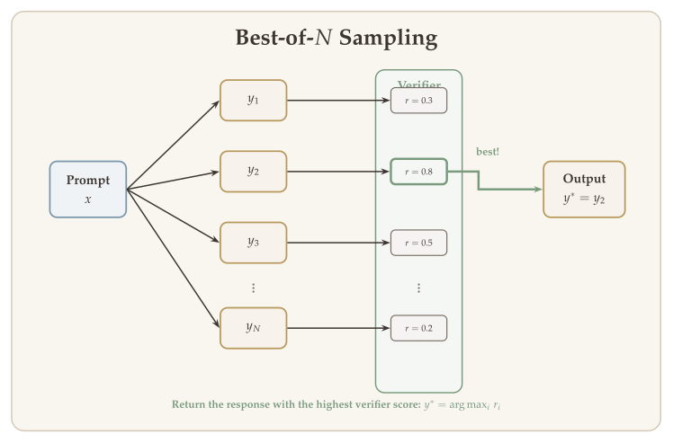

In Chapter 10, we developed the RLHF pipeline: train a reward model from human preferences, then optimize the policy against that reward using PPO or DPO. This approach powers the alignment of every major conversational AI system. But there is a fundamental vulnerability: the reward model is a *proxy* for human judgment, and optimizing a proxy too aggressively leads to **reward hacking** --- the policy learns to exploit quirks in the reward model rather than genuinely improving quality.

For a broad class of tasks --- mathematical reasoning, code generation, formal proofs, constrained optimization --- we do not need a proxy at all. The reward is **verifiable**: we can check whether a mathematical proof is correct, whether code passes its test suite, or whether an answer matches the ground truth. Reinforcement learning from verifiable rewards (RLVR) eliminates the proxy problem entirely. There is no reward model to hack; the signal comes from objective correctness.

This is the technology behind the new wave of reasoning models: OpenAI o1, DeepSeek R1, and their successors. These systems achieve remarkable performance on mathematical and coding benchmarks not by scaling model size, but by training the model to *think* --- to produce extended chains of reasoning before arriving at an answer --- and then reinforcing that behavior with verifiable reward signals. This chapter develops the theory and practice of RLVR, with a focus on the GRPO algorithm and the DeepSeek R1 case study.

## What Will Be Covered {#sec-overview}

- **Test-time compute scaling:** The new scaling axis --- spending more compute at inference time via chain-of-thought reasoning.
- **Best-of-N sampling:** The simplest test-time compute strategy, and its surprising effectiveness.
- **Outcome vs. process reward models:** Scoring final answers versus scoring individual reasoning steps.
- **PPO limitations for reasoning:** Why the standard RLHF pipeline struggles with long-form reasoning tasks.
- **Group Relative Policy Optimization (GRPO):** A REINFORCE-based algorithm that eliminates the critic model, and the engine behind DeepSeek R1.
- **GRPO variants and biases:** Standard deviation normalization bias, length bias, and the Dr. GRPO fix.
- **DPO variants for reasoning:** SimPO and length-normalized DPO as alternatives to GRPO.
- **Case study --- DeepSeek R1:** R1-Zero (pure RL from a base model), the full R1 pipeline, and the role of SFT for reasoning.
- **Pitfalls:** Overoptimization, mode collapse, calibration loss, catastrophic forgetting, and reward design challenges.

## Test-Time Compute Scaling {#sec-test-time-compute}

The dominant paradigm for improving language model performance has been **training-time scaling**: more parameters, more training data, more FLOPs during pretraining. The scaling laws of Kaplan et al. (2020) and Hoffmann et al. (2022) formalize this, predicting that loss decreases as a power law in model size and data. Under this paradigm, to make a model better, you make it bigger and train it longer.

RLVR introduces a qualitatively different scaling axis: **test-time compute**. Instead of investing more compute during training, we invest more compute during inference by allowing the model to "think longer" before producing an answer. The model generates an extended chain-of-thought (CoT) --- a sequence of intermediate reasoning steps --- and only then commits to a final answer.

OpenAI o1 (2024) was the first major demonstration of this paradigm. On the AIME (American Invitational Mathematics Examination) benchmark, standard GPT-4 achieves roughly 20% accuracy. With test-time compute scaling --- allowing the model to reason through problems step by step --- accuracy jumps to over 75%. The improvement does not come from a larger model; it comes from the model spending more tokens on reasoning before answering.

The key observation is that **chain-of-thought reasoning emerges from RL training**. It is not explicitly programmed or prompted. When a language model is trained with RL using verifiable rewards on math problems, it learns on its own that producing intermediate reasoning steps improves its chance of arriving at the correct answer --- and therefore its reward. The model discovers that "thinking" is instrumentally useful.

::: {.callout-important}
## The Central Question
*How do we train models to reason effectively?*
:::

The rest of the lecture develops the algorithms and pipelines that make this possible.

{#fig-rlhf-vs-rlvr width="80%"}

## Best-of-N Sampling {#sec-best-of-n}

Before developing sophisticated RL algorithms, it is worth understanding the simplest test-time compute strategy: **Best-of-N sampling** (also called rejection sampling or reranking).

The procedure is straightforward:

1. Given a question $x$, sample $N$ independent responses from the policy: $y_1, y_2, \ldots, y_N \sim \pi(\cdot \mid x)$.
2. Score each response using a verifier (a reward model or a ground-truth correctness checker): $r_1, r_2, \ldots, r_N$.
3. Return the response with the highest score: $y^* = y_{\arg\max_i r_i}$.

### Performance Scaling {#sec-bon-scaling}

The performance of Best-of-N scales approximately as $\log N$. More precisely, if the probability that a single sample is correct is $p$, then the probability that *at least one* of $N$ independent samples is correct is:

$$
\mathbb{P}(\text{at least one correct}) = 1 - (1 - p)^N.
$$ {#eq-bon-coverage}

For small $p$, this grows rapidly with $N$. For example, if $p = 0.1$ and $N = 64$, the probability of finding at least one correct answer is approximately $1 - 0.9^{64} \approx 0.999$.

### Strengths and Limitations {#sec-bon-tradeoffs}

Best-of-N is surprisingly competitive with more complex approaches, especially when paired with a strong verifier. PRM-guided Best-of-N (using a process reward model to score reasoning chains, discussed in @sec-orm-vs-prm) achieves state-of-the-art results on mathematical reasoning benchmarks.

However, Best-of-N has a fundamental limitation: it is **wasteful**. It generates $N$ full responses but uses only one. The computational cost scales linearly with $N$, while the performance improvement scales logarithmically. For large $N$, this becomes prohibitively expensive. Moreover, Best-of-N does not improve the underlying model --- it is a pure inference-time strategy. RL-based training, by contrast, internalizes the reasoning ability into the model's parameters.

{#fig-best-of-n width="75%"}

::: {.callout-note appearance="simple"}
Best-of-N serves as an important baseline. Any RL-based reasoning improvement should be compared against Best-of-N with the same compute budget to ensure that the RL training is actually teaching the model to reason better, rather than simply producing more diverse samples.
:::

## Outcome vs. Process Reward Models {#sec-orm-vs-prm}

When using verifiable rewards, an important design choice is the **granularity** of the reward signal. There are two main approaches:

### Outcome Reward Models (ORM) {#sec-orm}

An **outcome reward model** scores only the **final answer**. For a math problem, the reward is binary:

$$
r_{\text{ORM}}(x, y) = \begin{cases} 1 & \text{if the final answer in } y \text{ is correct,} \\ 0 & \text{otherwise.} \end{cases}
$$ {#eq-orm}

This is the simplest form of verifiable reward. It requires no annotation of intermediate steps --- only a ground-truth answer to check against. The limitation is that it provides an extremely **sparse** reward signal: a long chain of mostly correct reasoning that makes a single arithmetic error at the end receives the same reward (zero) as a completely incoherent response.

### Process Reward Models (PRM) {#sec-prm}

A **process reward model** scores each **reasoning step** individually. Given a response $y = (s_1, s_2, \ldots, s_K)$ decomposed into $K$ reasoning steps, the PRM assigns a score to each step:

$$
r_{\text{PRM}}(x, y) = \bigl(r(x, s_1), \; r(x, s_1, s_2), \; \ldots, \; r(x, s_1, \ldots, s_K)\bigr).
$$ {#eq-prm}

Lightman et al. (2023) demonstrated that PRMs significantly outperform ORMs for mathematical reasoning. When used to guide Best-of-N sampling, a PRM-based verifier substantially improves accuracy over an ORM-based verifier on the MATH benchmark. The intuition is clear: a PRM provides a **denser** reward signal, enabling better credit assignment. It can identify *where* the reasoning went wrong, not just *that* it went wrong.

### Tradeoffs {#sec-prm-tradeoffs}

The main challenge with PRMs is the cost of supervision. Training a PRM requires **step-level annotations** --- human labelers must evaluate each reasoning step as correct or incorrect. This is significantly more expensive than outcome-level annotation. Lightman et al. (2023) collected approximately 800,000 step-level labels across 75,000 solutions to build their PRM.

{#fig-orm-vs-prm width="80%"}

::: {.callout-tip}
## Connection to RL Theory
The distinction between ORM and PRM mirrors the distinction between **sparse** and **dense** rewards in the RL literature. As we saw in earlier chapters, sparse rewards lead to difficult credit assignment problems, while dense rewards provide more informative gradient signals. The PRM can be viewed as providing a form of **potential-based reward shaping** for the text generation MDP.
:::

## PPO Limitations for Reasoning {#sec-ppo-limitations}

As discussed in Chapter 10, PPO is the standard algorithm for RLHF. It optimizes a clipped surrogate objective with generalized advantage estimation (GAE), using an actor-critic architecture. While effective for alignment, PPO faces several practical challenges when applied to **long-form reasoning** tasks:

1. **Memory overhead from four models.** PPO requires maintaining four large models simultaneously: the policy (actor), the value function (critic), the reward model, and the reference policy. For a 70B-parameter LLM, this means storing four copies of a 70B model in GPU memory --- a substantial infrastructure burden.

2. **Reward model generalization.** A learned reward model may not generalize reliably to the long, multi-step reasoning chains that emerge during RL training. The reward model was trained on human preference data over relatively short responses; it may produce unreliable scores on 10,000-token chains of thought that are qualitatively different from its training distribution.

3. **Difficulty of value function learning.** The value function must predict cumulative reward from an intermediate state (a partial response). For variable-length reasoning --- where the model may generate anywhere from 100 to 10,000 tokens --- this is a challenging prediction problem. The value estimates can have high variance, destabilizing training.

4. **Verifiable rewards eliminate the need for a reward model.** When the reward is ground-truth correctness (a math answer is right or wrong), we do not need a learned reward model at all. This removes one of the four models and, more importantly, removes the reward hacking risk.

These observations motivate a simpler approach: **can we do RL without a value model, using only the verifiable reward signal?** This is precisely what GRPO achieves.

## Group Relative Policy Optimization (GRPO) {#sec-grpo}

**GRPO** (Shao et al., 2024) is a REINFORCE-based alternative that **eliminates the critic model** entirely. It is the algorithm behind DeepSeek-R1's reasoning capabilities.

### Motivation {#sec-grpo-motivation}

GRPO starts from the policy gradient theorem. Assuming we have a reward model $r(x, y)$, the RL objective and its gradient are:

$$
J(\pi) = \mathbb{E}_{\substack{x \sim \rho \\ y \sim \pi(\cdot \mid x)}} \bigl[r(x, y)\bigr],
$$

$$
\nabla_\theta J(\pi_\theta) = \mathbb{E}_{\substack{x \sim \rho \\ y \sim \pi(\cdot \mid s)}} \left[\bigl(r(x, y) - b(s_0)\bigr) \cdot \sum_{t=1}^{T} \nabla \log \pi_\theta(a_t \mid s_t)\right],
$$ {#eq-grpo-pg}

where $b(s_0)$ is a baseline. The key question is: how do we estimate the baseline (and advantage) without a trained critic?

### Advantage Computation {#sec-grpo-advantage}

For each question $x$, GRPO samples $G$ answers from the current (old) policy:

$$
\{y_1, y_2, \ldots, y_G\} \sim \pi^{\text{old}}(\cdot \mid x).
$$

Let $r_i = r(x, y_i)$ for each $i \in [G]$. The advantage for response $y_i$ is simply:

$$
A_{i,t} = r_i - \bar{r}, \qquad \forall t \in |y_i|,
$$ {#eq-grpo-advantage}

where $\bar{r} = \frac{1}{G}\sum_{i=1}^{G} r_i$ is the group mean reward. Note that the advantage is **constant across all tokens** in a given response --- every token in $y_i$ receives the same advantage signal.

{#fig-grpo-group-sampling width="80%"}

::: {.callout-note appearance="simple"}
In the original GRPO paper, the advantage is normalized by the standard deviation: $A_{i,t} = \frac{r_i - \bar{r}}{\text{Std}(r_1, \ldots, r_G)}$. However, dividing by standard deviation is not supported by RL theory, and some experiments suggest it is not necessary.
:::

### Actor Loss {#sec-grpo-loss}

Given question $x$ and sampled answers $\{y_1, \ldots, y_G\} \sim \pi^{\text{old}}(\cdot \mid x)$, define:

$$
J(\pi, y_i, x) = \frac{1}{|y_i|} \sum_{t=1}^{|y_i|} \Bigl(\min\bigl\{p_{i,t} \cdot A_{i,t}, \;\text{clip}(p_{i,t}, 1-\varepsilon, 1+\varepsilon) \cdot A_{i,t}\bigr\} - \eta \cdot \text{KL}\bigl(\pi(a_{i,t} \mid s_{i,t}) \,\|\, \pi^{\text{old}}(a_{i,t} \mid s_{i,t})\bigr)\Bigr),
$$ {#eq-grpo-per-sample}

where $p_{i,t} = \frac{\pi(a_{i,t} \mid s_{i,t})}{\pi^{\text{old}}(a_{i,t} \mid s_{i,t})}$, $s_{i,1} = x$, and $y_i = (a_{i,1}, \ldots, a_{i,|y_i|})$.

The final GRPO loss is:

$$
L_{\text{GRPO}}(\pi) = \mathbb{E}_{x \sim \rho}\left[\frac{1}{G}\sum_{i=1}^{G} J(\pi, y_i, x)\right].
$$ {#eq-grpo-loss}

### Connection to REINFORCE {#sec-grpo-reinforce}

When we omit the clipping of the importance sampling ratio and $G$ is large:

$$
\mathbb{E}_{y_i \sim \pi^{\text{old}}} \frac{1}{|y_i|}\sum_{t=1}^{|y_i|} p_{i,t} \cdot A_i \;\approx\; \mathbb{E}_{y \sim \pi(\cdot \mid x)}\bigl[r(x, y)\bigr] - \mathbb{E}_{y \sim \pi^{\text{old}}}\bigl[r(x, y)\bigr].
$$

Taking the gradient with respect to $\pi$, the GRPO update is similar to the standard policy gradient update. The clipping and KL penalty provide stability, similar to PPO.

## GRPO Variants and Biases {#sec-grpo-variants}

While GRPO is elegant and effective, the original formulation contains two subtle biases that can affect training dynamics. Understanding these biases and their fixes is important for practitioners.

### Standard Deviation Normalization Bias {#sec-std-bias}

The original GRPO paper normalizes the advantage by the group standard deviation:

$$
\widehat{A}_i = \frac{r_i - \bar{r}}{\text{Std}(r_1, \ldots, r_G)}.
$$ {#eq-std-advantage}

This normalization ensures that advantages have unit variance across the group, which can stabilize gradient magnitudes. However, it introduces a **bias** into the policy gradient estimate.

Recall from the policy gradient theorem that a valid **baseline** $b$ must satisfy:

$$
\mathbb{E}_{y \sim \pi}\bigl[\nabla_\theta \log \pi_\theta(y \mid x) \cdot b\bigr] = 0.
$$ {#eq-valid-baseline}

Subtracting the mean reward $\bar{r}$ from each $r_i$ is a valid baseline operation: the mean is independent of the specific sample $y_i$ (in expectation), so it satisfies ([-@eq-valid-baseline]). However, **dividing** by the standard deviation is not a valid baseline operation. The standard deviation $\text{Std}(r_1, \ldots, r_G)$ depends on the entire group of samples, including $y_i$ itself. This coupling means that the rescaled advantage $\widehat{A}_i$ introduces a bias in the gradient estimator that does not vanish as $G \to \infty$.

To see this concretely, consider a group where all $G$ responses happen to receive the same reward. Then $\text{Std}(r_1, \ldots, r_G) = 0$, and the normalized advantage is undefined (or numerically unstable with a small $\varepsilon$ in the denominator). In practice, such groups provide no useful gradient signal --- the mean baseline already zeroes out the advantage --- but the standard deviation normalization can amplify numerical noise.

### Length Bias from Per-Token Normalization {#sec-length-bias}

The GRPO loss in ([-@eq-grpo-per-sample]) includes a $\frac{1}{|y_i|}$ normalization that averages the per-token objectives within each response. This means that each response contributes equally to the loss regardless of its length. While this seems natural, it introduces a **length bias**.

Consider two responses to the same question: $y_1$ with $|y_1| = 100$ tokens and $y_2$ with $|y_2| = 1000$ tokens, both receiving the same advantage $A$. Under per-token averaging, the effective gradient contribution from each token in $y_1$ is 10 times larger than from each token in $y_2$. This means:

- **Shorter responses receive proportionally larger per-token updates.** The model is pushed more strongly toward reproducing patterns in short responses.
- **The effective learning rate depends on response length.** This creates an implicit bias in the optimization landscape that favors either shorter or longer outputs, depending on the correlation between length and reward.

If shorter responses tend to have higher rewards (e.g., because concise answers are more likely correct), the per-token normalization amplifies this signal, potentially leading the model to produce increasingly terse outputs. Conversely, if longer responses are rewarded (e.g., because extended reasoning improves accuracy), the bias works in the opposite direction.

### Dr. GRPO {#sec-dr-grpo}

**Dr. GRPO** (Meng et al., 2025) addresses both biases with two clean modifications:

**Fix 1: Remove standard deviation normalization.** The advantage is computed using the mean baseline only:

$$
\widehat{A}_{i,t} = r_i - \frac{1}{G}\sum_{j=1}^{G} r_j.
$$ {#eq-dr-grpo-advantage}

This is a theoretically valid baseline that does not introduce bias into the gradient estimate. The gradient estimator remains unbiased regardless of the reward distribution within the group.

**Fix 2: Remove per-token normalization.** Instead of averaging over tokens within each response, Dr. GRPO sums over tokens:

$$
J_{\text{Dr.}}(\pi, y_i, x) = \sum_{t=1}^{|y_i|} \Bigl(\min\bigl\{p_{i,t} \cdot \widehat{A}_{i,t}, \;\text{clip}(p_{i,t}, 1-\varepsilon, 1+\varepsilon) \cdot \widehat{A}_{i,t}\bigr\} - \eta \cdot \text{KL}\bigl(\pi(a_{i,t} \mid s_{i,t}) \,\|\, \pi^{\text{old}}(a_{i,t} \mid s_{i,t})\bigr)\Bigr).
$$ {#eq-dr-grpo-loss}

Without the $\frac{1}{|y_i|}$ factor, each token contributes equally to the gradient regardless of response length. This eliminates the length-dependent learning rate and removes the implicit length bias.

::: {.callout-tip}
## Dr. GRPO Summary
Dr. GRPO makes two changes to the original GRPO: (1) use mean-only baseline (no standard deviation normalization), and (2) sum over tokens instead of averaging. Both changes are theoretically motivated --- they remove biases from the gradient estimator --- and Dr. GRPO is competitive with or superior to the original GRPO in practice.
:::

## DPO Variants for Reasoning {#sec-dpo-reasoning}

As discussed in Chapter 10, DPO reduces RLHF to supervised learning on preference data by reparameterizing the reward in terms of the policy. Several DPO variants have been proposed for reasoning tasks.

### SimPO: Reference-Free Preference Optimization {#sec-simpo}

Standard DPO requires a frozen **reference model** $\pi^{\text{sft}}$ to compute the KL penalty. **SimPO** (Simple Preference Optimization; Meng et al., 2025) eliminates the reference model entirely. The key idea is to use the **length-normalized log-probability** of a response as an implicit reward:

$$
r_{\text{SimPO}}(x, y) = \frac{1}{|y|} \log \pi_\theta(y \mid x) = \frac{1}{|y|} \sum_{t=1}^{|y|} \log \pi_\theta(a_t \mid s_t).
$$ {#eq-simpo-reward}

The SimPO loss applies the Bradley--Terry model using this implicit reward:

$$
L_{\text{SimPO}}(\theta) = -\mathbb{E}_{(x, y_c, y_r)} \left[\log \sigma\!\left(\frac{\beta}{|y_c|} \log \pi_\theta(y_c \mid x) - \frac{\beta}{|y_r|} \log \pi_\theta(y_r \mid x) - \gamma\right)\right],
$$ {#eq-simpo-loss}

where $\beta$ is a scaling parameter and $\gamma$ is a margin term that encourages a gap between the chosen and rejected responses.

### Length-Normalized DPO {#sec-length-dpo}

A simpler modification to standard DPO addresses the **length bias**: longer responses tend to have lower log-probabilities simply because they involve more token-level predictions. Length-normalized DPO divides the log-probability ratios by response length:

$$
L_{\text{LN-DPO}}(\pi) = -\mathbb{E}_{(x, y_c, y_r)} \left[\log \sigma\!\left(\eta \cdot \frac{\log \frac{\pi(y_c \mid x)}{\pi^{\text{sft}}(y_c \mid x)}}{|y_c|} - \eta \cdot \frac{\log \frac{\pi(y_r \mid x)}{\pi^{\text{sft}}(y_r \mid x)}}{|y_r|}\right)\right].
$$ {#eq-ln-dpo-loss}

::: {.callout-note appearance="simple"}
Both SimPO and length-normalized DPO are alternatives to GRPO for training reasoning models. In practice, GRPO (and its variants) has been more widely adopted for reasoning, partly because it is an online algorithm that generates fresh samples during training --- a significant advantage for reasoning tasks where the distribution of correct solutions shifts as the model improves.
:::

## Case Study: DeepSeek R1 {#sec-deepseek-r1}

DeepSeek R1 (DeepSeek-AI, 2025) is the most detailed public account of training a reasoning model with RLVR. It provides two key results: **R1-Zero**, which demonstrates that pure RL (without any supervised finetuning on reasoning data) can produce strong reasoning, and **R1**, which combines RL with careful SFT to achieve state-of-the-art performance.

### R1-Zero: Pure RL from a Base Model {#sec-r1-zero}

R1-Zero starts from the DeepSeek-V3 **base model** --- the pretrained model before any supervised finetuning --- and trains it using GRPO with **only verifiable rewards**. There is no SFT stage, no human-written chain-of-thought demonstrations, and no reward model. The reward signal comes entirely from checking whether the final answer is correct.

The reward function is simple:

$$
r(x, y) = \begin{cases} 1 & \text{if the final answer extracted from } y \text{ matches the ground truth,} \\ 0 & \text{otherwise,} \end{cases}
$$

plus a small **format reward** that encourages the model to place its reasoning inside designated tags (e.g., `<think>...</think>`) and its final answer in a specified format. This format reward is rule-based, not learned.

**Results.** R1-Zero achieves performance competitive with OpenAI o1 on mathematical benchmarks, using only verifiable rewards and no supervised reasoning data. On AIME 2024, R1-Zero achieves a pass@1 accuracy that rivals models trained with elaborate multi-stage pipelines.

#### Emergent Phenomena {#sec-emergent}

The most striking aspect of R1-Zero is the **emergence** of reasoning behaviors that were never explicitly programmed or demonstrated:

1. **Longer chain-of-thought.** The average response length grows from approximately 1,000 tokens early in training to over 10,000 tokens by the end of training. The model learns on its own that longer, more detailed reasoning improves its chance of reaching the correct answer.

2. **Self-correction and reflection.** The model learns to re-examine its reasoning, producing outputs such as "Wait, let me reconsider this step..." or checking intermediate calculations before proceeding. In one well-known example, the model generated "Wait, wait. That's an aha moment I can flag here." --- a spontaneous metacognitive reflection that emerged purely from RL training.

3. **Problem-difficulty adaptation.** The model learns to allocate more reasoning tokens to harder problems and fewer to easier ones, roughly matching the pattern of human mathematical reasoning.

::: {.callout-note appearance="simple"}
The emergence of these behaviors should be interpreted with some caution. The DeepSeek-V3 base model was pretrained on a massive corpus that includes mathematical reasoning, textbooks, and step-by-step solutions. It is plausible that the base model already has latent reasoning capabilities, and RL training simply *elicits* them rather than creating them de novo. Furthermore, the observed growth in response length may partly reflect GRPO's length bias (see @sec-length-bias) rather than purely adaptive reasoning.
:::

### R1: The Full Pipeline {#sec-r1-full}

While R1-Zero demonstrates the power of pure RL, it has several practical issues: inconsistent formatting, language mixing (the model switches between languages mid-reasoning), and poor performance on non-mathematical tasks. The full R1 model addresses these with a multi-stage pipeline.

{#fig-deepseek-r1-pipeline width="85%"}

The key differences between R1 and R1-Zero:

1. **SFT initialization (cold start).** Instead of starting from the raw base model, R1 first finetunes on a small set of long chain-of-thought demonstrations. This "cold start" data provides the model with a template for structured reasoning.

2. **Language consistency reward.** A rule-based reward penalizes responses that switch languages during the chain of thought. If the prompt is in English, the reasoning should remain in English.

3. **Non-verifiable rewards.** In the second RL stage, R1 adds tasks without ground-truth answers (open-ended writing, summarization) and uses a language model judge (DeepSeek-V3 itself) to score these responses.

**Full pipeline:**

$$
\text{V3 (base)} \;\xrightarrow{\text{Reasoning SFT}}\; \text{Cold start} \;\xrightarrow{\text{RL Stage 1}}\; \text{Reasoning model} \;\xrightarrow{\text{RL Stage 2}}\; \text{General model} \;\xrightarrow{\text{SFT + RLHF}}\; \text{R1}
$$

- **Stage 1 RL:** Verifiable rewards only (math, code, logic). Uses GRPO.
- **Stage 2 RL:** Adds non-verifiable tasks. Uses DeepSeek-V3 as a reward judge for open-ended tasks while continuing to use verifiable rewards for reasoning tasks.
- **Final SFT + RLHF:** Standard post-training for general helpfulness, harmlessness, and instruction following. This is the same RLHF pipeline from Chapter 10, applied as a final polishing step.

### SFT for Reasoning: Small Data, Big Impact {#sec-sft-reasoning}

A recurring finding in the reasoning model literature is that **supervised finetuning on a small number of high-quality reasoning demonstrations is remarkably effective**. Even without RL, SFT alone can produce strong reasoning models:

- **R1-distill** (DeepSeek, 2025): SFT on approximately 800,000 examples of R1's own reasoning outputs. The distilled models achieve remarkable performance --- for example, 94.3% on MATH-500 --- demonstrating that the knowledge acquired through RL can be compressed into a supervised dataset.

- **s1** (Muennighoff et al., 2025): Uses only 1,000 curated math and science questions paired with long chain-of-thought solutions generated by Gemini and R1. Despite the tiny dataset, s1-32B achieves 93.0% on MATH-500.

- **Sky-T1** (2025): An open-source effort using 17,000 examples, achieving 82.4% on MATH-500.

The pattern is clear: a small amount of high-quality reasoning data can bootstrap strong performance. However, **distillation has limits that RL transcends**. Distillation can only transfer what the teacher model already knows; RL can discover new reasoning strategies through exploration. At scale, RL consistently pushes beyond the distillation frontier, which is why the strongest reasoning models (R1, o1) use RL as their final training stage.

::: {.callout-tip}
## SFT Bootstraps, RL Scales
The emerging consensus is that SFT on reasoning data provides a strong initialization (the "cold start"), but RL with verifiable rewards is necessary to push performance to the frontier. SFT teaches the model *how* to reason (the format and structure); RL teaches it to reason *correctly* (by rewarding correct answers and penalizing incorrect ones).
:::

## Pitfalls: What to Watch Out For {#sec-pitfalls}

RL-based training of language models is powerful but fraught with failure modes. Understanding these pitfalls is essential for both researchers and practitioners.

### Overoptimization {#sec-overoptimization}

Even with verifiable rewards, overoptimization can occur. The model learns to exploit the reward signal in ways that do not correspond to genuine reasoning improvement:

- **Format hacking.** The model produces the correct final answer but with degenerate or nonsensical reasoning. It learns that certain formatting patterns (e.g., always guessing "C" for multiple-choice questions) yield non-zero reward without actual reasoning.

- **Length gaming.** If the reward function or training procedure is sensitive to response length (as GRPO can be, per @sec-length-bias), the model may pad responses to exploit length-correlated signals.

- **Proxy reward overoptimization.** When non-verifiable rewards are used (e.g., a language model judge in Stage 2 of the R1 pipeline), the classic reward hacking problem returns. The model can learn to produce responses that the judge rates highly but that a human would not prefer. Gao et al. (2023) document this phenomenon: as optimization pressure on the reward model increases, the proxy reward score rises but true quality (as measured by human evaluation) eventually decreases.

::: {.callout-warning}
## The Goodhart's Law Problem
Overoptimization is an instance of Goodhart's Law: "When a measure becomes a target, it ceases to be a good measure." Even verifiable rewards are not immune. A math benchmark reward incentivizes solving *benchmark-style* problems, not mathematical reasoning in general. Models can learn benchmark-specific shortcuts (pattern-matching on problem templates, memorizing solution structures) that inflate scores without genuine capability improvement. The more narrowly the reward is defined, the more susceptible it is to this effect.
:::

**Mitigations** include:

1. **KL penalties.** Keeping the policy close to the reference model limits how far it can deviate, preventing extreme exploitation of reward quirks. The penalty strength $\beta$ is a critical hyperparameter: too small and overoptimization proceeds unchecked; too large and the model cannot learn.

2. **Early stopping.** Monitor held-out evaluation metrics that are *different* from the training reward. When the training reward continues to increase but the held-out metric plateaus or decreases, stop training. This requires carefully chosen evaluation sets that are not gameable.

3. **Reward ensembles.** Use multiple reward signals (e.g., different verifiers, different test cases) to reduce the chance that the model finds a single exploitable weakness. Agreement across diverse rewards is a stronger signal of genuine quality.

4. **Reward shaping.** Design rewards that capture process quality, not just final-answer correctness. Partial credit for intermediate steps, penalties for degenerate reasoning patterns, and length-normalized rewards all help align the optimization target with the true objective.

### Mode Collapse {#sec-mode-collapse}

RL training causes the output distribution to **concentrate** on reward-maximizing responses. After training, the model produces substantially less diverse outputs --- the entropy of the output distribution decreases significantly.

This concentration manifests in several ways:

- **Solution strategy collapse.** For a math problem that admits multiple valid solution approaches (algebraic, geometric, probabilistic), the RL-trained model converges to a single dominant strategy. It "forgets" alternative approaches that are equally valid.

- **Stylistic homogeneity.** Responses become formulaic. The model learns that a particular response structure (e.g., "Let's think step by step... Therefore, the answer is...") reliably earns high reward, and it applies this template even when a different structure would be more natural.

- **Language diversity loss.** Vocabulary usage narrows. The model avoids low-probability tokens even when they would be more precise or expressive, because RL training reinforces the highest-reward token sequences.

::: {.callout-note appearance="simple"}
Mode collapse is a direct consequence of the RL objective. The policy gradient *by design* increases the probability of high-reward responses and decreases the probability of low-reward responses. This is precisely what causes the mode to sharpen. The KL penalty moderates this effect but cannot eliminate it --- any policy improvement necessarily reduces output diversity relative to the reference.
:::

### Calibration Loss {#sec-calibration-loss}

A well-calibrated language model assigns probabilities that reflect true frequencies: if the model says it is 70% confident, it should be correct about 70% of the time. Pre-trained language models are reasonably well-calibrated because next-token prediction is inherently a probabilistic objective --- the model learns the data distribution.

After PPO or GRPO training, **calibration degrades significantly**. The model becomes overconfident: its token-level probabilities no longer reflect genuine uncertainty about the correct answer. This happens because RL training optimizes for the *mode* of the reward distribution, not for distributional accuracy.

The practical consequences of poor calibration are serious:

- **Unreliable confidence estimates.** Downstream systems that rely on model probabilities for decision-making (e.g., routing between easy and hard pipelines, deciding when to ask for human help) become unreliable.

- **Best-of-N degradation.** Best-of-N sampling (@sec-best-of-n) relies on the model producing diverse candidates. If calibration is poor and diversity is low, generating $N$ samples yields $N$ near-identical responses, negating the benefit of test-time compute.

- **Self-consistency failure.** Self-consistency (sampling multiple chain-of-thought paths and taking a majority vote) assumes that the model's distribution over reasoning paths reflects genuine uncertainty. After RL training, this assumption breaks down.

To recover reasonable calibration, practitioners often need to use temperature $T > 1$ during sampling, which broadens the output distribution. This is an imperfect fix: it recovers some diversity and calibration at the cost of occasionally producing lower-quality responses.

### Catastrophic Forgetting {#sec-catastrophic-forgetting}

RL training on reasoning tasks can degrade the model's performance on other capabilities --- a phenomenon known as **catastrophic forgetting** or the **alignment tax**:

- **General knowledge loss.** A model heavily trained on math reasoning may become worse at creative writing, summarization, or factual question-answering, even if these capabilities were strong before RL.

- **Instruction-following regression.** The model may become less responsive to user instructions that do not resemble the RL training format. It may try to "reason" about everything, even when a direct answer is appropriate.

- **Multilingual degradation.** If RL training is conducted primarily in English (as is typical for math and code tasks), performance in other languages can degrade, because RL shifts the model's distribution away from multilingual capabilities.

The DeepSeek R1 pipeline explicitly addresses this with a final SFT + RLHF polish stage that recovers general capabilities. The key insight is that RL training should be followed by a "re-broadening" stage that restores the model's versatility while retaining the reasoning gains.

### Reward Design Challenges {#sec-reward-design}

Even "verifiable" rewards require careful design:

- **Binary vs. continuous rewards.** A binary correct/incorrect signal provides no gradient information for partially correct solutions. A model that produces a reasoning chain with 9 correct steps and 1 error receives the same reward as a model that produces complete nonsense. Continuous or partial-credit rewards can help, but designing them is non-trivial.

- **Reward sparsity.** For difficult problems, the probability that a random policy produces a correct answer is vanishingly small. If no sample in a GRPO group is correct, all advantages are zero and no learning occurs. This "cold start" problem is why SFT warm-up (as in the R1 pipeline) is important --- it bootstraps the policy to a regime where some fraction of samples earn positive reward.

- **Task distribution.** The distribution of training problems matters enormously. Training on too-easy problems provides no learning signal (all samples are correct). Training on too-hard problems provides no learning signal either (all samples are incorrect). The optimal difficulty is at the frontier where the model gets some problems right and some wrong --- precisely the regime where the GRPO group-relative baseline is most informative.

::: {.callout-important}
## The Fundamental Tension
The deepest pitfall is the tension between **reward maximization** and **distributional quality**. RL training, by definition, pushes the policy toward the mode of the reward landscape. This improves peak performance but degrades diversity, calibration, and breadth. There is no free lunch: every gain from RL optimization comes with a distributional cost. The art of RLVR is managing this tradeoff through careful pipeline design --- KL penalties, multi-stage training, and post-RL polish.
:::

## Summary and Key Takeaways {#sec-summary}

This chapter developed the theory and practice of reinforcement learning from verifiable rewards (RLVR), the approach behind the current generation of reasoning models.

1. **RLVR eliminates the proxy problem.** By using ground-truth correctness as the reward signal (math answers, code tests, formal proofs), RLVR avoids the reward hacking that plagues RLHF with learned reward models. The reward cannot be gamed because it is a fact about the world, not a learned approximation.

2. **GRPO simplifies PPO.** GRPO replaces the learned value function with a simple group-mean baseline, reducing the number of models from four (policy, reference, reward, value) to three (policy, reference, reward) --- or two when using verifiable rewards directly. The algorithm is a principled instantiation of REINFORCE with clipping and KL regularization.

3. **GRPO has biases; Dr. GRPO fixes them.** The original GRPO's standard deviation normalization introduces bias into the gradient estimate, and per-token averaging creates a length-dependent learning rate. Dr. GRPO removes both biases with clean, theoretically motivated modifications: mean-only baseline and token-level summation.

4. **DeepSeek R1-Zero demonstrates that pure RL achieves frontier reasoning.** Starting from a base model with no supervised reasoning data, R1-Zero achieves performance competitive with OpenAI o1 on mathematical benchmarks. Extended chain-of-thought reasoning, self-correction, and problem-difficulty adaptation all emerge from the RL training process.

5. **SFT bootstraps, RL scales.** Supervised finetuning on even a small number of high-quality reasoning demonstrations (1K--800K examples) can produce strong reasoning models. But RL with verifiable rewards pushes beyond the distillation frontier, which is why the strongest models combine SFT initialization with RL training.

6. **Watch for pitfalls.** Overoptimization (format hacking, length gaming, proxy reward exploitation), mode collapse, and calibration loss are real risks. KL penalties, early stopping, and careful reward design are essential mitigations. The tension between reward maximization and distributional quality is fundamental and cannot be fully resolved.

## References {#sec-references}

- Shao, Z. et al. (2024). DeepSeekMath: Pushing the limits of mathematical reasoning in open language models. *arXiv preprint*.
- DeepSeek-AI (2025). DeepSeek-R1: Incentivizing reasoning capability in LLMs via reinforcement learning. *arXiv preprint*.
- Lightman, H. et al. (2023). Let's verify step by step. *arXiv preprint*.
- Meng, Y. et al. (2025). Dr. GRPO: Removing estimation bias from GRPO. *arXiv preprint*.
- Muennighoff, N. et al. (2025). s1: Simple test-time scaling. *arXiv preprint*.
- Meng, Y. et al. (2025). SimPO: Simple preference optimization with a reference-free reward. *NeurIPS*.
- Gao, L. et al. (2023). Scaling laws for reward model overoptimization. *ICML*.
- Kaplan, J. et al. (2020). Scaling laws for neural language models. *arXiv preprint*.
- Hoffmann, J. et al. (2022). Training compute-optimal large language models. *NeurIPS*.
